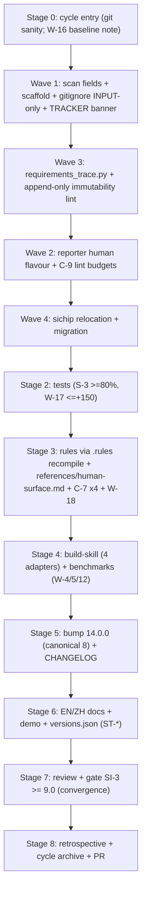

# v14.0.0 (MAJOR): Build the `.local/human/` Human Interaction Surface

Implements the ratified design as a **full MAJOR release**, **single PR**. Build to the spec, not from scratch.

## Source of truth (build to these)

- [.local/research/v14.0.0_design.md](.local/research/v14.0.0_design.md) — `§9` roadmap (file-level build list), `§6` integration contract, `§3`/`§4` schemas + C-9 budgets, `§5` separation + gitignore, `§7` ADRs (incl. ADR-2/ADR-8).
- [.local/research/v14.0.0_选型决策清单.md](.local/research/v14.0.0_选型决策清单.md) — locked decisions. **D2 = INPUT-only tracking**: git-track `.local/human/input/**` only; `output/` + `archive/` stay private.
- [.local/research/v14.0.0_gap_analysis.md](.local/research/v14.0.0_gap_analysis.md) (D-1..D-4) + [.local/research/v14.0.0_evaluation.md](.local/research/v14.0.0_evaluation.md) (design gate PASS 8.975; verified code claims accurate).

## Branch & delivery

- Single feature branch `feat/v14.0.0-impl-human-surface`, **stacked on the design branch** `feat/v14.0.0-human-interaction-surface` so the design docs + locked decisions are present (if PR #142 merges first, branch off `main` instead). One PR at cycle close. **S-6**: never push to `main`.

## Build sequence

## Stages (devola full-pipeline MAJOR cycle; L0->L1->L2->L3, only L3 implements)

- **Stage 0 — Cycle entry.** Working-tree sanity (`git status`); confirm SI-1 gap analysis exists (it does). W-16 wholesale baseline regen is a MAJOR-cycle obligation — land it at first observed benchmark drift, else at cycle close (per the v12.3.0 W-16 clarification).
- **Stage 1 — Implement core** (disjoint file ownership per wave):
  - **Wave 1 (discovery + scaffold + gitignore):** [src/devolaflow/workspace_context.py](src/devolaflow/workspace_context.py) — append `has_human_dir` / `human_constitution` / `human_requirements` / `human_digest` + `_scan_human_*` helpers (S-5 safe) + `to_summary_dict`; [src/devolaflow/local/workspace.py](src/devolaflow/local/workspace.py) — `REQUIRED_DIRS += human, human/input, human/input/amendments, human/output, human/output/convergence, human/archive` + `_DIR_README_CONTENT`; `ensure_local_gitignore` block `+= !.local/human/input/**` (INPUT-only per D2); fix `generate_tracker` banner "Auto-maintained" -> "Human-maintained".
  - **Wave 3 (traceability + immutability):** NEW `src/devolaflow/agent_workspace/requirements_trace.py` (REQ-ID -> evidence producer, `§6c`); NEW `src/devolaflow/lifecycle/check_human_input_append_only.py` (append-only lint keyed on `Lifecycle: RATIFIED`, mirrors `check_envelope_append_only`). Runs before Wave 2 (reporter consumes the tracer).
  - **Wave 2 (output + budgets):** [src/devolaflow/agent_workspace/reporter.py](src/devolaflow/agent_workspace/reporter.py) — 5th `render_human_report` flavour (consumes the Wave-3 `requirements_trace` map for per-REQ rows + the gate's `review_findings` severity-split via `gate/scorer.py::_count_severity` — note `findings_by_severity` is a StatusReport schema field, not a symbol) + new `templates/human_report.md.j2` + `regenerate_all` `"human"` key (idempotent, opt-in); [src/devolaflow/agent_workspace/lint.py](src/devolaflow/agent_workspace/lint.py) — `lint.py` today is change-folder-only (`ARTIFACT_BUDGETS` + `lint_change`), so add a `HUMAN_ARTIFACT_BUDGETS` map + a NEW `lint_human(repo_root)` entry point (token-only enforcement; per-file shard cap) walking `.local/human/`.
  - **Wave 4 (de-pollution):** [src/devolaflow/lifecycle/post_skill_edit.py](src/devolaflow/lifecycle/post_skill_edit.py) — `FEEDBACK_DIR_DEFAULT -> .local/.agent/sichip-deferred/` + one-time migration of existing docs + fingerprint sidecar + transition dual-read.
- **Stage 2 — Tests** (S-3 >= 80% on new modules; W-17 <= +150 NEW funcs/cycle, mid-cycle audit): update `tests/test_gitignore_policy.py` (input tracked, an output path stays IGNORED), NEW `tests/test_human_input_immutability.py`, reporter human-flavour tests, lint budget tests, `workspace_context` scan tests, `requirements_trace` tests, `tests/test_post_skill_edit_hook.py` + `tests/test_sichip_dedup_feedback_doc.py` (relocation + migration + dedup-preserved).
- **Stage 3 — Rules + reference doc** (C-7 four obligations; C-9 via recompile): edit `.rules/conventions.mdc` C-9 to add the 5 human-artifact budget rows then `make compile-rules` (NEVER hand-edit the compiled `.cursor/rules/repo-governance.mdc` / `AGENTS.md` — drift lint blocks it); update `workflow-system/agent/references/agent-workspace.md` §9 budgets + §1 When-to-Engage row; NEW `workflow-system/agent/references/human-surface.md` (<= 1000 lines); add SKILL.md Tier-2 nav row (keep <= 500 lines, C-4), `tests/test_no_ghost_features.py::_SF4_REFERENCE_SET`, `scripts/sync_cursor_skill.py::MIRRORED_FILES`. **W-18**: refresh the ghost-audit for new symbols (`requirements_trace`, `check_human_input_append_only`, `render_human_report`, the 4 scan fields) BEFORE any CHANGELOG feature entry.
- **Stage 4 — Adapter build + benchmarks** (SKILL.md changed): `build-skill` for all 4 adapters within budgets (W-5/W-12); EvoBench `tests/test_benchmarks.py` + `task_adaptive_selector` verify if `context_profiles.yaml` changed (W-4/W-6/W-13).
- **Stage 5 — Version bump to 14.0.0** (W-10/CP-3, C-6): `python scripts/bump_version.py 14.0.0` (canonical 8 + auto cursor-skill sync); CHANGELOG `## [14.0.0]` entry (after W-18); `tests/test_version.py` + `tests/test_smoke.py`.
- **Stage 6 — Human docs** (ST-1..ST-13): EN/ZH guides, demo pages, `versions.json` new v14.0.0 entry (WX-2), benchmark-results `index.html` SAMPLE_DATA; `make sync-human-docs`.
- **Stage 7 — Review + gate** (SI-3 >= 9.0 MAJOR bar; convergence loop): W-2/SI-2 NineS self-eval; W-3 `.local/research/v14.0.0_evaluation.md` (implementation eval — distinct from the design eval); **W-9/SI-10 6-step**: `pytest -q`, `ruff check`, `ruff format --check`, `test_version.py`, `test_benchmarks.py`, `make check-cursor-skill`. FAIL -> reinforcement round (W-8).
- **Stage 8 — Close**: W-7 retrospective (`.local/research/v14.0.0_retrospective.md`); W-19 `python scripts/archive_research_artifacts.py v14.0.0` -> `docs/cycle-archive/v14.0.0/`; commit, push, open the PR.

## Governance (applies NOW — not deferred this cycle)

- W-16 baseline regen; W-9/SI-10 6-step; W-3/SI-3 composite **>= 9.0** (MAJOR); W-4/W-6/W-13 benchmarks; W-5/W-12 build-skill (4 adapters); W-10/CP-3 + C-6 version across 8 canonical files; S-3 >= 80% coverage; W-17 <= +150 NEW test funcs + mid-cycle audit; W-18 ghost-audit refresh before CHANGELOG; C-4 SKILL <= 500 lines; C-7 four reference obligations; **C-9 edited via `.rules/conventions.mdc` + recompile**; W-21 Soul-freeze (no new S-rule); S-6 branch + PR; S-2 relative paths.
- **No `.pre-commit-config.yaml` exists** — the SI-10 6-step is NOT a git hook; it is run **manually** (Makefile protocol) before the Stage-8 commit. Don't rely on a hook to catch failures.

## Key decisions / risks

- **A-2 cache layout**: the design's `§6b` `change_context.human_input_refs` NEST is OPTIONAL — recommend SKIPPING it this cycle (file reads suffice) so `canonical_order` stays 17 and `tests/test_layout_invariant_multi_baseline.py` is untouched. Revisit only if dispatch-surfacing is needed.
- **Wave ordering**: Wave 3 (`requirements_trace.py`) lands before Wave 2 (reporter consumes it).
- **C-9 compile path**: hand-editing `repo-governance.mdc`/`AGENTS.md` fails `test_rule_surfaces_compile_only` — must go through `.rules/` + `make compile-rules`.
- **W-17 test budget**: baseline is ~4559 tests at v13.0.0; the full surface adds many tests — keep NEW test functions <= +150 for the cycle; if exceeded, defer non-essential tests.
- **Branch base**: stack on the design branch (PR #142) vs branch off `main` after #142 merges.

## Verified code anchors (from touch-point map)

- `src/devolaflow/workspace_context.py`: `WorkspaceContext` fields L131-140 (append after `compiled_corpora`); `_scan_*` helpers end ~L371; `scan_workspace` assembly L410-447; `to_summary_dict` L182-193.
- `src/devolaflow/local/workspace.py`: `REQUIRED_DIRS` L11-18; `_DIR_README_CONTENT` L26-118; `_LOCAL_WHITELIST_BLOCK_LINES` L308-320 + `_LOCAL_WHITELIST_REQUIRED_RULES` L322-328 (4th rule `!.local/human/`); `generate_tracker` banner L226.
- `src/devolaflow/agent_workspace/reporter.py`: flavours L125-328 (add after L328); `regenerate_all` L404-409; Jinja2 `_env` L417-436; templates dir `agent_workspace/templates/*.j2`.
- `src/devolaflow/agent_workspace/lint.py`: `ARTIFACT_BUDGETS` L65-74; `lint_change` L198-225 (change-folder-only).
- `src/devolaflow/agent_workspace/requirements_trace.py` (NEW): mirror `delta_parser.py` shape (frozen dataclasses + `__all__` + regex REQ-block parser; S-5 missing-REQ -> `unmet`+"no evidence").
- `src/devolaflow/lifecycle/post_skill_edit.py`: `FEEDBACK_DIR_DEFAULT` L108; `FINGERPRINT_SIDECAR_NAME` L129; dual-read in `_load_existing_fingerprints` L233-257.
- Tests: `test_gitignore_policy.py` `LOCAL_WHITELISTED_PATHS` L111-120 + required-rules L132-136; `test_no_ghost_features.py` `_SF4_REFERENCE_SET` L448-623 (23 -> 24 with `human-surface.md`); `test_workspace_context_scan.py` `expected_keys` L276-288; `test_smoke.py` version assert L9.
- Version bump: `scripts/bump_version.py` (11 replacements / 8 files); SKILL.md banner L32 + "Current version" L37.