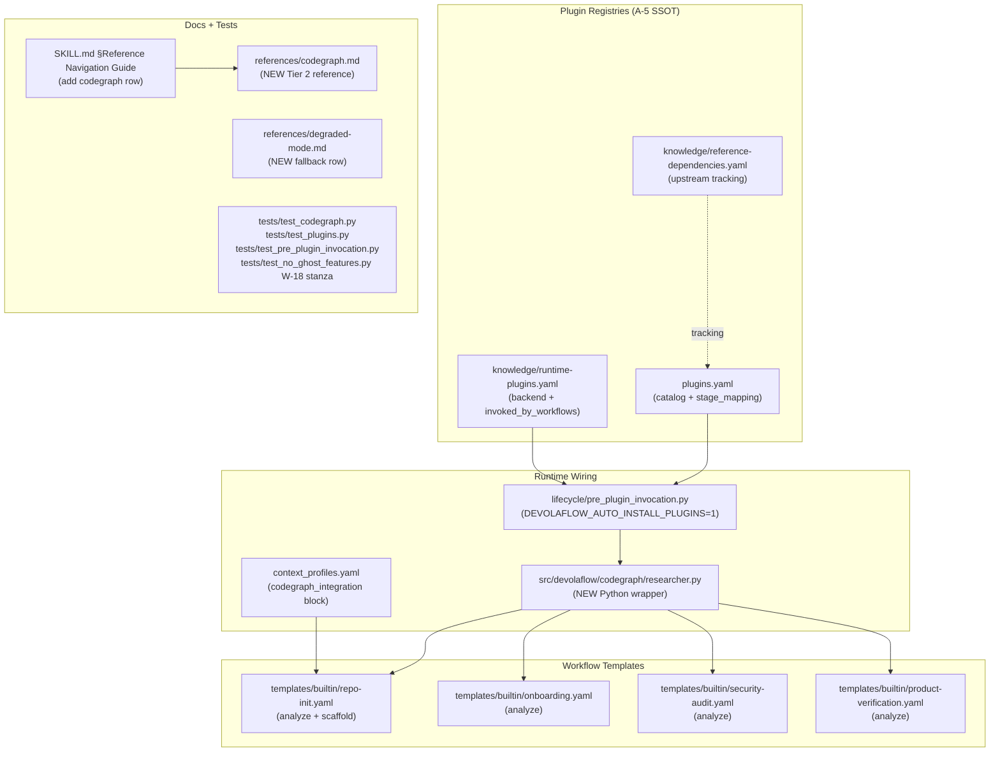

# v12.5.0 — Codegraph Plugin Integration (Combined Cycle)

## Cycle position

- Predecessor: **v12.4.0** shipped 2026-05-17 (composite 9.40 — new v12.x peak; retrospective at [`.local/research/v12.4.0_retrospective.md`](.local/research/v12.4.0_retrospective.md))
- Target: **v12.5.0** EXPANSION MINOR; primary deliverable = codegraph plugin; combined with 3 telegraph carry-overs per [`.local/research/v12.4.0_retrospective.md`](.local/research/v12.4.0_retrospective.md) §6
- Estimated PV count: **6** (in line with v12.4.0 PV count precedent; well under W-17 caps)
- Estimated test delta: **~80 NEW** test functions (well under W-17 +150/cycle cap)

## 1 — What codegraph brings (benefit analysis summary)

| Surface | Upstream benchmark (7 repos / 7 langs) | DevolaFlow leverage |
|---|---|---|
| Token spend per agent query | **59% fewer tokens** | L0/L1/L2 dispatchers heavily use Read/Glob/Grep for planning → replaced by `codegraph_search` / `codegraph_files` |
| Tool-call count per query | **70% fewer tool calls** | L3 task agents read source for impl/review → `codegraph_explore` returns full source for related symbols in ONE call |
| Wall-clock per query | **49% faster** | Repo-init `analyze` stage detects file structure → `codegraph_status` / `codegraph_files` replaces bespoke fs scanning |
| API cost per query | **35% cheaper** | Gate code-review scoring → `codegraph_impact` for blast-radius analysis |
| CI test selection | `codegraph affected` (transitive import trace) | W-4 EvoBench harness can run only affected tests on CI |

Codegraph is **100% local, zero-config, MCP-first, 19+ languages, ~28KB npm package with bundled Node runtime, MIT-licensed, 17k stars, latest v0.9.3 (2026-05-22)**. Compatibility with DevolaFlow constraints: S-2 (project-relative `.codegraph/` dir), S-5 (degraded-mode contract for fallback), S-7 (npm + GitHub URL only), W-20 (reuses existing `DEVOLAFLOW_AUTO_INSTALL_PLUGINS=1`).

## 2 — Architecture: where codegraph plugs in



## 3 — PV breakdown

### PV-01 — Entry gate (W-1 / W-2)

Author the SI-1 gap analysis enumerating 4 D-N items (codegraph + 3 carry-overs) and produce the codegraph benefit-analysis research artifact + baseline NineS self-eval.

- [`.local/research/v12.5.0_gap_analysis.md`](.local/research/v12.5.0_gap_analysis.md) — D-1 codegraph integration (BLOCKER from feedback), D-2 cc-spike refactor pair (MAJOR carry-over), D-3 handoff auto-strip helper (MAJOR carry-over), D-4 v13.0.0 strict-graduation telegraph audit (MINOR)
- [`.local/research/v12.5.0_codegraph_benefit_analysis.md`](.local/research/v12.5.0_codegraph_benefit_analysis.md) — NEW research artifact: §1 upstream benchmarks verbatim, §2 DevolaFlow workflow-by-workflow benefit map, §3 integration architecture (5-surface mirror of NineS), §4 risks + mitigations, §5 degraded-mode contract, §6 acceptance criteria for PV-03/PV-04/PV-05
- [`.local/research/v12.5.0_nines_self_eval.json`](.local/research/v12.5.0_nines_self_eval.json) — baseline pin (expect 0.907 preserved from v12.4.0)

### PV-02 — Carry-over cc-spike refactor (closes D-2)

Apply v12.4.0 PV-04 helper-extraction template verbatim to the 2 WARNING-tier cc-spikes telegraphed in [`.local/research/v12.4.0_retrospective.md`](.local/research/v12.4.0_retrospective.md) §6 item 1:

- [`src/devolaflow/shell_proxy/commands.py`](src/devolaflow/shell_proxy/commands.py) — refactor `load_command_mappings` cc=16 and `apply_local_recipe` cc=16 each into 4 `_apply_*` / `_validate_*` private helpers (cc ≤ 8 each); orchestrator cc ≤ 7
- [`tests/test_shell_proxy_commands.py`](tests/test_shell_proxy_commands.py) — extend with ~12 helper-extraction tests
- [`tests/test_no_ghost_features.py`](tests/test_no_ghost_features.py) — NEW W-18 stanza `test_v12_5_0_cc_spike_sweep_complete` pinning 8 NEW helper symbols
- W-4 EvoBench sweep at close (commands.py is on the RTK proxy path — must stay 36/36 GREEN)

### PV-03 — Codegraph plugin landing (closes D-1 part 1)

Register codegraph in both registries + add Python wrapper. Mirror NineS shape precisely.

**Plugin registry catalog** ([`workflow-system/agent/plugins.yaml`](workflow-system/agent/plugins.yaml)):

```yaml
codegraph:
  description: "Pre-indexed code knowledge graph (tree-sitter + SQLite FTS5) — 35% cheaper / 70% fewer tool calls / 59% fewer tokens vs raw Read+Grep+Glob across 7 codebases"
  cli_binary: "codegraph"
  version_command: "codegraph --version"
  version_regex: '(\d+\.\d+\.\d+)'
  install_methods:
    npm: "npm install -g @colbymchenry/codegraph"
    script: "curl -fsSL https://raw.githubusercontent.com/colbymchenry/codegraph/main/install.sh | sh"
  skill_install_command: "codegraph install --yes"
  capabilities:
    - smart_context_building   # codegraph_context — entry points + related symbols + snippets in one call
    - full_text_search         # codegraph_search — FTS5 over symbol names
    - impact_analysis          # codegraph_impact — blast radius before edit
    - callers_callees_trace    # codegraph_callers / callees
    - file_structure_lookup    # codegraph_files — replaces fs scanning
    - test_impact_selection    # codegraph affected — CI hook for selective test runs
    - framework_route_awareness  # 14 frameworks: Django, Flask, FastAPI, Express, NestJS, Laravel, Rails, Spring, Gin, Axum, ASP.NET, Vapor, React Router, SvelteKit
    - multi_language_index     # 19+ languages incl. TS/JS/Python/Go/Rust/Java/C#/PHP/Ruby/C/C++/Swift/Kotlin/Scala/Dart/Lua/Luau/Svelte/Vue/Liquid/Pascal
  role: "code_intelligence"    # NEW role (5th)
  repo_url: "https://github.com/colbymchenry/codegraph"
  min_version: "0.9.3"
  workflows:
    - repo-init
    - onboarding
    - security-audit
    - product-verification
    - refactoring
    - performance-optimization
  stage_mapping:
    analyze: "codegraph status && codegraph files --format tree"
    scaffold: "codegraph init -i"
    research: "codegraph context \"{query}\" --format markdown --max-nodes 20"
    impact: "codegraph impact {symbol} --depth 3 --json"
```

Add NEW `code_intelligence` role under `plugin_roles:` with `invocation: on_demand`, `provider: codegraph`, `primary_workflows: [repo-init, onboarding, security-audit, product-verification]`, `stage_affinity: [analyze, scaffold, research, profile]`.

**Runtime registry** ([`workflow-system/agent/knowledge/runtime-plugins.yaml`](workflow-system/agent/knowledge/runtime-plugins.yaml)):

```yaml
- id: codegraph
  backend: npm_then_init
  package: "@colbymchenry/codegraph"
  install_cmd: "npm install -g @colbymchenry/codegraph@latest"
  upgrade_cmd: "npm install -g @colbymchenry/codegraph@latest"
  version_check_cmd: "codegraph --version"
  min_version: "0.9.3"
  canonical_url: "https://github.com/colbymchenry/codegraph"
  init_cmd_template: "codegraph init {project_root}"
  init_targets: []
  invoked_by_workflows:
    - repo-init
    - onboarding
    - security-audit
    - product-verification
```

**Reference tracking** ([`workflow-system/agent/knowledge/reference-dependencies.yaml`](workflow-system/agent/knowledge/reference-dependencies.yaml)) — add to `active_tracking` (11 → 12 entries):

```yaml
- id: codegraph
  repo_url: https://github.com/colbymchenry/codegraph
  source_type: github_repo
  last_checked: "2026-05-23"
  last_known_version: "0.9.3"
  relevance_score: 5
  key_patterns:
    - "tree-sitter AST → SQLite FTS5 local-only index"
    - "MCP-first: 9 tools (search/context/callers/callees/impact/node/explore/files/status)"
    - "auto-sync via OS file events (FSEvents/inotify/RDCW), 2s debounce"
    - "agent installer auto-writes .cursor/rules/codegraph.mdc + CLAUDE.md"
    - "benchmark: 35% cheaper / 70% fewer tool calls / 59% fewer tokens / 49% faster (7 repos × 7 langs)"
    - "framework-aware routes: 14 frameworks (Django/Flask/FastAPI/Express/NestJS/Laravel/Rails/Spring/Gin/Axum/ASP.NET/Vapor/React Router/SvelteKit)"
    - "zero-config: respects .gitignore, skips >1MB files"
    - "codegraph affected: transitive test-impact for CI hooks"
  update_triggers:
    - npm version > 0.9.3
    - new language support added
    - MCP tool surface changes (new tools or signature changes)
    - benchmark methodology changes
  devolaflow_integration_points:
    - workflow-system/agent/plugins.yaml (codegraph block)
    - workflow-system/agent/knowledge/runtime-plugins.yaml (codegraph entry)
    - workflow-system/agent/templates/builtin/repo-init.yaml (scaffold stage post-step)
    - workflow-system/agent/templates/builtin/onboarding.yaml (analyze codegraph_commands)
    - workflow-system/agent/templates/builtin/security-audit.yaml (analyze codegraph_commands)
    - workflow-system/agent/templates/builtin/product-verification.yaml (analyze codegraph_commands)
    - workflow-system/agent/context_profiles.yaml (codegraph_integration block)
    - workflow-system/agent/references/codegraph.md (NEW)
    - workflow-system/agent/references/degraded-mode.md (codegraph fallback row)
    - workflow-system/agent/SKILL.md §Reference Navigation Guide
    - src/devolaflow/codegraph/ (NEW package)
  gap_ids: []
  note: "v12.5.0 PV-01 D-1 — primary integration target."
```

**Python wrapper** (NEW package mirroring `src/devolaflow/nines/`):

- `src/devolaflow/codegraph/__init__.py` — package marker + `__all__`
- `src/devolaflow/codegraph/researcher.py` — subprocess wrappers: `build_context(query, *, max_nodes=20, fmt="markdown") -> str`, `search_symbols(query, *, kind=None, limit=10) -> list[dict]`, `get_impact(symbol, *, depth=3) -> dict`, `get_callers(symbol, *, limit=20) -> list[dict]`, `get_affected_tests(changed_files: list[str]) -> list[str]`
- `src/devolaflow/codegraph/_cli.py` — `_run_codegraph(args: list[str], cwd: Path) -> CompletedProcess` thin subprocess wrapper with timeout + structured-error contract (S-5 no-silent-failure)

**Tests** (~28 NEW):

- `tests/test_codegraph.py` (NEW, ~18 tests) — Python wrapper happy-path + degraded-mode + timeout + JSON-parse + subprocess-error classification
- `tests/test_plugins.py` — extend with `test_codegraph_spec_registered` + `test_code_intelligence_role_present`
- `tests/test_pre_plugin_invocation.py` — extend with `test_codegraph_invoked_by_repo_init_workflow` + 3 sister-workflow tests
- `tests/test_runtime_plugins_smoke.py` — extend with codegraph entry smoke check
- `tests/test_no_ghost_features.py` — NEW W-18 stanza `test_v12_5_0_codegraph_plugin_registered` pinning the codegraph keys in both YAML registries + Python wrapper symbols

### PV-04 — Codegraph workflow wiring (closes D-1 part 2)

Wire codegraph into the 4 analyze-stage workflows + context profiles.

**Repo-init augmentation** ([`workflow-system/agent/templates/builtin/repo-init.yaml`](workflow-system/agent/templates/builtin/repo-init.yaml)):

- `scaffold` stage gains a sub-step under `config` — **runs in ALL modes (core / standard / full)** per operator decision 2026-05-23 (codegraph footprint is ~28KB npm package with bundled Node runtime, negligible cost for core mode):
  ```yaml
  codegraph_init:
    cmd: "codegraph init {project_root}"
    on_failure: "warn"  # degraded-mode per references/degraded-mode.md — never blocks scaffold
    add_to_gitignore: [".codegraph/"]
  ```
  Rationale: mode=core stays lean by skipping `compile` + `interview` + `verify` stages, but the codegraph index is small + zero-config + a strict prerequisite for the downstream analyze workflows (onboarding / security-audit / product-verification) to deliver their token savings. Gating codegraph init on mode would mean core-mode users miss the 35%/70%/59% benefits.
- `analyze` stage gains `config.codegraph_commands` hint surfacing `codegraph status && codegraph files --format tree` for the L3 agent (no auto-execute; surfaced for the agent to invoke)
- `verify` stage (existing `skip_condition: "mode != 'full'"` preserved) gains a smoke check asserting `.codegraph/codegraph.db` exists (runs ONLY at mode=full as a verification gate; the init itself ran during scaffold in ALL modes)
- New `mode=core` post-condition: if `codegraph` CLI absent AND `DEVOLAFLOW_AUTO_INSTALL_PLUGINS=1` not set, scaffold emits a one-line WARN suggesting `npm i -g @colbymchenry/codegraph` — does NOT block the workflow (S-5 explicit warn + continue)

**Sister workflows** — augment 3 analyze-stage templates with `config.codegraph_commands`:

- [`workflow-system/agent/templates/builtin/onboarding.yaml`](workflow-system/agent/templates/builtin/onboarding.yaml) — `analyze` stage
- [`workflow-system/agent/templates/builtin/security-audit.yaml`](workflow-system/agent/templates/builtin/security-audit.yaml) — `analyze` stage (codegraph_impact + codegraph_callers for attack-surface mapping)
- [`workflow-system/agent/templates/builtin/product-verification.yaml`](workflow-system/agent/templates/builtin/product-verification.yaml) — `analyze` stage

**Context profile** ([`workflow-system/agent/context_profiles.yaml`](workflow-system/agent/context_profiles.yaml)):

- NEW `codegraph_integration` top-level block parallel to `nines_integration` (existing) with `commands.{repo_init, analyze, research, impact}` recipes + `tokens_est: 200` + `priority_default: important` for repo-init/onboarding/security-audit/product-verification profiles + `skip` for unrelated profiles (per W-15 section relevance)

**Tests** (~15 NEW):

- `tests/test_repo_init_codegraph.py` (NEW) — verifies repo-init template includes codegraph_init sub-step + smoke-asserts `.codegraph/` added to gitignore
- `tests/test_codegraph_workflow_wiring.py` (NEW) — pins codegraph_commands presence in 4 templates + context_profiles codegraph_integration block
- `tests/test_no_ghost_features.py` — W-18 stanza `test_v12_5_0_codegraph_workflow_wired` pinning template surfaces
- `tests/test_benchmarks.py` — W-4 sweep must stay 36/36 (codegraph plugin metadata adds ~50 bytes/dispatch — verify no scenario regression > 5%)

### PV-05 — Docs + handoff auto-strip helper (closes D-1 part 3 + D-3)

**Codegraph reference doc** ([`workflow-system/agent/references/codegraph.md`](workflow-system/agent/references/codegraph.md)) — NEW Tier 2 reference (~600 lines, well under C-4 Large tier ≤1000):

- §1 What codegraph is + when L3 should use it
- §2 The 9 MCP tools (search/context/callers/callees/impact/node/explore/files/status) with L3 decision tree
- §3 CLI surface (init/index/sync/query/files/context/impact/affected/serve)
- §4 DevolaFlow integration map (which workflows invoke it, which env flags gate it)
- §5 Degraded-mode contract (CLI unavailable → Read/Glob/Grep fallback)
- §6 Cache management (.codegraph/ gitignore, sqlite WAL mode, file-watcher debounce)

**Other docs:**

- [`workflow-system/agent/references/degraded-mode.md`](workflow-system/agent/references/degraded-mode.md) — NEW codegraph row: `codegraph unreachable → fall back to Read/Glob/Grep; warn once per session; gate scoring drops codegraph_impact dimension`
- [`workflow-system/agent/references/env-flags.md`](workflow-system/agent/references/env-flags.md) — §7 W-20 checklist gains a note: "codegraph reuses `DEVOLAFLOW_AUTO_INSTALL_PLUGINS=1` per W-20 reuse-first; NO new env flag (flag count stays at 7)"
- [`workflow-system/agent/SKILL.md`](workflow-system/agent/SKILL.md) — §"Workspace Engagement" gains `.codegraph/` row (when present, surface as accelerated context); §"Reference Navigation Guide" Tier 2 table gains codegraph row (21 → 22 references); §"Quick Start — Workflow Selection" row for `repo-init` gains "auto-installs codegraph index (all modes — core/standard/full)" note
- SKILL.md line count: 486 → ~490 (well under C-4 < 500 ceiling — ~10 slots of headroom)

**Handoff auto-strip helper** (closes D-3 carry-over):

- [`src/devolaflow/agent_workspace/handoff.py`](src/devolaflow/agent_workspace/handoff.py) — NEW `strip_l0_only_metadata(envelope: dict) -> dict` helper (companion to v12.4.0 PV-05 `reject_subagent_banner_emission` hook) — auto-strips banner literals + quality_score keys from envelopes BEFORE write; idempotent; pure function
- `tests/test_handoff_strip_metadata.py` (NEW, ~8 tests) — happy-path + idempotency + permissive on absent keys + S-5 no-silent-failure
- `tests/test_no_ghost_features.py` — W-18 stanza `test_v12_5_0_handoff_strip_helper`

### PV-06 — Cycle close (W-3 + W-7 + W-19)

Standard cycle-close deliverables matching the v12.4.0 PV-06 shape:

- [`.local/research/v12.5.0_evaluation.md`](.local/research/v12.5.0_evaluation.md) — SI-3 6-dimension scorecard; target composite ≥ 9.0 (continue the v12.x cycle peak trajectory: 9.225 → 9.40 → ≥9.0)
- [`.local/research/v12.5.0_retrospective.md`](.local/research/v12.5.0_retrospective.md) — W-7 4-section + v12.6.0+ telegraph
- `docs/cycle-archive/v12.5.0/` — W-19 archive via `python scripts/archive_research_artifacts.py 12.5.0`
- Version bump 12.4.0 → 12.5.0 via `python scripts/bump_version.py 12.5.0` (touches 7 canonical sync locations per C-6)
- [`CHANGELOG.md`](CHANGELOG.md) `## [12.5.0]` — comprehensive entry: codegraph plugin (PV-03/04/05), cc-spike refactor (PV-02), handoff helper (PV-05), W-9 SI-10 6-step gate table
- [`workflow-system/human/demo/version-timeline/versions.json`](workflow-system/human/demo/version-timeline/versions.json) — NEW v12.5.0 entry per WX-2 / ST-7
- `make sync-human-docs` for EN + ZH propagation
- W-9 SI-10 6-step pre-commit ALL GREEN gate

## 4 — Pre-flight constraints checklist

| Constraint | Verification |
|---|---|
| **S-2** (no absolute paths) | All new files use repo-relative paths; codegraph uses `.codegraph/` project-local |
| **S-5** (no silent failures) | Python wrapper logs every subprocess error; degraded-mode emits WARN+continues |
| **S-7** (external URLs) | npm + `https://github.com/colbymchenry/codegraph` only — never hardcode local clone paths |
| **W-20** (env-flag reuse) | NO new `DEVOLAFLOW_*` flag; reuse `DEVOLAFLOW_AUTO_INSTALL_PLUGINS=1` (flag count 7 → 7) |
| **W-21** (Soul-set freeze) | NO Soul rule changes (S-1..S-10 unchanged; freeze at 10) |
| **W-17** (per-PV test cap) | PV-02 ~14 / PV-03 ~28 / PV-04 ~15 / PV-05 ~12 = ~69 NEW; well under +150 cycle cap |
| **W-16** (baseline regen) | Run W-4 sweep at PV-02 (commands.py) + PV-03 (plugin metadata) + PV-04 (template) close; wholesale regen at first PV that drifts |
| **W-18** (ghost-audit refresh) | Each PV adds a W-18 stanza in `tests/test_no_ghost_features.py` BEFORE the CHANGELOG entry |
| **A-2** (canonical_order preserved) | NO new dispatch keys (plugin metadata nests under existing `config.codegraph_commands` per A-2.3 NEST) |
| **A-5** (SSOT registry) | Single owner per registry surface: plugins.yaml + runtime-plugins.yaml; no shadow definitions |
| **A-7** (cascade depth) | v12.5.0 cycle itself is STANDARD complexity → cascade required L0→L1→L2→L3 per PV |
| **C-4** (line budgets) | SKILL.md 486 → ~490 (under 500); new reference codegraph.md ≤600 (under 1000 Large tier) |
| **C-6** (version consistency) | `scripts/bump_version.py 12.5.0` touches 7 canonical locations |
| **SF-4** (reference count) | references/ count 21 → 22; SKILL.md Tier 2 table updated; opt-in `make sync-cursor-skill` if mirror present |

## 5 — Decisions locked + open question parking (for v12.6.0+ telegraph)

**Locked decisions (2026-05-23 operator confirmation):**

- ✓ codegraph auto-init runs in **ALL repo-init modes** (core / standard / full) — codegraph footprint negligible (~28KB + bundled runtime); core users get the same token-savings benefits

**Parked for v12.6.0+ telegraph:**

- Should `codegraph affected` integrate with `make test` as an opt-in fast-path? — needs `references/execution-protocol.md` ADR
- MCP server config writing (codegraph install) — currently agent-side opt-in via `codegraph init`; should DevolaFlow's `devola-init local` auto-invoke `codegraph install --target=auto`? — telegraph for v13.0.0 SI-1 (touches user-wide AI tool config, needs deliberation)
- Should v12.5.0 PV-04 also auto-add `.codegraph/` to `.gitignore` via a new helper in `src/devolaflow/local/workspace.py`? (currently the scaffold step writes to gitignore via template config; a dedicated helper would also handle existing-gitignore merge cleanly) — defer to v12.6.0 if the template-config approach proves brittle