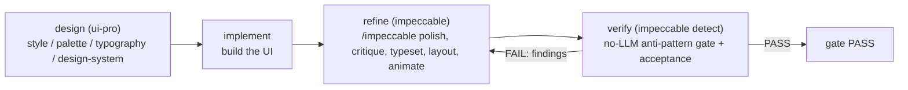

# v13.0.0 — Impeccable Integration, Web-Design Workflow, and Bundled Plugin Install

## Context & decisions

- Driven by [.local/feedbacks/feedback_for_v12.5.0.md](.local/feedbacks/feedback_for_v12.5.0.md). Three asks: (1) add `impeccable` to references + plugin library and add a ui-pro -> impeccable web-design flow; (2) bump version; (3) make devola install also install all plugins.
- **Version**: MAJOR bump `12.5.0` -> `13.0.0` (per your answer; overrides the "minor" wording in the feedback file). MAJOR triggers W-16 wholesale baseline regen and SI-3 threshold >= 9.0.
- **Global plugin install**: default-ON for `--global` with `--no-plugins` opt-out.
- **Web-design flow**: new dedicated `web-design` template.
- **What impeccable is** (from its README): an npm package (`impeccable`) shipping one AI skill with 23 `/impeccable` commands (`craft`, `shape`, `critique`, `audit`, `polish`, `typeset`, `layout`, `animate`, ...) plus a no-LLM anti-pattern detector CLI (`npx impeccable detect <path|url>`). Install via `npx impeccable skills install` (auto-detects harness). This mirrors the `ui-pro`/`codegraph` `npm_then_init` plugin shape. Catalog key and runtime id will both be `impeccable`.

This executes as a STANDARD+ cascade (L0 orchestrates -> L1/L2 -> L3 implements; P1 enforced). Work happens on a feature branch, never on a protected branch (S-6).

## Web-design workflow shape

`plugins_for_workflow("web-design")` resolves to `[ui-pro, impeccable]` in registry order, so ui-pro is ensured before impeccable; stage-level `ensure_plugins` pins ui-pro to `design` and impeccable to `refine`/`verify`.

## Phase 0 — SI-1 gate (W-1, required before any code)

- Run `git status` + `git diff --stat HEAD` working-tree sanity check (SKILL repo-init contract).
- Author `.local/research/v13.0.0_gap_analysis.md`: deficiencies (no impeccable anywhere; no active web-design workflow; install.sh/devola-init install no plugins), priority ranking, file-level fix scope. No implementation lands before this exists.
- Note MAJOR-cycle obligations: W-16 wholesale baseline regen, SI-3 >= 9.0, W-19 archive to `docs/cycle-archive/v13.0.0/`.

## Phase 1 — Register impeccable as a plugin (dual-registry, A-5 SSOT)

- [workflow-system/agent/plugins.yaml](workflow-system/agent/plugins.yaml): add `impeccable:` catalog block (cli_binary `impeccable`, npm install method `npm install -g impeccable`, capabilities = design refine/audit/critique/polish + 23 commands + anti-pattern detect, `workflows: [web-design]`, `stage_mapping` for refine/verify, `platform_install` global+project). Optionally add a `plugin_roles: ui_refinement` entry.
- [workflow-system/agent/knowledge/runtime-plugins.yaml](workflow-system/agent/knowledge/runtime-plugins.yaml): append 6th list entry `- id: impeccable` (`backend: npm_then_init`, `package: impeccable`, `install_cmd`/`upgrade_cmd`, `init_cmd_template` using `npx impeccable skills install` (auto-detect), `version_check_cmd`, `canonical_url: https://github.com/pbakaus/impeccable`, `invoked_by_workflows: [web-design]`). Append-only (A-2). Confirm `init_cmd_template` handling against `installer.py` `npm_then_init` path (`src/devolaflow/plugins/installer.py` ~588-660); also confirm impeccable's "global skill" mechanism (npm `-g` CLI + per-harness `skills install`).
- [workflow-system/agent/knowledge/reference-dependencies.yaml](workflow-system/agent/knowledge/reference-dependencies.yaml): add `active_tracking` entry for impeccable (repo_url, integration points), mirroring the codegraph entry.

## Phase 2 — Impeccable reference doc + SF-4 surfaces (C-7 = 4 mandatory edits)

- Create `workflow-system/agent/references/impeccable.md` (use `scripts/scaffold_reference.py impeccable --tier large`): purpose, when-to-load, the 23 commands, anti-pattern detector, ui-pro -> impeccable composition, degraded-mode pointer. Keep <= 1000 lines (C-4 Large tier).
- Add `"impeccable.md"` to `_SF4_REFERENCE_SET` in [tests/test_no_ghost_features.py](tests/test_no_ghost_features.py) (22 -> 23).
- Add a Tier-2 nav row in [workflow-system/agent/SKILL.md](workflow-system/agent/SKILL.md) "Reference Navigation Guide".
- Add `impeccable.md` to `MIRRORED_FILES` in [scripts/sync_cursor_skill.py](scripts/sync_cursor_skill.py) (keeps SF-4 / mirror in lockstep; satisfies the size-budget test parametrization).
- Add an impeccable section + matrix row to [workflow-system/agent/references/degraded-mode.md](workflow-system/agent/references/degraded-mode.md) (PPI001 permissive-continue, mirroring ui-pro).
- Add an `impeccable_integration` block to [workflow-system/agent/context_profiles.yaml](workflow-system/agent/context_profiles.yaml) (mirror `ui_integration`); wire it into the new `web-design` profile's section priorities.

## Phase 3 — New `web-design` workflow template (ui-pro -> impeccable)

- Create `workflow-system/agent/templates/builtin/web-design.yaml`: stages `design -> implement -> refine -> verify`, `ensure_plugins: [ui-pro]` on design and `[impeccable]` on refine/verify, refine<->verify convergence loop, gate type `convergence`.
- Register in [workflow-system/agent/templates/registry.yaml](workflow-system/agent/templates/registry.yaml) and the `templates:` list in [workflow-system/agent/workflow-skill.yaml](workflow-system/agent/workflow-skill.yaml).
- Add a Workflow Selection row in [workflow-system/agent/SKILL.md](workflow-system/agent/SKILL.md) (intent keywords: web design, frontend design, landing page, ui-pro, impeccable, polish UI).
- Add `web-design` to `invoked_by_workflows` for both `ui-pro` and `impeccable` in `runtime-plugins.yaml`.

## Phase 4 — Bundle plugins into devola install (default-ON for --global)

- [src/devolaflow/init_project.py](src/devolaflow/init_project.py): add a registry-driven `install_plugins(scope)` helper that iterates `runtime-plugins.yaml` and calls the existing installer (`refresh_all()` / `ensure_plugin(..., global)`) so commands stay SSOT (A-5, no duplication). Invoke it after a `--global` skill install unless `--no-plugins`; parse `--no-plugins` in `main()`. Per-plugin failures are warn-not-fatal with explicit logging (S-5).
- [scripts/install.sh](scripts/install.sh): add `--no-plugins`; when `SCOPE=global`, after skill install, drive the same registry path (delegate to the Python installer / `devolaflow-plugins refresh` when the package is importable; otherwise emit clear guidance). Document in `--help`.
- Note this is a CLI arg (not a new `DEVOLAFLOW_*` env flag), so W-20 reuse-first is satisfied; existing `DEVOLAFLOW_AUTO_INSTALL_PLUGINS` semantics for dispatch-time install are unchanged.

## Phase 5 — Tests (keep <= +30 new functions, W-17)

- Update plugin-order expectations to add `impeccable` (6th): `tests/test_plugin_sichip_registration.py`, `tests/test_runtime_plugins_smoke.py`.
- `tests/test_degraded_mode.py`: `test_impeccable_unreachable_emits_ppi001_permissive_continues`.
- `tests/test_dispatch_plugin_autoinstall.py` (or plugins test): `plugins_for_workflow("web-design") == ["ui-pro", "impeccable"]`.
- Template test: registry parses `web-design` with the expected stages.
- Install test: `devola-init --global` triggers `install_plugins`; `--no-plugins` skips it (subprocess mocked).
- W-18 ghost-audit stanza for impeccable in `tests/test_no_ghost_features.py` (added BEFORE the CHANGELOG entry).
- Version tests updated by bump: `tests/test_smoke.py`, `tests/test_version.py`.

## Phase 6 — Docs (ST-1..ST-13 registry, bilingual)

- [CHANGELOG.md](CHANGELOG.md): new `## [13.0.0] - <date> — MAJOR — <theme>` entry following the v12.5.0 section style (operator-visible changes, NEW symbols, headline numbers, verification table). Name the `--no-plugins` flag (W-20 authoring requirement).
- Human docs EN/ZH (`workflow-system/human/en|zh`) updated in lockstep (ST-3); `make sync-human-docs`.
- WX-2: add a `13.0.0` entry to `workflow-system/human/demo/version-timeline/versions.json`; update demo "What's New".

## Phase 7 — MAJOR version bump 12.5.0 -> 13.0.0 (W-10 / CP-3)

- `python scripts/bump_version.py 13.0.0` (updates the canonical 8 files; auto-syncs the cursor mirror if present).
- `python -m pytest tests/test_version.py -v`.

## Phase 8 — Verification gates (SI-10 / W-9 + MAJOR specifics)

- W-16: `python -m pytest tests/test_benchmarks.py --regenerate-baselines` and store `benchmarks/devolaflow_context/baselines/v13.0.0_baseline.json` (context_profiles + SKILL.md changed, so W-4/W-6/W-13 apply; run `task_adaptive_selector` for the web-design profile to confirm no `critical` section dropped).
- SI-10 6-step: `pytest tests/ -q`; `ruff check src/ tests/`; `ruff format --check src/ tests/`; `pytest tests/test_version.py`; `pytest tests/test_benchmarks.py`; `make check-cursor-skill`.
- W-12/W-5: SKILL.md changed -> `build-skill` for all 4 adapters within budget.
- SI-3: author `.local/research/v13.0.0_evaluation.md`, composite >= 9.0 (MAJOR). SI-8: `.local/research/v13.0.0_retrospective.md`. W-19: `python scripts/archive_research_artifacts.py 13.0.0`.

## Phase 9 — Branch & PR (S-6)

- Create feature branch `feat/v13.0.0-impeccable-web-design`, commit only after all SI-10 steps pass, open a Merge/Pull Request. Never push to a protected branch.

## Key risks / watch-items

- Confirm impeccable's exact global-skill install command (README documents `npx impeccable skills install` for project + manual `cp -r dist/...` for global); the `npm_then_init` init template may need a no-`{ai_platform}` form.
- Default-ON global plugin install runs `npm -g` / `pip` / `curl|bash` for 6 plugins; must be warn-not-fatal and clearly logged so sandbox/CI installs don't hard-fail.
- Both prior UI templates (`demo-showcase`, `product-verification`) are DEPRECATED; the new `web-design` template supersedes them for the ui-pro -> impeccable flow (do not revive the deprecated ones).