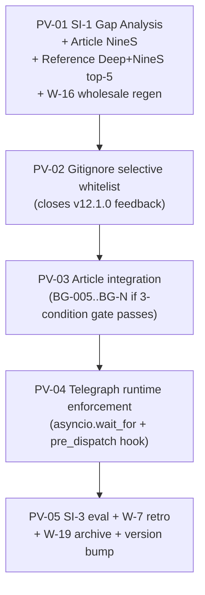
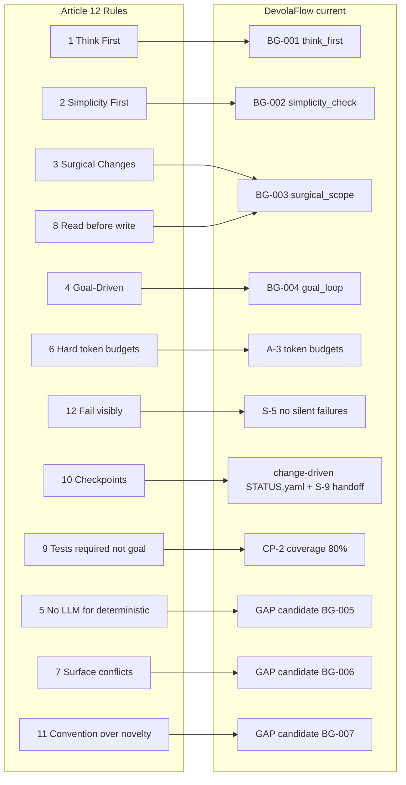

# v12.2.0 — Article Synthesis + Reference Deep Refresh + Gitignore Whitelist + Telegraph Runtime

> Cycle entry per [W-1 / SI-1](.cursor/rules/repo-governance.mdc).  
> 5 sequentially-validated PVs. Each PV closes with `pytest -q` + `ruff` GREEN before the next PV opens (mirrors W-9 SI-10 inside-the-cycle).

## 1. Source inputs (read first)

| Input | Path | Role |
|---|---|---|
| User task | [.local/tasks/update_to_v12.2.0.md](.local/tasks/update_to_v12.2.0.md) | Cycle scope contract |
| User feedback | [.local/feedbacks/feedback_for_v12.1.0.md](.local/feedbacks/feedback_for_v12.1.0.md) | Gitignore regression to fix |
| Article (Mnimiy 12-rule) | [agent-tools/dab57055...txt](/root/.cursor/projects/home-agent-workspace-DevolaFlow/agent-tools/dab57055-a438-402a-b0c6-bd1c5d03eb98.txt) | 12-rule template (X.com 403; cached page) |
| Current 4-rule baseline | [workflow-system/agent/references/behavioral-guidelines.md](workflow-system/agent/references/behavioral-guidelines.md) | BG-001..BG-004 already cover Karpathy 1-4 |
| Reference inventory | [workflow-system/agent/knowledge/reference-dependencies.yaml](workflow-system/agent/knowledge/reference-dependencies.yaml) | 21 entries (11 active + 10 periodic) |
| Telegraphed work | [CHANGELOG.md §v12.1.0+v12.2.0+ telegraph](CHANGELOG.md) | `pre_dispatch` quality_score hook + `AsyncDispatchExecutor` timeout |
| Cycle-archive policy | [docs/cycle-archive/v12.0.0/README.md](docs/cycle-archive/v12.0.0/README.md) | W-19 calls `.local/research/` "gitignored" — conflicts with PV-02 whitelist; decision needed |

## 2. Why MINOR (not MAJOR or PATCH)

- **Not MAJOR**: no schema break, no API removal, no soul-rule change. Gitignore whitelist is additive (more files tracked, never fewer); backward-compat for existing consumer repos (whitelist applies only when `devola-init local` re-runs).
- **Not PATCH-style MINOR (like v12.1.0)**: scope spans 5 surfaces; PATCH-style is single-PV no-code-change.
- **MINOR**: telegraphed deferred work + new ref-deps insights + selective behavioral primitive additions + bug fix.

## 3. PV decomposition (5 PVs)



Each PV closes with: `pytest tests/ -q` + `ruff check src/ tests/` + `ruff format --check` GREEN before the next opens.

### PV-01 — Cycle entry gap analysis + Article NineS + Reference deep refresh

**Deliverables** (all under `.local/research/v12.2.0_*`):

- `v12.2.0_gap_analysis.md` — the W-1 / SI-1 entry-gate artifact, weaving:
  - Article 8-rule (Rules 5-12) mapping vs existing DevolaFlow rules (already drafted below in §4)
  - Reference refresh delta summary
  - Gitignore feedback decomposition + the `docs/cycle-archive/` conflict resolution proposal
  - Telegraphed deferred work scope reminder
- `v12.2.0_article_nines.{json,md}` — `nines analyze --target-path <cached page> --depth deep --agent-impact --keypoints`
- `v12.2.0_reference_deltas/` — one `.md` per ref-dep that had release activity since `last_checked: 2026-05-02` (top-5 by relevance+activity)
- `benchmarks/devolaflow_context/baselines/v12.2.0_baseline.json` — **W-16 wholesale regen** (MINOR cycle entry per W-16); pins all 36+ benchmark scenarios at the v12.2.0 equilibrium

**Why wholesale regen at PV-01**: v12.0.0 → v12.1.0 → v12.2.0 is a MINOR transition; v8.4.0 retrospective §R-7 (cited at [.rules/workflow.mdc W-16](.rules/workflow.mdc)) mandates wholesale regen at cycle start, not piecemeal.

### PV-02 — Gitignore selective whitelist (closes v12.1.0 feedback)

**Target**: revert the v9.2.3 PV-02 broad `.local/` ignore to a selective whitelist per the user's explicit team-collab set: **`.local/memory/specs/` + `.local/research/`**.

**Files**:

| File | Change |
|---|---|
| [src/devolaflow/local/workspace.py](src/devolaflow/local/workspace.py) | Replace `_LOCAL_GITIGNORE_RULE = ".local/"` with multi-line whitelist block. Update `_is_broad_local_ignore_rule` semantics or rename to `_is_correct_local_ignore_block`. Update `ensure_local_gitignore` to write the new block + repair both the v9.2.3 broad rule AND the legacy `_OLD_LOCAL_WHITELIST_RULES`. |
| [.gitignore](.gitignore) | Repo-root self-fix — replace line 49 `.local/` with the new whitelist block. |
| [tests/test_local_workspace.py](tests/test_local_workspace.py) + [tests/test_scaffold_gitignore_audit.py](tests/test_scaffold_gitignore_audit.py) | Pin the new block format, the v9.2.3-broad-rule repair path, and the legacy-whitelist repair path. |
| [tests/test_no_ghost_features.py](tests/test_no_ghost_features.py) | W-18 stanza `test_v12_2_0_gitignore_whitelist_repair` |

**New `.gitignore` block proposal** (operator-visible):

```bash
# DevolaFlow local workspace (private — whitelist team-collab subdirs)
# Per .local/feedbacks/feedback_for_v12.1.0.md — narrow whitelist replaces broad ignore.
.local/*
!.local/.gitignore        # let nested .gitignore files survive
!.local/memory/
.local/memory/*
!.local/memory/specs/     # A-4 source-of-truth contracts
!.local/memory/specs/**
!.local/research/         # gap analysis + ADRs + design docs (cited by W-19 retros)
!.local/research/**
```

**Decision the user needs to confirm during plan refinement**: `docs/cycle-archive/v12.0.0/README.md` declares `.local/research/` "gitignored". Whitelisting `.local/research/` adds ~12MB / 508 files to git history. Two paths:

- **Option A — "live + archive" parallel**: keep both surfaces; `.local/research/` becomes live cycle workspace tracked from v12.2.0 forward; `docs/cycle-archive/` remains canonical frozen snapshot at cycle close. Update [docs/cycle-archive/v12.0.0/README.md](docs/cycle-archive/v12.0.0/README.md) "gitignored" line.
- **Option B — graduated**: keep current cycle research tracked (`.local/research/v12.2.0*` only); older `.local/research/v9.*..v12.1.*` files get `git rm` once `docs/cycle-archive/v9.0.0/` ... `docs/cycle-archive/v12.1.0/` archives exist. Adds a `scripts/archive_research_artifacts.py --rm-source` cleanup step.

PV-02 ships the gitignore mechanics; the live/graduated choice is documented in PV-01's gap analysis and confirmed during the user's plan-confirmation step (or in PV-05 retrospective if deferred).

### PV-03 — Article-driven behavioral primitive additions (SELECTIVE per article's own thesis)

**Article's own advice**: "a 6-rule CLAUDE.md tuned to your real failure modes beats a 12-rule one with 6 rules you'll never need." Translate to DevolaFlow: only adopt the article's Rules 5-12 that close gaps NOT already covered by S-1..S-10, A-1..A-7, W-1..W-24, or BG-001..BG-004.

**Pre-mapping** (formalised in PV-01's gap analysis; sketch below):

| Article Rule | Existing DevolaFlow coverage | Gap verdict |
|---|---|---|
| 5. No LLM for deterministic decisions | A-3 (budgets), W-20 (env-flag reuse) — partial; NEW principle for L3 | **NEW BG-005 candidate** |
| 6. Hard token budgets | A-3 + W-6 + `gate.token_budget` (v8.0.0 P-03) | **Already covered** — reinforce L3 self-check |
| 7. Surface conflicts, don't average | Not covered | **NEW BG-006 candidate** |
| 8. Read before write | Implicit in `execution-protocol.md` Read tool guidance | **Already covered** — sharpen wording |
| 9. Tests required but not the goal | CP-2 (coverage), W-4 (benchmarks), `test_on_complete` hook | **Already covered** |
| 10. Long-running ops need checkpoints | change-driven workflow + STATUS.yaml + handoff envelopes (S-9) | **Already covered** |
| 11. Convention beats novelty | Not covered | **NEW BG-007 candidate** |
| 12. Fail visibly, not silently | **S-5** at Soul level | **Already covered** — strongest |

**Likely scope**: 0-3 NEW BG primitives (BG-005 / BG-006 / BG-007). Each must clear the [W-22.3 ADR 3-condition gate](.cursor/rules/repo-governance.mdc) if the addition is architectural; otherwise stays as a behavioral primitive (no ADR needed).

**Files** (only if the gate passes for each):

- `workflow-system/agent/references/behavioral-guidelines.md` (extend the matrix + add Rule sections + Severity matrix rows)
- `workflow-system/agent/context_profiles.yaml` (per-profile defaults for new fields if any)
- `schemas/lean-dispatch.yaml` (NEST under `behavioral_guidelines` if the new fields fit there; preserves canonical_order length 17 per [A-2.3](.cursor/rules/repo-governance.mdc))
- `tests/test_behavioral_guidelines.py` + `tests/test_no_ghost_features.py` W-18 stanza

### PV-04 — Telegraphed runtime enforcement (v12.0.0+v12.1.0 deferred work)

Per [CHANGELOG.md §v12.1.0 telegraph](CHANGELOG.md):

- `AsyncDispatchExecutor` per-task timeout (`asyncio.wait_for`) — closes D-2 at runtime layer; surfaces `TaskOutcome(succeeded=False, exception=TimeoutError)` on breach. Files: [src/devolaflow/agent_workspace/dispatch_executor.py](src/devolaflow/agent_workspace/dispatch_executor.py).
- `pre_dispatch` hook rejecting L3 reports with `quality_score` fields — closes D-1 at runtime layer per [S-10](.cursor/rules/repo-governance.mdc) hook-chain contract. Files: [src/devolaflow/lifecycle/](src/devolaflow/lifecycle/) (new `reject_subagent_quality_score.py`).
- Per-task-type timeout defaults in [src/devolaflow/task_adaptive_selector.py](src/devolaflow/task_adaptive_selector.py) (`research=2700` / `impl=1800` / `test=900` / `review=1200` / `hotfix=600`).

Each runtime surface stays default-permissive per the [.rules/workflow.mdc](.cursor/rules/workflow.mdc) "DEFAULTS-PERMISSIVE-IN-MINOR / STRICT-IN-NEXT-MAJOR" pattern; strict graduation telegraphed to v13.0.0 per [W-21](.cursor/rules/repo-governance.mdc).

### PV-05 — SI-3 evaluation + W-7 retrospective + W-19 archive + version bump

- `.local/research/v12.2.0_nines_self_eval.{json,md}` — `nines self-eval` per [W-2](.cursor/rules/repo-governance.mdc)
- `.local/research/v12.2.0_evaluation.md` — SI-3 6-dimension scorecard; **MINOR threshold composite ≥ 8.5** per [W-3](.cursor/rules/repo-governance.mdc)
- `.local/research/v12.2.0_retrospective.md` — W-7 4-section retrospective
- `scripts/archive_research_artifacts.py v12.2.0` — W-19 archive to `docs/cycle-archive/v12.2.0/`
- `scripts/bump_version.py 12.2.0` — bumps all 8 canonical files per [C-6](.cursor/rules/repo-governance.mdc) + auto-syncs mirror
- `CHANGELOG.md ## [12.2.0]` entry — authored AFTER W-18 ghost-audit stanzas land
- W-9 SI-10 6-step pre-commit GREEN

## 4. Article 12-rule cross-walk (for PV-01 gap analysis seed)

The article's empirical claim is **41% → 11% → 3% mistake rate** (no rules → 4 rules → 12 rules). Karpathy's 4 are already implemented as BG-001..BG-004; this cycle evaluates the 8 extensions.

Mermaid diagram for the gap mapping:



## 5. Budget guards

| Guard | Threshold | This cycle estimate |
|---|---|---|
| [W-17](.cursor/rules/repo-governance.mdc) NEW tests / PV | ≤ +30 | ~5-15 per PV; PV-04 highest (~15) |
| [W-17](.cursor/rules/repo-governance.mdc) NEW tests / cycle | ≤ +150 | ~50 cumulative |
| [W-21](.cursor/rules/repo-governance.mdc) Soul-set cap | 12 (currently 10) | No Soul additions |
| [C-4](.cursor/rules/repo-governance.mdc) SKILL.md ceiling | < 500 lines | Currently 494; +5 max acceptable (would need PV-03 prose tightening) |
| [W-20](.cursor/rules/repo-governance.mdc) env-flag count | reuse-first | 7 (no new flag) |
| [A-2.4](.cursor/rules/repo-governance.mdc) multi-baseline | 33/33 | Stays 33/33 (no schema NEST in PV-03 unless field needed) OR 34/34 if PV-03 NESTs new BG fields |

## 6. Risks + mitigations

| Risk | Mitigation |
|---|---|
| `.local/research/` whitelist explodes git diff (12MB / 508 files) | Surface in PV-01 gap analysis; user picks Option A (live+archive) vs Option B (graduated). Default to Option B if unclear. |
| PV-03 over-adds BG primitives → bloat against C-4 | Apply article's own "6-rule beats 12-rule" advice; each new BG must clear gap-mapping verdict from §4 |
| W-16 wholesale regen at PV-01 invalidates PV-02..PV-05 baseline mid-flight | Single regen at PV-01; subsequent PVs compare against the same v12.2.0 baseline (no piecemeal per W-16) |
| `AsyncDispatchExecutor` timeout default value triggers in well-behaved tests | Make default-OFF for v12.2.0 (default `None` = no timeout); operators opt in by passing `timeout_seconds` per task |
| Article integration introduces "rule sprawl" (>14 effective rules) per article §7 | Pre-commit count check in PV-03; defer to v12.3.0 if cumulative behavioral primitives + Soul ≥ 14 |

## 7. Out of scope (telegraphed forward)

- Strict graduation of PV-04 runtime enforcement → v13.0.0 per [W-21](.cursor/rules/repo-governance.mdc) 2-cycle cadence
- Comprehensive reference dependency NineS deep on all 21 entries (PV-01 covers top-5 by activity; remaining 16 stay on monthly cadence per `tracking_policy`)
- `--rm-source` mode of `scripts/archive_research_artifacts.py` (only ships if user picks gitignore Option B in plan refinement)