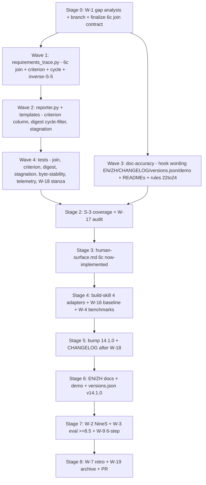

# v14.1.0 (MINOR) — Complete the Human-Surface OUTPUT Contract + v14.0.0 Review Fixes

## Scope & source of truth

Build to the ratified design [.local/research/v14.0.0_design.md](.local/research/v14.0.0_design.md) (§4 OUTPUT, §6c two-producer trace, ADR-4/ADR-5) and the v14.0.0 review findings. Operator-selected scope: **MINOR** — all correctness/doc fixes PLUS the §6c functional evidence-join.

Version decision: **MINOR `v14.1.0`** because the §6c test-run-artifact join is new capability. MINOR readiness bar = **W-3/SI-3 composite ≥ 8.5** (not the ≥9.0 MAJOR bar). New `.0`-style MINOR cycle ⇒ **W-16 wholesale baseline regen** applies; **W-1 SI-1 gap analysis** gates entry.

Invariants held: **A-2 untouched** (no schema change; `canonical_order` stays 17), **W-21** no new Soul rule, **S-6** feature branch + PR (never push `main`), **S-2** relative paths.

## Build sequence

## Stage 0 — Cycle entry (W-1 SI-1)

- `git status` working-tree sanity; branch `feat/v14.1.0-human-surface-output` off `main` (or current HEAD `5cf9573`).
- Author [.local/research/v14.1.0_gap_analysis.md](.local/research/v14.1.0_gap_analysis.md): enumerate the 4 majors + minors from the review, priority, file-level scope. **Finalize the §6c join contract** (the one real design decision):
  - New frozen `TestOutcome{node_id, outcome, commit}` + `parse_pytest_report(path)` (consume a pytest `--report-log` JSONL or junitxml; S-5 loud on missing/malformed).
  - `trace_requirements(requirements_path, *, test_results=None)` — when `test_results` given, extract the test node-id from each REQ's `Acceptance` text, look up outcome, set `result` (passed→met / failed→unmet / missing→matrix fallback) and **verbatim** evidence `"<node_id> <PASS|FAIL> @ <commit>"` (C-3); when absent, keep current matrix-Status behaviour (backward-compatible — existing tests stay green).

## Stage 1 — Implement (disjoint file ownership per wave)

- **Wave 1 — [requirements_trace.py](src/devolaflow/agent_workspace/requirements_trace.py):**
  - Add `criterion: str = ""` and `cycle: str = ""` to `RequirementTraceResult` (after the 3 required fields; defaults keep existing constructors green).
  - `_parse_traceability_matrix` (L193): also capture the `Cycle` column (`_find_col(header, "cycle")`) → return `{REQ-ID: (status, criterion, cycle)}`.
  - `trace_requirements` (L257): add `test_results` param + the join; **union matrix keys with block keys** (fixes inverse-S-5 at L302 — a matrix-only REQ currently never emits) → matrix-only rows map to `unmet` + explicit note.
  - Add `TestOutcome` + `parse_pytest_report` + `__all__` exports.
- **Wave 2 — [reporter.py](src/devolaflow/agent_workspace/reporter.py) + templates (depends on Wave 1 fields):**
  - `render_human_report` (L432): add `criterion` to `req_rows`; thread `test_results` through to the trace.
  - [human_report.md.j2](src/devolaflow/agent_workspace/templates/human_report.md.j2) L12-15: 4-column table `| REQ-ID | Acceptance criterion | Result | Evidence |` (matches §4a).
  - `render_human_digest` (L502): filter `req_deltas` to `cycle == version` (the §4b/F-3 fix; the matrix `Cycle` is now parsed).
  - `_derive_human_status` (L842): add optional `stagnation: bool = False` → `human_needed` (closes §4a stagnation path).
- **Wave 3 — doc-accuracy (parallel, disjoint from code):**
  - Qualify the immutability-hook "guard" overclaim (it is opt-in, NOT in `DEFAULT_EVENTS`) at [CHANGELOG.md](CHANGELOG.md):16, [architecture-overview.md (EN)](workflow-system/human/en/architecture-overview.md):122, [architecture-overview.md (ZH)](workflow-system/human/zh/architecture-overview.md):94, [versions.json](workflow-system/human/demo/version-timeline/versions.json):1901+1904, and the demo [index.html](workflow-system/human/demo/index.html) v14 "What's New". Wording: "available via `check_human_input_append_only` (opt-in via `register_hook`; not in `DEFAULT_EVENTS`)".
  - Add the 3 missing `_DIR_README_CONTENT` keys in [local/workspace.py](src/devolaflow/local/workspace.py) (`human/input/amendments`, `human/output/convergence`, `human/archive`) with write-owner tags; fix the stale "three positive rules" comment (now four).
  - Fix the stale archive index entry `v14.0.0_implementation_evaluation.md` → `v14.0.0_impl_evaluation.md` in [docs/cycle-archive/v14.0.0/README.md](docs/cycle-archive/v14.0.0/README.md):27.
  - Update the stale "(22 files)" / "22 entries" count → 24 in [.rules/conventions.mdc](.rules/conventions.mdc) (C-4 + C-7), then `make compile-rules` (regenerates `AGENTS.md` + `.cursor/rules/repo-governance.mdc`; never hand-edit compiled outputs — drift lint blocks it).
- **Wave 4 — tests (depends on Waves 1-2):** see Stage 2.

## Stage 2 — Tests (S-3 ≥80%, W-17 cap)

- New/updated tests: §6c join (`parse_pytest_report`, `test_results` path, verbatim evidence format), criterion column render, DIGEST `cycle`-filter, stagnation status, inverse-S-5 matrix-only REQ, plus a **dedicated 4-flavour byte-stability** regression in [tests/test_reporter.py](tests/test_reporter.py) (the gap R3 flagged).
- Test-hygiene: redirect the test that rewrites the tracked `.local/research/v7.0.3_probe_telemetry.json` to `tmp_path` (locate via `tests/test_dispatch_latency.py` / probe test).
- W-17: keep ≤ +30 NEW test funcs this PV / ≤ +150 cycle; report the count.

## Stage 3 — Reference doc

- Update [references/human-surface.md](workflow-system/agent/references/human-surface.md): mark §6c test-run-artifact join as **implemented** (was "future cycle"); document the caller contract (supply `test_results` from a pytest report at workflow close). No new reference file ⇒ C-7 four-obligations unchanged; keep ≤1000 lines.

## Stage 4 — Adapter build + benchmarks

- W-5/W-12: `build-skill` for the 4 adapters (SKILL.md version strings change on bump) within budgets.
- W-16: wholesale regen `benchmarks/devolaflow_context/baselines/v14.1.0_baseline.json` (regen at first drift or cycle close).
- W-4/W-13: `python -m pytest tests/test_benchmarks.py -v` (no regression >5%).

## Stage 5 — Version bump (W-10/CP-3, C-6)

- `python scripts/bump_version.py 14.1.0` (canonical 8 + auto cursor-skill sync); **W-18 first** — refresh ghost-audit with a `test_v14_1_0_*` stanza for new symbols (`parse_pytest_report`, `TestOutcome`, new trace fields) BEFORE writing the CHANGELOG; then add `## [14.1.0]`; run `tests/test_version.py` + `tests/test_smoke.py`.

## Stage 6 — Human docs (ST-1..ST-13, WX-2)

- EN/ZH guides; demo pages; new `versions.json` v14.1.0 entry (WX-2 fields); benchmark-results `SAMPLE_DATA` version; README badge; `make sync-human-docs`. Keep EN/ZH parity (ST-3).

## Stage 7 — Review + gate

- W-2/SI-2 NineS self-eval; W-3 [.local/research/v14.1.0_impl_evaluation.md](.local/research/v14.1.0_impl_evaluation.md) (composite **≥ 8.5** MINOR); **W-9/SI-10 6-step**: `pytest -q`, `ruff check`, `ruff format --check`, `test_version.py`, `test_benchmarks.py`, `make check-cursor-skill`. FAIL → reinforcement round (W-8).

## Stage 8 — Close

- W-7 [.local/research/v14.1.0_retrospective.md](.local/research/v14.1.0_retrospective.md) (4 sections); W-19 `python scripts/archive_research_artifacts.py v14.1.0` → `docs/cycle-archive/v14.1.0/`; commit; push branch; open single PR (S-6).

## Key decisions / risks

- **Hook stays opt-in (qualify docs), NOT wired into `DEFAULT_EVENTS`** — wiring would bump the event count 16→17 and break the two CI tests pinning `len==16` (cache-stable lifecycle tuple); the v14.0.0 design deliberately chose opt-in. If you instead want it always-on, that is a separate cache-layout decision — tell me and I will replan.
- **`RequirementTraceResult` field growth** — add `criterion`/`cycle` with defaults to avoid churning existing test constructors (W-17 friendly).
- **§6c evidence source** — the pure function consumes a parsed `test_results` map; producing it (run pytest with `--report-log` + capture HEAD commit) is the L0 caller's job, documented in `human-surface.md`. SI-1 finalizes report format + REQ→node-id linkage.
- **No `.local/human/` in this repo** — feature is scaffolding for consumer repos; tests use fixtures (unchanged from v14.0.0).

## Out of scope (deferred)

- Real git-diff/pre-commit CI for INPUT immutability (design §3c "git-diff lint") — current hook is API-level like its handoff-envelope analogue; defer to a future cycle unless requested.
- Auto-`update_tracker()` (ADR-7 optional later enhancement).
