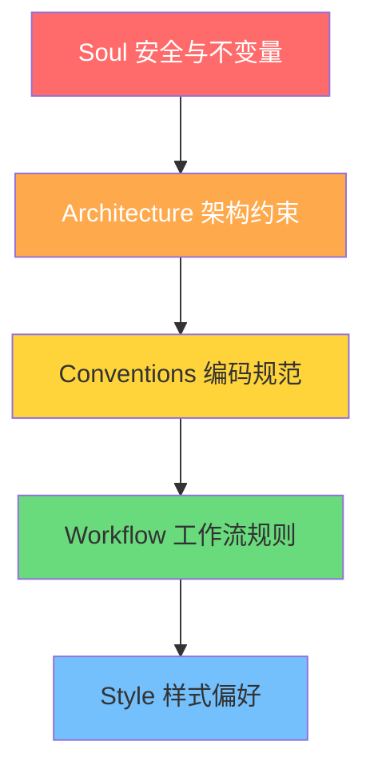
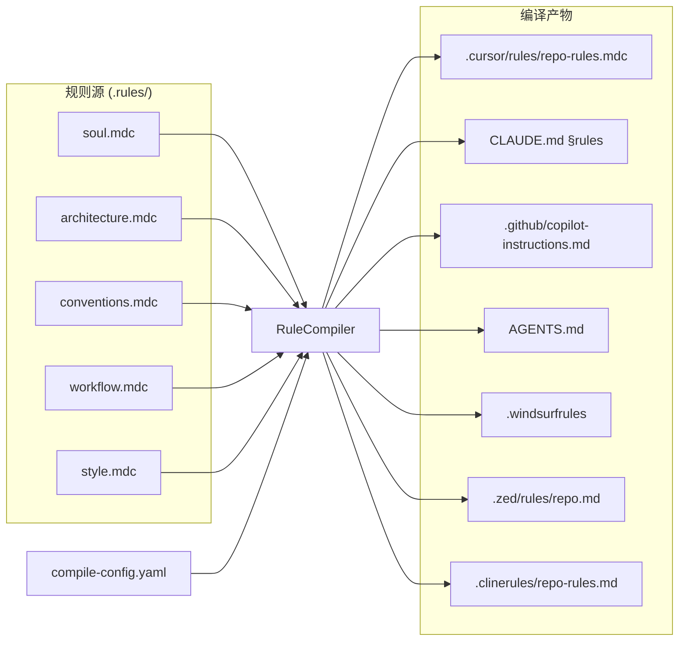

# DevolaFlow Init Workflow — 仓库初始化与治理设计方案 v7.3

> 文档版本: 1.1 | 对应 DevolaFlow: v7.3.0 | 日期: 2026-04-20
> v1.1 变更: 将独立 `devola-local` 技能方案改为 `devola-flow` 内置 `repo-init` 工作流

---

## 一、概述与目标

### 1.1 为什么需要 Init Workflow

DevolaFlow 作为多 Agent 编排的工作流元框架，核心能力（`devola-flow` 技能）聚焦于 **任务分解 → 门控 → 收敛** 的执行链路。但在实际使用中，两个关键问题反复出现：

1. **本地工作区无规范**：`.local/` 已被 `.gitignore` 忽略，SI-1/SI-2/SI-3/SI-8 规则要求在 `.local/research/` 存放 gap analysis、ADR、retrospective 等产物，但目录结构靠人工约定，缺乏索引导航和按需创建机制。当前 `.local/` 下已积累 benchmarks/、research/、feedbacks/ 等散落文件，缺少 `index.md` 导航。

2. **规则治理碎片化**：项目有 8 个 `.cursor/rules/*.mdc` 文件，但这些规则仅被 Cursor 消费。Claude (`CLAUDE.md`)、Copilot (`.github/copilot-instructions.md`)、Windsurf、Zed、Cline 等工具各有独立的规则格式，导致同一仓库的治理约束在不同工具之间不一致。

### 1.2 架构定位：devola-flow 内置工作流

**关键决策：不创建独立技能，而是在 `devola-flow` 中新增 `repo-init` 工作流。**

```
devola-flow
├── workflow 工作流执行引擎（运行时）
│   ├── greenfield / brownfield / ...  ← 既有工作流类型
│   └── repo-init  ← 新增：仓库初始化与治理工作流
└── infrastructure
    ├── gate / template_engine / adapters  ← 既有基础设施
    └── local/  ← 新增：workspace + compiler + drift 模块
```

Init workflow 与其他工作流的关系：

- **正交互补**：`greenfield`/`brownfield` 管 **怎么做**（dispatch → gate → converge），`repo-init` 管 **在哪做、按什么规矩做**（workspace scaffold + rule governance）
- **共享基础设施**：复用 DevolaFlow 的适配器管线（`adapter_configs/`、`DataDrivenAdapter`）、门控系统、上下文优化
- **深度分析驱动**：Init workflow 在 `analyze` 阶段深度解析仓库结构（语言、框架、CI、现有规则、AI 工具覆盖情况），为后续迭代工作流建立全局认知

### 1.3 核心解决的问题

| # | 问题 | Init Workflow 的解决方案 |
|---|------|------------------------|
| P1 | `.local/` 无索引、无规范 | 标准化目录树 + `index.md` 模板 + 按需创建策略 |
| P2 | 规则只对 Cursor 生效 | `.rules/` 统一规则源 + 跨工具编译管线 |
| P3 | 规则漂移无感知 | 编译产物漂移检测 + CI 集成 |
| P4 | 新仓库无脚手架 | `repo-init` 工作流一键初始化 |
| P5 | Token 预算失控 | 按工具的 token 限额编译 + 预算报告 |

---

## 二、`.local/` 工作区结构设计

### 2.1 完整目录树

```
.local/
├── index.md                    # 工作区导航索引（必选）
├── feedbacks/                  # 迭代反馈记录（必选）
│   └── feedback_for_v7.3.0.md
├── tasks/                      # 任务跟踪（必选）
│   └── current.md
├── research/                   # 调研/分析产物（按需，SI-1/SI-2 要求）
│   ├── gap_analysis_v7.3.md
│   └── adr/
│       └── v7-ADR-001-*.md
├── design/                     # 设计文档（按需）
│   └── *.md
├── benchmarks/                 # 本地基准测试产物（按需，SI-4 要求）
│   └── run_*.py
├── logs/                       # 运行日志/NineS 输出（按需，SI-2 要求）
│   └── nines_self_eval_v7.3.json
├── scratch/                    # 临时实验空间（按需，不被索引）
│   └── ...
└── .meta.yaml                  # 工作区元数据（自动维护）
```

### 2.2 各目录职责

| 目录 | 创建策略 | 职责 | 关联规则 |
|------|----------|------|----------|
| `index.md` | **必选** | 工作区导航入口，列出所有活跃目录和最近活动 | — |
| `feedbacks/` | **必选** | 每版本一个反馈文件，驱动迭代改进 | SI-8 |
| `tasks/` | **必选** | 当前迭代任务列表和进度跟踪 | SI-1 |
| `research/` | **按需** | gap analysis, NineS 评估, ADR | SI-1, SI-2, SI-3 |
| `design/` | **按需** | 设计文档、方案对比、架构决策 | — |
| `benchmarks/` | **按需** | 本地基准测试脚本和结果 | SI-4, CO-5 |
| `logs/` | **按需** | 工具运行日志、NineS JSON 输出 | SI-2 |
| `scratch/` | **按需** | 临时实验，不纳入索引 | — |
| `.meta.yaml` | **自动** | 记录创建时间、最后更新、已激活目录列表 | — |

### 2.3 按需创建策略

采用**渐进式丰富**（progressive enrichment）模式：

```python
REQUIRED_DIRS = ["feedbacks", "tasks"]
ON_DEMAND_DIRS = ["research", "design", "benchmarks", "logs", "scratch"]

def scaffold_local(cwd: Path, dirs: list[str] | None = None) -> None:
    local = cwd / ".local"
    local.mkdir(exist_ok=True)

    for d in REQUIRED_DIRS:
        (local / d).mkdir(exist_ok=True)

    if dirs:
        for d in dirs:
            if d in ON_DEMAND_DIRS:
                (local / d).mkdir(exist_ok=True)

    _write_index(local)
    _write_meta(local)
```

触发按需创建的场景：
- `repo-init` 工作流 scaffold 阶段 → 根据 analyze 结果决定创建哪些目录
- SI-1 gap analysis 开始时 → 自动创建 `research/`
- `devola-flow` 执行 benchmark 时 → 自动创建 `benchmarks/`

### 2.4 index.md 模板

```markdown
# .local/ 工作区索引

> 自动生成于 {timestamp} | DevolaFlow v{version}
> 此文件由 `repo-init` 工作流维护，手动编辑会在下次 sync 时被覆盖

## 活跃目录

| 目录 | 状态 | 最近更新 | 文件数 |
|------|------|----------|--------|
| feedbacks/ | ✅ 活跃 | {date} | {count} |
| tasks/ | ✅ 活跃 | {date} | {count} |
| research/ | ⏳ 按需 | — | — |

## 最近活动

- [{date}] feedbacks/feedback_for_v7.3.0.md — 新增迭代反馈
- [{date}] tasks/current.md — 更新任务状态

## 快速导航

- 当前迭代反馈: [feedbacks/](feedbacks/)
- 当前任务: [tasks/current.md](tasks/current.md)
- 调研产物: [research/](research/) (如已创建)
```

### 2.5 与 SI 规则的对齐

| SI 规则 | 要求 | Init Workflow 的实现 |
|---------|------|---------------------|
| SI-1 迭代规划门控 | gap analysis 存放在 `.local/research/` | `research/` 按需创建 + index 自动索引 |
| SI-2 NineS 驱动分析 | JSON 输出存放在 `.local/research/` | `logs/` 存放原始 JSON，`research/` 存放分析报告 |
| SI-3 发布前评估 | 评估报告存放在 `.local/research/` | 评估模板 + 自动索引 |
| SI-8 迭代回顾 | retrospective 存放在 `.local/research/` | 回顾模板 + feedbacks/ 聚合 |

---

## 三、`.rules/` 治理规则结构设计

### 3.1 分层规则模型

采用 **Soul Rules** 五层架构，从不可变核心约束到可调样式偏好：



| 层级 | 优先级 | 特征 | 示例 |
|------|--------|------|------|
| Soul | P0 — 不可覆盖 | 安全红线、法律合规 | 禁止硬编码密钥、禁止 force push main |
| Architecture | P1 — 需审批修改 | 技术架构约束 | 分层隔离、接口契约、依赖方向 |
| Conventions | P2 — 团队共识 | 编码与命名规范 | ruff 配置、测试覆盖率要求 |
| Workflow | P3 — 可按项目调整 | CI/CD 和开发流程 | PR 流程、commit 规范 |
| Style | P4 — 个人偏好 | 代码风格细节 | 注释风格、import 排序偏好 |

### 3.2 目录结构

```
.rules/
├── index.md              # 规则目录索引
├── soul.mdc              # P0: 不可变核心约束
├── architecture.mdc      # P1: 架构约束
├── conventions.mdc       # P2: 编码规范
├── workflow.mdc          # P3: 工作流规则
├── style.mdc             # P4: 样式偏好
└── compile-config.yaml   # 跨工具编译配置
```

使用 `.mdc` 格式（Markdown with Configuration）以兼容 Cursor 的规则解析，同时对其他工具可作为标准 Markdown 处理。

### 3.3 soul.mdc 核心约束模板

```markdown
---
description: "仓库核心安全约束 — 所有 AI 工具和开发者必须遵守，不可覆盖"
priority: P0
alwaysApply: true
---

# Soul Rules — 核心不变量

## S-1 安全红线
- 禁止硬编码密钥/密码/token，禁止 commit `.env`/`credentials.json`
- 禁止对 main/master 执行 force push，禁止 `--no-verify`

## S-2 数据完整性
- 数据库迁移必须可逆（up + down），API 端点必须有输入验证

## S-3 错误处理
- 禁止空 catch/except 块，所有错误必须 log/re-throw/返回显式状态

## S-4 AI 工具约束
- AI 代码需通过同等测试审查，禁止 AI 修改 soul.mdc 本身
```

### 3.4 index.md 规则目录模板

```markdown
# .rules/ 规则目录

> 由 `repo-init` 工作流管理，编译到各 AI 工具的原生格式

## 规则层级

| 文件 | 层级 | 优先级 | 规则数 | 最后更新 |
|------|------|--------|--------|----------|
| soul.mdc | Soul | P0 | {n} | {date} |
| architecture.mdc | Architecture | P1 | {n} | {date} |
| conventions.mdc | Conventions | P2 | {n} | {date} |
| workflow.mdc | Workflow | P3 | {n} | {date} |
| style.mdc | Style | P4 | {n} | {date} |

## 使用方式

devola-init sync-rules               # 编译到所有检测到的工具
devola-init sync-rules --tools cursor # 指定工具
devola-init check-drift               # 检测编译产物漂移
```

### 3.5 与现有 `.cursor/rules/` 的关系

现有 8 个 `.cursor/rules/*.mdc` 文件分为两类：

1. **DevolaFlow 工作流规则**（由 `install.sh` 分发）：
   - `devola-flow-rules.mdc` / `workflow-rules.mdc` — 属于 `devola-flow` 技能，不归 `.rules/` 管辖

2. **DevolaFlow 项目内部规则**（不分发，仅本仓库开发用）：
   - `change-process-rules.mdc`, `skill-format-rules.mdc`, `self-improve-iteration-rules.mdc` 等
   - 这些可以渐进迁移到 `.rules/` 分层模型中

**迁移策略**：增量式，不破坏现有结构。

```
Phase 1: .rules/ 独立新建，不触碰 .cursor/rules/
Phase 2: 新规则优先写入 .rules/，编译输出到 .cursor/rules/
Phase 3: 存量规则逐步重构到 .rules/ 分层模型（可选）
```

---

## 四、跨工具规则编译方案

### 4.1 编译器架构



设计原则：复用 DevolaFlow 现有的适配器基础设施 (`DataDrivenAdapter` 模式)，为规则编译创建平行的 YAML 驱动管线。

### 4.2 输入输出映射表

| 目标工具 | 输出路径 | 格式 | Soul | Arch | Conv | WF | Style | Token 限额 |
|----------|----------|------|------|------|------|-----|-------|-----------|
| Cursor | `.cursor/rules/repo-rules.mdc` | MDC (带 frontmatter) | ✅ | ✅ | ✅ | ✅ | ✅ | 8000 |
| Claude | `CLAUDE.md` 追加 section | Markdown | ✅ | ✅ | ✅ | ✅ | ❌ | 4000 |
| Copilot | `.github/copilot-instructions.md` | Markdown | ✅ | ✅ | ✅ | ❌ | ❌ | 4000 |
| AGENTS.md | `AGENTS.md` | Markdown (LF标准) | ✅ | ✅ | ✅ | ✅ | ✅ | 6000 |
| Windsurf | `.windsurfrules` | Plaintext | ✅ | ✅ | ✅ | ✅ | ❌ | 4000 |
| Zed | `.zed/rules/repo.md` | Markdown | ✅ | ✅ | ✅ | ❌ | ❌ | 3000 |
| Cline | `.clinerules/repo-rules.md` | Markdown | ✅ | ✅ | ✅ | ✅ | ❌ | 4000 |
| Roo | `.roo/rules/repo-rules.md` | Markdown | ✅ | ✅ | ✅ | ✅ | ❌ | 4000 |
| KimiCode | `.kimi/rules/repo.md` | Markdown | ✅ | ✅ | ✅ | ❌ | ❌ | 3000 |

**层级包含逻辑**：Token 预算不足时按优先级裁剪 — Style 先丢弃，依次向上。Soul 层永不裁剪。

### 4.3 compile-config.yaml 配置规范

```yaml
version: "1.0"
source_dir: ".rules"

layers:
  - name: soul
    file: soul.mdc
    priority: P0
    always_include: true
  - name: architecture
    file: architecture.mdc
    priority: P1
    always_include: true
  - name: conventions
    file: conventions.mdc
    priority: P2
    always_include: false
  - name: workflow
    file: workflow.mdc
    priority: P3
    always_include: false
  - name: style
    file: style.mdc
    priority: P4
    always_include: false

targets:
  cursor:
    output: ".cursor/rules/repo-rules.mdc"
    format: mdc
    token_budget: 8000
    include_layers: [soul, architecture, conventions, workflow, style]
    frontmatter:
      description: "仓库治理规则（由 .rules/ 编译生成，勿手动编辑）"
      alwaysApply: true

  claude:
    output: "CLAUDE.md"
    format: markdown_append
    token_budget: 4000
    include_layers: [soul, architecture, conventions, workflow]
    append_marker: "<!-- devola-rules:start -->"
    append_end: "<!-- devola-rules:end -->"

  agents_md:
    output: "AGENTS.md"
    format: markdown
    token_budget: 6000
    include_layers: [soul, architecture, conventions, workflow, style]

  copilot:
    output: ".github/copilot-instructions.md"
    format: markdown_append
    token_budget: 4000
    include_layers: [soul, architecture, conventions]

  windsurf:
    output: ".windsurfrules"
    format: plaintext
    token_budget: 4000
    include_layers: [soul, architecture, conventions, workflow]

drift_detection:
  enabled: true
  hash_file: ".rules/.compile-hashes.json"
  ci_check: true
```

### 4.4 各工具的编译策略

**MDC 格式 (Cursor)**：保留 YAML frontmatter `---` 块，拼接各层内容为单文件，添加 `alwaysApply: true`。

**Markdown Append (Claude/Copilot)**：使用 HTML 注释标记界定编译区域，仅替换标记之间的内容，保留文件其余部分不变。

```markdown
<!-- devola-rules:start -->
## Repo Rules (auto-compiled from .rules/)
... 编译内容 ...
<!-- devola-rules:end -->
```

**AGENTS.md**：完整的独立 Markdown 文件，包含所有层级，按 heading 分层组织。遵循 Linux Foundation AGENTS.md 规范。

**Plaintext (Windsurf)**：剥离 Markdown 格式标记，保留纯文本规则列表。

### 4.5 Token 预算管理

```python
def compile_for_target(
    layers: list[RuleLayer],
    target: TargetConfig,
) -> CompileResult:
    """按优先级向 token 预算内填充规则层。"""
    budget = target.token_budget
    included: list[str] = []
    total_tokens = 0

    for layer in sorted(layers, key=lambda l: l.priority):
        if layer.name not in target.include_layers:
            continue
        tokens = estimate_tokens(layer.content)
        if total_tokens + tokens > budget and not layer.always_include:
            break
        included.append(layer.content)
        total_tokens += tokens

    return CompileResult(
        content=join_layers(included, target.format),
        tokens_used=total_tokens,
        tokens_budget=budget,
        layers_included=[l.name for l in layers if l.content in included],
    )
```

Token 估算：使用 `len(text) / 4` 的通用近似（与 DevolaFlow 现有 `compressor.py` 保持一致）。

### 4.6 漂移检测机制

编译时为每个目标生成内容哈希，存储到 `.rules/.compile-hashes.json`：

```json
{
  "compiled_at": "2026-04-20T10:00:00Z",
  "source_hash": "sha256:abc123...",
  "targets": {
    ".cursor/rules/repo-rules.mdc": "sha256:def456...",
    "CLAUDE.md": "sha256:789abc...",
    "AGENTS.md": "sha256:012def..."
  }
}
```

漂移检测对比当前文件哈希与记录值，报告漂移情况：

```
✅ .cursor/rules/repo-rules.mdc — in sync
⚠️ CLAUDE.md — drifted (manual edit detected)
❌ AGENTS.md — missing (not yet compiled)
```

---

## 五、`repo-init` 工作流集成方案

### 5.1 SKILL.md 工作流选择表集成

在 SKILL.md 的 Workflow Selection 表中新增 `repo-init` 工作流类型：

| 工作流类型 | 触发关键词 | 阶段 | 门控 |
|-----------|-----------|------|------|
| `repo-init` | init repo, initialize repo, 初始化仓库, setup workspace, 配置工作区, scaffold local, 初始化工作区, sync rules, 同步规则 | analyze → scaffold → compile → verify | standard, threshold 85 |

SKILL.md frontmatter 的 `triggers` 列表追加：

```yaml
triggers:
  # ... 既有触发词 ...
  - "init repo"
  - "initialize repo"
  - "初始化仓库"
  - "setup workspace"
  - "配置工作区"
  - "scaffold local"
  - "sync rules"
  - "同步规则"
```

### 5.2 既有基础设施集成点

`repo-init` 工作流需要对以下 DevolaFlow 组件进行扩展：

| 组件 | 文件 | 变更内容 |
|------|------|----------|
| 触发词注册 | `workflow-skill.yaml` | `trigger_terms` 追加 repo-init 关键词 |
| 工作流模板 | `meta-framework.md` | 新增 `repo-init` 工作流模板条目 |
| 上下文配置 | `context_profiles.yaml` | 新增 `repo-init` 上下文 profile |
| 项目初始化 | `init_project.py` | 扩展 `.local/` 和 `.rules/` 脚手架（已有 cursor/claude/copilot/codex 的初始化） |
| 适配器管线 | `adapter_configs/` | 可选：新增 `rule-compile.yaml` 配置 |

**workflow-skill.yaml 变更示例**：

```yaml
workflows:
  repo-init:
    description: "Initialize repo workspace (.local/) and governance rules (.rules/)"
    trigger_terms:
      - "init repo"
      - "initialize repo"
      - "初始化仓库"
      - "setup workspace"
      - "配置工作区"
    stages: [analyze, scaffold, compile, verify]
    gate:
      type: standard
      threshold: 85
```

**context_profiles.yaml 新增 profile**：

```yaml
repo-init:
  critical:
    - existing_rules       # 现有 .cursor/rules/, CLAUDE.md, AGENTS.md 等
    - repo_structure        # 仓库语言、框架、CI 配置
    - ai_tool_presence      # 已安装的 AI 工具配置文件检测
  important:
    - package_config        # pyproject.toml, package.json 等
    - ci_config             # .github/workflows/, .gitlab-ci.yml 等
  supplementary:
    - git_history           # 最近 commit 模式
    - team_conventions      # 从代码推断的团队惯例
```

### 5.3 Python 模块设计

模块路径保持在 `src/devolaflow/local/`（作为 devolaflow 包的子模块）：

```
src/devolaflow/local/
├── __init__.py          # 公开 API: init_workspace, sync_rules, check_drift
├── workspace.py         # .local/ 脚手架和索引生成
├── compiler.py          # .rules/ → 各工具编译器核心
├── drift.py             # 漂移检测（扩展自 check_drift.py）
└── templates.py         # index.md / soul.mdc 模板
```

**无独立 CLI 入口点** — 集成到现有 `devola-init` 命令中作为子命令：

```bash
devola-init local               # 初始化 .local/ + .rules/
devola-init local --with research,design  # 含按需目录
devola-init sync-rules          # 编译 .rules/ 到各工具
devola-init check-drift         # 漂移检测
```

关键类设计：

```python
# compiler.py
@dataclass
class RuleLayer:
    name: str
    priority: int
    content: str
    always_include: bool = False

@dataclass
class TargetConfig:
    name: str
    output: str
    format: str          # "mdc" | "markdown" | "markdown_append" | "plaintext"
    token_budget: int
    include_layers: list[str]
    frontmatter: dict | None = None
    append_marker: str | None = None

@dataclass
class CompileResult:
    target: str
    content: str
    tokens_used: int
    tokens_budget: int
    layers_included: list[str]
    hash: str

class RuleCompiler:
    def __init__(self, config_path: Path) -> None: ...
    def load_layers(self, rules_dir: Path) -> list[RuleLayer]: ...
    def compile(self, target: str | None = None) -> list[CompileResult]: ...
    def compile_all(self) -> list[CompileResult]: ...
```

**init_project.py 扩展**：现有 `init_project.py` 已处理 cursor/claude/copilot/codex 的初始化，新增 `.local/` 和 `.rules/` 脚手架逻辑：

```python
# init_project.py 新增
def init_local_workspace(project_root: Path, with_dirs: list[str] | None = None) -> None:
    from devolaflow.local.workspace import scaffold_local
    scaffold_local(project_root, dirs=with_dirs)

def init_rules(project_root: Path) -> None:
    from devolaflow.local.workspace import scaffold_rules
    scaffold_rules(project_root)
```

### 5.4 Init 工作流阶段定义

`repo-init` 工作流分为 4 个阶段，采用标准门控：

#### S01 — `analyze`（仓库深度分析）

**目标**：深度解析仓库结构，为后续阶段和未来迭代建立全局认知。

**分析维度**：

| 维度 | 检测内容 | 输出 |
|------|----------|------|
| 语言与框架 | 主语言、框架版本、包管理器 | `repo_profile.languages`, `repo_profile.frameworks` |
| CI/CD | GitHub Actions / GitLab CI / CircleCI 配置 | `repo_profile.ci` |
| 现有规则 | `.cursor/rules/`, `CLAUDE.md`, `AGENTS.md`, `.windsurfrules` 等 | `existing_rules[]` — 已有内容待迁移 |
| AI 工具覆盖 | 哪些工具已有配置、哪些缺失 | `ai_tools.present[]`, `ai_tools.missing[]` |
| 项目规模 | 文件数、目录深度、代码行数 | `repo_profile.scale` |
| 测试基础 | 测试框架、覆盖率配置、CI 测试步骤 | `repo_profile.testing` |

**产出物**：`.local/research/repo-init-analysis.yaml` — 结构化分析报告，供后续阶段和 `devola-flow` 其他工作流消费。

#### S02 — `scaffold`（脚手架创建）

**目标**：基于分析结果创建 `.local/` 和 `.rules/` 结构。

**动作**：
1. 创建 `.local/` 必选目录 + 根据分析结果创建按需目录
2. 生成 `.local/index.md` 和 `.local/.meta.yaml`
3. 创建 `.rules/` 五层结构 + `compile-config.yaml`
4. 如果存在现有规则（analyze 阶段检测到），提取并迁移到对应 `.rules/` 层级
5. 更新 `.gitignore`（确保 `.local/` 被忽略，`.rules/` 被跟踪）

#### S03 — `compile`（规则编译）

**目标**：将 `.rules/` 编译到所有检测到的 AI 工具格式。

**动作**：
1. 加载 `.rules/compile-config.yaml`
2. 读取并解析各层 `.mdc` 文件
3. 按目标工具的 token 预算和层级包含策略编译
4. 写入各工具的原生格式文件
5. 生成 `.rules/.compile-hashes.json`

#### S04 — `verify`（验证）

**目标**：验证全流程输出的正确性。

**动作**：
1. 运行漂移检测 — 确认编译产物与源规则一致
2. 验证各编译产物格式正确（MDC frontmatter 合法、Markdown 结构完整等）
3. 检查 token 预算未超标
4. 如果有测试套件 → 运行相关测试
5. 输出验证报告到 `.local/logs/repo-init-verify.yaml`

### 5.5 自验证：DevolaFlow 仓库作为首个目标

DevolaFlow 仓库本身是 `repo-init` 工作流的**首个验证目标**，用于端到端验证整个管线：

**验证步骤**：

1. **规则迁移**：将 `.cursor/rules/` 中的项目内部规则（`change-process-rules.mdc`、`skill-format-rules.mdc` 等）内容提取到 `.rules/` 五层模型
   - DevolaFlow 工作流规则（`devola-flow-rules.mdc` 等）保持不动 — 它们由 `install.sh` 管理

2. **编译回写**：从 `.rules/` 编译生成 `.cursor/rules/repo-rules.mdc`（独立于现有的 devola-flow 规则文件，不覆盖它们）

3. **AGENTS.md 生成**：编译生成仓库根目录的 `AGENTS.md`

4. **管线验证**：
   - 编译产物格式正确
   - Token 预算未超标
   - 漂移检测 → 初次编译后哈希一致
   - `python -m pytest tests/test_local_*.py -v` 全部通过

5. **回归验证**：确保现有 800+ 测试不受影响

此自验证同时证明了：
- `.local/` 脚手架在有内容的仓库上工作正常（非空目录场景）
- `.rules/` 编译器处理真实规则（非模板）的能力
- 与现有 `.cursor/rules/` 共存不冲突

---

## 六、实现路径与分期计划

### Phase 1: 核心基础设施（2-3 天）

**目标**：`.local/` 和 `.rules/` 脚手架可用 + 规则编译器核心完成。

**交付物**：
- `src/devolaflow/local/workspace.py` — `.local/` 脚手架 + `index.md` 生成
- `src/devolaflow/local/compiler.py` — `.rules/` → 各工具编译器核心
- `src/devolaflow/local/drift.py` — 漂移检测
- `src/devolaflow/local/templates.py` — 模板定义
- `init_project.py` 扩展 — `.local/` 和 `.rules/` 初始化
- `.rules/` 模板文件集（soul.mdc 等）
- `tests/test_local_workspace.py` — 15+ 测试
- `tests/test_local_compiler.py` — 25+ 测试
- `tests/test_local_drift.py` — 10+ 测试

**验收标准**：
- [x] `devola-init local` 创建完整 `.local/` 和 `.rules/` 结构
- [x] `devola-init sync-rules` 为至少 5 个工具生成正确输出
- [x] 漂移检测正确工作
- [x] 测试通过且覆盖率 ≥ 80%

### Phase 2: Init 工作流集成（2-3 天）

**目标**：`repo-init` 工作流在 SKILL.md + meta-framework 中完整注册并可执行。

**交付物**：
- SKILL.md 新增 `repo-init` 工作流条目 + 触发词
- `workflow-skill.yaml` 追加触发词注册
- `meta-framework.md` 新增工作流模板
- `context_profiles.yaml` 新增 `repo-init` profile
- S01-S04 阶段逻辑实现
- `tests/test_local_integration.py` — 端到端测试

**验收标准**：
- [x] 用户说 "init repo" / "初始化仓库" 时触发 `repo-init` 工作流
- [x] 4 个阶段按序执行，门控通过（threshold 85）
- [x] analyze 阶段产出完整的 `repo-init-analysis.yaml`
- [x] 与现有 `devola-flow` 工作流不冲突

### Phase 3: 自验证 + CI 集成（2-3 天）

**目标**：在 DevolaFlow 仓库上完成端到端自验证，CI 钩子就绪。

**交付物**：
- DevolaFlow 仓库自身的 `.rules/` 迁移完成
- 编译产物（`repo-rules.mdc`、`AGENTS.md`）生成并验证
- CI 漂移检测钩子
- 全部 9 个工具的编译输出经过验证
- 文档更新（README 提及 `repo-init` 工作流）
- 75+ 测试通过，覆盖率 ≥ 85%

**验收标准**：
- [x] DevolaFlow 仓库的 `.rules/` 包含从现有规则迁移的内容
- [x] `.cursor/rules/repo-rules.mdc` 由编译生成，与 devola-flow 规则文件共存
- [x] `AGENTS.md` 由编译生成
- [x] CI 中漂移检测返回非零退出码时阻塞合并
- [x] 现有 800+ 测试不受影响

---

## 七、量化收益评估

### 7.1 对比矩阵

| 维度 | 无 Init Workflow | 有 Init Workflow | 提升 |
|------|----------------|-----------------|------|
| 新仓库初始化 | 手动创建 5-10 个目录和文件 (15-30 min) | 一条命令 (< 10 sec) | **~99% 时间减少** |
| 规则同步 | 手动复制到每个工具配置 (20-40 min/次) | `sync-rules` 自动 (< 5 sec) | **~99% 时间减少** |
| 规则漂移检测 | 无（人工 diff） | 自动哈希对比 + CI 钩子 | **0% → 100% 覆盖** |
| 工具间规则一致性 | 经常不一致（手动维护） | 单一源编译保证一致 | **显著提升** |
| Token 预算控制 | 无控制，经常超标 | 按工具硬限额 + 优先级裁剪 | **可量化可控** |
| 工作区可发现性 | 文件散落，靠记忆 | `index.md` 导航 + `status` 命令 | **显著提升** |

### 7.2 效率指标预估

| 指标 | 当前基线 | 预期值 | 改善幅度 |
|------|---------|--------|----------|
| 上下文切换（定位工作产物） | ~3 min/次 | ~15 sec/次 | -92% |
| 规则同步时间（每次修改规则后） | ~25 min（手动） | ~5 sec（自动） | -99.7% |
| 规则漂移检测覆盖率 | 0%（无机制） | 100%（所有目标） | +100% |
| 新工具接入时间 | ~2 小时（研究格式+编写） | ~10 min（添加 YAML 配置） | -92% |
| `.local/` 目录创建正确率 | ~70%（凭记忆） | 100%（模板驱动） | +30% |

### 7.3 Token 预算优化指标

| 场景 | 无预算管理 | 有预算管理 | 影响 |
|------|-----------|-----------|------|
| 全规则注入（5 层 ~2000 tokens） | 2000 tokens × N 工具 | 按工具限额裁剪 | 避免 40-60% 冗余 |
| Style 层对 Claude 的价值 | 注入但低价值 | 不注入（P4 裁剪） | 节省 ~300 tokens |
| Workflow 层对 Copilot 的价值 | 注入但 Copilot 不理解 | 不注入（工具不支持） | 节省 ~400 tokens |

### 7.4 方案对比

| 维度 | 手动维护 | Crag | Rulix | Init Workflow |
|------|---------|------|-------|--------------|
| 支持工具数 | N/A | 14 | 5 | 9（可扩展） |
| 分层规则模型 | ❌ | ❌ | ✅ | ✅ |
| Token 预算 | ❌ | ❌ | ✅ | ✅ |
| 漂移检测 | ❌ | ❌ | ❌ | ✅ |
| `.local/` 工作区管理 | ❌ | ❌ | ❌ | ✅ |
| DevolaFlow 原生集成 | N/A | 需外部调用 | 需外部调用 | **内置工作流** |
| 安装依赖 | 无 | Node.js | Node.js | Python (已有) |
| 学习成本 | 高（各工具格式） | 中 | 中 | 低（统一入口） |

### 7.5 风险评估

| 风险 | 级别 | 缓解措施 |
|------|------|----------|
| 编译产物格式变化（工具更新） | 中 | YAML 驱动配置，修改配置即可适配 |
| `.rules/` 与 `.cursor/rules/` 职责重叠 | 中 | 明确分界：`.rules/` = 仓库治理，`.cursor/rules/` = DevolaFlow 工作流 |
| Token 估算不准确 | 低 | 保守估算 (÷4) + 10% 安全余量 |
| 团队不愿迁移到 `.rules/` | 中 | Phase 1 不触碰现有规则，渐进式迁移 |
| AGENTS.md 格式尚未完全标准化 | 低 | 遵循 Linux Foundation 草案，保持简单 Markdown |
| Init 工作流与既有工作流冲突 | 低 | repo-init 触发词独立、阶段不重叠、共享门控基础设施 |

---

## 八、选型报告

### 8.1 编译器方案选型

| 方案 | 优势 | 劣势 | 评分 |
|------|------|------|------|
| **A: 自研编译器** | 完全控制、无外部依赖、原生集成 DevolaFlow 适配器 | 需要自行维护各工具格式 | ⭐⭐⭐⭐ |
| B: 集成 Crag | 14 个工具开箱即用 | Node.js 依赖、无分层模型、无 token 预算 | ⭐⭐ |
| C: 集成 Rulix | 分层 + token 预算 | Node.js 依赖、仅 5 个工具、无 `.local/` 支持 | ⭐⭐⭐ |
| D: 混合（自研核心 + Crag 格式参考） | 兼顾自主和广度 | 复杂度增加 | ⭐⭐⭐ |

**推荐: 方案 A — 自研编译器**

理由：
1. DevolaFlow 已有 `DataDrivenAdapter` + `adapter_configs/` 的 YAML 驱动管线，规则编译器可复用同一模式
2. Python 生态统一（无 Node.js 依赖），降低 CI 复杂度
3. 分层规则模型和 token 预算是核心差异化能力，需要完全控制
4. `.local/` 工作区管理是独有功能，无法外包
5. 作为 `devola-flow` 内置工作流，天然集成无额外胶水层
6. 9 个工具覆盖已满足 DevolaFlow `install.sh` 支持的全部目标

### 8.2 规则格式选型

| 格式 | 优势 | 劣势 | 评分 |
|------|------|------|------|
| **A: MDC (Markdown with Configuration)** | 兼容 Cursor、支持 frontmatter 元数据、对人可读 | 非通用标准 | ⭐⭐⭐⭐ |
| B: 纯 Markdown | 最广泛兼容 | 无结构化元数据 | ⭐⭐⭐ |
| C: YAML | 机器友好、结构化 | 对人不够友好、不支持富文本 | ⭐⭐ |

**推荐: 方案 A — MDC**

理由：
1. DevolaFlow 已有 8 个 `.mdc` 文件，团队熟悉
2. YAML frontmatter 提供 `priority`、`alwaysApply` 等结构化元数据
3. 主体为 Markdown，人类可读性好
4. 编译到其他格式时 strip frontmatter 即可

### 8.3 工作区格式选型

| 格式 | 优势 | 劣势 | 评分 |
|------|------|------|------|
| **A: Markdown (index.md)** | 人类可读、AI 工具原生理解、版本控制友好 | 需要解析提取结构化数据 | ⭐⭐⭐⭐ |
| B: JSONC | 机器友好、支持注释 | 人类编辑体验差 | ⭐⭐ |
| C: YAML | 折中 | 大文件时缩进易出错 | ⭐⭐⭐ |

**推荐: 方案 A — Markdown**

理由：
1. `.local/` 的主要消费者是人类开发者和 AI Agent — Markdown 两者都能很好处理
2. `index.md` 在 GitHub/IDE 中自动渲染预览
3. 与 DevolaFlow 现有的文档体系保持一致
4. 元数据需求通过 `.meta.yaml` 补充文件满足，不污染 index 的可读性

### 8.4 集成方式选型

| 方案 | 优势 | 劣势 | 评分 |
|------|------|------|------|
| ~~A: 独立 `devola-local` 技能~~ | 职责隔离、独立演化 | 维护两个技能、重复基础设施、触发词混淆 | ⭐⭐ |
| **B: `devola-flow` 内置 `repo-init` 工作流** | 零额外安装、统一触发、共享门控/上下文/适配器 | SKILL.md 体积增长（可控） | ⭐⭐⭐⭐ |

**推荐: 方案 B — 内置工作流**（本文档 v1.1 采纳方案）

理由：
1. 用户只需安装一个技能 `devola-flow`，`repo-init` 开箱即用
2. 共享门控系统、上下文优化、适配器管线，无重复建设
3. analyze 阶段的仓库分析结果可直接被其他 `devola-flow` 工作流消费（如 brownfield 改造参考 repo profile）
4. 触发词空间统一管理，避免 `devola-flow` / `devola-local` 之间的歧义

---

## 九、参考资料

### 行业实践

1. **AGENTS.md 规范** — Linux Foundation 支持的跨工具 AI 规则标准，60,000+ 仓库采用
2. **Crag** (github.com/yujiosaka/crag) — 14 目标规则编译器，Node.js 实现
3. **Rulix** (github.com/peterje/rulix) — 5 目标编译器，支持 token 预算
4. **rule-composer** — 10 目标规则组合工具
5. **Soul Rules 概念** — 不可变核心约束的五层分离模型

### DevolaFlow 内部参考

- `src/devolaflow/adapters/data_driven.py` — YAML 驱动适配器模式（7 个 `adapter_configs/*.yaml`）
- `scripts/install.sh` — 10 工具安装器
- `src/devolaflow/init_project.py` — 现有 `devola-init` CLI（待扩展）
- `src/devolaflow/check_drift.py` — 漂移检测基础
- `.cursor/rules/*.mdc` — 8 个现有 Cursor 规则文件
- `workflow-system/agent/SKILL.md` — 工作流选择表（待追加 repo-init）
- `workflow-system/agent/references/meta-framework.md` — 工作流模板注册
- `workflow-system/agent/context_profiles.yaml` — 上下文 profile 配置
- 项目规则：CP-2 (覆盖率≥80%), CP-7 (pre-commit), SF-1 (行数预算), SI-1/SI-2/SI-10, CO-4 (相对路径)
