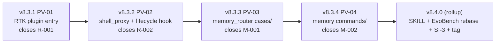

# v8.4.0 Gap Analysis — RTK + Memory Router Cycle

> SI-1 Iteration Planning Gate artifact — required before any v8.4.0 implementation begins (per W-1 / SI-1, anchored in `.cursor/rules/repo-governance.mdc#W-1`). Predecessor cycle: v8.3.0 (9 PVs, 100% accept, SI-3 9.40/10) → see `.local/research/v8.3.0_retrospective.md`.

---

## 0. Executive Summary

The v8.3.0 user feedback (`.local/feedbacks/feedback_for_8.3.0.md`, 9 lines) requests a **3-track investigation cycle** that targets v8.4.0 release (minor bump):

| # | User Ask (verbatim quote, abbreviated) | Maps To | Severity |
|---|----------------------------------------|---------|----------|
| A1 | "调研 https://github.com/rtk-ai/rtk 仓库 ... 使用 NineS 进行分析分解,以及是否能将 rtk 作为插件加入" | RTK research → plugin (SI-2 NineS analysis + R-001 closure) | **High** |
| A2 | "在 planning next move 时 ... 是否可以在本地.local 的工作区memory 下建立一些精简的快速处理 case (以 index+subfiles 的形式来做多层级路由)" | Planning-time fast-path memory router (M-001 + M-002) | **High** |
| A3 | "通过 8.3.x 系列分别迭代,验证,如果有提升则合入并发布,最终合并后作为 8.4.0 进行最终集成验证与发布" | NineS-driven verify-and-release loop (process invariant, mirrors v8.3.0's per-PV gating) | **Critical** (process) |

**Cycle classification:** v8.4.0 minor bump. **Patch count forecast: 4 PVs + 1 release roll-up = 5 increments** (resolved D-001 decision: split — see §3). Lighter than v8.3.0 (9 PVs) and v8.0.0 (13 patches), heavier than v8.2.0 (5 PVs). Consistent with the user's "通过 8.3.x 系列分别迭代,验证" mandate (each PV individually validated before next).

**RTK depth = B** (per cycle plan §0 line 38, locked by user): plugin auto-install **AND** Shell-tool wrapper, both default-off via feature flag.

**Companion artifacts** (this file is the SI-1 entry point):
- `.local/research/v8.4.0_rtk_nines_analysis.md` — A1 SI-2 deliverable (NineS deep-analyze synthesis, ALREADY AUTHORED)
- `.local/research/v8.4.0_rtk_nines_analysis.json` — raw NineS JSON (1242 lines)
- `.local/research/v8.4.0_design.md` — full design covering R-001 / R-002 / M-001 / M-002 (PENDING — author at PV-01 time per cycle plan)
- `.local/research/v8.4.0_patch_plan.md` — formal per-PV decomposition with 8 mandatory fields per patch (PENDING — companion to design)

---

## 1. Quantitative Deviations (current vs target)

| Metric | v8.3.0 baseline (verbatim) | v8.4.0 target | Gap |
|--------|---------------------------:|---------------:|------|
| `__version__` (`src/devolaflow/__init__.py`) | `8.3.0` | `8.4.0` (after 4 patch bumps + 1 minor) | +5 version transitions per CP-3 / W-10 |
| RTK plugin entries in `runtime-plugins.yaml` | 0 (registry has nines + ui-pro only; schema_version 1) | 1 (`rtk` 3rd entry) + new `curl_install_script` backend (schema_version 2) | **R-001 — Critical for A1** |
| Shell-tool token compression layer | NONE — verbose `pytest`/`ruff`/`git diff` blow L3 8K budget per A-3 | `src/devolaflow/shell_proxy/` package + `lifecycle/pre_shell_call.py` hook (default-off) | **R-002 — High for A1 depth=B** |
| Planning-time fast-path memory router | NONE — L0 re-derives workflow + stage decomposition every dispatch (~3K tokens consumed for repeat patterns) | `.local/memory/cases/index.yaml` + per-`<case-id>.md` recipes + `src/devolaflow/memory_router/` consulted PRE re-derive | **M-001 — Medium-High for A2** |
| RTK-pattern command-output mappings in `.local/memory/` | NONE (`.local/memory/` has `MEMORY.md` 153 B + `README.md` 284 B + `plugin_install.log` 9 KB + `specs/` empty) | `.local/memory/commands/<repo-or-tool>/<cmd>.yaml` extending RTK with repo-specific recipes (per D-001 split) | **M-002 — Medium-High for A2** |
| Test count (collected) | 3110 (v8.3.0 final per CHANGELOG) | ≤ 3,210 (cap +100; explicit per-PV caps in §4 to prevent 4.7× over-delivery — see v8.3.0 retro §4.6) | +50-100 net new tests forecast |
| EvoBench baseline | `v8.3.0_baseline.json` (45 scenarios) | `v8.4.0_baseline.json` (47-48 scenarios; +2 for memory-router + shell-proxy-disabled-no-op; +1 if D-001 splits and PV-04 ships command_mapping_density.yaml) | +2-3 EvoBench scenarios |
| `workflow-system/agent/SKILL.md` line count | **498/500** (3 micro-compressions in v8.3.0 PV-09 absorbed +30 lines while holding the SF-1 default-tier 500 ceiling) | ≤ 500 — only **2 lines headroom**; v8.4.0 micro-compression budget required up-front | **R4 risk in §6 — preserved** |
| References under `workflow-system/agent/references/` | **10** (`agent-hierarchy.md` + `agent-workspace.md` + `behavioral-guidelines.md` + `context-isolation.md` + `decomposition-gate.md` + `execution-protocol.md` + `message-schemas.md` + `meta-framework.md` + `repo-modes.md` + `team-roles.md`) | 10 OR **11** (conditional 11th `memory-router.md` if D-001 split + memory-router surface justifies; SF-4 grows 10 → 11 only if PV-03 + PV-04 surface area demands it) | +0 OR +1 reference per W-12 |
| P6 cache layout (`schemas/lean-dispatch.yaml#layout_invariant.canonical_order`) | length 16 / version 5 (v8.3.0 PV-05 added `change_context` at position 16 byte-identical for positions 1-15) | length **16** / version **5** (NO transition expected for v8.4.0 — RTK + memory router are off-band; do NOT touch dispatch envelope) | **0 P6 transitions planned** |
| Rules total (Soul/Architecture/Conventions/Workflow/Style) | **50** (S-1..S-9 / A-1..A-4 / C-1..C-9 / W-1..W-15 / ST-1..ST-13) | 50 OR 51 (no new soul/arch rules anticipated; 1 conventions row possible if shell-proxy whitelist needs codification) | +0 OR +1 conventions rule |
| `consolidate_session()` learnings substrate | populated with v8.3.0 cycle reflections; sessions land in `.local/memory/operational.jsonl` (gitignored) | unchanged for v8.4.0 — memory router READS this substrate, does NOT mutate the substrate schema | **R5 strict** |

---

## 2. Gap Inventory (priority-ranked)

### 2.1 In-scope (closes within v8.4.0 cycle)

| ID | Priority | Source ask | Proposed fix (file-level scope) | Closing patch |
|----|----------|------------|----------------------------------|---------------|
| **R-001** | **High** | A1 — RTK is not installable from DevolaFlow (no entry in `workflow-system/agent/knowledge/runtime-plugins.yaml`; the Shell tool calls run raw `pytest` / `git diff` / `ruff check` etc, blowing the 8K L3 budget per A-3). | Append RTK row to `runtime-plugins.yaml` (3rd entry alongside `nines` + `ui-pro`); bump `schema_version` 1 → 2; add `curl_install_script` backend declaration; add `installer.py::install_rtk()` implementing the new backend; add `verify_distinguish_cmd: "rtk gain"` (per `INSTALL.md` collision warning, see SI-2 §5.2); add ~5-9 tests in `tests/test_plugins.py` covering RTK detect/install/version-probe/distinguish/uninstall paths. **Default off** via existing `DEVOLAFLOW_AUTO_INSTALL=0` opt-out; `min_version: "0.37.2"` (per `Cargo.toml`, NOT README's stale 0.28.2). | **v8.3.1 (PV-01)** |
| **R-002** | **High** | A1 depth=B — Shell-tool calls injected into L3 context are uncompressed (verbose `pytest`/`ruff`/`git diff` output); RTK provides a documented −80% to −90% compression layer via the rewrite hook protocol (see SI-2 §6.1 whitelist table). | New module `src/devolaflow/shell_proxy/` (3 files: `__init__.py`, `proxy.py`, `registry.py`) modeled on RTK's `src/discover/registry.rs` single-source-of-truth pattern (SI-2 §4.1); new `src/devolaflow/lifecycle/pre_shell_call.py` thin-delegator hook (mirrors RTK's `hooks/claude/rtk-rewrite.sh`); Tier 1 whitelist = `pytest`, `ruff check`, `git diff`, `git log`, `git status`; activation requires `DEVOLAFLOW_RTK_PROXY=1` AND `which rtk && rtk gain` succeeds AND command matches Tier 1/2 regex; **R5 strict** — existing 3110 tests pass byte-identical when proxy off. ~25-30 new tests in `tests/test_shell_proxy.py` + `tests/test_shell_proxy_disabled_is_noop.py`. | **v8.3.2 (PV-02)** |
| **M-001** | **Medium-High** | A2 — L0 re-derives workflow + stage decomposition from SKILL.md every dispatch (no fast-path lookup); planning consumes ~3K tokens even for repeat patterns; agents waste cycles on "planning next move" when the answer is recipe-shaped. | New module `src/devolaflow/memory_router/` (3 files: `__init__.py`, `router.py`, `cache.py`); `.local/memory/cases/index.yaml` (multi-level routing keys per A2 verbatim: `workflow_type → task_type → case_id`) + per-`<case-id>.md` recipe files (seed 5-10 common cases from completed v8.3.0 sessions via `consolidate_session()`); router consulted at L0/L1 dispatch time **before** re-deriving from SKILL.md; cache hit short-circuits planning, cache miss falls through to current behavior (R5 strict — never breaks existing dispatch). Schema lives at `schemas/memory-case.yaml`. ~25-30 tests + 1 EvoBench scenario `memory_router_fastpath.yaml` proving ≥30% L0 token reduction on repeat patterns. **Default off** via `DEVOLAFLOW_MEMORY_ROUTER=1`. | **v8.3.3 (PV-03)** |
| **M-002** | **Medium-High** | A2 verbatim — "将常见的处理命令按照 rtk 的仓库模式,在 memory 下进行映射和处理,并单独进行调用和路由,即除了原始 rtk 支持能力以外,还拓展了结合实际仓库中的新rtk 能力支持". RTK-pattern command-output mappings extending RTK with repo-specific compression recipes (e.g., DevolaFlow-specific `pytest tests/test_benchmarks.py` filter that knows the EvoBench scenario JSON shape). | Per **D-001 RESOLVED = Option B (SPLIT)** (see §3): NEW `.local/memory/commands/<repo-or-tool>/<cmd>.yaml` directory using the literal RTK `[filters.<name>]` schema (per SI-2 §4.3); consumed by PV-02's `shell_proxy` to layer local recipes ON TOP of RTK's built-in 100+ commands (precedence: local recipe wins, falls back to RTK's `rtk rewrite`, falls back to passthrough). Schema lives at `schemas/command-mapping.yaml`. ~10-15 tests + 1 EvoBench scenario `command_mapping_density.yaml`. | **v8.3.4 (PV-04)** — conditional on D-001 = split (RESOLVED) |

### 2.2 Carry-forward from v8.3.0 retrospective §3 (DEFER decisions per item)

The v8.3.0 retrospective §3 enumerates 9 deferred items. Per §3 of THIS gap analysis (D-001) and the cycle plan §8 (out-of-scope), each is dispositioned below — **no carry-forward item is opportunistically promoted into v8.4.0 in-scope**, to keep the cycle scope-bounded:

| ID | Source (v8.3.0 retro §3 anchor) | Disposition | Rationale |
|----|----------------------------------|-------------|-----------|
| **M-007** | retro §3.1 — slash commands (`/devola:propose`, `/devola:apply`, `/devola:archive` analogs of OpenSpec `/opsx:*`) | **DEFER to v8.4.x+ or v8.5.0** | M-007 is an additive surface (per-tool `commands/devola-*.md` directory mirroring OpenSpec's adapter pattern). It would couple to ALL 4 build-skill adapters (cursor/claude/codex/copilot) per W-12 / SI-5. v8.4.0 already changes SKILL.md (Workflow Selection row for memory_router) — adding M-007 in the same cycle blows the SF-1 498/500 ceiling. **Defer.** |
| **I-PV07-A** | retro §3.1 — REPORT.md auto-trigger from `change-driven` template apply/archive stages | **DEFER to v8.4.x+** | Auto-trigger requires PV-07's reporter to be aware of stage-completion events; introducing this in v8.4.0 couples to `change-driven` template (PV-06 of v8.3.0) and would create a bidirectional dependency between memory_router (PV-03 of v8.4.0) and reporter. Out of scope per "validate one improvement at a time" mandate. |
| **B3 partial (5 of 7 v8.0.0 opt-in primitives still default-OFF)** | retro §3.2 — `token_budget_breaker`, `ratchet`, `complexity_detector`, `ac_generator`, `behavioral_guidelines` remain opt-in | **DEFER to v8.5.0+** | Flipping defaults requires a single coordinated PV with full EvoBench regression sweep — that's a dedicated cycle, not a sub-PV. Per cycle plan §8 explicit out-of-scope. |
| **A1 NineS code_coverage timeout** | retro §3.2 — `code_coverage: 0.0` artifact carries from v8.0.0 / v8.1.0 / v8.2.0 / v8.3.0 cycles | **DEFER to v8.4.x sustaining** | Requires `golden_test_set/` growth + `nines.toml` budget bump. Independent of RTK + memory router. Schedule as a hygiene PV after the v8.4.0 release if cadence allows. |
| **A2 agent_overhead 46179 tokens warning** | retro §3.2 — `workflow-system/agent` token overhead exceeds NineS' threshold | **DEFER to v8.5.0+** | Requires SKILL.md compression beyond the 498/500 ceiling — hits R4 (preserved 2-line headroom). The v8.4.0 cycle's job is to NOT make this worse; structural compression is its own cycle. |
| **A3 NineS index rebuild** for source freshness (v8.3.0 NineS shows `source_freshness: 0.5`) | retro §3.2 | **DEFER to v8.4.x sustaining** | Out-of-band hygiene; bundle with A1 / A4 as a single sustaining PV after v8.4.0 ships. |
| **A4 golden_test_set refresh** for source coverage | retro §3.2 | **DEFER to v8.4.x sustaining** | Same rationale as A3; bundle. |
| **M-004 full closure** (`ArchiveManager.propose_merge` for delta-spec merge into source-of-truth) | retro §3.3 — A-4 ADR partial closure | **DEFER to v8.5.0+** | Touches `agent_workspace/` core module and the source-of-truth gate (W-3 + W-4 must be re-validated for the merge gate). Independent of v8.4.0's RTK + memory router scope. |
| **L-001..L-004** (per-tool commands for 25+ assistants, telemetry opt-out, web demo refresh, archive migration) | gap_analysis §2.4 of v8.3.0 | **DEFER all to v8.4.x+ or v8.5.0+** | Per cycle plan §8 explicit out-of-scope. |

**Disposition summary:** **9 carry-forward items, all DEFERRED**, none promoted to v8.4.0 in-scope. This honors the user's per-improvement-validate-then-merge discipline (A3) and keeps v8.4.0 focused on RTK + memory router (4 PVs).

### 2.3 In-scope total

**4 in-scope items** (R-001 + R-002 + M-001 + M-002) — substantially leaner than v8.3.0's 18-item inventory, reflecting the 3-track focus of `feedback_for_8.3.0.md` (vs v8.2.0's 6 asks + PATCH that drove v8.3.0).

---

## 3. Decision D-001 — Memory-Router Split (1 PV combined vs 2 PVs split)

### 3.1 Background

The v8.4.0 cycle plan defers this decision to SI-1 (cycle plan §1 line 51 — "Decision item D-001"). Two structural options:

- **Option A (combined / 1 PV):** single `.local/memory/playbook/` directory with one schema covering BOTH planning recipes AND command-output mappings; one `memory_router/` module that reads both. Lands in PV-03 (`v8.3.3`); PV-04 not needed.
- **Option B (split / 2 PVs):** two directories — `.local/memory/cases/` (planning fast-path, M-001) AND `.local/memory/commands/` (RTK-pattern command mapping, M-002) — with two schemas (`schemas/memory-case.yaml` for cases; `schemas/command-mapping.yaml` for commands). PV-03 ships `cases/`; PV-04 ships `commands/` (conditional on this decision = split).

### 3.2 Dependency analysis (R-002 ↔ M-001 ↔ M-002)

| Dependency | Forward direction | Notes |
|------------|-------------------|-------|
| R-002 (shell_proxy) → M-002 (commands/) | shell_proxy CONSUMES commands/ recipes (precedence: local > RTK > passthrough) | `shell_proxy/registry.py` reads `.local/memory/commands/**/*.yaml` at startup; **strong coupling** → favors split-and-ship-after-shell_proxy ordering (M-002 lands AFTER R-002). |
| R-002 (shell_proxy) → M-001 (cases/) | NONE | shell_proxy operates on the Shell tool dispatch path; memory_router operates on the L0/L1 planning path. Different code paths. |
| M-001 (cases/) → M-002 (commands/) | NONE | cases/ recipes are about workflow_type → task_type → case_id (planning); commands/ are about cmd → filter (compression). Different primary keys, different consumers. |

**Key observation:** M-001 and M-002 have NO shared dependency. They are independent surfaces with independent consumers. Forcing them into one PV (Option A) creates **artificial coupling** in the schema and the router module. R-002 depends on M-002 only (not M-001), so R-002 must ship before M-002 — which is naturally the case in both options.

### 3.3 Risk comparison

| Risk axis | Option A (combined) | Option B (split) |
|-----------|---------------------|-------------------|
| **SKILL.md ceiling (498/500, 2 lines headroom)** | 1 net section change ("Memory Playbook"), ~2-4 lines added → likely **fits** but no margin | 1 net section change ("Memory Router") in PV-03; PV-04 commands/ is reference-only (loaded on-demand by shell_proxy, not in SKILL.md) → likely **fits with margin** because M-002 surface lives in references/ not SKILL.md |
| **Test count forecast (cap +100)** | ~30 tests in PV-03 (combined) | ~25-30 in PV-03 (cases/) + ~10-15 in PV-04 (commands/) = ~35-45 total (slightly higher) |
| **EvoBench scenario count** | +1 (`memory_router_fastpath.yaml`) | +2 (`memory_router_fastpath.yaml` in PV-03 + `command_mapping_density.yaml` in PV-04) |
| **R5 strict surface (existing tests byte-identical when feature flag off)** | One surface to default-off (`DEVOLAFLOW_MEMORY_ROUTER=1`) | Two surfaces (PV-03 router off-flag + PV-04 commands off-flag); slightly more flag-discipline but each PV independently verifiable per R5 v8.3.0 PV-08 precedent |
| **Per-PV SI-3 evaluation isolation (W-3)** | Single composite covers both surfaces — harder to attribute regression source | Two independent composites — clean attribution if one surface under-performs (mirror v8.3.0 retro §4 process learning: "validated independently per PV") |
| **Cycle length** | 3 PVs (v8.3.1 R-001 + v8.3.2 R-002 + v8.3.3 combined) + rollup | 4 PVs (v8.3.1 R-001 + v8.3.2 R-002 + v8.3.3 cases/ + v8.3.4 commands/) + rollup |
| **Schema honesty** | 1 schema covering 2 different shapes (recipes vs filters) → mild domain-modeling smell | 2 schemas, each fitting its native shape (memory-case.yaml = recipe; command-mapping.yaml = literal RTK filter shape per SI-2 §4.3 reuse) |
| **Risk-isolation for ship-or-defer** | If combined surface under-performs in EvoBench, BOTH M-001 and M-002 must regress together | If commands/ under-performs in PV-04 EvoBench, can defer PV-04 (M-002 only) and still ship cases/ (M-001) in v8.4.0 |
| **Backward-compat carry to v8.5+** | One Schema commits to a unified shape; future split is a refactor | Two clean schemas; future merge or split is each a focused refactor |

### 3.4 DECISION: **Option B — SPLIT (2 PVs)**

**Rationale:** The memory-case recipe shape (workflow_type / task_type / case_id with markdown body) and the RTK filter shape (`[filters.<name>]` TOML with regex / strip / truncate) are **structurally distinct**. Forcing them under one schema would create domain-modeling debt. Per the v8.3.0 retrospective §4 "validate independently per PV" learning and the user's verbatim ask A3 ("如果有提升则合入并发布"), splitting lets PV-04 ship-or-defer based on its own EvoBench evidence WITHOUT blocking the planning fast-path (M-001) which has stronger conviction (the user explicitly described it as "在 planning next move 时 ... 是否可以在本地.local 的工作区memory 下建立一些精简的快速处理 case"). Test-count delta (~+15 tests) is well within the +100 cap (§4); EvoBench delta (+1 scenario) is well within the +2-3 forecast (§1).

### 3.5 Implication for §4 PV cadence

PV-04 lands as the conditional 4th patch. Cycle becomes:
```
v8.3.1 (PV-01) → v8.3.2 (PV-02) → v8.3.3 (PV-03) → v8.3.4 (PV-04) → v8.4.0 (rollup)
```
5 increments total. Mirrors v8.2.0's 5-PV cycle in shape (vs v8.3.0's 9-PV cycle in size). Each PV ships its own published patch version per CP-3 / W-10 (see §5 invariants).

---

## 4. PV Cadence (DAG with file-level scope per PV)



### 4.1 PV-01 — `v8.3.1` — RTK plugin entry (closes R-001)

**Files (NEW):**
- `workflow-system/agent/knowledge/runtime-plugins.yaml` — append RTK row (3rd entry); bump `schema_version` 1 → 2; add `curl_install_script` backend declaration; add `verify_distinguish_cmd` field (new field per SI-2 §5.2)
- `src/devolaflow/plugins/installer.py` — extend with `_install_via_curl_script()` method implementing the new backend (mirrors existing `_install_via_pip()` and `_install_via_npm_then_init()` patterns)
- `tests/test_plugins.py` — add ~5-9 tests covering: detect-installed (`rtk gain` succeeds → skip install), install-via-curl (network reachable → verify), install-via-cargo-fallback (network unreachable → cargo path), uninstall idempotency, name-collision-detection (`rtk --version` succeeds but `rtk gain` fails → raise PluginInstallError per S-5)

**Files (MODIFIED):**
- 7 canonical version-sync locations per CP-3 / W-10 (`src/devolaflow/__init__.py` + `pyproject.toml` + `workflow-system/agent/SKILL.md` (banner + frontmatter) + `workflow-skill.yaml` + `scripts/generate_human_docs.py` + `tests/test_smoke.py` + `README.md` + `workflow-system/human/demo/benchmark-results/index.html`) — `8.3.0` → `8.3.1`
- `CHANGELOG.md` — add `## [8.3.1]` patch entry

**Test cap (forecast):** +9 tests. **EvoBench delta:** 0 (PV-01 does not change dispatch; plugin installer is preconditional). **SKILL.md delta:** 0 (PV-01 does not edit SKILL.md beyond version-bump banner per W-10). **Per-PV gate:** SI-10 6/6 + SI-3 ≥ 8.5 + NineS ≥ 0.85.

### 4.2 PV-02 — `v8.3.2` — Shell-proxy + lifecycle hook (closes R-002, depends on PV-01)

**Files (NEW):**
- `src/devolaflow/shell_proxy/__init__.py` — public API (`is_active`, `rewrite_command`, `register_recipe`)
- `src/devolaflow/shell_proxy/proxy.py` — proxy logic + version-cache (mirrors RTK's `~/.cache/rtk-hook-version-ok` pattern per SI-2 §4.1)
- `src/devolaflow/shell_proxy/registry.py` — single source of truth for whitelist + rewrite rules (mirrors RTK's `src/discover/registry.rs` per SI-2 §4.1)
- `src/devolaflow/lifecycle/pre_shell_call.py` — thin-delegator hook (mirrors RTK's `hooks/claude/rtk-rewrite.sh` per SI-2 §4.1)
- `tests/test_shell_proxy.py` — ~20 tests covering Tier 1 whitelist (pytest, ruff check, git diff, git log, git status); rewrite correctness; version-cache; `rtk gain` distinguishes-from-rtk-type-kit guard
- `tests/test_shell_proxy_disabled_is_noop.py` — ~5 tests asserting byte-identical existing dispatch when `DEVOLAFLOW_RTK_PROXY=0` (R5 strict, mirrors v8.3.0 PV-08 + v8.2.0 PV-03 precedents)
- `benchmarks/devolaflow_context/scenarios/shell_proxy_compression.yaml` — NEW EvoBench scenario asserting ≥75% token reduction on `pytest tests/ -q` capture

**Files (MODIFIED):**
- 7 canonical version-sync locations — `8.3.1` → `8.3.2`
- `workflow-system/agent/SKILL.md` — possibly **no edit** if shell_proxy is fully default-off (zero L0/L1/L2 dispatcher visibility); confirm at PV-02 design time. If SKILL.md edit needed, PV-02 must absorb +0 net lines (use micro-compression in adjacent sections to stay 498/500). Worst-case fallback: surface promoted to `references/shell-proxy.md` (11th canonical reference, SF-4 grows 10 → 11).
- `CHANGELOG.md` — add `## [8.3.2]` patch entry

**Test cap (forecast):** +25-30 tests (capped). **EvoBench delta:** +1 scenario. **SKILL.md delta:** 0 lines preferred, ≤+5 with offsetting compression. **Per-PV gate:** SI-10 6/6 + SI-3 ≥ 8.5 + NineS ≥ 0.85.

### 4.3 PV-03 — `v8.3.3` — Memory router cases/ (closes M-001, independent of PV-01/PV-02)

**Files (NEW):**
- `src/devolaflow/memory_router/__init__.py` — public API (`route_to_case`, `is_active`, `record_hit`)
- `src/devolaflow/memory_router/router.py` — core router (consulted at L0/L1 dispatch BEFORE re-deriving from SKILL.md)
- `src/devolaflow/memory_router/cache.py` — TTL + version-stamp invalidation (cache invalidates on `__version__` change per cycle plan §6 R3 risk mitigation)
- `schemas/memory-case.yaml` — schema for case recipes (workflow_type / task_type / case_id / dispatch_template / expected_savings_pp / inline_tests)
- `.local/memory/cases/index.yaml` — NEW (multi-level routing keys: `workflow_type → task_type → case_id`); seed with 5-8 cases extracted from completed v8.3.0 sessions via `consolidate_session()`
- `.local/memory/cases/<seed-id>.md` — 5-8 seed recipe files (e.g., `feature-implementation-python.md`, `gate-evaluation.md`, `version-bump-cp3.md`, `evobench-regression-check.md`)
- `tests/test_memory_router.py` — ~25 tests covering route-hit / route-miss-fallback / cache-invalidation-on-version-bump / index.yaml-schema-validation / R5-disabled-no-op
- `benchmarks/devolaflow_context/scenarios/memory_router_fastpath.yaml` — NEW; asserts ≥30% L0 token reduction on repeat patterns (per cycle plan §3 PV-03 explicit success criterion)

**Files (MODIFIED):**
- 7 canonical version-sync locations — `8.3.2` → `8.3.3`
- `workflow-system/agent/SKILL.md` — append 1-2 line "Memory Router" hint (only the activation flag + 1 sentence; full surface in `references/memory-router.md` per SF-3 / SF-4 promotion). Net +0 to +2 lines (within 2-line headroom).
- `workflow-system/agent/references/memory-router.md` — NEW (11th canonical reference — SF-4 grows 10 → 11; ~250-400 lines, well within Large tier 1000 ceiling per SF-1). Triggers cascading-coupling: `tests/test_no_ghost_features.py::_SF4_REFERENCE_SET` 10 → 11; `scripts/sync_cursor_skill.py::MIRRORED_FILES` 14 → 15; cursor adapter golden updated.
- `CHANGELOG.md` — add `## [8.3.3]` patch entry

**Test cap (forecast):** +25-30 tests (capped). **EvoBench delta:** +1 scenario (total 47). **SKILL.md delta:** ≤+2 lines (headroom-tight). **Per-PV gate:** SI-10 6/6 + SI-3 ≥ 8.5 + NineS ≥ 0.85.

### 4.4 PV-04 — `v8.3.4` — Memory commands/ (closes M-002, depends on PV-02 + PV-03)

**Files (NEW):**
- `schemas/command-mapping.yaml` — schema for command-mapping files (literal RTK `[filters.<name>]` shape per SI-2 §4.3 reuse)
- `.local/memory/commands/devolaflow/<cmd>.yaml` — seed 3-5 DevolaFlow-specific recipes (e.g., `pytest-test-benchmarks.yaml` knowing the EvoBench scenario JSON shape; `make-check-cursor-skill.yaml` knowing the canonical-mirror parity output; `nines-self-eval.yaml` knowing the 51KB JSON shape)
- `src/devolaflow/shell_proxy/local_recipes.py` — NEW module loaded by `shell_proxy/proxy.py`; precedence is local > RTK > passthrough; falls back gracefully if `.local/memory/commands/` is absent
- `tests/test_command_mapping.py` — ~10 tests covering local-recipe-overrides-rtk / local-recipe-falls-through-when-not-matched / schema-validation / R5-disabled-no-op
- `benchmarks/devolaflow_context/scenarios/command_mapping_density.yaml` — NEW EvoBench scenario asserting local recipes deliver additional ≥10pp savings beyond RTK baseline on the 3-5 seeded commands

**Files (MODIFIED):**
- 7 canonical version-sync locations — `8.3.3` → `8.3.4`
- `workflow-system/agent/SKILL.md` — typically **no edit** (commands/ surface lives in `references/memory-router.md` extended at PV-04 with a §"Command mappings" subsection)
- `workflow-system/agent/references/memory-router.md` — extend with §"Command mappings" subsection (~50-80 net lines added; still within Large tier 1000 ceiling)
- `CHANGELOG.md` — add `## [8.3.4]` patch entry

**Test cap (forecast):** +10-15 tests (capped). **EvoBench delta:** +1 scenario (total 48). **SKILL.md delta:** 0 lines. **Per-PV gate:** SI-10 6/6 + SI-3 ≥ 8.5 + NineS ≥ 0.85.

### 4.5 v8.4.0 — Rollup release

**Files (MODIFIED):**
- 7 canonical version-sync locations — `8.3.4` → `8.4.0`
- `CHANGELOG.md` — `## [8.4.0]` rollup aggregating per-patch ledger
- `benchmarks/devolaflow_context/baselines/v8.4.0_baseline.json` — NEW baseline rebased from v8.3.0 (regenerated post-PV-04)
- `tests/test_benchmarks.py::test_runner_prefers_latest_baseline` — bumped to `v8.4.0_baseline.json`
- `workflow-system/human/demo/version-timeline/versions.json` — append v8.4.0 entry per ST-7 (from `__version__` change)
- Annotated git tag `v8.4.0`
- `.local/research/v8.4.0_evaluation.md` — SI-3 release evaluation
- `.local/research/v8.4.0_retrospective.md` — SI-8 4-section retrospective
- `.local/research/v8.4.0_evobench_summary.md` — per-scenario delta vs v8.3.0
- `.local/research/v8.4.0_nines_self_eval.json` + `.md` summary (NineS post-cycle)

**Forecast cycle test count delta:** ~+50-65 net new tests (forecast cap = +100 per §1; this is well below cap to honor v8.3.0 retro §4.6 lesson — no 4.7× over-delivery). **EvoBench delta:** 45 → 48 scenarios (+3). **SKILL.md ceiling:** held ≤500 throughout (498 → 498-500).

---

## 5. Cycle Invariants (mirror cycle plan §4; expanded)

These invariants apply to EVERY PV; failure at ANY invariant blocks the patch per the cycle plan §4 table:

1. **I-1 — Each PV bumps version (real semver patch).** Per CP-3 / W-10. Each PV runs `python scripts/bump_version.py <new-version>` updating all 7 canonical sync locations + `__version__` source-of-truth in `src/devolaflow/__init__.py`. Verified by `python -m pytest tests/test_version.py -v`. **NOT lightweight tags.**
2. **I-2 — Each PV runs the SI-10 6-step gate.** Per W-9: `python -m pytest tests/ -q` PASS, `ruff check src/ tests/` clean, `ruff format --check src/ tests/` clean, `python -m pytest tests/test_version.py -v` PASS, `python -m pytest tests/test_benchmarks.py -v` PASS, `make check-cursor-skill` exit 0. All 6 must pass before commit.
3. **I-3 — Each PV runs SI-3 with composite ≥ 8.5 (minor threshold).** Per W-3. Per-PV evaluation report at `.local/research/v8.3.X_evaluation.md` (X = patch number); the v8.4.0 rollup needs ≥ 8.5 (still minor, not major; G3 9.0 stretch is opportunistic).
4. **I-4 — Each PV NineS post-eval composite ≥ 0.85.** Per W-2. NineS deep-analyze post-each-PV stored at `.local/research/v8.3.X_nines.json`. The v8.4.0 rollup needs ≥ 0.85 minimum, ≥ 0.90 stretch (matches v8.3.0's 0.9050).
5. **I-5 — EvoBench: 0 regression > 5pp per scenario vs `benchmarks/devolaflow_context/baselines/v8.3.0_baseline.json`.** Per W-4. Each PV bumps the baseline ONLY if new scenarios are added; otherwise composite must remain within 5pp of v8.3.0_baseline. The v8.4.0 rollup rebases to `v8.4.0_baseline.json`.
6. **I-6 — `workflow-system/agent/SKILL.md` held ≤ 500 lines.** Per SF-1 default tier. Currently 498/500 (only 2 lines headroom). Each PV that touches SKILL.md MUST measure pre-edit + post-edit and fail if breaches 500. PV-03 is the highest-risk patch (adds ≤+2 lines for memory_router activation hint).
7. **I-7 — R5 strict for `shell_proxy` and `memory_router` (existing tests byte-identical when feature flag off).** Per the v8.3.0 PV-08 byte-counted discipline (retro §4.5). PV-02 STATUS report MUST report "X/X tests pass byte-identical" with `DEVOLAFLOW_RTK_PROXY=0`; PV-03 STATUS report MUST report "X/X tests pass byte-identical" with `DEVOLAFLOW_MEMORY_ROUTER=0`; PV-04 STATUS report MUST report same for `commands/` precedence.
8. **I-8 — P6 cache-layout invariant: stays at v5 (no schema bump expected for v8.4.0).** Per A-2 / Rule 6. `schemas/lean-dispatch.yaml#layout_invariant.canonical_order` MUST remain length 16 / version 5 throughout the cycle. RTK + memory router are off-band — they do NOT touch the dispatch envelope. Verified each PV by `python -m pytest tests/test_compressor.py::test_dispatch_layout_v5 -v`.
9. **I-9 — All paths in agent-facing files relative to repo root (S-2).** No absolute filesystem paths in SKILL.md, CLAUDE.md, references/, schemas/, .local/memory/cases/*, .local/memory/commands/*, runtime-plugins.yaml, or any compiled rule. External URLs only per S-7. **`/home/agent/reference/rtk` is a runtime clone path used only for SI-2 NineS run; NEVER enter agent-facing files.**
10. **I-10 — 100% PV accept rate (carry forward from 45/45 lifetime cycle precedent).** v7.2.0 4/4 + v7.3.0 6/6 + v7.5.0 8/8 + v8.0.0 13/13 + v8.2.0 5/5 + v8.3.0 9/9 = 45/45. v8.4.0 forecast: 4/4. **Discipline: per-improvement-validate-then-merge. No batched rollups.**

---

## 6. Risk Register (top 5; ranked by likelihood × impact, with mitigation)

| # | Risk | Affected PV | Likelihood | Impact | Mitigation |
|---|------|-------------|------------|--------|------------|
| **R1** | **RTK install fails on agent host** — `curl_install_script` requires network reachability to GitHub releases; cargo fallback requires Rust toolchain; both can fail (e.g., CI sandboxes without internet). | PV-01 (v8.3.1) | MEDIUM | HIGH (blocks all subsequent PVs because PV-02 shell_proxy depends on `rtk` binary) | (1) `installer.py::install_rtk()` tries primary `curl_install_script`, falls back to `cargo install --git`, falls back to actionable `PluginInstallError` per S-5 (NEVER silent — message points at SI-2 §5.1 backend table + RTK collision warning). (2) `tests/test_plugins.py::test_rtk_install_offline_fails_loudly` asserts the failure path. (3) PV-01 ships with `local_fallback_path: null` (per S-7 — no hardcoded paths) but documents in commentary that operators may set `RTK_INSTALL_DIR` env to point at a pre-staged binary. (4) PV-02 lifecycle hook gracefully degrades to passthrough if `which rtk && rtk gain` fails (per SI-2 §6.2 activation contract). |
| **R2** | **Name collision** — `cargo install rtk` from crates.io may install rtk-type-kit (Rust Type Kit) instead of Rust Token Killer. RTK's own `INSTALL.md` warns about this. | PV-01 (v8.3.1) | MEDIUM | HIGH (silent wrong-install means shell_proxy attempts to call non-existent `rtk rewrite` → all proxy attempts fail) | `verify_distinguish_cmd: "rtk gain"` is **mandatory** (NOT optional) post-install per SI-2 §5.2. If `rtk gain` fails → `PluginInstallError` per S-5. PV-01 cargo-fallback path ALWAYS uses `--git https://github.com/rtk-ai/rtk` (NEVER bare `cargo install rtk`). `tests/test_plugins.py::test_rtk_distinguish_from_type_kit` asserts the discrimination logic. |
| **R3** | **Shell-tool intercept layer breaks existing dispatch** — PV-02 inserts a new `lifecycle/pre_shell_call.py` hook into the dispatch path. Existing 6 lifecycle modules (`check_file_ownership`, `dispatcher`, `format_on_edit`, `test_on_complete`, `validate_dispatch`, `validate_owned_files`) must continue to fire in the existing order. | PV-02 (v8.3.2) | MEDIUM | HIGH (regression in the hottest path = full-cycle abort) | (1) **R5 strict** — ALL existing 3110 tests pass byte-identical when `DEVOLAFLOW_RTK_PROXY=0` (the single-flag activation contract from SI-2 §6.2). (2) `tests/test_shell_proxy_disabled_is_noop.py` mirror v8.3.0 PV-08's 71/71 byte-counted discipline (retro §4.5). (3) New EvoBench scenario `shell_proxy_compression.yaml` ALSO has a default-off variant `shell_proxy_disabled.yaml` asserting byte-identical dispatch composite vs v8.3.0_baseline. (4) PV-02 lands in its OWN feature branch; revert is single-commit if needed. |
| **R4** | **SKILL.md ceiling (498/500 — only 2 lines headroom) breached by PV-03.** PV-03 wants to add a "Memory Router" hint to the "Workflow Selection" table OR to the "Lifecycle Hooks" section. Even +3 lines breaches SF-1 default tier. | PV-03 (v8.3.3) | MEDIUM | HIGH (SF-1 violation blocks merge per W-12) | (1) PV-03 micro-compression budget audited PRE-PV-03 (mirror v8.2.0 PV-05 R7 anchor refactor that opened budget at the SKILL surface). (2) Worst-case fallback: surface promotion to **NEW** `references/memory-router.md` (11th canonical reference; SF-4 grows 10 → 11). The SKILL.md edit then becomes 0-2 lines (just 1-line activation hint + reference link) and the meaty content lives in the reference. (3) PV-03 STATUS report MUST show `wc -l workflow-system/agent/SKILL.md` ≤ 500 BEFORE commit. |
| **R5** | **Cycle scope drift / 4.7× over-delivery** (v8.3.0 retro §4.6 lesson — forecast +159 actual +743 tests). | All PVs | HIGH | LOW (over-delivery doesn't break the gate, but pollutes the per-module test forecast and slows CI) | (1) **Explicit per-PV test caps** in §4 (PV-01 +9, PV-02 +25-30, PV-03 +25-30, PV-04 +10-15 = total +69-84 cap, with hard ceiling +100 cycle-wide). (2) Mid-cycle test-count audit at PV-02 STATUS report (if cumulative is already >50 tests beyond forecast, escalate per W-8 / SI-9 to human). (3) Use higher per-module forecast multiplier per retro §4.6 (`+30 tests per net-new Python module` informed by v8.3.0 PV-05 ~60 tests for `agent_workspace/`). (4) **PV-04 explicitly conditional on D-001** — if EvoBench evidence in PV-03 already saturates the savings opportunity, PV-04 commands/ may be deferred to v8.4.x (DEFER doc in retrospective §3 instead of adding 15+ tests). |

**Additional risk inherited from cycle plan §6 R3 — fast-path router cache poisoning** — Stale routes silently miscategorize new tasks. **Mitigation:** per-route TTL + version stamp in `cache.py` (cache invalidates on `__version__` change); cache-miss is the safe path (falls through to existing planner). Tracked but not in the top 5 because PV-03's R5 default-off contract eliminates the production-impact surface (only opt-in users exposed).

---

## 7. Out-of-Scope (explicit; mirrors cycle plan §8)

The following are explicitly NOT in v8.4.0 scope. Capturing here so SI-3 / SI-8 cannot retroactively complain about gaps:

- **M-007 slash commands** (`/devola:propose` / `/devola:apply` / `/devola:archive`) — defer per v8.3.0 retrospective §3.1 RESOLVED. Not in this cycle.
- **B3 full default-on flip** for the 5 remaining v8.0.0 opt-in primitives (`token_budget_breaker`, `ratchet`, `complexity_detector`, `ac_generator`, `behavioral_guidelines`) — defer per v8.3.0 retrospective §3.2.
- **L-001..L-004**: per-tool command files for 25+ assistants, telemetry opt-out env var, web demo refresh for memory-router surface, archive migration tool — all defer per gap_analysis §2.4 of v8.3.0.
- **A1..A4 NineS hygiene cleanup** (code_coverage timeout, agent_overhead 46179 warning, NineS index rebuild, golden_test_set refresh) — defer per v8.3.0 retrospective §3.2; bundle as a single sustaining PV after v8.4.0 ships if cadence allows.
- **M-004 full closure** (`ArchiveManager.propose_merge` for delta-spec merge into source-of-truth) — defer per v8.3.0 retrospective §3.3 to v8.5.0+.
- **Web demo refresh (DS-1 / WX-1 / WX-2)** for the new memory-router and shell-proxy surfaces — defer to v8.4.x sustaining (cycle plan §8). The v8.4.0 release does append `version-timeline/versions.json` per ST-7 (mandatory) but does NOT add showcase pages.
- **Adapter set expansion** (current 4: cursor/codex/claude/copilot) — RTK ships 12 adapters; we do NOT expand to match. Defer to L-001 cycle.
- **NineS v3.4+ upgrade** for advisory finding ID namespace stabilization — defer to v9.x per v8.2.0 retrospective §3.4 (carries through v8.3.0).

---

## 8. Verification Plan (per W-9 / SI-10 + per-PV additional gates)

Each patch MUST satisfy the 6-step pre-commit sequence before commit (per W-9):

```
1. python -m pytest tests/ -q                  # all tests pass
2. ruff check src/ tests/                      # no lint errors
3. ruff format --check src/ tests/             # formatting correct
4. python -m pytest tests/test_version.py -v   # version consistency (canonical 7)
5. python -m pytest tests/test_benchmarks.py -v # no regressions > 5pp
6. make check-cursor-skill                     # exit 0 (no-op if mirror absent)
```

Plus **per-patch additional gates**:

| Patch | Additional gates beyond SI-10 |
|-------|-------------------------------|
| **v8.3.1 (PV-01)** | `pytest tests/test_plugins.py -v` PASS (RTK detect/install/distinguish/uninstall + name-collision-detection); `python -c "from devolaflow.plugins import ensure_plugin; ensure_plugin('rtk')"` smoke test (when network available); `runtime-plugins.yaml` `schema_version: 2` consistency check; SI-3 ≥ 8.5; NineS ≥ 0.85 |
| **v8.3.2 (PV-02)** | `pytest tests/test_shell_proxy.py -v` PASS; `pytest tests/test_shell_proxy_disabled_is_noop.py -v` PASS (R5 strict — explicit byte-counted preservation per retro §4.5); EvoBench scenario `shell_proxy_compression.yaml` PASS at ≥75% reduction; SI-3 ≥ 8.5; NineS ≥ 0.85 |
| **v8.3.3 (PV-03)** | `pytest tests/test_memory_router.py -v` PASS; EvoBench scenario `memory_router_fastpath.yaml` PASS at ≥30% L0 token reduction; `wc -l workflow-system/agent/SKILL.md` ≤ 500; if `references/memory-router.md` added → `pytest tests/test_no_ghost_features.py::test_sf4_reference_set` updated 10 → 11; SI-3 ≥ 8.5; NineS ≥ 0.85 |
| **v8.3.4 (PV-04)** | `pytest tests/test_command_mapping.py -v` PASS; EvoBench scenario `command_mapping_density.yaml` PASS at ≥10pp incremental savings; precedence-chain test (local > RTK > passthrough) explicit; SI-3 ≥ 8.5; NineS ≥ 0.85 |
| **v8.4.0 rollup** | SI-3 evaluation report ≥ 8.5 (minor threshold; ≥ 9.0 stretch); SI-8 retrospective with mandatory 4 sections (gaps / implemented / deferred / learnings); CHANGELOG aggregate roll-up; `versions.json` appended per ST-7; `v8.4.0_baseline.json` regenerated; annotated `v8.4.0` git tag |

---

## 9. SI-1 Gate Verdict

**PASS** — this gap analysis enumerates:

- (a) **4 in-scope deficiencies** (R-001 + R-002 + M-001 + M-002) directly traceable to user feedback `feedback_for_8.3.0.md` items A1 + A2 + A3;
- (b) **priority ranking** (High / Medium-High) with explicit scope-bounding via §2.2 carry-forward defer table (9 deferred items, 0 promoted);
- (c) **proposed fixes with file-level scope** (every gap row in §2.1 lists target files; every PV in §4 lists NEW + MODIFIED files explicitly);
- (d) **D-001 RESOLVED = Option B (split, 4 PVs)** with documented rationale (§3) and dependency analysis;
- (e) **PV-level decomposition** (5 increments: PV-01 + PV-02 + PV-03 + PV-04 + rollup) with per-PV test caps + EvoBench deltas + SKILL.md deltas + per-PV gates (§4);
- (f) **10 cycle invariants** (§5) carrying v8.3.0's discipline forward;
- (g) **5-row risk register** with mitigation per row (§6);
- (h) **explicit out-of-scope list** (§7) preventing retroactive scope-creep complaints.

Per Rule W-1 / SI-1, this gate is the entry point for SI-2 through SI-10. The companion SI-2 artifact (`v8.4.0_rtk_nines_analysis.md` + `.json`) is **already authored** — the only PRE-implementation artifact still pending is the `v8.4.0_design.md` (full design across the 4 in-scope items), which the cycle plan defers to PV-01 implementation time.

After this gate clears, L0 dispatches PV-01 (R-001 closure). NO IMPLEMENTATION before this gate is signed off by USER per the v8.3.0 cycle plan §1 / SI-1 precedent.

---

## 10. Cross-References

- **User feedback**: `.local/feedbacks/feedback_for_8.3.0.md` (9 lines, dated 2026-04-22, 3 asks A1+A2+A3)
- **Predecessor cycle retrospective (W-7 / SI-8)**: `.local/research/v8.3.0_retrospective.md` (4-section: gaps / implemented / deferred / learnings)
- **Predecessor cycle evaluation (W-3 / SI-3)**: `.local/research/v8.3.0_evaluation.md` (composite 9.40/10)
- **Predecessor cycle gap analysis (style precedent)**: `.local/research/v8.3.0_gap_analysis.md` (18-item inventory; 4C + 8H + 6M + 4L)
- **SI-2 companion (TASK A)**: `.local/research/v8.4.0_rtk_nines_analysis.md` + `.local/research/v8.4.0_rtk_nines_analysis.json` (raw NineS deep-analyze output, 1242 lines)
- **Cycle plan**: `/root/.cursor/plans/v8.4.0_rtk_+_memory_router_e4ec076d.plan.md` (8 todos: SI-1 / SI-2 / PV-01 / PV-02 / PV-03 / PV-04 / v8.4.0 rollup / SI-8 retro)
- **RTK source** (canonical URL only per S-7): `https://github.com/rtk-ai/rtk` (clone for SI-2 NineS run; runtime path is NOT hardcoded in any agent-facing file)
- **NineS source** (per S-7): `https://github.com/YoRHa-Agents/NineS`
- **DevolaFlow source** (per S-7): `https://github.com/YoRHa-Agents/DevolaFlow`
- **EvoBench baseline (v8.3.0)**: `benchmarks/devolaflow_context/baselines/v8.3.0_baseline.json` (45 scenarios)
- **Existing runtime-plugins.yaml** (PV-01 modifies): `workflow-system/agent/knowledge/runtime-plugins.yaml` (schema_version 1; nines + ui-pro)
- **Existing lifecycle hooks** (PV-02 extends): `src/devolaflow/lifecycle/{check_file_ownership, dispatcher, format_on_edit, test_on_complete, validate_dispatch, validate_owned_files}.py`
- **Existing `.local/memory/`** (PV-03 + PV-04 populate): `MEMORY.md` (153 B), `README.md` (284 B), `plugin_install.log` (9 KB), `specs/` (empty); pre-existing substrate per v8.3.0 PV-03 G-2 repair
