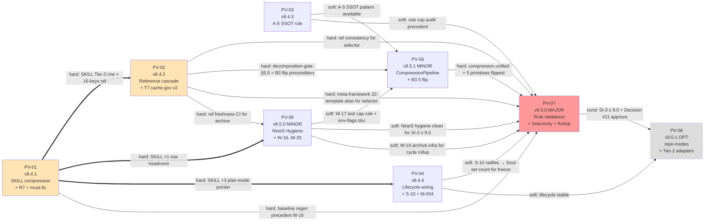

---

## title: DevolaFlow v9.0.0 实施计划 (Implementation Plan)

generated: 2026-04-23
author: L3 Task Agent (Design team)
predecessor_cycle: "v8.4.0 @ HEAD `24d6123` on main, annotated tag `v8.4.0` pushed"
upstream_si1_contract: ".local/research/v9.0.0_gap_analysis.md"
upstream_roadmap: ".local/research/v9.0.0_version_roadmap.md"
upstream_gate_report: ".local/research/v9.0.0_si1_gate.md"
sit_in_artifact_chain:

- "v9.0.0_gap_analysis.md (S05-T01) + v9.0.0_version_roadmap.md (S05-T02) + v9.0.0_si1_gate.md (PASS 9.10/10)"
- "→ v9.0.0_implementation_plan.md (THIS FILE — dispatch playbook)"
- "→ L0 Project Agent dispatches PV-01..PV-08"
purpose: "L0 Project Agent 在 v9.0.0 周期启动时直接使用的调度手册"

# DevolaFlow v9.0.0 实施计划 (Implementation Plan)

> 把 `v9.0.0_version_roadmap.md` 的 8-PV 高层规划细化到 stage→wave→task 可派遣粒度。
> 日期：2026-04-23 | 作者：L3 Task Agent (Design team) | 周期：v8.4.0 → v9.0.0
> 上游契约：`.local/research/v9.0.0_gap_analysis.md` (SI-1) | 上游路线图：`.local/research/v9.0.0_version_roadmap.md`
> 上游 gate：`.local/research/v9.0.0_si1_gate.md` (PASS, composite 9.10/10)
> 用途：L0 Project Agent 在 v9.0.0 周期启动时的**调度手册** (dispatch playbook)。

## 目录

1. [执行摘要](#1-执行摘要)
2. [起飞前检查清单 (Pre-flight Checklist)](#2-起飞前检查清单-pre-flight-checklist)
3. [Erratum 修复 (G-01 + G-02)](#3-erratum-修复-g-01--g-02)
4. [周期级总览](#4-周期级总览)
5. [跨 PV 依赖图 (DAG)](#5-跨-pv-依赖图-dag)
6. [逐 PV 实施块 (PV-01 ... PV-08)](#6-逐-pv-实施块-pv-01--pv-08)
7. [风险加固矩阵 (Reinforcement Matrix)](#7-风险加固矩阵-reinforcement-matrix)
8. [时间线建议](#8-时间线建议)
9. [通信契约 (L0 ↔ Human reporting)](#9-通信契约-l0--human-reporting)
10. [验证矩阵 (Per-PV Verification Harness)](#10-验证矩阵-per-pv-verification-harness)
11. [紧急情况处置 (Escalation Playbook)](#11-紧急情况处置-escalation-playbook)
12. [交叉引用](#12-交叉引用)

---

## 1. 执行摘要

**周期目标。** v9.0.0 是 DevolaFlow 的首个真正 MAJOR 周期，把 v2.x → v8.4.0 八个迭代沉淀的 Karpathy 原语、agent-workspace 三件套、RTK + memory router 组合体收敛进一个**可治理、可调度、可裁剪**的统一框架。SI-1 契约（`v9.0.0_gap_analysis.md` §3.1）锁定 **26 个 in-scope items**（9 BLOCKER + 12 CRITICAL + 5 MAJOR），合并 47 条优先级排序改进项（P0=12 / P1=18 / P2=11 / P3=6）。SI-1 planning gate 已 PASS（composite **9.10/10**，`v9.0.0_si1_gate.md` §1），仅遗留 1 个 MAJOR + 3 个 MINOR + 3 个 INFO findings —— 全部为可在 PV-01/PV-02 内顺手清理的文档级 erratum，不影响实施进度。

**8-PV 节奏与版本号。** 周期按 **4 PATCH (PV-01..PV-04) + 2 MINOR (PV-05, PV-06) + 1 MAJOR (PV-07) + 1 OPTIONAL sustaining PATCH (PV-08)** 排列，目标版本号链路 `v8.4.0 → v8.4.1 → v8.4.2 → v8.4.3 → v8.4.4 → v8.5.0 → v8.5.1 → v9.0.0 → v9.0.1 (optional)`。每个 PV 都是真发布（real semver），由 `scripts/bump_version.py` 同步 7 个 canonical 位置 + `__version`__ source-of-truth；都跑完 W-9 / SI-10 6 步 + SI-3 ≥ 8.5/9.0 + NineS ≥ 0.85/0.91；都打 annotated git tag。

**关键里程碑。**

- **PV-01 (v8.4.1) — SKILL 余量解锁**：把 `workflow-system/agent/SKILL.md` 从 499/500 压到 ≤ 480，给后续每个需要新增 SKILL Tier-2 行的 PV 留出 ≥ 17 行 headroom；同时关闭 4 条 `references/shell-proxy.md` must-fix（B-04 + B-07 + B-08 + B-09）；wholesale 重生 baseline 并归档 two-view diff（W-16 候选编纂的实施先例）。
- **PV-02 (v8.4.2) — Reference BLOCKER 闭环**：一次 PR 内吸收 9 条 reference 漂移（B-05 F-02 16-keys / B-06 F-03 lean schema / C-05..C-12 共 8 条），并落地 cache-layout 治理 v2（B-02 BLOCKER）—— PV-02 是周期内单 PV 体量最大的协调修复，承担解锁后续多个 PV 的前置。
- **PV-07 (v9.0.0) — codify cache governance + rule rebalance + MAJOR rollup**：T6 规则体系按任务类型切片（per-task-type AGENTS.md slice），3 surface 收敛到 `.rules/` 单一权威源，60-rule hard cap codify，Soul-set freeze 在 9 (或 10 if S-10 ratify)；产出 SI-3 ≥ 9.0 evaluation + SI-8 4-section retrospective + wholesale `v9.0.0_baseline.json` + annotated `v9.0.0` git tag + `versions.json` 追加。
- **PV-08 (v9.0.1, optional)** — 视 PV-07 SI-3 evaluation 与 Open Decision §9.2 #11 决议而启动；不启动则归入 v9.1.0 PV-01。

**总工作量预估。** 来自 `v9.0.0_improvements_zh.md` §"v9.0.0 建议的 PV-to-Theme 映射" + roadmap §"Summary" 表格：47 项 P0-P3 改进、跨 8 PV 累计 LOC delta **~+3,000 ~ +3,500**（含 ADR + 评估报告 + retrospective 等文档型产出）；纯实施 **~45-66 小时**，加 SI-3/SI-10/NineS/EvoBench 验证开销 ×1.3 ≈ **~60-90 小时 / 8-12 工作日**。激进节奏 1 PV/天可压到 8 天；稳健节奏 1 PV/1.5-2 天则约 10-12 工作日。

---

## 2. 起飞前检查清单 (Pre-flight Checklist)

L0 Project Agent 在 v9.0.0 周期开始**第一次派遣 PV-01 之前**必须逐项确认。任意一项未通过都先停下，向 user 反馈而不是带病启动。

- **当前版本验证**：`grep '__version__' src/devolaflow/__init__.py` 输出 `__version__ = "8.4.0"`（已确认 ✓）
- **干净工作树**：`git status` 无 uncommitted changes（除 `.local/research/v9.0.0_*.md` 系列研究产出）；`git log -1 --format='%H %s'` HEAD 为 v8.4.0 commit `24d6123`
- **基线就绪**：`benchmarks/devolaflow_context/baselines/v8.4.0_baseline.json` 存在（已确认 ✓），覆盖 48 scenarios；`benchmarks/devolaflow_context/baselines/` 历史链含 `v6.0.5_baseline.json` 起 17 个 baseline + 2 个 `layout_invariant_v{7.0.0,7.3.0}.yaml` golden
- **测试基准**：`python -m pytest tests/ -q` 当前通过率 100%（**3216 tests passing** per `v9.0.0_gap_analysis.md` §1.1 + retro §2.1）
- **Lint 干净**：`ruff check src/ tests/` 退出码 0；`ruff format --check src/ tests/` 退出码 0
- **NineS 当前**：`.local/research/v8.4.0_nines.json` 存在（composite **0.9050** baseline，byte-stable across 6 measurements per `CHANGELOG.md` `## [8.4.0]` 行 10）
- **SKILL.md 行数确认**：`wc -l workflow-system/agent/SKILL.md` 返回 **499**（已确认 ✓ — 1-line headroom，I-6 invariant CRITICAL）
- **AGENTS.md 行数确认**：`wc -l AGENTS.md` 返回 **325**（已确认 ✓，作为 PV-07 selectivity 改造前 baseline 记录）
- **lean-dispatch 不变量**：`schemas/lean-dispatch.yaml#layout_invariant.version` 为 **5**，`canonical_order` 长度为 **16**（已确认 ✓ 行 427-446；A-2 / Rule 6 / I-8 强制）
- **Rule taxonomy 当前 50 条**：Soul 9 / Architecture 4 / Conventions 9 / Workflow 15 / Style 13 = 50（per `v9.0.0_gap_analysis.md` §1.1 + perf_trajectory §"Rule Taxonomy Growth"）
- **G-01 + G-02 erratum 已知**：见 §3 — PV-01 dispatch 时一并处理
- **8 个 Open Decisions 已签署**：见 `v9.0.0_gap_analysis.md` §9.2 — 默认 stance 已写明，如未签署，先决议再启动 PV-01
- **ADR 目录就绪**：`.local/research/adr/` 已存在（已确认 ✓，含 v7-ADR-001..005 历史 ADR）；PV-01 创建 `v9-ADR-001-skill-headroom-reclamation.md` 起步
- **CHANGELOG dry-run**：`CHANGELOG.md` 顶部为 `## [8.4.0] — 2026-04-23`；v9.0.0 周期每个 PV entry 均插入到此条目之上（`## [Unreleased]` placeholder 不写内容）
- **External resource URLs 已知**：DevolaFlow `https://github.com/YoRHa-Agents/DevolaFlow`、NineS `https://github.com/YoRHa-Agents/NineS`、RTK `https://github.com/rtk-ai/rtk` —— Rule S-7 唯一允许的 external citation 形式，runtime path 不可硬编码
- **Mirror status 检查**：`make check-cursor-skill` 退出 0（如 `.cursor/skills/devola-flow/` mirror 缺失则 no-op；如存在则 bytewise 校验，per Rule SF-3）
- **L0 dispatch budget 已知**：L0 Project ~3K / L1 Stage ~5K / L2 Wave ~4K / L3 Task ~8K（A-3 / SI-6）；不可越界

**未通过任意一项 → 停止，向 user 反馈具体差异；通过全部 → 进入 §3 erratum 处理 + PV-01 dispatch。**

---

## 3. Erratum 修复 (G-01 + G-02)

来自 `.local/research/v9.0.0_si1_gate.md` 的 PASS 报告 + 用户 task brief 显式标注。两条 erratum **不影响 v9.0.0 周期实施进度**，可与 PV-01 SKILL 压缩**并行**处理。

### 3.1 G-01 — ADR 编号错位（gap_analysis vs roadmap）

- **问题**：`v9.0.0_gap_analysis.md` §5.2（PV-02 owned files NEW）+ §8.4 cross-refs 把 PV-02 的 ADR 文件标为 `v9-ADR-001-cache-layout-governance-v2.md`；而 `v9.0.0_version_roadmap.md` §"NEW v9.0.0 ADRs to be authored across the cycle (8 total)" 表把同一 ADR 标为 `v9-ADR-002-cache-layout-governance-v2.md`，因为 roadmap 把 PV-01 的 SKILL headroom ADR 占用了 `v9-ADR-001`。
- **canonical 决议**：以 **roadmap §"NEW v9.0.0 ADRs"** 为准（roadmap 是 ordering authority；gap_analysis 是 contract authority — 但 ADR 文件名属于 ordering domain）。canonical sequence 为：

  | ADR anchor | PV                  | 文件路径                                                                 |
  | ---------- | ------------------- | -------------------------------------------------------------------- |
  | ADR-009    | PV-01 (v8.4.1)      | `.local/research/adr/v9-ADR-001-skill-headroom-reclamation.md`       |
  | ADR-010    | PV-02 (v8.4.2)      | `.local/research/adr/v9-ADR-002-cache-layout-governance-v2.md`       |
  | ADR-011    | PV-03 (v8.4.3)      | `.local/research/adr/v9-ADR-003-a5-ssot-registry.md`                 |
  | ADR-012    | PV-04 (v8.4.4)      | `.local/research/adr/v9-ADR-004-lifecycle-wiring-and-s10.md`         |
  | ADR-013    | PV-05 (v8.5.0)      | `.local/research/adr/v9-ADR-005-nines-hygiene-and-w-rules.md`        |
  | ADR-014    | PV-06 (v8.5.1)      | `.local/research/adr/v9-ADR-006-compression-pipeline-and-b3-flip.md` |
  | ADR-015    | PV-07 (v9.0.0)      | `.local/research/adr/v9-ADR-007-rule-rebalancing-and-rollup.md`      |
  | ADR-016    | PV-08 (v9.0.1, OPT) | `.local/research/adr/v9-ADR-008-sustaining.md`                       |

- **修复方式**：在 PV-01 dispatch 的 `applicable_rules.coordination` 字段加一行 erratum：*"ADR file paths in `version_roadmap.md` §"NEW v9.0.0 ADRs" supersede `gap_analysis.md` §5.2 / §8.4 verbatim filename references; canonical ADR sequence is v9-ADR-001 = SKILL compression (PV-01), v9-ADR-002..008 = PV-02..PV-08 in roadmap order."*
- **建议**：作为 v9.0.0 周期收尾时（PV-07 retrospective）的 `.local/research/v9.0.0_erratum.md` 备查；亦可在 PV-02 顺手把 gap_analysis.md §5.2 第一条 NEW 文件路径与 §8.4 cross-ref 中提到的 `v9-ADR-001-cache-layout-governance-v2.md` 字符串改为 `v9-ADR-002-cache-layout-governance-v2.md`（trivial < 5-line edit，P1 trivial waiver 适用）。

### 3.2 G-02 — Stale §1.7 anchor pattern（gap_analysis 全文）

- **问题**：`v9.0.0_gap_analysis.md` 主体共 **18 处**使用 `Open Decision §1.7 #N` 引用 Open Decisions（si1_gate G-01 verbatim 显示 lines 58, 111, 158, 164, 179, 188, 217, 319, 361, 411 等），但实际 Open Decisions section anchor 是 **§9.2**（gap_analysis line 618）；且 §9.2 仅枚举 **8 项** decisions（#1 v9.0.0 MAJOR vs MINOR / #2 12+13 ref / #3 6th rule category / #4 SF-1 tier promote / #5 B3 bundle / #6 M-007 / #7 shell-proxy hotfix / #8 NineS bundle），不含被引用的 #10 / #11 —— 后两者实际指向 `v9.0.0_decomposition_analysis.md` §"Open Decisions for v9.0.0 SI-1" #10 (T3 `apply_local_recipe`) 与 #11 (T5 6th primitive `behavioral_guidelines`)。
- **修复方式**（在 PV-01 dispatch 时同步派一个 trivial L3 task）：
  ```bash
  # Step 1: 全局替换 §1.7 → §9.2 for #1..#8 references
  sed -i 's/Open Decision §1\.7 #\([1-8]\)\b/Open Decision §9.2 #\1/g' \
      .local/research/v9.0.0_gap_analysis.md

  # Step 2: 替换剩余 #10 / #11 引用为更精准的来源
  # 手工编辑（仅 2-3 处）：将 "Open Decision §1.7 #10" → "decomposition_analysis.md §\"Open Decisions for v9.0.0 SI-1\" #10 (deferred to v9.x sustaining)"
  # 同上 #11
  ```
- **预估工作量**：< 5 分钟（sed 1 次 + 手工 2-3 处 #10/#11 重指向）。
- **验证命令**：
  ```bash
  rg "Open Decision §1\.7" .local/research/v9.0.0_gap_analysis.md
  # 期望：0 hits（全部已迁移到 §9.2 或 decomposition_analysis 来源）
  ```
- **同步影响**：si1_gate.md G-04 finding（"`决策 #11`" phantom）随之自动闭合 —— 以 *"decomposition_analysis.md §"Open Decisions" #10/#11 — deferred to v9.x sustaining"* 形式重新指向真实存在的 decision 来源。

**这两个 erratum 均不会阻塞 PV-01 SKILL 压缩主线工作；建议作为 PV-01 STATUS report 中 "documentation polish" 子项透明记录。**

---

## 4. 周期级总览

下表是 L0 Project Agent 派遣每个 PV 时所需的核心元数据。LOC 估算来自 `v9.0.0_version_roadmap.md` §"Summary" 表 + 每个 PV 的 "Estimated LOC" 段；时间估算来自 `v9.0.0_improvements_zh.md` §"v9.0.0 建议的 PV-to-Theme 映射"。


| PV        | 版本     | Type      | 主题                                                                    | 派遣类型                                      | 估时 (h) | LOC delta                       | 关键风险                                                          | 阻塞下游                                                                                                               |
| --------- | ------ | --------- | --------------------------------------------------------------------- | ----------------------------------------- | ------ | ------------------------------- | ------------------------------------------------------------- | ------------------------------------------------------------------------------------------------------------------ |
| **PV-01** | v8.4.1 | PATCH     | T1 SKILL.md 压缩 + R7 + 4 ref must-fix + erratum                        | Standard (15 file)                        | 3-5    | ~+500 net                       | R-2 压缩失败 / R-5 baseline drift                                 | **PV-02 hard** (reference cascade 依赖 SKILL headroom) + PV-04/PV-05/PV-06 (任何 SKILL +N 行 PV)                        |
| **PV-02** | v8.4.2 | PATCH     | T7 cache-layout v2 + 9 reference cascade                              | Complex (23 file)                         | 6-8    | ~+935 net                       | R-5 ref 级联 / R-11 多 baseline 测试                               | PV-03 (refs 一致性) + PV-06 (decomposition-gate §5.5 是 B3 flip 前置) + PV-07 (selectivity 需 meta-framework 22-template) |
| **PV-03** | v8.4.3 | PATCH     | T2 A-5 SSOT registry rule                                             | Standard (10 file)                        | 3-5    | ~+325 net                       | R-3 现有 registry 冲突                                            | 软 → PV-06 (Registry pattern available) + PV-07 (rule cap audit)                                                    |
| **PV-04** | v8.4.4 | PATCH     | T4 lifecycle hooks 接线 + S-10 + M-004 + I-PV07-A                       | Standard (15 file)                        | 4-6    | ~+400 net                       | R-10 dispatch hot-path / R-2 spillover (SKILL +3)             | 软 → PV-08 (lifecycle stable)                                                                                       |
| **PV-05** | v8.5.0 | MINOR     | T8 NineS Hygiene A1-A4 + W-16..W-20 + deferred marker + env-flags ref | Complex (25 file)                         | 6-8    | ~+800 net                       | R-6 NineS upstream blocker / R-7 第 13 ref 决策 stall            | 软 → PV-06 (W-17 cap rule + env-flags doc) + PV-08                                                                  |
| **PV-06** | v8.5.1 | MINOR     | T3 CompressionPipeline + T5 B3 5-primitive flip + (opt) A3 ref        | Complex (26 file)                         | 8-12   | ~+550 net (无 A3) / ~+850 (含 A3) | R-4 default-on 暴露 latent bug                                  | 软 → PV-07                                                                                                          |
| **PV-07** | v9.0.0 | MAJOR     | T6 Rule rebalancing + selectivity + Soul-set freeze + Rollup          | Complex XL (21 file + cycle deliverables) | 10-15  | ~+1,415 net (含 700 文档型)         | R-1 MAJOR 论证失败 / R-8 规则 deprecation 冲突 / R-9 cached-prefix 破坏 | (终点 v9.0.0 release)                                                                                                |
| **PV-08** | v9.0.1 | OPT PATCH | repo-modes sustaining + (opt) Tier-2 enterprise adapters              | Standard (9 file)                         | 1-3    | ~+200-330 net                   | R-12 sustaining 决策延迟 release                                  | 无 (条件 ship)                                                                                                        |


**总估时**：~~45-66 小时纯实施 + ~30-40% 验证开销 ≈ **~~60-90 小时 / 8-12 工作日**。

**关键节奏说明**：

- **PV-01 + PV-02 + PV-08 的 stage 分解最详细**（见 §6.1 / §6.2 / §6.8），因为 PV-01 + PV-02 联合解锁后续所有 PV，PV-08 是 conditional ship，需要明确 gate。
- **PV-03 / PV-04 / PV-05 在 PV-02 完成后可并行**（无相互硬依赖），见 §5 DAG。
- **PV-06 与 PV-07 必须依次**（PV-07 的 selectivity 测试需要 PV-06 的 CompressionPipeline + B3 flip 都已稳定）。

---

## 5. 跨 PV 依赖图 (DAG)

用 mermaid 表达硬依赖（hard，必须前置完成才能启动）与软依赖（soft，前置完成后启动更顺畅但非阻塞）：




**并行机会**：

- **批次 A (sequential)**: PV-01 → PV-02 — 必须串行（hard SKILL + ref deps）
- **批次 B (parallel)**: PV-03 ‖ PV-04 ‖ PV-05 — 三者互不硬依赖，可在 PV-02 完成后同时启动（如人手充足）
- **批次 C (sequential)**: PV-06 → PV-07 — 必须串行（hard：CompressionPipeline + B3 flip 完成是 selectivity 测试前置）
- **批次 D (conditional)**: PV-08 — 仅在 PV-07 SI-3 ≥ 9.0 且 Decision #11 = approve 才启动；否则归入 v9.1.0

**关键路径**：PV-01 → PV-02 → PV-06 → PV-07 = 4 个串行 PV，约占总周期 60-70% 工时。

---

## 6. 逐 PV 实施块 (PV-01 ... PV-08)

每个 PV 块统一包含 7 个 sub-section（**6.NN.1** Dispatch / **6.NN.2** Stage 分解 / **6.NN.3** Owned Files / **6.NN.4** 验收标准 / **6.NN.5** 验证命令 / **6.NN.6** 回滚程序 / **6.NN.7** Definition of Done）。

PV-01 + PV-02 + PV-08 的 stage 分解最详细（W-NN + T-NN 全列出 + context_profile + threshold + max_rounds）；PV-03..PV-07 的 stage 分解结构相同但稍简（每 stage 关键 task 1-3 个）。

### 6.1 PV-01 — `v8.4.1` PATCH — Theme T1 SKILL.md 压缩 + R7 + 4 reference must-fix + erratum

#### 6.1.1 派遣信息 (Dispatch)

- **branch_name**: `feat/v8.4.1-skill-headroom-reclamation`
- **PR title**: `feat(v8.4.1): SKILL.md compression to ≤480 + R7 anchor migration + 4 shell-proxy must-fixes + baseline regen`
- **commit message format**: `feat(v8.4.1): <subject>` 或 `chore(v8.4.1): <subject>` (for erratum)
- **target reviewer**: human / self-merge per W-9 / SI-10 6/6 PASS
- **派遣 context profile**: `implementation` (L3 Task spec ~8K tokens, 含 SKILL.md 现状 + R7 anchor 历史 + 4 must-fix evidence)

#### 6.1.2 Stage 分解

PV-01 是开局 PV，标准提高（threshold 90 strict，因为后续每个 PV 都依赖此 PV 的 SKILL headroom 与 baseline 重生质量）。

```
S01: research — Identify SKILL.md compression candidates + R7 migration impact
  W01 (parallel | 2 tasks)
    T01 [Research, ~30min]: 扫描 SKILL.md 章节按 line cost 排序；定位 §"Mode Awareness" + §"Reinforcement Rules" 可外迁 LOC
    T02 [Research, ~30min]: 列出当前 line-anchor → symbolic anchor 残留 (R7) 在 context_profiles.yaml + section_registry.py 的覆盖差距
  Gate: standard 85 (research)
  context_profile: research

S02: design — 选定压缩策略 (extract / micro-compress / reorganize)
  W01 (single | 1 task)
    T03 [Design, ~30min]: 综合 T01+T02，输出 .local/research/v9.0.0_pv01_compression_plan.md：
      - SKILL.md 删除/外迁明细 (target ≥ 19 lines reclaim, target final ≤ 480)
      - references/plan-mode-enforcement.md 章节结构 (~350-450 LOC, Tier-2)
      - R7 anchor 迁移 step list (按 module 分批)
  Gate: standard 85 (design)
  context_profile: design

S03: implement — 执行 SKILL.md 压缩 + reference 创建 + 4 shell-proxy must-fix + erratum
  W01 (parallel | 4 tasks — 4 独立文件)
    T04 [Impl, ~45min]: SKILL.md 压缩到 ≤ 480 + 增加 F-04 row for behavioral-guidelines.md
    T05 [Impl, ~60min]: NEW workflow-system/agent/references/plan-mode-enforcement.md (~400 LOC)
    T06 [Impl, ~30min]: workflow-system/agent/references/shell-proxy.md 4 must-fix:
      - line 654 (F-01 / B-04): DROP `/root/.cursor/plans/...` absolute path
      - §5.3 (F-05 / B-07): rewrite MemoryCase fields per src/devolaflow/memory_router/cache.py:91-130
      - §6.3 (F-06 / B-08): replace `note:` → `replacement:` ×2 per schemas/command-mapping.yaml:170-198
      - §5.2 (F-14 / B-09): replace `case.dispatch_template` / `case.expected_savings_pp` with `case.summary` / `case.recipe_path` / `case.version_stamp`
    T07 [Impl, ~30min]: R7 anchor migration in context_profiles.yaml + src/devolaflow/section_registry.py
  W02 (sequential | 2 tasks)
    T08 [Impl, ~10min]: erratum 修复 — sed Open Decision §1.7 → §9.2 (G-02) + 手工 #10/#11 重指向 + gap_analysis ADR-001 → ADR-002 (G-01)
    T09 [Impl, ~10min]: SKILL.md 增加 1-line 指向 references/plan-mode-enforcement.md (作为 Tier-2 nav 行；同时 +1 row F-04 behavioral-guidelines.md)
  Gate: standard 85 (implement)
  context_profile: implementation

S04: test — Verify SKILL.md ≤ 480 + baseline wholesale regen + W-9 SI-10 6/6
  W01 (parallel | 3 tasks)
    T10 [Test, ~5min]: pytest tests/test_integration.py::test_skill_md_under_500_lines (assertion bumped to ≤ 480)
    T11 [Test, ~20min]: NEW tests/test_no_ghost_features.py::test_reference_skill_md_tier2_parity — 12-entry SF-4 ≡ SKILL.md Tier-2 nav table
    T12 [Test/Bench, ~30min]: wholesale baseline regen (v7.8.0 + v8.3.0 + v8.4.0 + NEW v9.0.0_baseline.json) + two-view diff archive at .local/research/v9.0.0_evobench_summary.md
  W02 (sequential | 2 tasks)
    T13 [Test, ~10min]: 更新 _SF4_REFERENCE_SET 11→12 + sync_cursor_skill.py MIRRORED_FILES 14→15 + tests/test_benchmarks.py::test_runner_prefers_latest_baseline → v9.0.0_baseline.json
    T14 [Test, ~15min]: W-9 SI-10 6 步全跑 + verbatim grep 验证 4 must-fix（rg `/root/...` returns 0 in references/）
  Gate: strict 90 (test — PV-01 是周期开局，标准提高)
  context_profile: review

S05: review + release — Gate 评估 + 版本号 + ADR + CHANGELOG
  W01 (sequential | 3 tasks)
    T15 [Review, ~15min]: 综合评估 + erratum ledger 写入 .local/research/v9.0.0_erratum.md（G-01 + G-02 解决记录）
    T16 [Doc, ~30min]: NEW .local/research/adr/v9-ADR-001-skill-headroom-reclamation.md（~200 LOC）
    T17 [Release, ~15min]: scripts/bump_version.py 8.4.1 + CHANGELOG `## [8.4.1]` + W-9 SI-10 final verify + commit + push + gh pr create
  Gate: strict 90 (review)
  context_profile: review
  on_stagnation: escalate (P4 bounded retry, max 3 rounds)
```

**总 stage = 5；总 wave = 7；总 task = 17（PV-01 是结构最完整的 demo PV）。**

#### 6.1.3 归属文件 (Owned Files)

逐文件列出（与 `v9.0.0_gap_analysis.md` §5.1 一致）；区分 NEW / MODIFIED / DELETED；每文件 LOC delta 来自 `v9.0.0_version_roadmap.md` §v8.4.1 表。

**NEW (5 files):**


| #   | Path                                                                                   | LOC delta                    |
| --- | -------------------------------------------------------------------------------------- | ---------------------------- |
| 1   | `workflow-system/agent/references/plan-mode-enforcement.md`                            | +350-450 (Tier-2 sweet spot) |
| 2   | `tests/test_no_ghost_features.py::test_reference_skill_md_tier2_parity` (新增 test func) | +50                          |
| 3   | `.local/research/v9.0.0_evobench_summary.md`                                           | +150 (two-view diff)         |
| 4   | `.local/research/v9.0.0_erratum.md`                                                    | +30 (G-01 + G-02 ledger)     |
| 5   | `.local/research/adr/v9-ADR-001-skill-headroom-reclamation.md`                         | +200                         |
| 6   | `benchmarks/devolaflow_context/baselines/v9.0.0_baseline.json`                         | +50 (wholesale regen)        |


**MODIFIED (10 files):**


| #   | Path                                                                                                             | LOC delta                      |
| --- | ---------------------------------------------------------------------------------------------------------------- | ------------------------------ |
| 1   | `workflow-system/agent/SKILL.md`                                                                                 | net **−19** target (499 → 480) |
| 2   | `workflow-system/agent/references/shell-proxy.md`                                                                | ~−50 net (4 rewrites)          |
| 3   | `workflow-system/agent/context_profiles.yaml`                                                                    | ±0 (R7 refactor)               |
| 4   | `src/devolaflow/section_registry.py`                                                                             | ±0 (R7 refactor)               |
| 5   | `tests/test_integration.py::test_skill_md_under_500_lines`                                                       | +2 (assertion ≤ 480)           |
| 6   | `tests/test_no_ghost_features.py::_SF4_REFERENCE_SET`                                                            | +5 (11→12)                     |
| 7   | `scripts/sync_cursor_skill.py::MIRRORED_FILES`                                                                   | +5 (14→15)                     |
| 8   | `tests/test_benchmarks.py::test_runner_prefers_latest_baseline`                                                  | +5 (→ v9.0.0_baseline.json)    |
| 9   | `benchmarks/devolaflow_context/baselines/v7.8.0_baseline.json` + `v8.3.0_baseline.json` + `v8.4.0_baseline.json` | ±0 (regen)                     |
| 10  | `.local/research/v9.0.0_gap_analysis.md` (G-01 + G-02 erratum sed apply)                                         | < 25 lines diff                |
| 11  | `CHANGELOG.md`                                                                                                   | +25 (`## [8.4.1]`)             |
| 12  | 7 canonical version-sync locations per CP-3 / W-10                                                               | +10 net                        |


**DELETED**: 无。

**Test cap forecast**: ≤ +20 tests (per gap_analysis §5.1 forecast)。

#### 6.1.4 验收标准 (Acceptance Criteria)

每条 binary 可验证；每条配执行命令；不达标 → 阻塞 commit。

- `wc -l workflow-system/agent/SKILL.md` 返回 ≤ **480**（target；HARD ≤ 500 throughout per I-6）
- `python -m pytest tests/ -q` 通过率 100%（不少于 3216 tests + ≤ +20 net 新增）
- `python -m pytest tests/test_benchmarks.py -v` 0 regression > 5pp 对 wholesale-regenerated baseline；pre-rebase + post-rebase 双视图都归档到 `.local/research/v9.0.0_evobench_summary.md`
- `ruff check src/ tests/` 退出码 0；`ruff format --check src/ tests/` 退出码 0
- `python scripts/bump_version.py 8.4.1` 7 个同步位置全部更新（验证 `python -m pytest tests/test_version.py -v` PASS）
- CHANGELOG.md 新增 `## [8.4.1]` entry，包含 `### Highlights` + `### Cross-references`（mirror v8.4.0 entry 格式）
- `rg '/root/' workflow-system/agent/references/` 返回 0 hits（F-01 / B-04 closure verbatim）
- `rg 'note:' workflow-system/agent/references/shell-proxy.md` (in §6.3 context) 返回 0 hits；`rg 'replacement:' workflow-system/agent/references/shell-proxy.md` 返回 ≥ 2 hits（F-06 / B-08 closure）
- `pytest tests/test_no_ghost_features.py::test_reference_skill_md_tier2_parity -v` PASS（SF-4 set = 12 ≡ SKILL.md Tier-2 nav 12 行）
- `make check-cursor-skill` 退出 0
- `rg "Open Decision §1\.7" .local/research/v9.0.0_gap_analysis.md` 返回 0 hits（G-02 closure）
- `.local/research/adr/v9-ADR-001-skill-headroom-reclamation.md` 存在且 ≥ 200 LOC
- SI-3 evaluation `.local/research/v8.4.1_evaluation.md` 写入并 ≥ 8.5（PATCH threshold per I-3）
- NineS post-PV `.local/research/v8.4.1_nines.{json,md}` 写入并 composite ≥ 0.85（carry-forward floor per I-4）

#### 6.1.5 验证命令 (Verification Harness)

完整的 verification commands 列表，按顺序执行；失败任意一条 → 修复后重跑全部。

```bash
# 1. Pre-PR verification (in feat branch)
python -m pytest tests/ -q
ruff check src/ tests/
ruff format --check src/ tests/
python -m pytest tests/test_version.py -v
python -m pytest tests/test_benchmarks.py -v
make check-cursor-skill

# 2. PV-01 specific
wc -l workflow-system/agent/SKILL.md  # 期望 ≤ 480
pytest tests/test_no_ghost_features.py::test_reference_skill_md_tier2_parity -v
pytest tests/test_integration.py::test_skill_md_under_500_lines -v
rg '/root/' workflow-system/agent/references/  # 期望 0 hits
rg 'note:' workflow-system/agent/references/shell-proxy.md  # 期望 0 hits in §6.3
rg 'replacement:' workflow-system/agent/references/shell-proxy.md  # 期望 ≥ 2 hits
rg "Open Decision §1\.7" .local/research/v9.0.0_gap_analysis.md  # 期望 0 hits

# 3. NineS post-PV (per W-2)
nines -f json -c nines.toml self-eval --baseline-version 8.4.0 \
    --golden-dir data/golden_test_set --samples-dir data/golden_test_set \
    --src-dir src/devolaflow --test-dir tests --project-root . \
    > .local/research/v8.4.1_nines.json

# 4. Two-view EvoBench summary
python scripts/regenerate_baselines.py --wholesale --archive-two-view \
    --output .local/research/v9.0.0_evobench_summary.md
# (脚本若未实现，按 v8.3.0 PV-09 commit 12f4ea8 precedent 手工 regen + diff 归档)
```

#### 6.1.6 回滚程序 (Rollback)

- 若 SI-3 < 8.5 → revert PR + 重新进入 SI-1（**不弹出周期**）；若 SKILL ≤ 480 不可达，触发 R-2 (b) fallback：SF-1 tier 升 Large(≤1000)（需 ADR + Open Decision §9.2 #4 重决议）
- 若 SI-10 任一 step fail → fix in-place + retry，**不超过 2 retries**（P4 bounded）
- 若 EvoBench post-rebase regression > 5pp → 触发 R-5 mitigation：halt + escalate per W-8（标记到 `.local/research/v9.0.0_evobench_summary.md` 的 "regressions" section）
- 若 NineS composite 跌破 0.85 → 暂停下一 PV (PV-02) 派遣，先做 hygiene 修复
- 文件级回滚：`git revert <pv01_commit>` 即可，因 SKILL/reference/baseline 都是单 commit 内的协调改动

#### 6.1.7 完成定义 (Definition of Done)

- W-9 / SI-10 6/6 PASS
- SI-3 ≥ **8.5**（PATCH per I-3）
- NineS post-PV composite ≥ **0.85** (carry-forward floor)；运行 `nines self-eval --baseline-version 8.4.0` 并存入 `.local/research/v8.4.1_nines.{json,md}`
- EvoBench post-rebase 0 regression > 5pp（per W-4 / SI-4）
- 7 canonical version-sync locations bumped via `scripts/bump_version.py 8.4.1`
- CHANGELOG.md 新 `## [8.4.1]` entry + Highlights + Cross-references
- PR merged to `main` via `gh pr merge --merge --delete-branch`
- Annotated tag pushed: `git tag -a v8.4.1 -m "..." && git push --tags`
- `.local/research/adr/v9-ADR-001-skill-headroom-reclamation.md` committed
- `.local/research/v9.0.0_erratum.md` 记录 G-01 + G-02 解决方案
- `.local/research/v9.0.0_evobench_summary.md` 含 two-view diff 归档（W-16 编纂的实施先例）
- L0 向 user 报告（per §9 通信契约）：commit hash / PR # / tag / SI-3 / NineS / EvoBench / tests / LOC delta / time / carry-forward to PV-02

---

### 6.2 PV-02 — `v8.4.2` PATCH — Reference Freshness Cascade + T7 Cache-Layout Governance v2

#### 6.2.1 派遣信息 (Dispatch)

- **branch_name**: `feat/v8.4.2-reference-cascade-and-cache-gov-v2`
- **PR title**: `feat(v8.4.2): 9-reference coordinated refresh + 11 frontmatter bumps + cache-layout governance v2 + drift CI guards`
- **commit message format**: `feat(v8.4.2): <subject>`
- **target reviewer**: human (大 PR — 23 file)；self-merge per W-9 / SI-10 6/6 PASS
- **派遣 context profile**: `implementation` + `design` (混合 — refs 是 doc，cache-layout 是 schema/test)

#### 6.2.2 Stage 分解

PV-02 是周期内单 PV 体量最大的协调修复（23 file），承担 9 ref BLOCKER+CRITICAL + T7 BLOCKER 双重闭环。standard 85；4 ref tasks 可并行。

```
S01: research — Verify 9 reference findings against current source-of-truth
  W01 (parallel | 2 tasks)
    T01 [Research, ~30min]: 对照 schemas/lean-dispatch.yaml#layout_invariant 16-keys (verbatim canonical_order line 429-446) vs references/context-isolation.md §10 (F-02 stale 12-keys)；同时 verify F-15 §15 重号
    T02 [Research, ~45min]: workflow-system/agent/templates/builtin/*.yaml 共 22 templates 列表 vs meta-framework.md §4 alias 12 / team-roles.md §7 matrix 11 漏 10/11 (F-07 + F-10)
  Gate: standard 85
  context_profile: research

S02: design — Coordinate 9-ref edit plan + cache-layout v2 nest-vs-append rule
  W01 (parallel | 2 tasks)
    T03 [Design, ~45min]: 输出 .local/research/v9.0.0_pv02_ref_cascade_plan.md：每 ref 的 diff hunk 草稿 (10 ref × hunk LOC)
    T04 [Design, ~30min]: 起草 .local/research/adr/v9-ADR-002-cache-layout-governance-v2.md skeleton（nest-vs-append decision rule + multi-baseline byte test 论证）
  Gate: standard 85
  context_profile: design

S03: implement — Reference cascade 9-ref edits + 11 frontmatter bumps + cache governance v2 + 5 NEW test/golden files
  W01 (parallel | 4 ref tasks — 4 独立文件 + 11 frontmatter)
    T05 [Impl, ~30min]: context-isolation.md F-02 §10 12→16 keys + F-15 §15 → §16 renumber；message-schemas.md F-03 §2/§3 rewrite + add §7-§9（preserve verbose form as deprecated appendix per R5 backward-compat）
    T06 [Impl, ~30min]: behavioral-guidelines.md F-04 body extension (S-8 composition + severity matrix + v8.2.x primitives)；meta-framework.md F-07 §4 alias 12→22 templates verbatim from workflow-system/agent/templates/builtin/*.yaml；team-roles.md F-10 §7 matrix 11→22
    T07 [Impl, ~45min]: execution-protocol.md F-11 NEW §12 change-driven envelope + F-12 NEW §10 memory_router fast-path + F-13 NEW §11 pre_shell_call hook + PSC001..PSC004
    T08 [Impl, ~20min]: agent-workspace.md cross-refs + envelope policy clarification；shell-proxy.md frontmatter `last_updated: "2026-04-23"` + cross-refs to PV-01 fixes；11 frontmatter `last_updated: "2026-04-23"` 同步 bump (F-09 short-term)；NEW decomposition-gate.md §5.5 "Gate Primitive Composition (v8.0.0+)" 7-primitive table
  W02 (parallel | 2 cache-gov tasks)
    T09 [Impl, ~30min]: src/devolaflow/compressor.py::assert_dispatch_layout 扩展 nest-vs-append check (T7 #3, ~+60 LOC)；schemas/lean-dispatch.yaml#layout_invariant version 5 documentation comments only（NO top-level transition — preserve length 16 / version 5 per I-8）
    T10 [Impl, ~30min]: .cursor/rules/repo-governance.mdc + .rules/architecture.mdc 扩展 A-2 with nest-vs-append rule (~+45 LOC)；regenerate AGENTS.md (~+30 LOC net)
  Gate: standard 85
  context_profile: implementation

S04: test — 5 NEW tests + golden YAMLs + freshness CI guard
  W01 (parallel | 3 tasks)
    T11 [Test, ~30min]: NEW tests/test_layout_invariant_multi_baseline.py (~+90 LOC) 覆盖所有 prior baselines (v7.0.0 + v7.3.0 + v8.0.0 P-08 + v8.0.0 P-10 + v8.3.0 PV-05 + v8.4.0)；3 NEW golden YAMLs (~+50/+60/+70 LOC each — layout_invariant_v8.0.0/v8.3.0/v8.4.0.yaml)
    T12 [Test, ~25min]: NEW tests/test_reference_frontmatter_freshness.py (~+80 LOC, 90-day window enforcement)
    T13 [Test, ~25min]: NEW tests/test_reference_api_alignment.py (~+70 LOC) — 解析 reference 中 dataclass + YAML code blocks，断言 fields ≡ canonical schema/source（F-05 + F-06 防错复发）
  W02 (sequential | 1 task)
    T14 [Test, ~15min]: W-9 / SI-10 6 步全跑 + verbatim grep verifications:
      - rg "16 keys" workflow-system/agent/references/context-isolation.md → ≥ 1 hit
      - rg "12 keys" workflow-system/agent/references/context-isolation.md → 0 hits
      - rg "lean format" workflow-system/agent/references/message-schemas.md → ≥ 1 hit (canonical mandate per C-2)
      - rg "2026-04-23" workflow-system/agent/references/*.md → 11 hits (F-09 frontmatter bumps)
  Gate: standard 85
  context_profile: review

S05: review + release — Gate 评估 + ADR + 版本号 + CHANGELOG
  W01 (sequential | 3 tasks)
    T15 [Review, ~15min]: 综合评估；任何 ref 漂移残留 → 列入 PV-03 carry-forward
    T16 [Doc, ~30min]: 完成 .local/research/adr/v9-ADR-002-cache-layout-governance-v2.md (~+200 LOC)
    T17 [Release, ~15min]: scripts/bump_version.py 8.4.2 + CHANGELOG `## [8.4.2]` + W-9 SI-10 final verify + commit + push + gh pr create
  Gate: standard 85
  context_profile: review
  on_stagnation: escalate
```

**总 stage = 5；总 wave = 7；总 task = 17。**

#### 6.2.3 归属文件 (Owned Files)

per `v9.0.0_gap_analysis.md` §5.2 + roadmap §v8.4.2。共 **23 file** (5 NEW + 17 MODIFIED + 1 ADR)。

**NEW (7 files):**


| #   | Path                                                                   | LOC delta |
| --- | ---------------------------------------------------------------------- | --------- |
| 1   | `tests/test_layout_invariant_multi_baseline.py`                        | +90       |
| 2   | `tests/test_reference_frontmatter_freshness.py`                        | +80       |
| 3   | `tests/test_reference_api_alignment.py`                                | +70       |
| 4   | `benchmarks/devolaflow_context/baselines/layout_invariant_v8.0.0.yaml` | +50       |
| 5   | `benchmarks/devolaflow_context/baselines/layout_invariant_v8.3.0.yaml` | +60       |
| 6   | `benchmarks/devolaflow_context/baselines/layout_invariant_v8.4.0.yaml` | +70       |
| 7   | `.local/research/adr/v9-ADR-002-cache-layout-governance-v2.md`         | +200      |


**MODIFIED (16 files):**


| #   | Path                                                                      | LOC delta        |
| --- | ------------------------------------------------------------------------- | ---------------- |
| 1   | `workflow-system/agent/references/context-isolation.md` (F-02 + F-15)     | +5               |
| 2   | `workflow-system/agent/references/message-schemas.md` (F-03)              | +71              |
| 3   | `workflow-system/agent/references/behavioral-guidelines.md` (F-04 body)   | +45              |
| 4   | `workflow-system/agent/references/meta-framework.md` (F-07)               | +60-80           |
| 5   | `workflow-system/agent/references/decomposition-gate.md` (F-08 §5.5)      | +50              |
| 6   | `workflow-system/agent/references/team-roles.md` (F-10 §7)                | +12              |
| 7   | `workflow-system/agent/references/execution-protocol.md` (F-11+F-12+F-13) | +110             |
| 8   | `workflow-system/agent/references/agent-workspace.md`                     | +11              |
| 9   | `workflow-system/agent/references/shell-proxy.md` (frontmatter only)      | +5               |
| 10  | 11 frontmatter `last_updated: "2026-04-23"` 行 bump (cross 11 ref files)   | +11 (1 per file) |
| 11  | `schemas/lean-dispatch.yaml#layout_invariant` (doc comments only)         | +10              |
| 12  | `src/devolaflow/compressor.py::assert_dispatch_layout`                    | +60              |
| 13  | `.cursor/rules/repo-governance.mdc` (A-2 nest-vs-append)                  | +45              |
| 14  | `.rules/architecture.mdc` (A-2 source)                                    | +45              |
| 15  | `AGENTS.md` (regenerate)                                                  | net +30          |
| 16  | 7 canonical version-sync locations                                        | +10              |
| 17  | `CHANGELOG.md` `## [8.4.2]`                                               | +30              |


**Test cap forecast**: ≤ +25 tests (multi-baseline 6 + freshness ~5 + api alignment ~14)。

#### 6.2.4 验收标准 (Acceptance Criteria)

- 全部 9 reference findings 闭环（B-05/B-06/C-01 body/C-05/C-06/C-07/C-08/C-09/C-10/C-11/C-12 verbatim per `v9.0.0_reference_review.md` Action Plan）
- `pytest tests/test_no_ghost_features.py::test_reference_skill_md_tier2_parity -v` PASS（SF-4 11-entry set ≡ SKILL.md Tier-2 nav 12 entries — PV-01 已建立）
- `rg "16 keys" workflow-system/agent/references/context-isolation.md` 至少 1 hit（F-02 verbatim per `schemas/lean-dispatch.yaml#layout_invariant` length 16）
- `pytest tests/test_layout_invariant_multi_baseline.py -v` PASS — 覆盖 6 baselines (v7.0.0 + v7.3.0 + v8.0.0 P-08 + v8.0.0 P-10 + v8.3.0 PV-05 + v8.4.0)
- `pytest tests/test_reference_frontmatter_freshness.py -v` PASS（90-day window）
- `pytest tests/test_reference_api_alignment.py -v` PASS（dataclass + YAML 字段对齐 schema/source）
- `rg '2026-04-23' workflow-system/agent/references/*.md` 返回 11 hits（11 frontmatter bumps verified）
- AGENTS.md A-2 section 包含 "nest-vs-append" 关键词（A-2 extension verbatim per `v9-ADR-002`）
- `python -m pytest tests/test_compressor.py::test_dispatch_layout_v5 -v` PASS（layout 不变 — version 5 / length 16 preserved per I-8）
- SI-10 6/6 PASS；SI-3 ≥ 8.5；NineS ≥ 0.85；EvoBench composite ≥ 90 floor preserved per W-4

#### 6.2.5 验证命令 (Verification Harness)

```bash
# Pre-PR
python -m pytest tests/ -q
ruff check src/ tests/
ruff format --check src/ tests/
python -m pytest tests/test_version.py -v
python -m pytest tests/test_benchmarks.py -v
make check-cursor-skill

# PV-02 specific
pytest tests/test_layout_invariant_multi_baseline.py -v
pytest tests/test_reference_frontmatter_freshness.py -v
pytest tests/test_reference_api_alignment.py -v
pytest tests/test_no_ghost_features.py::test_reference_skill_md_tier2_parity -v
pytest tests/test_compressor.py::test_dispatch_layout_v5 -v

# Verbatim grep checks
rg "16 keys" workflow-system/agent/references/context-isolation.md
rg "12 keys" workflow-system/agent/references/context-isolation.md  # 期望 0
rg "2026-04-23" workflow-system/agent/references/ --count-matches
rg "nest-vs-append" .cursor/rules/repo-governance.mdc AGENTS.md

# NineS
nines -f json -c nines.toml self-eval --baseline-version 8.4.1 \
    --golden-dir data/golden_test_set --samples-dir data/golden_test_set \
    --src-dir src/devolaflow --test-dir tests --project-root . \
    > .local/research/v8.4.2_nines.json
```

#### 6.2.6 回滚程序 (Rollback)

- 若 SI-3 < 8.5 → revert PR；refs 修改是 isolated 文件，单 PR revert 安全
- 若 multi-baseline byte test fail → 检查是否 PV-01 wholesale regen 引入了非预期 layout 偏差；如确实是 layout 漂移，halt 并 escalate（违反 I-8）
- 若 ref API alignment test fail → 表明某 ref 仍有 schema/code 漂移；fix in-place 并 retry（不超过 2 次）
- 若 EvoBench composite < 90 floor 在某 scenario → R-5 mitigation：检查是否 SKILL.md 编辑或新 ref 引入了语料替换；revert 该 ref edit 单独再调
- 文件级：`git revert <pv02_commit>`

#### 6.2.7 完成定义 (Definition of Done)

- W-9 / SI-10 6/6 PASS
- SI-3 ≥ 8.5；NineS ≥ 0.85；EvoBench composite ≥ 90 floor
- `tests/test_layout_invariant_multi_baseline.py` PASS — 6 historical baselines all green
- 11 frontmatter `last_updated: "2026-04-23"` 全部就位（F-09 short-term + CI guard 长期化）
- `.local/research/adr/v9-ADR-002-cache-layout-governance-v2.md` committed
- AGENTS.md regenerated with A-2 extension
- 7 canonical version-sync locations bumped via `scripts/bump_version.py 8.4.2`
- PR merged + tag `v8.4.2` pushed
- L0 报告 + carry-forward to PV-03

---

### 6.3 PV-03 — `v8.4.3` PATCH — Theme T2 A-5 SSOT Registry Rule

#### 6.3.1 派遣信息

- **branch_name**: `feat/v8.4.3-a5-ssot-registry`
- **PR title**: `feat(v8.4.3): codify Architecture Rule A-5 (single-source-of-truth registry pattern) + DEFAULT_ALLOWLIST parity test`
- **commit**: `feat(v8.4.3): <subject>`
- **context profile**: `design` (rule codification) + `implementation` (CI test)

#### 6.3.2 Stage 分解

```
S01: research — Audit existing registries + DEFAULT_ALLOWLIST overlap
  W01 (single | 1 task)
    T01 [Research, ~30min]: 列出当前 5 个 SSOT registries (plugins.yaml + runtime-plugins.yaml + shell_proxy/registry.py::WHITELIST + memory_router/cache.py::MemoryCase + shell_proxy/commands.py::CommandMapping)；同时 audit scripts/detect_dead_apis.py::DEFAULT_ALLOWLIST 中是否有 domain-SSOT 重复名（per C-07）

S02: design — A-5 rule wording + parity test 设计
  W01 (single | 1 task)
    T02 [Design, ~30min]: 输出 A-5 rule wording (~+30 LOC for .rules/architecture.mdc)；parity test 算法 (NEW whitelist/recipe surface 必须有 single-owner module)

S03: implement — A-5 codification + CI tests + cross-ref
  W01 (parallel | 2 tasks)
    T03 [Impl, ~30min]: .cursor/rules/repo-governance.mdc + .rules/architecture.mdc A-5 codification；regenerate AGENTS.md (~+35 lines net)
    T04 [Impl, ~30min]: NEW tests/test_no_ghost_features.py::test_registry_single_owner (~+50 LOC)；scripts/detect_dead_apis.py 扩展 DEFAULT_ALLOWLIST parity logic (~+15 LOC)；tests/test_dead_apis.py parity test (~+25 LOC)；workflow-system/agent/references/shell-proxy.md §11 NEW "Registry SSOT" cross-link (~+10 LOC)

S04: test — Run gate suite + parity + dead-API check
  W01 (sequential | 1 task)
    T05 [Test, ~15min]: W-9 / SI-10 6 步全跑；pytest tests/test_no_ghost_features.py::test_registry_single_owner -v；pytest tests/test_dead_apis.py -v；scripts/detect_dead_apis.py --strict 退出 0

S05: review + release
  W01 (sequential | 2 tasks)
    T06 [Doc, ~30min]: NEW .local/research/adr/v9-ADR-003-a5-ssot-registry.md (~+180 LOC)
    T07 [Release, ~15min]: scripts/bump_version.py 8.4.3 + CHANGELOG `## [8.4.3]` + commit + push + gh pr create
```

**总 stage = 5；总 wave = 5；总 task = 7。**

#### 6.3.3 归属文件

per `v9.0.0_gap_analysis.md` §5.3。共 **10 file** (1 NEW test + 1 NEW ADR + 8 MODIFIED)。


| #   | Action | Path                                                                         | LOC     |
| --- | ------ | ---------------------------------------------------------------------------- | ------- |
| 1   | NEW    | `tests/test_no_ghost_features.py::test_registry_single_owner` (新增 test func) | +50     |
| 2   | NEW    | `.local/research/adr/v9-ADR-003-a5-ssot-registry.md`                         | +180    |
| 3   | MOD    | `.cursor/rules/repo-governance.mdc` (+A-5)                                   | +30     |
| 4   | MOD    | `.rules/architecture.mdc` (A-5 source)                                       | +30     |
| 5   | MOD    | `AGENTS.md` (regenerate +A-5)                                                | net +35 |
| 6   | MOD    | `scripts/detect_dead_apis.py` (DEFAULT_ALLOWLIST parity)                     | +15     |
| 7   | MOD    | `tests/test_dead_apis.py` (parity test)                                      | +25     |
| 8   | MOD    | `workflow-system/agent/references/shell-proxy.md` (§11 cross-link)           | +10     |
| 9   | MOD    | 7 canonical version-sync locations                                           | +10     |
| 10  | MOD    | `CHANGELOG.md` `## [8.4.3]`                                                  | +20     |


**Test cap forecast**: ≤ +5 tests。

#### 6.3.4 验收标准

- AGENTS.md + `.cursor/rules/repo-governance.mdc` 都包含 Architecture Rule A-5 verbatim（"Single-Source-of-Truth Registry Pattern"）
- `pytest tests/test_no_ghost_features.py::test_registry_single_owner -v` PASS — 当前 5 个 SSOT registries 全部 single-owner；deliberate-fail probe test xfail-removed verified
- `pytest tests/test_dead_apis.py -v` PASS — `DEFAULT_ALLOWLIST` parity 拒绝任意 domain-SSOT 名称
- `python scripts/detect_dead_apis.py --strict` 退出 0
- `references/shell-proxy.md` §11 cross-link 3 SSOT registries (verified with `rg 'shell_proxy/registry.py' workflow-system/agent/references/shell-proxy.md`)
- `.local/research/adr/v9-ADR-003-a5-ssot-registry.md` 含 (a) pattern definition + (b) parity-test enforcement + (c) v9-staged rollout (informational at v8.4.3 → strict at v8.5.0 if R-3 mitigation needed)
- SI-10 6/6 PASS；SI-3 ≥ 8.5；NineS ≥ 0.85

#### 6.3.5 验证命令

```bash
python -m pytest tests/ -q
ruff check src/ tests/
ruff format --check src/ tests/
python -m pytest tests/test_version.py -v
python -m pytest tests/test_benchmarks.py -v
make check-cursor-skill

# PV-03 specific
pytest tests/test_no_ghost_features.py::test_registry_single_owner -v
pytest tests/test_dead_apis.py -v
python scripts/detect_dead_apis.py --strict
rg "A-5" AGENTS.md  # 期望 ≥ 1 hit
rg "Single-Source-of-Truth Registry Pattern" .cursor/rules/repo-governance.mdc

nines -f json -c nines.toml self-eval --baseline-version 8.4.2 \
    --golden-dir data/golden_test_set --samples-dir data/golden_test_set \
    --src-dir src/devolaflow --test-dir tests --project-root . \
    > .local/research/v8.4.3_nines.json
```

#### 6.3.6 回滚程序

- 若 R-3 触发（parity test 拒绝既有 `DEFAULT_ALLOWLIST` 条目）→ A-5 改 informational guideline + parity test 改 `xfail(strict=False)`；ADR-003 标注 staged rollout；下一 minor (PV-05) 再 flip strict
- 若 SI-3 < 8.5 → revert + 重 SI-1
- 文件级：`git revert <pv03_commit>`；现有 registries 不受影响（rule 是新增 codification，不破坏既有代码）

#### 6.3.7 Definition of Done

- W-9 / SI-10 6/6 PASS；SI-3 ≥ 8.5；NineS ≥ 0.85
- A-5 rule entered AGENTS.md + `.cursor/rules/repo-governance.mdc`
- ADR-003 committed
- PR merged + tag `v8.4.3` pushed
- L0 报告 + carry-forward to PV-04

---

### 6.4 PV-04 — `v8.4.4` PATCH — T4 Lifecycle Hooks 接线 + S-10 + M-004 + I-PV07-A

#### 6.4.1 派遣信息

- **branch_name**: `feat/v8.4.4-lifecycle-wiring-and-s10`
- **PR title**: `feat(v8.4.4): wire pre_dispatch lifecycle hook + Soul Rule S-10 + ArchiveManager.propose_merge + REPORT.md auto-trigger`
- **commit**: `feat(v8.4.4): <subject>`
- **context profile**: `implementation` (代码改动为主)

#### 6.4.2 Stage 分解

```
S01: research — Confirm dead-wire location + S-10 contract draft
  W01 (parallel | 2 tasks)
    T01 [Research, ~20min]: 定位 src/devolaflow/feedback.py::generate_round_dispatch 的 emission point，确认 lifecycle.run_hooks("pre_dispatch", ...) 应插入位置
    T02 [Research, ~20min]: 起草 S-10 wording — "Prompt-Side Governance Contract Embedding"

S02: design — 接线 plan + M-004 propose_merge API
  W01 (single | 1 task)
    T03 [Design, ~30min]: 输出 .local/research/v9.0.0_pv04_design.md：含 (a) feedback.py extension hook 调用点 + (b) ArchiveManager.propose_merge API signature + (c) reporter.py auto-trigger 流程

S03: implement — 4 并行 subgroup
  W01 (parallel | 3 tasks)
    T04 [Impl, ~30min]: src/devolaflow/feedback.py::generate_round_dispatch +25 LOC extension to call lifecycle.run_hooks("pre_dispatch", dispatch, strict=False)；src/devolaflow/lifecycle/__init__.py DEFAULT_EVENTS 5→6；src/devolaflow/lifecycle/dispatcher.py register pre_dispatch handler
    T05 [Impl, ~60min]: src/devolaflow/agent_workspace/archive.py::propose_merge 实现 (~+150 LOC)；tests/test_agent_workspace.py +50 LOC coverage
    T06 [Impl, ~30min]: src/devolaflow/agent_workspace/reporter.py REPORT.md auto-trigger via lifecycle hook (~+40 LOC, closes I-PV07-A)
  W02 (sequential | 2 tasks)
    T07 [Impl, ~20min]: NEW tests/test_dispatch_emission_runs_hooks.py (~+80 LOC) — regression test asserting feedback.py invokes lifecycle.run_hooks
    T08 [Doc, ~20min]: .cursor/rules/repo-governance.mdc + .rules/repo-governance.mdc S-10 codification (~+25 LOC)；regenerate AGENTS.md (~+30 net)；workflow-system/agent/SKILL.md +3-line pointer to references/plan-mode-enforcement.md (T4 #4 — within ≥17-line PV-01 headroom)；references/plan-mode-enforcement.md +20 LOC for S-10 contract；references/decomposition-gate.md §6 cross-link to lifecycle.run_hooks call site

S04: test — Verify hook wired + propose_merge + REPORT.md trigger + R5 strict
  W01 (parallel | 2 tasks)
    T09 [Test, ~15min]: W-9 / SI-10 6 步；pytest tests/test_dispatch_emission_runs_hooks.py -v；pytest tests/test_agent_workspace.py -v；pytest tests/test_lifecycle_pre_shell_call.py tests/test_lifecycle_hooks.py -v
    T10 [Test, ~10min]: R5 strict verification — 当 no hook handlers registered 时 byte-identical existing dispatch behavior（per v8.4.0 retro §4.1 #4）

S05: review + release
  W01 (sequential | 2 tasks)
    T11 [Doc, ~30min]: NEW .local/research/adr/v9-ADR-004-lifecycle-wiring-and-s10.md (~+200 LOC)
    T12 [Release, ~15min]: scripts/bump_version.py 8.4.4 + CHANGELOG `## [8.4.4]` + commit + push + gh pr create
```

**总 stage = 5；总 wave = 7；总 task = 12。**

#### 6.4.3 归属文件

per `v9.0.0_gap_analysis.md` §5.4 + roadmap §v8.4.4。共 **15 file**。


| #   | Action | Path                                                                         | LOC                                 |
| --- | ------ | ---------------------------------------------------------------------------- | ----------------------------------- |
| 1   | MOD    | `src/devolaflow/feedback.py::generate_round_dispatch`                        | +25                                 |
| 2   | MOD    | `src/devolaflow/lifecycle/__init__.py` (DEFAULT_EVENTS 5→6)                  | +5                                  |
| 3   | MOD    | `src/devolaflow/lifecycle/dispatcher.py` (pre_dispatch handler)              | +10                                 |
| 4   | NEW    | `tests/test_dispatch_emission_runs_hooks.py`                                 | +80                                 |
| 5   | MOD    | `src/devolaflow/agent_workspace/archive.py::propose_merge`                   | +150                                |
| 6   | MOD    | `tests/test_agent_workspace.py` (propose_merge coverage)                     | +50                                 |
| 7   | MOD    | `src/devolaflow/agent_workspace/reporter.py` (REPORT.md auto-trigger)        | +40                                 |
| 8   | MOD    | `.cursor/rules/repo-governance.mdc` (+S-10)                                  | +25                                 |
| 9   | MOD    | `.rules/repo-governance.mdc` (S-10 source)                                   | +25                                 |
| 10  | MOD    | `AGENTS.md` (regenerate +S-10)                                               | net +30                             |
| 11  | MOD    | `workflow-system/agent/SKILL.md` (+3-line pointer T4 #4)                     | +3 (within ≥17-line PV-01 headroom) |
| 12  | MOD    | `workflow-system/agent/references/plan-mode-enforcement.md` (S-10 extension) | +20                                 |
| 13  | MOD    | `workflow-system/agent/references/decomposition-gate.md` (§6 cross-link)     | +5                                  |
| 14  | NEW    | `.local/research/adr/v9-ADR-004-lifecycle-wiring-and-s10.md`                 | +200                                |
| 15  | MOD    | 7 canonical version-sync locations + CHANGELOG                               | +35                                 |


**Test cap forecast**: ≤ +20 tests (mostly in propose_merge + dispatch_emission)。

#### 6.4.4 验收标准

- `pytest tests/test_dispatch_emission_runs_hooks.py -v` PASS — `feedback.py::generate_round_dispatch` invokes `lifecycle.run_hooks("pre_dispatch", ...)` before returning
- `lifecycle/__init__.py::DEFAULT_EVENTS` 长度为 **6**（was 5；+`pre_dispatch`）— verified by `pytest tests/test_lifecycle_hooks.py::test_default_events_match_skill_md_table -v`
- `pytest tests/test_agent_workspace.py -v` PASS — `ArchiveManager.propose_merge` integration tests cover delta-spec merge into source-of-truth (M-004 / A-4 ADR full closure)
- REPORT.md auto-trigger E2E test PASS — `agent_workspace/reporter.py` triggered by lifecycle hook on apply/archive
- AGENTS.md + `.cursor/rules/repo-governance.mdc` 都包含 Soul Rule S-10 verbatim
- `wc -l workflow-system/agent/SKILL.md` ≤ **483**（PV-01 480 + 3-line pointer，within ≥ 17-line PV-01 headroom）
- `references/plan-mode-enforcement.md` extended with S-10 contract section
- R5 strict triple-codification per v8.4.0 retro §4.1 #4 — byte-identical existing dispatch behavior when no hook handlers registered（verified by hook-off integration scenario）
- SI-10 6/6 PASS；SI-3 ≥ 8.5；NineS ≥ 0.85

#### 6.4.5 验证命令

```bash
# Pre-PR
python -m pytest tests/ -q
ruff check src/ tests/
ruff format --check src/ tests/
python -m pytest tests/test_version.py -v
python -m pytest tests/test_benchmarks.py -v
make check-cursor-skill

# PV-04 specific
pytest tests/test_dispatch_emission_runs_hooks.py -v
pytest tests/test_agent_workspace.py -v
pytest tests/test_lifecycle_pre_shell_call.py tests/test_lifecycle_hooks.py -v
wc -l workflow-system/agent/SKILL.md  # 期望 ≤ 483
rg "S-10" AGENTS.md  # 期望 ≥ 1 hit (Soul Rule S-10)

nines -f json -c nines.toml self-eval --baseline-version 8.4.3 \
    --golden-dir data/golden_test_set --samples-dir data/golden_test_set \
    --src-dir src/devolaflow --test-dir tests --project-root . \
    > .local/research/v8.4.4_nines.json
```

#### 6.4.6 回滚程序

- 若 R-10 触发（hot-path 引入 regression）→ revert `feedback.py::generate_round_dispatch` extension（DEFAULT_EVENTS 6→5）；保留 lifecycle/dispatcher.py + propose_merge（这些是 isolated 改动）；S-10 rule 暂留（informational only）
- 若 propose_merge 导致 archive 测试 fail → fix in-place + retry，不超过 2 次
- 若 SI-3 < 8.5 → revert PR；S-10 + propose_merge 转 carry-forward 到 v9.0.0 PV-07 rollup
- 文件级：`git revert <pv04_commit>`

#### 6.4.7 Definition of Done

- W-9 / SI-10 6/6 PASS；SI-3 ≥ 8.5；NineS ≥ 0.85
- `lifecycle.run_hooks("pre_dispatch", ...)` 在 dispatch emission 路径被调用（dead-wire 闭环 — mirrors v6.0.3 highest-ROI precedent）
- S-10 entered Soul-set (count: 9 → 10)
- `propose_merge` API 可调用（M-004 / A-4 ADR full closure）
- ADR-004 committed
- PR merged + tag `v8.4.4` pushed
- L0 报告 + carry-forward to PV-05

---

### 6.5 PV-05 — `v8.5.0` MINOR — T8 NineS Hygiene A1-A4 + W-16..W-20 + Deferred Marker + env-flags ref

#### 6.5.1 派遣信息

- **branch_name**: `feat/v8.5.0-nines-hygiene-and-w-rules`
- **PR title**: `feat(v8.5.0): close NineS A1-A4 hygiene + codify W-16..W-20 + add references/env-flags.md (13th canonical)`
- **commit**: `feat(v8.5.0): <subject>`
- **context profile**: `implementation` + `design` (rule codification + golden refresh + env-flags 文档)
- **MINOR semver justification**: 4 hygiene 关闭 + 5 W-rules 新增 + 13th SF-4 ref + new pytest marker — operator-visible behavior change for NineS measurement methodology

#### 6.5.2 Stage 分解

```
S01: research — Audit env-flag inventory + A1-A4 closure path
  W01 (parallel | 2 tasks)
    T01 [Research, ~30min]: 列出当前所有 env-flag (DEVOLAFLOW_RTK_PROXY + DEVOLAFLOW_MEMORY_ROUTER + 5 v8.0.0 gate primitives + Karpathy 4-primitives + R5 strict pattern flags) — 输出到 PV-05 design.md
    T02 [Research, ~20min]: A1 closure path 选择 — (a) 扩展 pyproject.toml [tool.coverage] budget OR (b) 删除 nested cov collection；依据 NineS upstream blocker assessment

S02: design — env-flags.md skeleton + 5 W-rules wording + deferred marker spec
  W01 (parallel | 2 tasks)
    T03 [Design, ~45min]: workflow-system/agent/references/env-flags.md skeleton (~+200-280 LOC, Tier-2)
    T04 [Design, ~30min]: 5 W-rules wording + @pytest.mark.deferred(strict=True, reason=...) spec

S03: implement — A1-A4 closure + W-rules + env-flags + deferred marker (4 并行 subgroup)
  W01 (parallel | 3 A-tasks)
    T05 [Impl, ~30min]: A1 closure — pyproject.toml [tool.coverage] budget extension (~+5 LOC) OR src/devolaflow/nines/scorer.py drop nested cov (~+10 LOC)；nines.toml +15 LOC budget bump
    T06 [Impl + Test, ~30min]: A2 closure — NEW tests/test_agent_context_overhead.py (~+50 LOC, ≤ 40K ceiling)
    T07 [Impl + Bench, ~30min]: A3 + A4 closure — NEW Makefile target nines-index-rebuild (~+10 LOC)；data/golden_test_set/ refresh (~+200 LOC)；src/devolaflow/nines/researcher.py index rebuild support (~+30 LOC)
  W02 (parallel | 2 doc-tasks)
    T08 [Doc, ~45min]: NEW workflow-system/agent/references/env-flags.md (~+250 LOC)；workflow-system/agent/SKILL.md +1 Tier-2 row for env-flags (within PV-01 headroom);_SF4_REFERENCE_SET 12→13；scripts/sync_cursor_skill.py MIRRORED_FILES 15→16
    T09 [Doc, ~30min]: 5 W-rules codification — .rules/workflow.mdc + .cursor/rules/repo-governance.mdc + AGENTS.md regenerate (W-16 wholesale-baseline-regen, W-17 per-PV test cap, W-18 ghost-audit refresh precondition, W-19 research artifact archive, W-20 env-flag reuse) (~+125 LOC each + AGENTS net +130)
  W03 (parallel | 3 misc tasks)
    T10 [Test, ~30min]: NEW @pytest.mark.deferred marker class — tests/conftest.py +40 LOC；tests/test_no_ghost_features.py +15 LOC marker registration；pyproject.toml [tool.pytest] +5 LOC marker declaration
    T11 [Impl, ~20min]: NEW scripts/archive_research_artifacts.py (~+100 LOC) per W-19；NEW docs/cycle-archive/v9.0.0_pre/ tracked tree placeholder (~+20 LOC)
    T12 [Doc, ~20min]: scripts/generate_si3_evaluation.py 拆分 SI-3 evaluation block (Quality Gate vs Research Snapshot) per C-04 (~+40 LOC)；.local/research/v9.0.0_evaluation.md template adjustment (~+20 LOC)；NEW tests/test_no_ghost_features.py::test_ghost_audit_refresh_present (~+30 LOC) per W-18

S04: test — Run NineS self-eval + verify A1-A4 + ghost-audit
  W01 (parallel | 2 tasks)
    T13 [Test, ~30min]: nines self-eval --baseline-version 8.5.0 → check code_coverage > 0 (A1) + agent_overhead ≤ 40K (A2) + index_recall > 0.8 (A3) + capability_mean ≥ 0.95 byte-stable (A4)
    T14 [Test, ~15min]: W-9 / SI-10 6 步全跑

S05: review + release
  W01 (sequential | 2 tasks)
    T15 [Doc, ~45min]: NEW .local/research/adr/v9-ADR-005-nines-hygiene-and-w-rules.md (~+250 LOC)
    T16 [Release, ~20min]: scripts/bump_version.py 8.5.0 + CHANGELOG `## [8.5.0]` + commit + push + gh pr create + mid-cycle audit per W-17 (cumulative test cap discipline confirmed)
```

**总 stage = 5；总 wave = 7；总 task = 16。**

#### 6.5.3 归属文件

per `v9.0.0_gap_analysis.md` §5.5 + roadmap §v8.5.0。共 **25 file**。

主要分类：

- **NEW (5)**: `references/env-flags.md`, `tests/test_agent_context_overhead.py`, `scripts/archive_research_artifacts.py`, `docs/cycle-archive/v9.0.0_pre/`, `.local/research/adr/v9-ADR-005-nines-hygiene-and-w-rules.md`
- **MOD core (8)**: `pyproject.toml`, `nines.toml`, `Makefile` (+nines-index-rebuild), `src/devolaflow/nines/scorer.py`, `src/devolaflow/nines/researcher.py`, `data/golden_test_set/`, `tests/conftest.py`, `tests/test_no_ghost_features.py`
- **MOD docs/rules (7)**: `workflow-system/agent/SKILL.md` (+1 row), `_SF4_REFERENCE_SET` 12→13, `MIRRORED_FILES` 15→16, `.rules/workflow.mdc` (+W-16..W-20), `.cursor/rules/repo-governance.mdc` (+W-16..W-20), `AGENTS.md` (regenerate), `scripts/generate_si3_evaluation.py`
- **MOD release (5)**: 7 canonical version-sync, `CHANGELOG.md` `## [8.5.0]`, `.local/research/v9.0.0_evaluation.md` template

**Test cap forecast**: ≤ +30 tests (A2 + ghost-audit + deferred marker tests + propose_merge integration)。

#### 6.5.4 验收标准

- **A1 closure**: `nines self-eval --baseline-version 8.5.0` 显示 `code_coverage > 0`（was 0.0 due to cov timeout）
- **A2 closure**: `pytest tests/test_agent_context_overhead.py -v` PASS — total agent context overhead ≤ **40000 tokens**（down from flagged 46179 per `v8.1.0-rc.1` NineS `AI-24c4f48d-0002`）
- **A3 closure**: `make nines-index-rebuild` 成功；NineS index recall > 0.8
- **A4 closure**: `data/golden_test_set/` 已 refresh per v6.1.1 tool-config-audit lesson —`nines self-eval` capability_mean ≥ 0.95 byte-stable
- AGENTS.md 包含 W-16, W-17, W-18, W-19, W-20 verbatim（5 new Workflow rules）— rule count 50 → 55 (within 60 cap per C-08)
- SF-4 set 12 → 13 with `env-flags.md`（verified by `pytest tests/test_no_ghost_features.py -v`）
- `wc -l workflow-system/agent/SKILL.md` ≤ **481**（after +1 row, within remaining ≥ 17-line PV-01 headroom）
- `@pytest.mark.deferred(strict=True, reason=...)` marker class registered in `tests/conftest.py` + `pyproject.toml [tool.pytest]`
- SI-3 evaluation block 已拆分 per C-04（Quality Gate vs Research Snapshot）— 验证 `.local/research/v9.0.0_evaluation.md` template
- NineS composite ≥ **0.91**（cycle-target now reachable post-A1-A4）；maintain ≥ 6 byte-stable measurements
- SI-10 6/6 PASS；SI-3 ≥ 8.5（MINOR threshold）

#### 6.5.5 验证命令

```bash
python -m pytest tests/ -q
ruff check src/ tests/
ruff format --check src/ tests/
python -m pytest tests/test_version.py -v
python -m pytest tests/test_benchmarks.py -v
make check-cursor-skill

# PV-05 specific
pytest tests/test_agent_context_overhead.py -v
pytest tests/test_no_ghost_features.py::test_ghost_audit_refresh_present -v
make nines-index-rebuild

nines -f json -c nines.toml self-eval --baseline-version 8.4.4 \
    --golden-dir data/golden_test_set --samples-dir data/golden_test_set \
    --src-dir src/devolaflow --test-dir tests --project-root . \
    > .local/research/v8.5.0_nines.json
# 检查输出: code_coverage > 0; agent_overhead ≤ 40K; index_recall > 0.8

wc -l workflow-system/agent/SKILL.md  # 期望 ≤ 481
rg "W-16" AGENTS.md
rg "W-20" AGENTS.md
```

#### 6.5.6 回滚程序

- 若 R-6 触发（NineS upstream 阻塞 A1）→ A1 改 manual mode fallback per W-2；A2-A4 仍可单独闭环；PV-05 ship 但 STATUS report 透明记录 A1 deferred
- 若 R-7 触发（13th ref 决策 stall）→ env-flags.md 改为 appendix in `references/shell-proxy.md` § (cross-link only)；SF-4 set 保持 12（PV-01 状态）
- 若 W-rules 引入 rule count > 60 → 立即 escalate to human (R-8 mitigation)；考虑 defer 1-2 W-rules 到 v9.x sustaining
- 文件级：A-tasks 与 W-rules 是 isolated 改动，可分别 revert

#### 6.5.7 Definition of Done

- W-9 / SI-10 6/6 PASS；SI-3 ≥ 8.5（MINOR）；NineS composite ≥ 0.91（cycle target reached）
- A1-A4 全部闭环 OR 在 STATUS report 透明记录 deferred items
- W-16..W-20 entered AGENTS.md
- `references/env-flags.md` published as 13th SF-4 canonical reference
- ADR-005 committed
- PR merged + tag `v8.5.0` pushed
- L0 报告 + carry-forward to PV-06

---

### 6.6 PV-06 — `v8.5.1` MINOR — T3 CompressionPipeline + T5 B3 Default-On Flip

#### 6.6.1 派遣信息

- **branch_name**: `feat/v8.5.1-compression-pipeline-and-b3-flip`
- **PR title**: `feat(v8.5.1): unify CompressionPipeline protocol + flip 5 v8.0.0 primitives default-ON in STRICT/AUDIT (+ optional A3 reference)`
- **commit**: `feat(v8.5.1): <subject>`
- **context profile**: `implementation` (refactor + 5 default-on flip)
- **MINOR semver justification**: 5 primitives flip default-OFF → default-ON for AUDIT profile users (operator-visible behavior change per `v9.0.0_decomposition_analysis.md` §"Theme T5" verbatim)

#### 6.6.2 Stage 分解

```
S01: research — Per-primitive baseline check (5 _disabled.yaml above floor 90)
  W01 (parallel | 2 tasks)
    T01 [Research, ~30min]: 现状梳理 — 5 primitives (token_budget_breaker / verification_ladder / ratchet / complexity_detector / ac_generator) 的 default state, env-flag 名, EvoBench 现有覆盖
    T02 [Research, ~20min]: 评估 Open Decision §9.2 #5 (B3 bundle vs split) — 默认 (a) Bundle in PV-06；记录 stagger fallback 触发条件

S02: design — CompressionStage protocol + multi-pass filter chain + flip plan
  W01 (parallel | 2 tasks)
    T03 [Design, ~45min]: src/devolaflow/compression_pipeline.py CompressionStage 协议 (~+200 LOC) + schemas/compression-pipeline.yaml (~+80 LOC) skeleton
    T04 [Design, ~30min]: 5 primitives flip 顺序 + per-primitive _disabled.yaml scenario template

S03: implement — protocol + 5-stage refactor + 5 disabled.yaml + 5 flip
  W01 (parallel | 2 protocol tasks)
    T05 [Impl, ~60min]: NEW src/devolaflow/compression_pipeline.py (~+200 LOC) + NEW schemas/compression-pipeline.yaml (~+80 LOC)
    T06 [Test, ~30min]: NEW tests/test_compression_pipeline.py (~+120 LOC, 包含 byte-identical-when-bypassed R5 strict)
  W02 (sequential | 1 refactor task)
    T07 [Impl, ~60min]: refactor 5 transforms (truncate_tool_output / summarise_predecessor / directed_compact / apply_local_recipe / abstractive A+B) as concrete CompressionStage impls：src/devolaflow/compressor.py +50；src/devolaflow/llm_client.py +30；src/devolaflow/shell_proxy/commands.py +80（含 multi-pass filter chain T3 #5）；schemas/command-mapping.yaml schema 1 → 2 add `compose: list[str]` (~+20 LOC)
  W03 (parallel | 5 disabled.yaml + 5 flip)
    T08 [Bench, ~60min]: NEW 5 _disabled.yaml EvoBench scenarios (~+50 LOC each) — token_budget_disabled.yaml / verification_ladder_disabled.yaml / ratchet_disabled.yaml / complexity_detector_disabled.yaml / ac_generator_disabled.yaml；每个 verify ≥ floor 90 BEFORE flip
    T09 [Config, ~30min]: workflow-system/agent/context_profiles.yaml flip 5 primitives default-OFF → default-ON in STRICT/AUDIT profiles (~+30 LOC)；src/devolaflow/gate/budget.py +5；src/devolaflow/gate/scorer.py +5；src/devolaflow/gate/ratchet.py +5；src/devolaflow/gate/complexity_detector.py +5；src/devolaflow/acceptance.py +5
  W04 (parallel | 2 ref/skill tasks - optional A3)
    T10 [Doc, ~10min]: workflow-system/agent/references/decomposition-gate.md §5.5 default-state column updates for the 5 flipped primitives (~+10 LOC)
    T11 [Doc OPTIONAL, ~60min]: IF Open Decision §9.2 #10 = approve: NEW workflow-system/agent/references/compression-pipeline.md (~+300-400 LOC, 14th SF-4 canonical)；SKILL.md +1 row (within ≥16-line headroom)；_SF4_REFERENCE_SET 13→14；MIRRORED_FILES 16→17

S04: test — Run gate suite + per-primitive disabled.yaml + R5 strict
  W01 (parallel | 2 tasks)
    T12 [Test, ~30min]: pytest tests/test_compression_pipeline.py -v；per-primitive `pytest benchmarks/devolaflow_context/scenarios/*_disabled.yaml ≥ 90 floor`；EvoBench scenario count: 48 → 53 (+5)
    T13 [Test, ~15min]: W-9 / SI-10 6 步全跑

S05: review + release
  W01 (sequential | 2 tasks)
    T14 [Doc, ~45min]: NEW .local/research/adr/v9-ADR-006-compression-pipeline-and-b3-flip.md (~+220 LOC)
    T15 [Release, ~20min]: scripts/bump_version.py 8.5.1 + CHANGELOG `## [8.5.1]` with "Adoption notes" listing 5 flipped primitives + opt-out env-flag paths verbatim + commit + push + gh pr create
```

**总 stage = 5；总 wave = 8；总 task = 15（含 OPTIONAL A3 ref）。**

#### 6.6.3 归属文件

per `v9.0.0_gap_analysis.md` §5.6 + roadmap §v8.5.1。共 **26 file**（含 OPTIONAL A3 ~3 file）。

关键归类：

- **NEW protocol (3)**: `src/devolaflow/compression_pipeline.py`, `schemas/compression-pipeline.yaml`, `tests/test_compression_pipeline.py`
- **NEW _disabled.yaml (5)**: `benchmarks/devolaflow_context/scenarios/{token_budget,verification_ladder,ratchet,complexity_detector,ac_generator}_disabled.yaml`
- **MOD refactor (3 + schema)**: `compressor.py`, `llm_client.py`, `shell_proxy/commands.py`, `schemas/command-mapping.yaml` (schema 1→2)
- **MOD config (6)**: `context_profiles.yaml`, `gate/budget.py`, `gate/scorer.py`, `gate/ratchet.py`, `gate/complexity_detector.py`, `acceptance.py`
- **MOD ref + skill (1-3 depending on A3)**: `references/decomposition-gate.md`；OPTIONAL `references/compression-pipeline.md`, SKILL.md, `_SF4_REFERENCE_SET`, `MIRRORED_FILES`
- **MOD release (4)**: `.local/research/adr/v9-ADR-006`, 7 canonical version-sync, `CHANGELOG.md`

**Test cap forecast**: ≤ +25 tests (compression_pipeline ~15 + per-primitive flip integration ~10)。

#### 6.6.4 验收标准

- `pytest tests/test_compression_pipeline.py -v` PASS — 包含 byte-identical pre/post test when all stages bypassed (R5 strict)
- 全部 5 `_disabled.yaml` EvoBench scenarios PASS at composite ≥ 90 floor (per W-4 / SI-4)
- EvoBench scenario count: 48 → **53** (+5 from `_disabled.yaml`)
- `context_profiles.yaml` flips verified — 5 primitives `default: true` for STRICT/AUDIT profiles (was `default: false`)
- CHANGELOG `## [8.5.1]` "Adoption notes" 列出全部 5 flipped primitives + opt-out env-flag paths verbatim（mirror v8.4.0 format）
- Refactored 5 transforms 全部 implement `CompressionStage` protocol（verified by `pytest tests/test_compression_pipeline.py::test_all_stages_implement_protocol -v`）
- `schemas/command-mapping.yaml` schema_version: 1 → 2（with `compose: list[str]` field per T3 #5）
- Multi-pass filter chain test：`apply_local_recipe` chains 2+ filters per `compose:` list
- (IF A3 lands) `references/compression-pipeline.md` 存在；SF-4 set 13 → 14；SKILL.md +1 row within headroom
- SI-10 6/6 PASS；SI-3 ≥ 8.5；NineS ≥ 0.91（carry-forward from PV-05 cycle target）

#### 6.6.5 验证命令

```bash
python -m pytest tests/ -q
ruff check src/ tests/
ruff format --check src/ tests/
python -m pytest tests/test_version.py -v
python -m pytest tests/test_benchmarks.py -v
make check-cursor-skill

# PV-06 specific
pytest tests/test_compression_pipeline.py -v
# 5 default-on flip 测试
for p in token_budget verification_ladder ratchet complexity_detector ac_generator; do
    python -m pytest "benchmarks/devolaflow_context/scenarios/${p}_disabled.yaml" -v
done

ls benchmarks/devolaflow_context/scenarios/*_disabled.yaml | wc -l  # 期望 ≥ 5
rg "Adoption notes" CHANGELOG.md  # PV-06 entry must include this section

nines -f json -c nines.toml self-eval --baseline-version 8.5.0 \
    --golden-dir data/golden_test_set --samples-dir data/golden_test_set \
    --src-dir src/devolaflow --test-dir tests --project-root . \
    > .local/research/v8.5.1_nines.json
```

#### 6.6.6 回滚程序

- 若 R-4 触发（某 primitive `_disabled.yaml` < floor 90）→ stagger flip per Open Decision §9.2 #5 (b) Hybrid：defer 该单一 primitive，ship 其他 4；CHANGELOG amend "Adoption notes"
- 若 5 primitives 同时 fail → 全部 revert 到 default-OFF；T3 protocol 单独 ship 作为 additive refactor
- 若 R-2 spillover (SKILL +1 row 后 wc > 480) → A3 ref defer 到 v9.0.x sustaining
- 文件级：`context_profiles.yaml` 1-line per primitive 即可单独 toggle off

#### 6.6.7 Definition of Done

- W-9 / SI-10 6/6 PASS；SI-3 ≥ 8.5；NineS ≥ 0.91
- 5 primitives default-ON in STRICT/AUDIT (per-primitive 验证 ≥ floor 90)
- CompressionPipeline protocol unified — 3 entry surfaces 收敛到 1
- ADR-006 committed
- PR merged + tag `v8.5.1` pushed
- L0 报告 + carry-forward to PV-07 (cycle MAJOR rollup)

---

### 6.7 PV-07 — `v9.0.0` MAJOR — T6 Rule Rebalancing + Selectivity + Soul-Set Freeze + Cycle Rollup

#### 6.7.1 派遣信息

- **branch_name**: `feat/v9.0.0-rule-rebalancing-and-rollup`
- **PR title**: `feat(v9.0.0): MAJOR — rule taxonomy rebalancing + per-task-type selectivity + Soul-set freeze + cycle rollup`
- **commit**: `feat(v9.0.0): <subject>`
- **context profile**: `design` (rule rebalancing) + `implementation` (selector + drift) + `review` (rollup)
- **MAJOR semver justification**: T6 是 breaking change to governance contract（per-task-type AGENTS.md slicing changes the rule corpus visible to cached-prefix L0 dispatchers per `v9.0.0_decomposition_analysis.md` §"Theme T6" line 192 verbatim）

#### 6.7.2 Stage 分解

```
S01: research — Pre-PV-07 rule deprecation audit + per-task-type slice design
  W01 (parallel | 2 tasks)
    T01 [Research, ~45min]: explicit rule deprecation audit — 列出 .cursor/rules/devola-flow-rules.mdc + workflow-rules.mdc 的全部 P1-P5/P1-P6 rules 是否与 .rules/ 5-layer source 重复（per Overlap Finding #3 verbatim）
    T02 [Research, ~30min]: 设计 per-task-type slice profiles — 哪些 task type 看哪些 rule layers（hotfix vs design vs research）

S02: design — Selector算法 + drift detection + Soul-set freeze governance + rollup deliverable list
  W01 (parallel | 2 tasks)
    T03 [Design, ~60min]: task_adaptive_selector.py per-task-type AGENTS.md slice 算法 (~+150 LOC) + context_profiles.yaml selector profiles (~+30 LOC) + local/compiler.py extension (~+60 LOC) + local/drift.py SHA-256 (~+40 LOC)
    T04 [Design, ~30min]: 起草 .local/research/adr/v9-ADR-007-rule-rebalancing-and-rollup.md skeleton

S03: implement — rule promotion + 2 deprecate stub + selector + compiler + drift + 2 NEW tests + rollup deliverables
  W01 (parallel | 3 rule surface tasks)
    T05 [Doc, ~30min]: .rules/*.mdc 5-layer source promotion (~+200 LOC across 5 layer files: soul/architecture/conventions/workflow/style)
    T06 [Doc, ~20min]: .cursor/rules/devola-flow-rules.mdc 削减到 cross-reference stub (−300 LOC)；.cursor/rules/workflow-rules.mdc 削减到 stub (−100 LOC)
    T07 [Doc, ~15min]: .rules/governance.mdc Soul-set-add governance rule (~+30 LOC) — 2-cycle telegraph + retrospective entry requirement for additions
  W02 (parallel | 2 selector + compiler tasks)
    T08 [Impl, ~60min]: src/devolaflow/task_adaptive_selector.py per-task-type AGENTS.md slice filter (~+150 LOC) + context_profiles.yaml selector profiles (~+30 LOC)
    T09 [Impl, ~30min]: src/devolaflow/local/compiler.py extension (~+60 LOC) + src/devolaflow/local/drift.py SHA-256 (~+40 LOC)；regenerate AGENTS.md
  W03 (sequential | 2 CI test tasks)
    T10 [Test, ~30min]: NEW tests/test_no_ghost_features.py::test_rule_count_under_cap (~+30 LOC, ≤ 60 HARD)
    T11 [Test, ~30min]: NEW tests/test_no_ghost_features.py::test_rule_surfaces_compile_only (~+40 LOC, drift-detected via local/drift.py SHA-256)
  W04 (parallel | 4 cycle rollup tasks)
    T12 [Bench, ~45min]: v9.0.0_baseline.json wholesale regen + per-task-type slice 0 EvoBench drift verification across all 5+ task types
    T13 [Doc, ~60min]: .local/research/v9.0.0_evaluation.md SI-3 release evaluation (~+200 LOC, composite ≥ 9.0 MAJOR threshold; ≥ 9.5 stretch)
    T14 [Doc, ~90min]: .local/research/v9.0.0_retrospective.md SI-8 4-section retrospective (~+400 LOC)
    T15 [Bench + Doc, ~30min]: NineS post-cycle .local/research/v9.0.0_nines.{json,md}；workflow-system/human/demo/version-timeline/versions.json append v9.0.0 entry per ST-7；docs/cycle-archive/v9.0.0/ population (per W-19 PV-05 deliverable)；.local/research/v9.0.0_evobench_summary.md per-scenario delta + 7-PV cumulative

S04: test — Verify rule cap + drift + per-task-type slice + cycle rollup integrity
  W01 (parallel | 2 tasks)
    T16 [Test, ~30min]: pytest tests/test_no_ghost_features.py::test_rule_count_under_cap -v PASS (≤ 60)；pytest tests/test_no_ghost_features.py::test_rule_surfaces_compile_only -v PASS (drift detect)
    T17 [Test, ~15min]: W-9 / SI-10 6 步全跑 + per-task-type slice 0 EvoBench drift verified

S05: review + release
  W01 (sequential | 3 tasks)
    T18 [Doc, ~60min]: 完成 .local/research/adr/v9-ADR-007-rule-rebalancing-and-rollup.md (~+300 LOC)
    T19 [Release, ~30min]: scripts/bump_version.py 9.0.0 + CHANGELOG `## [9.0.0]` with explicit "Adoption notes" (a) breaking rule-surface semantics, (b) deprecated stubs, (c) Soul-set frozen at 9 or 10 entries
    T20 [Release, ~15min]: gh pr create + (post-merge) annotated `v9.0.0` git tag push + make sync-human-docs (per ST-4)
```

**总 stage = 5；总 wave = 9；总 task = 20（最复杂的 PV）。**

#### 6.7.3 归属文件

per `v9.0.0_gap_analysis.md` §5.7 + roadmap §v9.0.0。共 **21 file** + cycle rollup deliverables。

主要归类：

- **MOD rule surface (5 + 2 deprecate stub + 1 governance + 1 AGENTS)**: `.rules/{soul,architecture,conventions,workflow,style}.mdc`（promote 5-layer source）；`.cursor/rules/devola-flow-rules.mdc` (−300 → stub)；`.cursor/rules/workflow-rules.mdc` (−100 → stub)；`.rules/governance.mdc` (Soul-set freeze)；`AGENTS.md` (regenerate)
- **MOD selector + compiler + drift (4)**: `src/devolaflow/task_adaptive_selector.py`, `src/devolaflow/local/compiler.py`, `src/devolaflow/local/drift.py`, `workflow-system/agent/context_profiles.yaml`
- **NEW CI tests (2)**: `tests/test_no_ghost_features.py::test_rule_count_under_cap`, `tests/test_no_ghost_features.py::test_rule_surfaces_compile_only`
- **MOD release + cycle rollup (8)**: `CHANGELOG.md` `## [9.0.0]`, 7 canonical version-sync, `benchmarks/devolaflow_context/baselines/v9.0.0_baseline.json` (wholesale regen), `workflow-system/human/demo/version-timeline/versions.json` (append v9.0.0)
- **NEW research artifacts (4)**: `.local/research/v9.0.0_evaluation.md`, `.local/research/v9.0.0_retrospective.md`, `.local/research/v9.0.0_evobench_summary.md`, `.local/research/v9.0.0_nines.{json,md}`, `.local/research/adr/v9-ADR-007-rule-rebalancing-and-rollup.md`
- **MOD archive (1)**: `docs/cycle-archive/v9.0.0/` populate

**Test cap forecast**: ≤ +30 tests (rule_count_under_cap + rule_surfaces_compile_only + per-task-type slice integration)。

#### 6.7.4 验收标准

- `pytest tests/test_no_ghost_features.py::test_rule_count_under_cap -v` PASS — 总 rule count ≤ **60** (HARD)
- `pytest tests/test_no_ghost_features.py::test_rule_surfaces_compile_only -v` PASS — `.cursor/rules/*.mdc` SHA-256 matches compiler output (no hand-edits)
- Per-task-type slice 0 EvoBench drift 验证通过 across all 5+ task types via per-profile baseline comparison
- `.cursor/rules/devola-flow-rules.mdc` 与 `.cursor/rules/workflow-rules.mdc` 都已削减到 cross-reference stubs (≤ 50 lines each, pointing at `.rules/`)
- AGENTS.md regenerated；selector annotations present per task profile
- CHANGELOG `## [9.0.0]` "Adoption notes" 显式 call out breaking change verbatim (per `v9.0.0_gap_analysis.md` §5.7 acceptance verbatim)
- `versions.json` 已 append v9.0.0 entry per ST-7 (REQUIRED — major release headline)
- SI-3 evaluation report ≥ **9.0** (MAJOR threshold per I-3)；≥ 9.5 stretch
- SI-8 retrospective with all 4 mandatory sections (gaps identified / implemented / deferred / key learnings) per W-7
- `v9.0.0_baseline.json` wholesale regenerated per W-16
- `docs/cycle-archive/v9.0.0/` populated per W-19
- Annotated `v9.0.0` git tag created
- SI-10 6/6 PASS；NineS composite ≥ 0.91（cycle target）
- `make sync-human-docs` re-run per ST-4 propagating new version

#### 6.7.5 验证命令

```bash
python -m pytest tests/ -q
ruff check src/ tests/
ruff format --check src/ tests/
python -m pytest tests/test_version.py -v
python -m pytest tests/test_benchmarks.py -v
make check-cursor-skill

# PV-07 specific
pytest tests/test_no_ghost_features.py::test_rule_count_under_cap -v
pytest tests/test_no_ghost_features.py::test_rule_surfaces_compile_only -v
# Verify rule count audit
rg "^## " AGENTS.md | wc -l  # 期望 ≤ 60 sections
# Verify deprecation stubs
wc -l .cursor/rules/devola-flow-rules.mdc .cursor/rules/workflow-rules.mdc  # 期望 each ≤ 50

# Per-task-type slice drift verification
python -m devolaflow.task_adaptive_selector hotfix --verbose
python -m devolaflow.task_adaptive_selector design --verbose
python -m devolaflow.task_adaptive_selector research --verbose
python -m devolaflow.task_adaptive_selector convergence --verbose

# Cycle rollup
ls .local/research/v9.0.0_{evaluation,retrospective,evobench_summary,nines}.md
ls docs/cycle-archive/v9.0.0/
rg "^## \[9.0.0\]" CHANGELOG.md
rg "9\.0\.0" workflow-system/human/demo/version-timeline/versions.json

nines -f json -c nines.toml self-eval --baseline-version 8.5.1 \
    --golden-dir data/golden_test_set --samples-dir data/golden_test_set \
    --src-dir src/devolaflow --test-dir tests --project-root . \
    > .local/research/v9.0.0_nines.json

# Post-merge
git tag -a v9.0.0 -m "MAJOR: rule rebalancing + selectivity + Soul-set freeze + 8-PV rollup"
git push --tags
make sync-human-docs
```

#### 6.7.6 回滚程序

- 若 **R-1** 触发（MAJOR justification 失败）→ S05 sign-off 时降级为 v8.6.0 MINOR；T6 deferred 到下个周期；PV-07 改为 "additive selectivity only" minor scope；annotated tag 改 `v8.6.0`
- 若 **R-8** 触发（rule count > 60）→ defer 1-2 W-rules from PV-05 to v9.x sustaining；rule_count_under_cap test 暂时 `xfail(strict=False)` + 记录到 retrospective
- 若 **R-9** 触发（cached-prefix 破坏）→ selector 改 fallback 到完整 AGENTS.md；MAJOR semver 仍 justified；CHANGELOG "Adoption notes" 加注 "selector is opt-in for v9.0.0; default = full AGENTS.md"
- 若 SI-3 < 9.0 → revert PR + 重新进入 SI-1 + 评估是否降级 v8.6.0 MINOR
- 文件级：`git revert <pv07_commit>` 实操困难（太多协调改动），优先 forward-fix

#### 6.7.7 Definition of Done

- W-9 / SI-10 6/6 PASS
- **SI-3 ≥ 9.0** (MAJOR threshold per I-3)；优选 ≥ 9.5 stretch
- NineS post-cycle composite ≥ 0.91（cycle target）；maintain ≥ 6 byte-stable measurements
- Rule count ≤ 60；Soul-set frozen at 9 (或 10 if S-10 ratify)
- Per-task-type AGENTS.md slice 0 EvoBench drift verified
- `.local/research/v9.0.0_evaluation.md` ≥ 9.0；`.local/research/v9.0.0_retrospective.md` 4-section complete
- `v9.0.0_baseline.json` wholesale regenerated；`docs/cycle-archive/v9.0.0/` populated
- ADR-007 committed
- `versions.json` v9.0.0 entry appended (ST-7)
- PR merged + annotated tag `v9.0.0` pushed
- `make sync-human-docs` post-tag (ST-4)
- L0 报告 final cycle summary + (conditional) carry-forward to PV-08 OR close cycle

---

### 6.8 PV-08 — `v9.0.1` PATCH (OPTIONAL) — Sustaining + Tier-2 Enterprise Adapters

#### 6.8.1 派遣信息

- **branch_name**: `feat/v9.0.1-sustaining`
- **PR title**: `chore(v9.0.1): repo-modes sustaining + (optional) Tier-2 enterprise adapter batch`
- **commit**: `chore(v9.0.1): <subject>`
- **conditional ship gate**: PV-07 SI-3 ≥ 9.0 with bandwidth AND Open Decision §9.2 #11 (or decomposition_analysis #11) = approve
- **context profile**: `implementation` (sustaining adapter configs)
- **如不启动**: PV-08 work 自动 defer 到 v9.1.0 PV-01；当前 cycle 在 PV-07 closure

#### 6.8.2 Stage 分解

```
S01: research — Conditional ship gate verification
  W01 (single | 1 task)
    T01 [Research, ~10min]: 验证 conditional ship gate — (a) PV-07 SI-3 ≥ 9.0 with bandwidth；(b) human approve §9.2 #11；如未达 → halt PV-08，归入 v9.1.0 PV-01

S02: design — Adapter config schema parity check
  W01 (single | 1 task)
    T02 [Design, ~20min]: 5 NEW adapter_configs (jetbrains/amazon_q/gemini/augment/trae) yaml schema parity check against existing adapter_configs/ pattern；同时确认 references/repo-modes.md 24-LOC sustaining edits 范围（Codeberg variant clarification + +verify/+monitor rows + §7 plugin/tool interaction）

S03: implement — repo-modes.md 24 LOC + (OPTIONAL) 5 adapter configs
  W01 (parallel | 2 tasks)
    T03 [Doc, ~20min]: workflow-system/agent/references/repo-modes.md sustaining edits (~+24 LOC) — Codeberg variant +2；§6 +verify / +monitor rows +4；§7 plugin/tool interaction +18
    T04 [Config OPTIONAL, ~30min]: 5 NEW src/devolaflow/adapter_configs/{jetbrains,amazon_q,gemini,augment,trae}.yaml (~+25 LOC each, total ~+125 LOC)

S04: test — Verify adapter schemas + W-9 SI-10
  W01 (sequential | 1 task)
    T05 [Test, ~15min]: pytest tests/ -q PASS；如 adapters land — pytest tests/test_adapter_configs.py -v；W-9 / SI-10 6 步

S05: review + release
  W01 (sequential | 2 tasks)
    T06 [Doc, ~30min]: NEW .local/research/adr/v9-ADR-008-sustaining.md (~+120 LOC) — sustaining decisions (PV-08 ship vs defer logic)
    T07 [Release, ~15min]: scripts/bump_version.py 9.0.1 + CHANGELOG `## [9.0.1]` + commit + push + gh pr create + tag v9.0.1
```

**总 stage = 5；总 wave = 5；总 task = 7（含 OPTIONAL adapter task）。**

#### 6.8.3 归属文件

per `v9.0.0_gap_analysis.md` §5.8 + roadmap §v9.0.1。共 **9 file**（含 5 OPTIONAL adapters）。


| #   | Action    | Path                                             | LOC  |
| --- | --------- | ------------------------------------------------ | ---- |
| 1   | MOD       | `workflow-system/agent/references/repo-modes.md` | +24  |
| 2   | NEW (OPT) | `src/devolaflow/adapter_configs/jetbrains.yaml`  | +25  |
| 3   | NEW (OPT) | `src/devolaflow/adapter_configs/amazon_q.yaml`   | +25  |
| 4   | NEW (OPT) | `src/devolaflow/adapter_configs/gemini.yaml`     | +25  |
| 5   | NEW (OPT) | `src/devolaflow/adapter_configs/augment.yaml`    | +25  |
| 6   | NEW (OPT) | `src/devolaflow/adapter_configs/trae.yaml`       | +25  |
| 7   | NEW       | `.local/research/adr/v9-ADR-008-sustaining.md`   | +120 |
| 8   | MOD       | `CHANGELOG.md` `## [9.0.1]`                      | +20  |
| 9   | MOD       | 7 canonical version-sync locations               | +10  |


**Test cap forecast**: ≤ +5 tests (adapter config schema validation only)。

#### 6.8.4 验收标准

- `references/repo-modes.md` sync'd with v9.0.0 mode set（Codeberg variant + `+verify` + `+monitor` rows + §7 plugin/tool interaction）
- (IF adapters land) 5 NEW `adapter_configs/*.yaml` files validate against existing schema；SF-3 mirror sync passes（per `make check-cursor-skill`）
- SI-10 6/6 PASS
- SI-3 ≥ 8.5（PATCH threshold；lower than v9.0.0 MAJOR）
- NineS ≥ 0.91（sustaining inherits v9.0.0 floor）
- **Conditional ship gate** validated: PV-07 SI-3 evaluation ≥ 9.0 AND Open Decision §9.2 #11 = approve（per S01-T01 verification）

#### 6.8.5 验证命令

```bash
python -m pytest tests/ -q
ruff check src/ tests/
ruff format --check src/ tests/
python -m pytest tests/test_version.py -v
python -m pytest tests/test_benchmarks.py -v
make check-cursor-skill

# PV-08 specific
ls src/devolaflow/adapter_configs/  # 期望含 5 NEW (if land)
pytest tests/test_adapter_configs.py -v  # if test exists
rg "Codeberg" workflow-system/agent/references/repo-modes.md  # 期望 ≥ 1 hit (variant clarification)
rg "\+verify|\+monitor" workflow-system/agent/references/repo-modes.md

# (Conditional) Verify PV-07 SI-3 ≥ 9.0
rg "^Composite.*[9-9]\.[0-9]" .local/research/v9.0.0_evaluation.md

nines -f json -c nines.toml self-eval --baseline-version 9.0.0 \
    --golden-dir data/golden_test_set --samples-dir data/golden_test_set \
    --src-dir src/devolaflow --test-dir tests --project-root . \
    > .local/research/v9.0.1_nines.json
```

#### 6.8.6 回滚程序

- 若 R-12 触发（PV-08 sustaining 决策 stall）→ halt PV-08，自动 defer 到 v9.1.0 PV-01；v9.0.0 release tag 不动
- 若 5 NEW adapters validation fail → 仅 ship `references/repo-modes.md` 24-LOC sustaining edits；adapters 单独 PR 在 v9.0.x sustaining
- 若 SI-3 < 8.5 → revert PR；重新评估是否值得再迭代
- 文件级：低 blast radius，单 PR revert 安全（mirrors v7.1.0 rollup rollback profile）

#### 6.8.7 Definition of Done

- Conditional ship gate validated AND ship 决议
- W-9 / SI-10 6/6 PASS；SI-3 ≥ 8.5；NineS ≥ 0.91
- ADR-008 committed
- PR merged + tag `v9.0.1` pushed
- L0 报告 cycle final closure（含 PV-08 "shipped as v9.0.1" 或 "deferred to v9.1.0"）

---

## 7. 风险加固矩阵 (Reinforcement Matrix)

来自 `v9.0.0_gap_analysis.md` §6 的 R-1..R-12（10 top + 2 supplementary）。每条映射到具体 PV + 加固动作 + 监控指标，供 W-8 / SI-9 reinforcement loop 使用。


| 风险 ID    | 标题                                                         | 触发条件                                                                                      | 影响 PV                      | 加固动作                                                                                                                                                                                                                       | 监控指标                                                                                  |
| -------- | ---------------------------------------------------------- | ----------------------------------------------------------------------------------------- | -------------------------- | -------------------------------------------------------------------------------------------------------------------------------------------------------------------------------------------------------------------------- | ------------------------------------------------------------------------------------- |
| **R-1**  | MAJOR justification 失败                                     | T6 deferred；v9.0.0 reclassified to v8.5.0 MINOR with PV-07 dropped                        | PV-07 (re-tagging cascade) | S05 gate review 强制 5-evidence 链（per `gap_analysis.md` §1.3）；Hybrid path (c) 默认 MAJOR with selectivity-only T6 = additive；可降级为 v8.6.0 MINOR                                                                                 | rule deprecation count ≥ 3；breaking-change explicit list ≥ 1                          |
| **R-2**  | SKILL 压缩失败                                                 | section-anchor 隐藏依赖；compress < 19 lines                                                   | PV-01                      | 拆分 PV-01a/01b：a 尝试压缩，b fallback 到 SF-1 Large tier 提升（Open Decision §9.2 #4）；pre-PV-01 micro-compression budget audit；HARD `tests/test_integration.py::test_skill_md_under_500_lines` 全程坚守                                  | `wc -l workflow-system/agent/SKILL.md` after T04 ≤ 480                                |
| **R-3**  | A-5 引入 breaking change                                     | `scripts/detect_dead_apis.py::DEFAULT_ALLOWLIST` parity test 拒绝既有 entries                 | PV-03                      | 先 codify 为 informational guideline + parity test `xfail(strict=False)` in PV-03 → flip to strict in PV-05；allowlist audit 列出所有 parity-rejected entries                                                                     | parity hook violation count；A-5 ADR §"staged rollout" 章节存在                            |
| **R-4**  | B3 flip 暴露 latent bug                                      | 5 个原语只在 opt-in 测试；某 `_disabled.yaml` < floor 90                                           | PV-06                      | stagger flip：每次 1-2 个原语，跨 2-3 PR；per-primitive `_disabled.yaml` ≥ floor 90 是 HARD precondition；roll-back 是 1 line in `context_profiles.yaml` per primitive                                                                 | per-flip `_disabled.yaml` composite ≥ 90                                              |
| **R-5**  | EvoBench baseline regen drift                              | SKILL 编辑 cascade；wholesale regen 暴露 5pp+ regression                                       | PV-01, PV-02               | wholesale regen + 2-view methodology (raw vs rebased)；R7 anchor migration 消除 dominant drift cause；如 post-rebase 仍 < floor 90，halt + escalate per W-8                                                                       | scenario count change；pre/post-rebase delta archive                                   |
| **R-6**  | NineS A1-A4 上游阻塞                                           | `code_coverage` timeout 需 NineS upstream fix；`pipeline_latency` evaluator 上游侧             | PV-05                      | 文档 manual NineS mode fallback per W-2；不阻塞 PV-08；A1 closure path (a) 扩 cov budget OR (b) drop nested cov                                                                                                                    | A1..A4 closure status；`code_coverage > 0` after PV-05                                 |
| **R-7**  | 12th/13th ref 决策 stall                                     | Open Decision §9.2 #2 未决                                                                  | PV-01, PV-05               | default-NO fallback：PV-01 plan-mode-enforcement.md 改 inline section in `references/execution-protocol.md` §；PV-05 env-flags.md 改 appendix in `references/shell-proxy.md` § (cross-link only)；如 #2 approve，正常 +1/+2 to SF-4 | SF-4 set count after PV-01 (12) + after PV-05 (13)                                    |
| **R-8**  | 规则 deprecation 与新增冲突                                       | v9.0.0 同时 deprecate + add 规则；rule count > 60                                              | PV-07                      | 显式 deprecation audit (PV-07 S01-T01)；T6 #1 deprecation of devola-flow-rules.mdc + workflow-rules.mdc 是 DUPLICATES per Overlap Finding #3，actual delta +7 net (50→57 ≤ 60 OK)；worst case defer 1-2 W-rules from PV-05       | rule count ≤ 60 (HARD via `test_rule_count_under_cap`)                                |
| **R-9**  | 100% accept rate 中断                                        | 任一 PV reject (SI-3 < 8.5/9.0)                                                             | 所有 PV                      | retrospective + reinforcement loop per W-8；per-improvement-validate-then-merge discipline；no batched rollups                                                                                                               | accept rate 49/49 → ≥ 56/57 (PV-08 optional)                                          |
| **R-10** | Lifecycle hook hot-path 影响                                 | `feedback.py::generate_round_dispatch` 引入 6th `pre_dispatch` event 影响 production dispatch | PV-04                      | `strict=False` permissive default（v7.4.8 P-05 pattern preserved）；R5 strict triple codification；roll-back 是 single revert of feedback.py extension                                                                          | `tests/test_dispatch_emission_runs_hooks.py` PASS at byte-identical existing dispatch |
| **R-11** | Wholesale baseline regen surfaces transient test pollution | v8.4.0 retro §4.2 #5 `test_exercise_modules` precedent                                    | PV-01                      | author CHANGELOG entry BEFORE running gate per v8.4.0 retro §4.2 #5；pre-commit gate sequence 严格走 W-9 SI-10 6 步（不跳过任意一步）                                                                                                    | SI-10 6/6 PASS；no transient test pollution in subsequent PV                           |
| **R-12** | PV-08 sustaining 决策延迟 release tag                          | Open Decision §9.2 #11 stall                                                              | PV-08 (and v9.0.0 tag)     | v9.0.0 ships at PV-07 (annotated tag pushed)；PV-08 是 v9.0.1 separate cycle；如 S05 declines PV-08，work 自动 defer 到 v9.1.0 PV-01                                                                                               | PV-07 cycle end → v9.0.0 tag pushed regardless of PV-08 status                        |


**Reinforcement loop 触发条件**（per W-8 / SI-9）：

- 任一 PV gate composite < 8.5 (MINOR/PATCH) 或 < 9.0 (MAJOR PV-07)：注入 ≤ 5 reinforcement rules（severity-filtered: blockers + criticals first）到下一 round dispatch under `applicable_rules.reinforcement` per `src/devolaflow/gate/reinforcement.py::findings_to_reinforcement()`
- L3 Task Agent MUST address all reinforcement rules before other work
- 如 score 停滞 2+ rounds → escalate to human per P4 bounded retry

---

## 8. 时间线建议

按工作日表示。**激进节奏**假设单人全职推进、每天 1 PV；**稳健节奏**则 1.5-2 天 / PV，PV-06 + PV-07 各占 2 天（XL 体量）。下表给出推荐稳健节奏。


| Day           | 上午                                                                      | 下午                                                           | 产出                                         |
| ------------- | ----------------------------------------------------------------------- | ------------------------------------------------------------ | ------------------------------------------ |
| **1**         | PV-01 S01 + S02（research + design + erratum 准备）                         | PV-01 S03 + S04（implement + test）+ S05（release）              | **v8.4.1 released**；G-01 + G-02 erratum 处理 |
| **2**         | PV-02 S01 + S02（research 9 ref findings + design cascade plan）          | PV-02 S03 W01 + W02（4 ref tasks + 2 cache-gov tasks 并行）      | PV-02 大半完工                                 |
| **3**         | PV-02 S04（5 NEW tests + verbatim grep）+ S05（release）                    | PV-03 S01..S05 全程（standard 体量，单天可完成）                         | **v8.4.2 released**；**v8.4.3 released**    |
| **4**         | PV-04 S01 + S02 + S03 W01（research + design + 3 并行 impl tasks）          | PV-04 S03 W02 + S04 + S05                                    | **v8.4.4 released**                        |
| **5**         | PV-05 S01 + S02 + S03 W01（research env-flags + design + 3 A-tasks）      | PV-05 S03 W02 + W03（doc + misc）                              | PV-05 大半完工                                 |
| **6**         | PV-05 S04 + S05（test + release）                                         | PV-06 S01 + S02 + S03 W01（research + protocol design + impl） | **v8.5.0 released**；PV-06 起步               |
| **7**         | PV-06 S03 W02 + W03（refactor + 5 disabled.yaml + flip）                  | PV-06 S03 W04 + S04（doc + test）                              | PV-06 大半完工                                 |
| **8**         | PV-06 S05（release）                                                      | PV-07 S01 + S02（rule deprecation audit + selector design）    | **v8.5.1 released**；PV-07 起步               |
| **9**         | PV-07 S03 W01 + W02 + W03（rule promotion + selector + drift + CI tests） | PV-07 S03 W04（4 cycle rollup tasks 并行）                       | PV-07 大半完工                                 |
| **10**        | PV-07 S04 + S05 W01..W02（test + ADR + release）                          | PV-07 S05 W03（tag + sync-human-docs）                         | **v9.0.0 released**；annotated tag pushed   |
| **11 (cond)** | PV-08 S01..S03（conditional gate + sustaining edits）                     | PV-08 S04 + S05                                              | **v9.0.1 released** (if approved)；周期完整收尾   |
| **12 (cond)** | retrospective polish + cross-reference verification                     | 周期 closure communication                                     | 周期实际结束                                     |


**关键节奏说明**：

- PV-01 + PV-03 + PV-04 + PV-08 是单天体量（standard）；PV-02 + PV-05 + PV-06 + PV-07 是 XL 1.5-2 天。
- 每 PR 之间留 **30min** 给 NineS + EvoBench 完整 run + L0 report。
- 如人手富余，PV-03 / PV-04 / PV-05 在 Day 4-5 可并行（不同 feature branch + 顺次 merge to main）—— 可压缩 1-2 天。
- 周末 / 假期不算工作日 → 自然日跨度可能 14-16 天。
- 任意 PV 失败 → 该 PV reinforcement loop（W-8 / SI-9）+ 下游 PV 顺延。

---

## 9. 通信契约 (L0 ↔ Human reporting)

每个 PV 完成后，L0 向 user 报告以下 markdown 表格（标准化模板，便于 user 快速 ack）。

```
✅ PV-NN <版本号> <主题> 已完成

| 项 | 值 |
|---|---|
| Commit | `<hash>` (commit subject) |
| PR | #<N> (merged) |
| Tag | <vX.Y.Z> (annotated) |
| SI-3 composite | N.N/10 (≥ <threshold per I-3>) |
| NineS composite | 0.NNNN (≥ <0.85 / 0.91 cycle target>) |
| EvoBench | <scenario_count> scenarios, 0 regressions > 5pp |
| Tests | <count> passing (Δ +<delta>; cap ≤ +30 per W-17 candidate) |
| LOC delta | +<add> / -<del> / net +<net> |
| Time spent | ~Nh (forecast: <forecast>h) |
| Lint | ruff check / format both PASS |
| SI-10 6/6 | <status: ALL PASS / step <N> failed: <reason>> |
| NEW artifacts | <list of new ADRs / research files> |
| Carry-forward to next PV | <list> |
| Risks triggered | <list of R-N or "none"> |

下一步：派遣 PV-(NN+1)，目标 <下一主题>，预估 <N>-<N>h。
请确认 (Y) 继续，或 (P)ause for review，或 (R)evert if issues found。
```

**特殊报告**：

- **PV-01 first report** 含 Pre-flight checklist 验证结果（§2 全部 [x] 状态）+ G-01/G-02 erratum 解决方案；
- **PV-05 mid-cycle audit** per W-17：报告累计 test cap discipline（cycle test delta ≤ +150 forecast）；
- **PV-07 final cycle report** 含 Rollup deliverable summary：SI-3 evaluation report 路径 + SI-8 retrospective 路径 + EvoBench summary 路径 + NineS post-cycle 路径 + `versions.json` v9.0.0 entry verbatim + `docs/cycle-archive/v9.0.0/` 文件清单；
- **PV-08 conditional report** 含明确的 ship/defer 决策依据（PV-07 SI-3 实测分数 + Decision #11 状态）。

**L0 不应自作主张派遣下一 PV** — 应等用户确认（**除非用户在周期开始时显式授权 "auto-advance"**，则 L0 在每个 PR merge 后立即派遣下一 PV，最多 advance 到 PV-07 然后 stop 等待 PV-08 ship 决议）。

---

## 10. 验证矩阵 (Per-PV Verification Harness)

汇总每个 PV 必须运行的命令矩阵。"所有 PV" 行是 W-9 / SI-10 6 步必跑；下方各行是 PV-specific 增量。


| PV        | 必需命令（按顺序执行）                                                                                                                                                                                                                                              | 期望结果                                                                                                  |
| --------- | -------------------------------------------------------------------------------------------------------------------------------------------------------------------------------------------------------------------------------------------------------- | ----------------------------------------------------------------------------------------------------- |
| **所有 PV** | `python -m pytest tests/ -q` + `ruff check src/ tests/` + `ruff format --check src/ tests/` + `python -m pytest tests/test_version.py -v` + `python -m pytest tests/test_benchmarks.py -v` + `make check-cursor-skill`                                   | 全 6 步 PASS；W-9 / SI-10 invariant                                                                      |
| **PV-01** | + `wc -l workflow-system/agent/SKILL.md` + `pytest tests/test_no_ghost_features.py::test_reference_skill_md_tier2_parity -v` + `rg '/root/' workflow-system/agent/references/` + `rg "Open Decision §1\.7" .local/research/v9.0.0_gap_analysis.md`       | SKILL ≤ 480；SF-4 set = 12 ≡ Tier-2 nav 12；0 absolute paths；0 stale §1.7                               |
| **PV-02** | + `pytest tests/test_layout_invariant_multi_baseline.py -v` + `pytest tests/test_reference_frontmatter_freshness.py -v` + `pytest tests/test_reference_api_alignment.py -v` + `rg '2026-04-23' workflow-system/agent/references/`（计数）                    | 0 fail；SF-4 set = 12（PV-02 不变 — env-flags 在 PV-05 ship）；6 historical baselines 全过；frontmatter 11 hits |
| **PV-03** | + `pytest tests/test_no_ghost_features.py::test_registry_single_owner -v` + `pytest tests/test_dead_apis.py -v` + `python scripts/detect_dead_apis.py --strict` + `rg "A-5" AGENTS.md`                                                                   | 全过；DEFAULT_ALLOWLIST parity 通过；A-5 在 AGENTS.md                                                        |
| **PV-04** | + `pytest tests/test_dispatch_emission_runs_hooks.py -v` + `pytest tests/test_lifecycle_pre_shell_call.py tests/test_lifecycle_hooks.py -v` + `pytest tests/test_agent_workspace.py -v` + `wc -l workflow-system/agent/SKILL.md` + `rg "S-10" AGENTS.md` | 全过；DEFAULT_EVENTS = 6；SKILL ≤ 483；S-10 在 AGENTS.md                                                    |
| **PV-05** | + `nines self-eval` (per W-2) + `pytest tests/test_agent_context_overhead.py -v` + `make nines-index-rebuild` + `rg "W-16                                                                                                                                | W-20" AGENTS.md`                                                                                      |
| **PV-06** | + 5 个 default-on flip 测试 (`token_budget` / `verification_ladder` / `ratchet` / `complexity_detector` / `ac_generator` `_disabled.yaml`) + `pytest tests/test_compression_pipeline.py -v` + `rg "Adoption notes" CHANGELOG.md`                            | 全过 without env-flag；scenarios 48 → 53；CHANGELOG含 Adoption notes                                       |
| **PV-07** | + multi-baseline byte-identicality test + `pytest tests/test_no_ghost_features.py::test_rule_count_under_cap -v` + `pytest tests/test_no_ghost_features.py::test_rule_surfaces_compile_only -v` + per-task-type slice drift run + `rg "^## " AGENTS.md   | wc -l`                                                                                                |
| **PV-08** | + adapter config validation (if land) + `rg "Codeberg" workflow-system/agent/references/repo-modes.md` + conditional ship gate verify (PV-07 SI-3 ≥ 9.0)                                                                                                 | 5 NEW adapters validate；Codeberg variant clarified；conditional gate met                               |


---

## 11. 紧急情况处置 (Escalation Playbook)

按 P4 bounded retry + escalation chain（**Task → Wave → Stage → Project → Human**）。每个 severity 级别对应不同的 L0 / L3 行为：

### 11.1 Severity 分级与响应


| Severity            | 触发条件                                                                      | L3 / L0 行为                                                                                  | 通信对象               |
| ------------------- | ------------------------------------------------------------------------- | ------------------------------------------------------------------------------------------- | ------------------ |
| **AUTO_RECOVER**    | 单一 task 失败（如 lint error / 单测 fail）                                        | L3 自重试 ≤ **3x**（指数退避 1s / 3s / 9s）；如仍 fail 升级 PAUSE                                         | L3 内部              |
| **PAUSE**           | 单一 stage 失败（如 SI-10 step 失败 + 自重试无果）                                      | L3 暂停，向 user 提问澄清；并行 PV / 其他 stage 继续执行；L0 可派遣其他 PV                                         | L3 → user          |
| **HUMAN_INTERVENE** | 单一 PV 失败（gate composite < threshold + reinforcement 1 round 无果）           | L0 stop 当前 stage，向 user 提供 ≥ 2 选项（fix / defer / abort）；当前 PV 暂时 carry-forward               | L0 → user          |
| **FULL_ROLLBACK**   | 多 PV 累计失败 OR 关键不变量违反（如 I-8 P6 cache layout 破坏 / I-10 100% accept rate 中断） | 回到上一稳定 Tag (`git reset --hard v<previous>`)，重新 SI-1 + 修订 gap_analysis；重启 cycle 或降级 cycle 范围 | L0 → user (强制 ack) |


### 11.2 特殊情况预案

- **若 PV-01 SKILL 压缩失败 (R-2)** → fall back to SF-1 tier 提升（500 → 1000 Large tier）；需 ADR + Open Decision §9.2 #4 重决议；PV-02..PV-05 SKILL row addition 改用扩展后的 SF-1 tier
- **若 PV-04 lifecycle wiring 引入 hot-path regression (R-10)** → revert `feedback.py::generate_round_dispatch` extension（保留 propose_merge + S-10 - 这些是 isolated）；R5 strict 复测；如仍 fail → S-10 改 prompt-side embedding only（不依赖 runtime hook）
- **若 PV-04 A-5 引入 break (R-3)** → 改 codify 为 SOFT informational guideline；hard enforcement (`xfail(strict=False)` → strict) 推到 v9.1.0
- **若 PV-06 B3 flip 5 primitives 全部 fail (R-4 极端)** → 全部 revert；T3 CompressionPipeline 单独 ship 作为 additive refactor；T5 整体推到 v9.1.0
- **若 PV-07 MAJOR 论证不足 (R-1)** → 改 release as **v8.6.0 MINOR**；T6 selectivity ship 作 additive only（cached-prefix preserved）；v9.0.0 推到下个周期；annotated tag 改 v8.6.0
- **若 PV-08 conditional gate 未满足 (R-12)** → halt PV-08；work 自动 defer 到 v9.1.0 PV-01；v9.0.0 已发布的 tag 不动

### 11.3 Reinforcement loop 进入条件

per Rule W-8 / SI-9：

- **Round 1 触发**：任一 PV gate composite < 8.5（PATCH/MINOR）或 < 9.0（PV-07 MAJOR）OR ≥ 5 reinforcement findings（gate report verbatim）
- **Round 2 注入**：max **5 rules** per round, severity-filtered（blockers + criticals first）, into next dispatch under `applicable_rules.reinforcement` per `src/devolaflow/gate/reinforcement.py::findings_to_reinforcement()`
- **L3 MUST address** all reinforcement rules before other work
- **Round 3 进入条件**：Round 2 仍 < threshold；进一步 escalate finding subset
- **如 score stagnant 2+ rounds** → escalate to human per P4 bounded retry（L0 不再自重试，强制 user 决策）

### 11.4 Tag 与 release 决策

- **Real semver published tags** per I-1 / W-10 (NOT lightweight tags per v8.4.0 retro §4.1 #2)
- v8.4.1 / v8.4.2 / v8.4.3 / v8.4.4 / v8.5.0 / v8.5.1 是 patch / minor pre-release tags
- **v9.0.0 是 cycle headline tag**：annotated, message含 `MAJOR: <subject summary>`, push immediately post-PR-merge
- **v9.0.1**（如 ship）是 sustaining tag，annotated
- 任意 PV 失败 + reinforcement loop 无果 → **不打 tag**，PV STATUS report 标 `pending`

---

## 12. 交叉引用 (Cross-references)

### 12.1 v9.0.0 SI-1 主输入工件

- v9.0.0 SI-1 契约: `.local/research/v9.0.0_gap_analysis.md` (S05-T01, ~617 lines, 26 in-scope items, 12 invariants, 10+2 risks, 8 PV file-level scope, 8 Open Decisions)
- v9.0.0 路线图 (EN): `.local/research/v9.0.0_version_roadmap.md` (S05-T02, 736 lines, 8-PV map, 8 ADR anchors, sequencing rationale, rollback matrix)
- v9.0.0 路线图 (ZH): `.local/research/v9.0.0_version_roadmap_zh.md`
- v9.0.0 多版本回顾: `.local/research/v9.0.0_version_history.md` (2122 lines) + `.local/research/v9.0.0_version_history_zh.md` (2071 lines)
- v9.0.0 改进清单: `.local/research/v9.0.0_improvements_zh.md` (S04-T02, 703 lines, 47 items × 4 priority)
- v9.0.0 贡献度清单: `.local/research/v9.0.0_contributions_zh.md` (S04-T01, 523 lines, 125 scored items)
- v9.0.0 SI-1 gate report: `.local/research/v9.0.0_si1_gate.md` (S05-T03, 271 lines, PASS composite 9.10/10)

### 12.2 v9.0.0 SI-1 支撑工件

- v9.0.0 reference 审查: `.local/research/v9.0.0_reference_review.md` (S03-T05, 633 lines, 11 ref verdict matrix, 15 F-NN findings)
- v9.0.0 性能轨迹: `.local/research/v9.0.0_perf_trajectory.md` (S02-T03, 330 lines, 7 KPI tables, 13 v9.0.0 numeric targets)
- v9.0.0 decomposition: `.local/research/v9.0.0_decomposition_analysis.md` (S02-T04, 280 lines, 8 themes T1-T8, 7-PV sketch, 12 open decisions)
- v9.0.0 conflict register: `.local/research/v9.0.0_conflict_register.md` (S02-T02, 276 lines, 14 conflicts × 4 severity)
- v9.0.0 overlap matrix: `.local/research/v9.0.0_overlap_matrix.md` (S02-T01, 141 lines, 14 feature families)

### 12.3 治理与版本同步

- 治理: `AGENTS.md` (current 325 lines, regenerate per PV-02/PV-03/PV-04/PV-05/PV-07) + `.cursor/rules/repo-governance.mdc` + `.rules/{soul,architecture,conventions,workflow,style}.mdc`
- 版本同步脚本: `scripts/bump_version.py` (CP-3 / W-10 — 7 canonical sync locations)
- W-9 / SI-10 protocol: `AGENTS.md` §"W-9 — Test-Then-Commit Protocol (SI-10)" (6-step pre-commit gate)
- SF-1/SF-3/SF-4: `.cursor/rules/skill-format-rules.mdc` (tier budgets / 7 sync locations / valid reference list)

### 12.4 上一周期参考 (v8.4.0 cycle)

- 上一周期 changelog precedent: `CHANGELOG.md` `## [8.4.0]` 4-PV ledger（cycle precedent for "Adoption notes" format）
- 上一周期 retro: `.local/research/v8.4.0_retrospective.md` (4-PV ledger; §3.2 9 carry-forward; §4.1-§4.4 process learnings)
- 上一周期 gap analysis: `.local/research/v8.4.0_gap_analysis.md` (4-item inventory; cycle invariant template I-1..I-10)
- 上一周期 evaluation: `.local/research/v8.4.0_evaluation.md` (composite 9.18/10 — v9.0.0 rollup target ≥ 9.0)
- 上一周期 NineS: `.local/research/v8.4.0_nines.{json,md}` (composite 0.9050 byte-stable across 6 measurements)
- v8.3.0 PV-09 baseline regen precedent: commit `12f4ea8` (W-16 实施 reference)
- v6.0.3 dead-wire closure precedent (highest-ROI v6.0 intervention): mirrors PV-04 `lifecycle.run_hooks` wiring

### 12.5 NEW v9.0.0 ADRs（across cycle）

per §3.1 G-01 erratum decision，canonical sequence 为：


| ADR anchor | PV                  | 文件路径                                                                 |
| ---------- | ------------------- | -------------------------------------------------------------------- |
| ADR-009    | PV-01 (v8.4.1)      | `.local/research/adr/v9-ADR-001-skill-headroom-reclamation.md`       |
| ADR-010    | PV-02 (v8.4.2)      | `.local/research/adr/v9-ADR-002-cache-layout-governance-v2.md`       |
| ADR-011    | PV-03 (v8.4.3)      | `.local/research/adr/v9-ADR-003-a5-ssot-registry.md`                 |
| ADR-012    | PV-04 (v8.4.4)      | `.local/research/adr/v9-ADR-004-lifecycle-wiring-and-s10.md`         |
| ADR-013    | PV-05 (v8.5.0)      | `.local/research/adr/v9-ADR-005-nines-hygiene-and-w-rules.md`        |
| ADR-014    | PV-06 (v8.5.1)      | `.local/research/adr/v9-ADR-006-compression-pipeline-and-b3-flip.md` |
| ADR-015    | PV-07 (v9.0.0)      | `.local/research/adr/v9-ADR-007-rule-rebalancing-and-rollup.md`      |
| ADR-016    | PV-08 (v9.0.1, OPT) | `.local/research/adr/v9-ADR-008-sustaining.md`                       |


历史 ADR 链：`.local/research/adr/v7-ADR-001..005-*.md`（5 个 v7.0.0 周期 ADR）→ v8.x cycle 未正式编号新 ADR → **v9.x cycle 接续 v9-ADR-001..008**。

### 12.6 Schemas + 不变量

- `schemas/lean-dispatch.yaml#layout_invariant.canonical_order` — version 5, length 16；I-8 invariant；PV-02 仅扩展 doc comments + nest-vs-append rule（NO top-level transition）
- `schemas/lean-report.yaml`
- `schemas/agent-workspace/*.yaml` (10 schemas)
- `schemas/memory-case.yaml` — F-05 source-of-truth for `MemoryCase` field list (PV-01 must-fix reference)
- `schemas/command-mapping.yaml` — F-06 source-of-truth for `replacement:` field name (PV-01 must-fix reference)；PV-06 schema 1→2 add `compose: list[str]`
- `schemas/compression-pipeline.yaml` — NEW PV-06 deliverable

### 12.7 External canonical URLs (per Rule S-7)

- DevolaFlow source: `https://github.com/YoRHa-Agents/DevolaFlow`
- NineS source: `https://github.com/YoRHa-Agents/NineS`
- RTK source: `https://github.com/rtk-ai/rtk` (cited only in PV-01 must-fix removal context; runtime path NOT hardcoded in any agent-facing file per S-2)

### 12.8 Methodology notes

- 全部路径 repo-relative per Rule S-2 / SF-5
- 全部技术标识符（命令、文件路径、模块名、commit hash、版本号、度量值）保持英文原文 per Rule C-3 verbatim
- 全部 verbatim 引用保留原文 + 行号 / section anchor per Rule C-3 / C-2
- 全部 external resources 仅以 GitHub URL 引用 per Rule S-7
- 8-PV count 与 `v9.0.0_gap_analysis.md` §1.2 line 69 verbatim 一致：*"Cycle size estimate: 8 PVs = 4 PATCH (PV-01..PV-04) + 2 MINOR (PV-05, PV-06) + 1 MAJOR (PV-07) + 1 optional sustaining PATCH (PV-08)"*
- ADR file path canonical sequence per §3.1 G-01 erratum — roadmap §"NEW v9.0.0 ADRs" 为权威；gap_analysis 内若有矛盾以 erratum 修正
- LOC 估算来自 roadmap §"Summary" 表 + 每 PV "Estimated LOC" 段；最终 PV STATUS 报告必须 verify against actuals per W-17 candidate (PV-05 codification)

---

*End of v9.0.0 Implementation Plan. Next consumer: L0 Project Agent for v9.0.0 cycle start (PV-01 dispatch). All paths repo-relative per Rule S-2 / SF-5; verbatim quotes preserved per Rule C-3 / C-2; no silent failures per Rule S-5; external resources cited only by GitHub URL per Rule S-7. Companion artifacts: `.local/research/v9.0.0_gap_analysis.md` (SI-1 contract) + `.local/research/v9.0.0_version_roadmap.md` (PV ordering authority) + `.local/research/v9.0.0_si1_gate.md` (PASS gate) — this implementation plan honors all three as authoritative.*