# Delivery Architecture — Cross-Tool Skill & Instruction System

> **Version**: 1.0.0
> **Date**: 2026-04-04
> **Status**: Design
> **Scope**: 4-tool format comparison, cross-tool commonality analysis, multi-level index architecture, compatibility layer design, MVP single-file skill specification.
> **Inputs**: Cursor Skill format (create-skill/SKILL.md), Codex Skill format (skill-creator/SKILL.md), Agent Hierarchy Design (design_agent_hierarchy.md), Claude Code docs, GitHub Copilot docs

---

## Table of Contents

1. [4-Tool Format Comparison](#1-4-tool-format-comparison)
2. [Cross-Tool Commonality Analysis](#2-cross-tool-commonality-analysis)
3. [Multi-Level Index Architecture](#3-multi-level-index-architecture)
4. [Cross-Tool Compatibility Layer](#4-cross-tool-compatibility-layer)
5. [MVP Single-File Skill Design](#5-mvp-single-file-skill-design)

---

## 1. 4-Tool Format Comparison

### 1.1 Format Summary

#### Cursor Skills

- **Entry file**: `SKILL.md` with YAML frontmatter (`name`, `description`)
- **Storage**: `~/.cursor/skills/<skill-name>/` (personal) or `.cursor/skills/<skill-name>/` (project)
- **Rules system**: `.cursor/rules/*.mdc` for always-on rules (separate from skills)
- **Line budget**: SKILL.md body < 500 lines
- **Progressive disclosure**: Reference files one level deep from SKILL.md
- **Discovery**: Agent reads description from frontmatter to decide when to apply
- **Trigger**: Description field contains both WHAT and WHEN; agent matches intent against description

#### Codex Skills

- **Entry file**: `SKILL.md` with YAML frontmatter (`name`, `description`, optional `metadata`)
- **Storage**: `~/.codex/skills/<skill-name>/` (or `$CODEX_HOME/skills/`)
- **UI metadata**: `agents/openai.yaml` — display name, short description, default prompt, optional icons/brand
- **Body budget**: SKILL.md < 500 lines
- **Progressive disclosure**: 3-level loading — metadata (~100 words always in context) → body (<5K words on trigger) → resources (unlimited, on demand)
- **Resource directories**: `scripts/` (executable code), `references/` (context docs), `assets/` (output templates)
- **Trigger**: Description field in frontmatter is the primary mechanism; body only loads after trigger

#### Claude Code

- **Entry file**: `CLAUDE.md` (plain Markdown, no required frontmatter)
- **Storage hierarchy**: `./CLAUDE.md` (project root, highest priority) → `./subdir/CLAUDE.md` (monorepo overrides) → `~/.claude/CLAUDE.md` (user-level)
- **Settings**: `.claude/settings.json` for permissions and tool config (separate from instructions)
- **Line budget**: Recommended < 200 lines (context cost concern)
- **Progressive disclosure**: Subdirectory CLAUDE.md files loaded when working in that directory
- **Trigger**: Always loaded at session start — no conditional activation
- **Rules system**: Instructions baked into CLAUDE.md itself; no separate rules mechanism

#### GitHub Copilot

- **Entry file**: `.github/copilot-instructions.md` (plain Markdown, no frontmatter)
- **Storage**: `.github/copilot-instructions.md` (repo-wide) + `.github/instructions/<NAME>.instructions.md` (path-specific)
- **Line budget**: Practical max ~1000 lines; code review hard limit 4000 characters
- **Progressive disclosure**: Path-specific instruction files via glob matching in frontmatter
- **Trigger**: Always applied to all requests within the repository
- **Rules system**: Instructions are the rules — no separate mechanism

### 1.2 Comparison Matrix

| Dimension | Cursor Skills | Codex Skills | Claude Code | GitHub Copilot |
|-----------|--------------|-------------|-------------|----------------|
| **Entry file** | `SKILL.md` (YAML front + MD body) | `SKILL.md` (YAML front + MD body) | `CLAUDE.md` (plain MD) | `copilot-instructions.md` (plain MD) |
| **Directory structure** | `skill-name/` with optional refs, scripts | `skill-name/` with `agents/`, `scripts/`, `references/`, `assets/` | `.claude/` + root `CLAUDE.md` | `.github/` + `.github/instructions/` |
| **Trigger mechanism** | Intent-match on description field | Intent-match on description field | Always-on (loaded at session start) | Always-on (loaded per request) |
| **Context budget** | <500 lines body | <500 lines body, ~100 words metadata always | <200 lines recommended | <1000 lines, 4K char for code review |
| **Progressive disclosure** | 1-level refs from SKILL.md | 3-level: metadata → body → resources | Subdirectory overrides | Path-specific `*.instructions.md` |
| **Rules system** | `.cursor/rules/*.mdc` (separate) | None (rules in SKILL.md body) | In CLAUDE.md itself | In instructions file itself |
| **Metadata format** | YAML frontmatter (name, description) | YAML frontmatter + `agents/openai.yaml` | None required | None required |
| **Personal vs Project** | Both (`~/.cursor/skills/` vs `.cursor/skills/`) | Both (`~/.codex/skills/` vs project) | Both (`~/.claude/CLAUDE.md` vs `./CLAUDE.md`) | Project only (`.github/`) |
| **Executable resources** | Optional `scripts/` | `scripts/` (encouraged, validated) | None | None |
| **Validation tooling** | Manual checklist | `scripts/quick_validate.py` | None | None |
| **Multi-skill composition** | Multiple skills coexist, agent selects | Multiple skills coexist, agent selects | Single CLAUDE.md per directory | Single file + path-specific overrides |
| **UI integration** | Agent skill list in sidebar | `agents/openai.yaml` chips/prompts | None | None |

### 1.3 Key Architectural Differences

```
┌─────────────────────────────────────────────────────────────────────────┐
│                       ACTIVATION MODEL SPECTRUM                        │
│                                                                        │
│  ◄── Always-On ─────────────────────────────── Intent-Triggered ──►   │
│                                                                        │
│  Claude Code        Copilot         Cursor Skills      Codex Skills    │
│  (load at start)    (load per req)  (match description) (3-level load) │
│                                                                        │
│  LOW selectivity ◄───────────────────────────► HIGH selectivity        │
│  HIGH context cost ◄──────────────────────────► LOW context cost       │
└─────────────────────────────────────────────────────────────────────────┘
```

**Implication for workflow skill delivery**: A complex workflow skill (agent hierarchy, gates, stage templates) benefits from the intent-triggered model (Cursor/Codex) because always-on loading would consume too much context budget on non-workflow tasks. However, foundational rules (brace conventions, commit discipline) suit the always-on model (Claude/Copilot).

---

## 2. Cross-Tool Commonality Analysis

### 2.1 Shared Abstractions

Despite surface differences, all four tools converge on five shared abstractions:

#### Abstraction 1: Trigger/Activation Mechanism

Every tool needs a way to determine WHEN instructions become active.

| Pattern | Tools Using It | Mechanism |
|---------|---------------|-----------|
| **Always-on** | Claude Code, Copilot | File loaded unconditionally at session/request start |
| **Intent-matched** | Cursor, Codex | Agent reads metadata and decides whether the skill is relevant |
| **Path-scoped** | Copilot, Claude Code | Instructions activate only when working on matching file paths |

**Unified abstraction**: `activation_policy` — a tri-state of `always`, `intent`, or `path_match`.

#### Abstraction 2: Context Window Budget Management

All tools share the constraint: instructions compete with conversation, code, and other context for the model's finite window.

| Strategy | Description | Tools |
|----------|-------------|-------|
| **Line cap** | Hard limit on instruction file length | Cursor (<500), Codex (<500), Claude (<200), Copilot (<1000) |
| **Tiered loading** | Load progressively more detail on demand | Codex (3-level), Cursor (1-level refs) |
| **Spatial scoping** | Only load instructions relevant to current file/directory | Claude (subdir), Copilot (path-match) |

**Unified abstraction**: `context_budget` — a struct of `{max_lines, loading_tiers, scope_filter}`.

#### Abstraction 3: Progressive Disclosure Pattern

All tools separate "always visible" metadata from "on-demand" detail, though at different granularity.

```
               Codex (3-tier)              Cursor (2-tier)
               ┌──────────────┐            ┌──────────────┐
  Always   │   │ metadata     │            │ description  │
  in       │   │ (~100 words) │            │ (frontmatter)│
  context  ▼   ├──────────────┤            ├──────────────┤
               │ SKILL.md body│            │ SKILL.md body│
  On       │   │ (<5K words)  │            │ (<500 lines) │
  trigger  ▼   ├──────────────┤            ├──────────────┤
               │ references/  │            │ reference.md │
  On       │   │ scripts/     │            │ examples.md  │
  demand   ▼   │ assets/      │            │ scripts/     │
               └──────────────┘            └──────────────┘

               Claude Code (1-tier)        Copilot (1.5-tier)
               ┌──────────────┐            ┌──────────────┐
  Always   │   │ CLAUDE.md    │            │ copilot-     │
  loaded   │   │ (entire file)│            │ instructions │
           ▼   │              │            │ .md          │
               └──────────────┘            ├──────────────┤
                                 On path   │ *.instructions│
                                 match  ▼  │ .md          │
                                           └──────────────┘
```

**Unified abstraction**: `disclosure_level` — an enum of `{metadata, body, resource}` with per-level loading rules.

#### Abstraction 4: Metadata vs Body vs Resources Layering

Despite naming differences, all tools separate content into conceptual layers:

| Layer | Purpose | Cursor | Codex | Claude | Copilot |
|-------|---------|--------|-------|--------|---------|
| **Metadata** | Identity, trigger info, display | YAML frontmatter | YAML frontmatter + openai.yaml | (implicit in file) | (implicit in file) |
| **Body** | Core instructions, workflows | SKILL.md markdown | SKILL.md markdown | CLAUDE.md content | copilot-instructions.md content |
| **Resources** | Extended refs, scripts, assets | reference.md, scripts/ | references/, scripts/, assets/ | (none) | path-specific *.instructions.md |

**Unified abstraction**: A 3-layer content model (`metadata`, `body`, `resources`) regardless of target tool.

#### Abstraction 5: Rules vs Skills Separation

Two tools explicitly separate "always-on rules" from "on-demand skills":

| Tool | Rules | Skills | Boundary |
|------|-------|--------|----------|
| **Cursor** | `.cursor/rules/*.mdc` (always loaded) | `.cursor/skills/*/SKILL.md` (intent-triggered) | Strict: rules = constraints, skills = capabilities |
| **Codex** | (embedded in SKILL.md body) | `~/.codex/skills/*/SKILL.md` | No formal separation |
| **Claude Code** | CLAUDE.md "Hard Rules" section | CLAUDE.md "Architecture" / "Commands" sections | Informal: sections within one file |
| **Copilot** | copilot-instructions.md "Things to Avoid" | copilot-instructions.md "Code Style" | Informal: sections within one file |

**Unified abstraction**: `content_type` — distinguishing `rule` (always-enforced constraint) from `skill` (on-demand capability), enabling correct routing per tool.

### 2.2 Commonality Summary Diagram

```mermaid
graph TB
    subgraph UnifiedModel ["Unified Source Model"]
        META[Metadata Layer<br/>name, description, triggers]
        BODY[Body Layer<br/>core instructions, workflows]
        RES[Resource Layer<br/>references, scripts, assets]
        RULES[Rules Layer<br/>always-on constraints]
    end

    subgraph Cursor ["Cursor Output"]
        C_SKILL[SKILL.md<br/>frontmatter + body]
        C_REF[reference.md / scripts/]
        C_RULES[.cursor/rules/*.mdc]
    end

    subgraph Codex ["Codex Output"]
        X_SKILL[SKILL.md<br/>frontmatter + body]
        X_UI[agents/openai.yaml]
        X_RES[references/ scripts/ assets/]
    end

    subgraph Claude ["Claude Code Output"]
        CL_MD[CLAUDE.md<br/>rules + instructions]
        CL_SET[.claude/settings.json]
    end

    subgraph Copilot ["Copilot Output"]
        CP_INST[copilot-instructions.md]
        CP_PATH[*.instructions.md]
    end

    META --> C_SKILL
    META --> X_SKILL
    META --> X_UI
    BODY --> C_SKILL
    BODY --> X_SKILL
    BODY --> CL_MD
    BODY --> CP_INST
    RES --> C_REF
    RES --> X_RES
    RES --> CP_PATH
    RULES --> C_RULES
    RULES --> CL_MD
    RULES --> CP_INST
```



---

## 3. Multi-Level Index Architecture

### 3.1 Design Rationale

The workflow skill system (agent hierarchy, gates, stage templates, repo modes) contains approximately 30K–50K tokens of knowledge. No single tool supports loading this volume into context at once. The architecture must:

1. Fit within a <500 line entry point (Cursor/Codex constraint)
2. Load only what's needed for the current workflow phase
3. Provide a clear navigation path from overview to detail
4. Support the 4-layer agent hierarchy without overwhelming any single layer's context budget

### 3.2 Three-Tier Knowledge Hierarchy

```
Tier 1: ENTRY (SKILL.md)                     ~400 lines, always loaded on trigger
├── Workflow overview & purpose
├── Quick-start decision tree
├── Stage primitive index (names + 1-line descriptions)
├── Mode selection heuristics
└── Reference index (what to load and when)

Tier 2: DOMAIN REFERENCES                    ~200-500 lines each, loaded per stage
├── agent-hierarchy.md                        Layer specs, delegation rules
├── gate-mechanism.md                         Gate formulas, pass/fail logic
├── repo-modes.md                             Repo mode detection, mode-specific config
├── stage-templates.md                        Per-workflow-type stage sequences
├── message-schemas.md                        Dispatch/Report/Escalation YAML schemas
├── team-roles.md                             5 AgentTeam role specifications
└── context-isolation.md                      Injection templates, budget rules

Tier 3: ON-DEMAND KNOWLEDGE                  Unlimited, loaded only when needed
├── examples/
│   ├── full-pipeline-trace.md                Complete delegation chain walkthrough
│   ├── hotfix-trace.md                       Minimal workflow trace
│   └── convergence-loop-trace.md             Review-fix-test cycle example
├── schemas/
│   ├── task-dispatch.yaml                    Full schema with field docs
│   ├── status-report.yaml                    Full schema with field docs
│   └── handoff-deliverable.yaml              Full schema with field docs
├── templates/
│   ├── project-status.yaml                   Dashboard template
│   ├── stage-readme.md                       Stage tracking template
│   └── wave-plan.md                          Wave decomposition template
└── scripts/
    ├── detect-repo-mode.sh                   Auto-detect repo structure
    └── validate-gate.py                      Gate formula calculator
```

### 3.3 Directory Tree (Cursor-Primary Format)

```
workflow-orchestrator/
├── SKILL.md                          # Tier 1: Entry point (<500 lines)
│
├── references/                       # Tier 2: Domain references
│   ├── agent-hierarchy.md            # 4-layer hierarchy, delegation rules
│   ├── gate-mechanism.md             # Gate formulas, convergence loops
│   ├── repo-modes.md                 # Repo mode detection + config
│   ├── stage-templates.md            # Workflow type → stage sequences
│   ├── message-schemas.md            # Dispatch/Report/Escalation schemas
│   ├── team-roles.md                 # 5 AgentTeam role specifications
│   └── context-isolation.md          # Context injection, budget rules
│
├── examples/                         # Tier 3: On-demand examples
│   ├── full-pipeline-trace.md
│   ├── hotfix-trace.md
│   └── convergence-loop-trace.md
│
├── schemas/                          # Tier 3: On-demand schemas
│   ├── task-dispatch.yaml
│   ├── status-report.yaml
│   └── handoff-deliverable.yaml
│
├── templates/                        # Tier 3: On-demand templates
│   ├── project-status.yaml
│   ├── stage-readme.md
│   └── wave-plan.md
│
└── scripts/                          # Tier 3: Executable utilities
    ├── detect-repo-mode.sh
    └── validate-gate.py
```

### 3.4 Entry SKILL.md Outline

The entry SKILL.md follows the Cursor <500 line constraint while providing sufficient orientation for the agent to navigate the full knowledge base:

```
Section                                          Approx Lines
─────────────────────────────────────────────────────────────
YAML Frontmatter (name, description)                    8
# Workflow Orchestrator                                 1
## Purpose & Scope                                     12
## Quick Start — Workflow Selection                    30
  Decision tree: user intent → workflow type
  Table: 10 workflow types × trigger heuristics
## 4-Layer Agent Hierarchy (Summary)                   40
  Layer table with roles, context budgets
  Dispatcher-not-implementer rule
  Delegation direction diagram (ASCII)
## Stage Primitives Index                              50
  Table: stage name × purpose × teams × gate type
  Ordering rules per workflow type
## Gate Mechanism (Summary)                            25
  Composite score formula (inline)
  Pass/fail conditions
  Loop-back rules
## AgentTeam Roles (Index)                             30
  Table: 5 teams × responsibilities × tools
  Participation matrix (workflow × team)
## Context Isolation (Summary)                         20
  Budget table (layer × token limit)
  What must not leak (summary list)
## Message Protocol (Summary)                          25
  3 message types listed with field overview
  Link to full schemas
## Repo Mode Detection                                 20
  Decision tree: monorepo vs polyrepo vs single
  Mode → configuration mapping
## Reference Navigation Guide                          40
  Table: topic × file × when to load
  Loading decision tree
## Rules for Dispatchers                               30
  Hard constraints per layer (MUST NOT list)
  Fail-forward protocol
## Convergence Loop (Summary)                          15
  8-phase loop outline
  Round progression logic
## Template Quick-Reference                            20
  List of available templates with 1-line purpose
─────────────────────────────────────────────────────────────
TOTAL                                                ~366
BUFFER (for formatting, whitespace)                  ~34
═════════════════════════════════════════════════════════════
GRAND TOTAL                                         ~400
```

### 3.5 Loading Strategy by Agent Layer

Each layer of the agent hierarchy needs different depth of skill knowledge:

| Agent Layer | Loaded Tiers | Specific Files | Approx Tokens |
|-------------|-------------|----------------|---------------|
| Project Agent | Tier 1 only | SKILL.md (quick-start + stage index + gate summary) | ~2,500 |
| Stage Agent | Tier 1 + selective Tier 2 | SKILL.md + `stage-templates.md` + `gate-mechanism.md` | ~4,000 |
| Wave Agent | Tier 1 (index only) | SKILL.md (team roles index + context isolation summary) | ~1,500 |
| Task Agent | Selective Tier 2 + Tier 3 | Role-specific reference + relevant schema + template | ~6,000 |

This maps directly to the context budget constraints from the agent hierarchy design (§2.2, P2).

---

## 4. Cross-Tool Compatibility Layer

### 4.1 Problem Statement

The workflow orchestration knowledge must be delivered to four different tools, each with different file formats, directory structures, and activation semantics. Maintaining four independent copies creates drift, duplication, and maintenance burden. A single source of truth with per-tool adapters solves this.

### 4.2 Source Schema: `workflow-skill.yaml`

The canonical source format captures all content and metadata in a tool-agnostic YAML structure. Every tool-specific output is generated from this schema.

```yaml
# workflow-skill.yaml — Single Source of Truth
# All tool-specific outputs are generated from this file.

identity:
  name: "workflow-orchestrator"
  display_name: "Workflow Orchestrator"
  version: "1.0.0"
  description: >
    Orchestrate multi-stage software workflows using a 4-layer agent hierarchy
    with gate mechanisms, convergence loops, and context-isolated task delegation.
    Use when the user requests implementation of a feature, bug fix, refactoring,
    migration, or any multi-step development workflow. Triggers on: "implement",
    "build", "create feature", "fix bug", "refactor", "migrate", "full pipeline",
    "hotfix", "add capability".

activation:
  policy: "intent"                       # always | intent | path_match
  trigger_terms:
    - "implement"
    - "build feature"
    - "fix bug"
    - "refactor"
    - "migrate"
    - "full pipeline"
    - "hotfix"
    - "workflow"

content:
  rules:                                 # always-on constraints (→ .cursor/rules, CLAUDE.md rules)
    - id: "dispatcher-no-impl"
      severity: "hard"
      text: "Dispatcher agents (Project, Stage, Wave) MUST NOT perform work directly."
    - id: "structured-messages"
      severity: "hard"
      text: "All inter-layer communication uses typed YAML schemas. No free-form chat."
    - id: "bounded-retry"
      severity: "hard"
      text: "Every loop has a max iteration count. Failures escalate upward."
    - id: "artifacts-as-contracts"
      severity: "hard"
      text: "Layers communicate through artifact files, not shared memory."
    - id: "file-ownership"
      severity: "hard"
      text: "Parallel tasks must own disjoint file sets. No shared writable files."

  body:                                  # core instructions (→ SKILL.md body, CLAUDE.md body)
    sections:
      - id: "quick-start"
        title: "Quick Start — Workflow Selection"
        content_file: "source/sections/quick-start.md"
        lines: 30

      - id: "hierarchy-summary"
        title: "4-Layer Agent Hierarchy"
        content_file: "source/sections/hierarchy-summary.md"
        lines: 40

      - id: "stage-index"
        title: "Stage Primitives Index"
        content_file: "source/sections/stage-index.md"
        lines: 50

      - id: "gate-summary"
        title: "Gate Mechanism"
        content_file: "source/sections/gate-summary.md"
        lines: 25

      - id: "team-index"
        title: "AgentTeam Roles"
        content_file: "source/sections/team-index.md"
        lines: 30

      - id: "context-summary"
        title: "Context Isolation"
        content_file: "source/sections/context-summary.md"
        lines: 20

      - id: "message-summary"
        title: "Message Protocol"
        content_file: "source/sections/message-summary.md"
        lines: 25

      - id: "repo-modes"
        title: "Repo Mode Detection"
        content_file: "source/sections/repo-modes.md"
        lines: 20

      - id: "reference-nav"
        title: "Reference Navigation"
        content_file: "source/sections/reference-nav.md"
        lines: 40

      - id: "dispatcher-rules"
        title: "Rules for Dispatchers"
        content_file: "source/sections/dispatcher-rules.md"
        lines: 30

      - id: "convergence"
        title: "Convergence Loop"
        content_file: "source/sections/convergence.md"
        lines: 15

      - id: "template-ref"
        title: "Template Quick-Reference"
        content_file: "source/sections/template-ref.md"
        lines: 20

  references:                            # domain reference files (Tier 2)
    - id: "agent-hierarchy"
      file: "source/references/agent-hierarchy.md"
      load_when: "Setting up or debugging the layer hierarchy, understanding delegation rules"
    - id: "gate-mechanism"
      file: "source/references/gate-mechanism.md"
      load_when: "Evaluating stage gates, configuring pass/fail thresholds"
    - id: "repo-modes"
      file: "source/references/repo-modes.md"
      load_when: "Detecting repository structure, configuring mode-specific behavior"
    - id: "stage-templates"
      file: "source/references/stage-templates.md"
      load_when: "Instantiating workflow stage sequences, understanding stage ordering"
    - id: "message-schemas"
      file: "source/references/message-schemas.md"
      load_when: "Constructing or parsing dispatch/report/escalation messages"
    - id: "team-roles"
      file: "source/references/team-roles.md"
      load_when: "Configuring task agents, understanding team capabilities and constraints"
    - id: "context-isolation"
      file: "source/references/context-isolation.md"
      load_when: "Setting up context injection templates, debugging context leaks"

  examples:                              # on-demand examples (Tier 3)
    - id: "full-pipeline"
      file: "source/examples/full-pipeline-trace.md"
      description: "Complete delegation chain for a new feature implementation"
    - id: "hotfix"
      file: "source/examples/hotfix-trace.md"
      description: "Minimal 4-stage hotfix workflow trace"
    - id: "convergence-loop"
      file: "source/examples/convergence-loop-trace.md"
      description: "Review-fix-test convergence cycle walkthrough"

  schemas:                               # YAML schema definitions (Tier 3)
    - id: "task-dispatch"
      file: "source/schemas/task-dispatch.yaml"
    - id: "status-report"
      file: "source/schemas/status-report.yaml"
    - id: "handoff-deliverable"
      file: "source/schemas/handoff-deliverable.yaml"

  templates:                             # reusable output templates (Tier 3)
    - id: "project-status"
      file: "source/templates/project-status.yaml"
    - id: "stage-readme"
      file: "source/templates/stage-readme.md"
    - id: "wave-plan"
      file: "source/templates/wave-plan.md"

  scripts:                               # executable utilities (Tier 3)
    - id: "detect-repo-mode"
      file: "source/scripts/detect-repo-mode.sh"
      description: "Auto-detect repo structure (monorepo/polyrepo/single)"
    - id: "validate-gate"
      file: "source/scripts/validate-gate.py"
      description: "Calculate gate composite score from findings"

adapters:
  cursor:
    output_dir: ".cursor/skills/workflow-orchestrator/"
    rules_dir: ".cursor/rules/"
  codex:
    output_dir: "~/.codex/skills/workflow-orchestrator/"
  claude:
    output_dir: "./"
  copilot:
    output_dir: ".github/"
```

### 4.3 Adapter Architecture

```mermaid
graph TB
    subgraph Source ["Single Source of Truth"]
        YAML["workflow-skill.yaml"]
        SRC["source/<br/>sections/ references/<br/>examples/ schemas/<br/>templates/ scripts/"]
    end

    BUILD["build-skill.py<br/>Adapter Engine"]

    YAML --> BUILD
    SRC --> BUILD

    subgraph CursorOut ["Cursor Output"]
        direction TB
        CS_SKILL[".cursor/skills/workflow-orchestrator/<br/>SKILL.md"]
        CS_REFS[".cursor/skills/workflow-orchestrator/<br/>references/*.md"]
        CS_EX[".cursor/skills/workflow-orchestrator/<br/>examples/*.md"]
        CS_SCH[".cursor/skills/workflow-orchestrator/<br/>schemas/*.yaml"]
        CS_TPL[".cursor/skills/workflow-orchestrator/<br/>templates/*"]
        CS_SCR[".cursor/skills/workflow-orchestrator/<br/>scripts/*"]
        CS_RULES[".cursor/rules/<br/>workflow-hard-rules.mdc"]
    end

    subgraph CodexOut ["Codex Output"]
        direction TB
        CX_SKILL["~/.codex/skills/workflow-orchestrator/<br/>SKILL.md"]
        CX_UI["agents/openai.yaml"]
        CX_REFS["references/*.md"]
        CX_SCR["scripts/*"]
        CX_ASS["assets/ (templates)"]
    end

    subgraph ClaudeOut ["Claude Code Output"]
        direction TB
        CL_MD["CLAUDE.md"]
        CL_SET[".claude/settings.json"]
    end

    subgraph CopilotOut ["Copilot Output"]
        direction TB
        CP_INST[".github/copilot-instructions.md"]
        CP_PATH[".github/instructions/<br/>workflow.instructions.md"]
    end

    BUILD --> CursorOut
    BUILD --> CodexOut
    BUILD --> ClaudeOut
    BUILD --> CopilotOut
```



### 4.4 Adapter Transformation Rules

#### Cursor Adapter

| Source Element | Output | Transformation |
|---------------|--------|----------------|
| `identity.name` + `identity.description` | SKILL.md YAML frontmatter | Wrap in `---` fences |
| `content.body.sections[]` | SKILL.md body | Concatenate section files, add `##` headers, insert reference links |
| `content.rules[]` | `.cursor/rules/workflow-hard-rules.mdc` | Convert to `.mdc` format with globs and severity annotations |
| `content.references[]` | `references/*.md` | Copy files, add "load when" header comment |
| `content.examples[]` | `examples/*.md` | Copy verbatim |
| `content.schemas[]` | `schemas/*.yaml` | Copy verbatim |
| `content.templates[]` | `templates/*` | Copy verbatim |
| `content.scripts[]` | `scripts/*` | Copy with execute permissions |

**Line budget validation**: After concatenation, assert `wc -l SKILL.md < 500`.

#### Codex Adapter

| Source Element | Output | Transformation |
|---------------|--------|----------------|
| `identity.*` | SKILL.md frontmatter + `agents/openai.yaml` | Frontmatter: name+description. YAML: display_name, short_description, default_prompt |
| `content.body.sections[]` | SKILL.md body | Same as Cursor, but embed rules as a body section (no separate rules file) |
| `content.rules[]` | SKILL.md body "## Hard Rules" section | Inline as a bulleted list within the body |
| `content.references[]` | `references/*.md` | Copy files |
| `content.scripts[]` | `scripts/*` | Copy with execute permissions |
| `content.templates[]` | `assets/*` | Reclassify as Codex assets (output templates) |

#### Claude Code Adapter

| Source Element | Output | Transformation |
|---------------|--------|----------------|
| `content.rules[]` | CLAUDE.md "## Hard Rules" section | Format as ALWAYS/NEVER directives |
| `content.body.sections[]` | CLAUDE.md body | Concatenate, but aggressively summarize to fit <200 line budget |
| `content.references[]` | (omitted — Claude has no reference mechanism) | Inline critical excerpts, drop the rest |
| `content.scripts[]` | (omitted) | Inline key commands as `## Common Commands` |
| `adapters.claude.permissions` | `.claude/settings.json` | Generate tool permission config |

**Budget constraint**: Claude adapter must compress body to <200 lines. Strategy:
1. Include rules section verbatim (critical)
2. Include quick-start decision tree (high value)
3. Include hierarchy summary as a compact table
4. Replace all reference links with inline 1-line summaries
5. Omit examples, schemas, templates (not loadable in Claude)

#### Copilot Adapter

| Source Element | Output | Transformation |
|---------------|--------|----------------|
| `content.rules[]` | copilot-instructions.md "## Things to Avoid" section | Rephrase as prohibitions |
| `content.body.sections[]` | copilot-instructions.md body | Concatenate, moderately compress |
| `content.references[]` | `.github/instructions/workflow.instructions.md` | Merge key references into a single path-scoped file |
| `content.scripts[]` | (omitted) | Copilot cannot execute scripts |

### 4.5 Build Pipeline

```
┌─────────────────────────────────────────────────────────────┐
│                    build-skill.py                            │
│                                                              │
│  1. Parse workflow-skill.yaml                                │
│  2. Validate: all content_file paths exist                   │
│  3. For each adapter in [cursor, codex, claude, copilot]:    │
│     a. Load transformation rules                             │
│     b. Read source section files                             │
│     c. Apply transformations (concat, compress, reformat)    │
│     d. Validate line budgets                                 │
│     e. Write output files to adapter output_dir              │
│  4. Run post-build validation:                               │
│     - Cursor: SKILL.md < 500 lines, all refs 1-level deep   │
│     - Codex: quick_validate.py equivalent checks             │
│     - Claude: CLAUDE.md < 200 lines                          │
│     - Copilot: copilot-instructions.md < 4000 chars (review) │
│  5. Report: files generated, line counts, validation status  │
└─────────────────────────────────────────────────────────────┘
```

### 4.6 Source Repository Layout

```
workflow-skill-source/
├── workflow-skill.yaml               # Canonical source schema
├── build-skill.py                    # Adapter engine
│
├── source/                           # All content lives here
│   ├── sections/                     # Body sections (Tier 1)
│   │   ├── quick-start.md
│   │   ├── hierarchy-summary.md
│   │   ├── stage-index.md
│   │   ├── gate-summary.md
│   │   ├── team-index.md
│   │   ├── context-summary.md
│   │   ├── message-summary.md
│   │   ├── repo-modes.md
│   │   ├── reference-nav.md
│   │   ├── dispatcher-rules.md
│   │   ├── convergence.md
│   │   └── template-ref.md
│   │
│   ├── references/                   # Domain references (Tier 2)
│   │   ├── agent-hierarchy.md
│   │   ├── gate-mechanism.md
│   │   ├── repo-modes.md
│   │   ├── stage-templates.md
│   │   ├── message-schemas.md
│   │   ├── team-roles.md
│   │   └── context-isolation.md
│   │
│   ├── examples/                     # On-demand examples (Tier 3)
│   │   ├── full-pipeline-trace.md
│   │   ├── hotfix-trace.md
│   │   └── convergence-loop-trace.md
│   │
│   ├── schemas/                      # YAML schemas (Tier 3)
│   │   ├── task-dispatch.yaml
│   │   ├── status-report.yaml
│   │   └── handoff-deliverable.yaml
│   │
│   ├── templates/                    # Output templates (Tier 3)
│   │   ├── project-status.yaml
│   │   ├── stage-readme.md
│   │   └── wave-plan.md
│   │
│   └── scripts/                      # Executable utilities (Tier 3)
│       ├── detect-repo-mode.sh
│       └── validate-gate.py
│
├── adapters/                         # Per-tool adapter config
│   ├── cursor.yaml                   # Cursor-specific transform rules
│   ├── codex.yaml                    # Codex-specific transform rules
│   ├── claude.yaml                   # Claude-specific transform rules
│   └── copilot.yaml                  # Copilot-specific transform rules
│
├── tests/                            # Adapter validation tests
│   ├── test_cursor_output.py
│   ├── test_codex_output.py
│   ├── test_claude_output.py
│   └── test_copilot_output.py
│
└── dist/                             # Generated outputs (gitignored)
    ├── cursor/
    ├── codex/
    ├── claude/
    └── copilot/
```

---

## 5. MVP Single-File Skill Design

### 5.1 Purpose

Before building the full multi-file system with adapters, an MVP single-file Cursor Skill (<500 lines) can deliver immediate value. This self-contained SKILL.md covers the core workflow orchestration capability without external references.

### 5.2 Scope

The MVP covers:
1. Workflow type selection from built-in templates
2. 4-layer agent hierarchy invocation pattern
3. Simplified gate mechanism
4. Repo mode detection
5. Core dispatcher rules

The MVP intentionally omits (deferred to multi-file version):
- Full YAML schemas for all message types
- Detailed per-team role specifications
- Convergence loop examples
- Executable scripts
- All Tier 2/3 reference material

### 5.3 Section Specification & Line Budget

```
┌──────────────────────────────────────────────────────────────────────┐
│              MVP SKILL.md — Line Budget Allocation                   │
│                                                                      │
│  Section                              Lines   Pct    Priority       │
│  ─────────────────────────────────────────────────────────────────   │
│  YAML Frontmatter                       8     2%     MUST           │
│  § Overview & Purpose                  12     3%     MUST           │
│  § Workflow Type Selection             55    12%     MUST           │
│    - Decision tree (intent → type)                                  │
│    - 10 workflow types table                                        │
│    - Quick-select heuristics                                        │
│  § 4-Layer Hierarchy                   70    15%     MUST           │
│    - Layer table (role, budget, tools)                              │
│    - Delegation diagram (ASCII)                                     │
│    - Dispatcher-not-implementer rule                                │
│    - Per-layer MUST NOT list                                        │
│  § Stage Dispatch Protocol             50    11%     MUST           │
│    - TaskDispatch schema (compact)                                  │
│    - StatusReport schema (compact)                                  │
│    - Dispatch → collect → gate flow                                 │
│  § Gate Mechanism                      40     9%     MUST           │
│    - Composite score formula                                        │
│    - Pass conditions (3 requirements)                               │
│    - Fail → loop-back rules                                         │
│    - Max rounds → escalate                                          │
│  § AgentTeam Quick Reference           45    10%     SHOULD         │
│    - 5 teams × {role, tools, output}                                │
│    - Participation matrix                                           │
│  § Context Isolation                   35     8%     SHOULD         │
│    - Context injection template                                     │
│    - Budget table (layer × tokens)                                  │
│    - Leak prevention rules                                          │
│  § Repo Mode Detection                 30     7%     SHOULD         │
│    - Monorepo/polyrepo/single detect                                │
│    - Mode → config mapping                                          │
│  § Wave Decomposition Rules            25     5%     MAY            │
│    - Independence constraint                                        │
│    - Max 5 tasks per wave                                           │
│    - File ownership partition                                       │
│  § Convergence Loop (Summary)          20     4%     MAY            │
│    - 8-phase outline                                                │
│    - Round progression                                              │
│  § Fail-Forward Protocol               20     4%     MAY            │
│    - Error classification table                                     │
│    - Escalation chain                                               │
│  § Quick Examples                      45    10%     SHOULD         │
│    - Full pipeline: 10-line dispatch trace                          │
│    - Hotfix: 8-line dispatch trace                                  │
│  ─────────────────────────────────────────────────────────────────   │
│  SUBTOTAL                             455                           │
│  Formatting/whitespace buffer          30                           │
│  ─────────────────────────────────────────────────────────────────   │
│  TOTAL                                485   <500 ✓                  │
└──────────────────────────────────────────────────────────────────────┘
```

### 5.4 MVP SKILL.md Structure (Skeleton)

```markdown
---
name: workflow-orchestrator
description: >
  Orchestrate multi-stage software workflows using a 4-layer agent hierarchy
  (Project → Stage → Wave → Task) with gate mechanisms, convergence loops,
  and context-isolated task delegation. Use when implementing features,
  fixing bugs, refactoring, migrating, or running any multi-step development
  workflow. Triggers on: implement, build, create feature, fix bug, refactor,
  migrate, full pipeline, hotfix, add capability, workflow orchestration.
---

# Workflow Orchestrator

## Purpose
[12 lines: what this skill does, when to use it, what it covers]

## Workflow Type Selection
[55 lines: decision tree + workflow types table + heuristics]

## 4-Layer Agent Hierarchy
[70 lines: layer specs + delegation diagram + hard constraints]

## Stage Dispatch Protocol
[50 lines: compact TaskDispatch/StatusReport schemas + flow]

## Gate Mechanism
[40 lines: formula + pass/fail + loop-back]

## AgentTeam Quick Reference
[45 lines: team table + participation matrix]

## Context Isolation
[35 lines: injection template + budgets + leak rules]

## Repo Mode Detection
[30 lines: detection tree + mode config]

## Wave Decomposition
[25 lines: independence + limits + ownership]

## Convergence Loop
[20 lines: phase outline + progression]

## Fail-Forward Protocol
[20 lines: error types + escalation]

## Quick Examples
[45 lines: two compact delegation traces]
```

### 5.5 MVP Validation Criteria

Before the MVP skill is considered complete:

- [ ] Total lines < 500
- [ ] YAML frontmatter contains `name` (≤64 chars, lowercase+hyphens) and `description` (≤1024 chars)
- [ ] Description includes both WHAT and WHEN
- [ ] Description written in third person
- [ ] All 10 workflow types covered in selection table
- [ ] 4-layer hierarchy clearly specified with per-layer MUST NOT rules
- [ ] Gate formula included inline with numeric thresholds
- [ ] At least 2 quick examples (full pipeline + hotfix traces)
- [ ] No references to external files (self-contained)
- [ ] Consistent terminology throughout (verified: "layer" not "tier", "stage" not "phase" for top-level, "wave" not "batch")
- [ ] No time-sensitive information

---

## Appendix A: Decision Record — Why Not Always-On?

**Question**: Should the workflow orchestrator instructions be delivered as always-on rules (Claude/Copilot style) or intent-triggered skills (Cursor/Codex style)?

**Decision**: Intent-triggered (primary), with a thin always-on rules layer for hard constraints.

**Rationale**:

| Factor | Always-On | Intent-Triggered | Winner |
|--------|-----------|-------------------|--------|
| Context cost on non-workflow tasks | ~400 lines wasted | 0 lines (not loaded) | Intent |
| Availability when needed | Always present | Must match trigger terms | Always-On |
| Complexity of content | Hard to fit <200 lines (Claude budget) | <500 lines viable (Cursor/Codex) | Intent |
| Hard constraint enforcement | Guaranteed active | Risk of not loading | Always-On |

**Hybrid solution**: Extract the 5 hard constraints (P1–P5 from hierarchy design) into always-on rules (`.cursor/rules/`, CLAUDE.md "Hard Rules" section), and deliver the full workflow orchestration knowledge as an intent-triggered skill.

## Appendix B: Format Evolution Risk Assessment

| Tool | Format Stability | Breaking Change Risk | Mitigation |
|------|-----------------|---------------------|------------|
| Cursor Skills | Medium (SKILL.md + frontmatter is stable; rules format may evolve) | Low–Medium | Adapter isolates format coupling |
| Codex Skills | Medium (openai.yaml schema may change) | Medium | openai.yaml generated from source, easy to regenerate |
| Claude Code | Low (CLAUDE.md is informal markdown, format is implicit) | Low | Minimal structure to break |
| Copilot | Medium (path-specific instructions are newer, may evolve) | Medium | Adapter can regenerate on format change |

The adapter architecture (§4) mitigates all four risks by decoupling content authoring from format rendering. A format change in any tool requires updating only that tool's adapter, not the source content.

## Appendix C: Glossary

| Term | Definition | Used In |
|------|-----------|---------|
| **Activation policy** | When/how instructions become active (always, intent-match, path-match) | §2.1 |
| **Adapter** | Tool-specific transform that converts source YAML to target format | §4.3 |
| **Context budget** | Maximum tokens/lines allocated for instruction content | §1.2, §3.5 |
| **Disclosure level** | Tier in the progressive loading hierarchy (metadata, body, resource) | §2.1, §3.2 |
| **Entry point** | The primary file an AI tool reads first (SKILL.md, CLAUDE.md, etc.) | §1.1 |
| **Gate** | Quality checkpoint between stages with pass/fail/loop-back decisions | §5.3 |
| **Source schema** | The canonical `workflow-skill.yaml` from which all outputs derive | §4.2 |
| **Tier** | Knowledge depth level (1=entry, 2=domain reference, 3=on-demand detail) | §3.2 |

---

*Design document generated: 2026-04-04 | Status: Delivery Architecture Design Complete*
*Inputs: Cursor SKILL.md format, Codex SKILL.md format, Claude Code CLAUDE.md format, Copilot instructions format, Agent Hierarchy Design*
*Next: Implement build-skill.py adapter engine, author source section files, build MVP SKILL.md*
