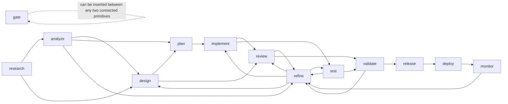
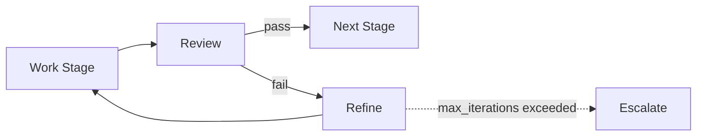
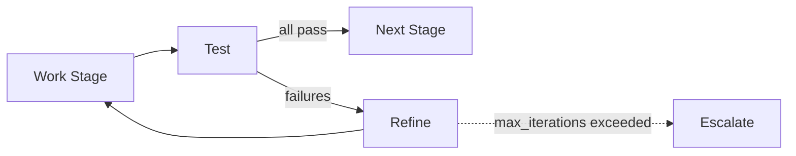
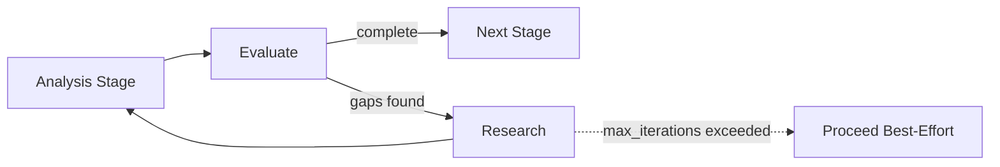
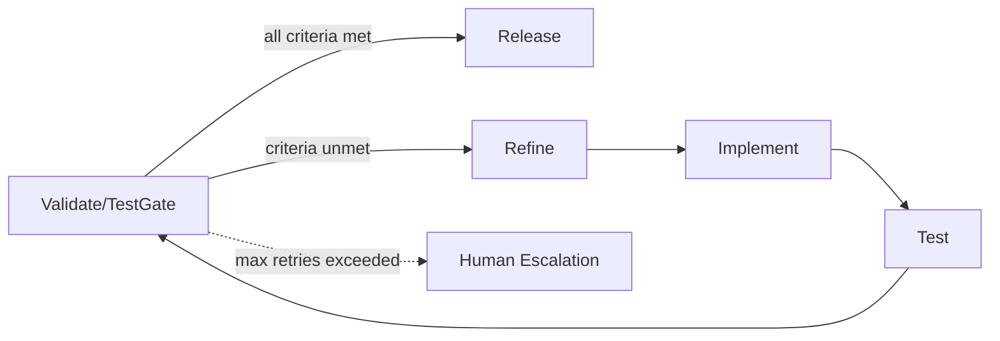
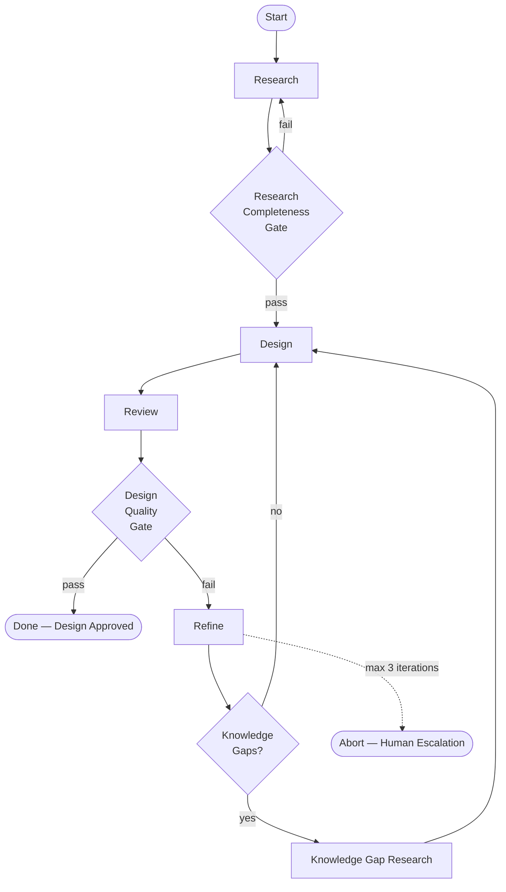
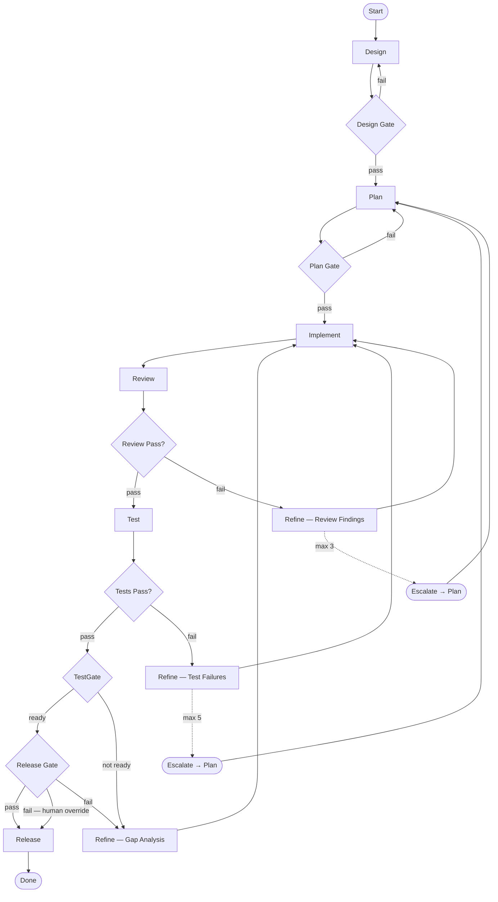
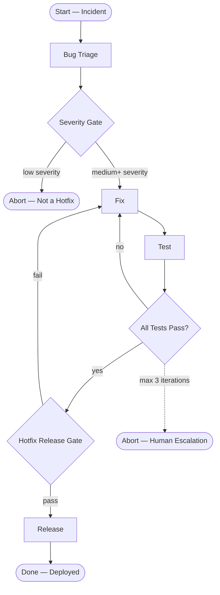

# Workflow Meta-Framework Design

> **Scope**: Composable stage primitive system, workflow template schema, template registry, and auto-recommendation engine.
> **Date**: 2026-04-04
> **Status**: Design Complete
> **Depends on**: wp1_frameworks_research.md (framework patterns), wp3_workflow_types.md (workflow type catalog)

---

## Table of Contents

1. [Design Philosophy](#1-design-philosophy)
2. [Stage Primitive Set](#2-stage-primitive-set)
3. [Stage Composability Model](#3-stage-composability-model)
4. [Workflow Template YAML Schema](#4-workflow-template-yaml-schema)
5. [Template Registry Mechanism](#5-template-registry-mechanism)
6. [Workflow Type Auto-Recommendation Logic](#6-workflow-type-auto-recommendation-logic)
7. [Complete Workflow Instance Definitions](#7-complete-workflow-instance-definitions)
8. [Cross-Cutting Concerns](#8-cross-cutting-concerns)

---

## 1. Design Philosophy

The meta-framework rests on four principles distilled from the framework research and workflow catalog:

1. **Primitives over monoliths.** Every workflow is a composition of a small, universal set of stage primitives. No workflow type is "special"—each is simply a different wiring of the same building blocks.

2. **Declarative templates, imperative execution.** Workflow authors declare *what* stages run and *how* they connect (YAML). The runtime engine decides *when* and *where* each stage executes. This separates concern: template design is a DAG-level activity; execution is a scheduler-level activity.

3. **Bounded iteration with escalation.** Every loop has a `max_iterations` ceiling and a `quality_threshold` exit condition. Exceeding the ceiling triggers scope escalation (retry at an earlier stage) or human escalation (pause with a divergence report). No infinite loops ever exist.

4. **Gate-as-first-class-citizen.** Quality gates are not implicit transitions—they are explicit, configurable nodes with typed pass/fail criteria. Gates can be auto-inserted between any two stages via template policy.

---

## 2. Stage Primitive Set

### 2.1 Primitive Catalog

The following 13 primitives are extracted from the 10 workflow types in the catalog. Every workflow type is expressible as a subset and composition of these primitives.

```
┌─────────────────────────────────────────────────────────────────────┐
│                     STAGE PRIMITIVE UNIVERSE                        │
├──────────┬───────────┬───────────┬───────────┬───────────┬─────────┤
│ DISCOVER │  SHAPE    │  BUILD    │  VERIFY   │  DELIVER  │ CONTROL │
├──────────┼───────────┼───────────┼───────────┼───────────┼─────────┤
│ research │ design    │ implement │ review    │ release   │ gate    │
│ analyze  │ plan      │ refine    │ test      │ deploy    │         │
│          │           │           │ validate  │ monitor   │         │
└──────────┴───────────┴───────────┴───────────┴───────────┴─────────┘
```

Each primitive is defined below with its full interface contract.

---

#### 2.1.1 `research`

| Property | Value |
|----------|-------|
| **Category** | Discover |
| **Purpose** | Gather information, survey prior art, benchmark alternatives, identify constraints |
| **Input type** | `ResearchRequest { question: string, scope: string[], evaluation_criteria: string[], source_hints: string[] }` |
| **Output type** | `ResearchReport { findings: Finding[], comparison_matrix: Matrix?, risk_assessment: Risk[], knowledge_gaps: string[] }` |
| **Preconditions** | Research question is defined; scope boundaries are set |
| **Postconditions** | Findings array is non-empty; knowledge_gaps identified (may be empty) |
| **Config params** | `depth: shallow | standard | comprehensive`, `source_types: [web, repo, paper, docs]`, `time_box_minutes: int` |
| **Default team** | Research |
| **Duration class** | Medium (15–45 min) to Long (45 min+) depending on `depth` |

---

#### 2.1.2 `analyze`

| Property | Value |
|----------|-------|
| **Category** | Discover |
| **Purpose** | Examine existing artifacts (code, metrics, logs, scans) to produce structured assessments |
| **Input type** | `AnalyzeRequest { targets: string[], analysis_type: enum[code, performance, security, dependency, documentation], baseline_metrics: Metrics? }` |
| **Output type** | `AnalysisReport { findings: AnalysisFinding[], hotspots: Hotspot[], priority_ranking: PrioritizedItem[], baseline_comparison: MetricDelta? }` |
| **Preconditions** | Target artifacts exist and are accessible |
| **Postconditions** | findings is non-empty; priority_ranking is sorted by severity × impact |
| **Config params** | `analysis_type: enum`, `severity_threshold: low | medium | high | critical`, `include_metrics: bool` |
| **Default team** | Research |
| **Duration class** | Medium (15–45 min) |

---

#### 2.1.3 `design`

| Property | Value |
|----------|-------|
| **Category** | Shape |
| **Purpose** | Synthesize inputs into a concrete design artifact: architecture, API spec, schema, or system specification |
| **Input type** | `DesignRequest { inputs: Artifact[], constraints: Constraint[], quality_requirements: QualityReq[], design_type: enum[architecture, api, schema, component, migration_plan] }` |
| **Output type** | `DesignDocument { diagrams: Diagram[], interfaces: InterfaceDef[], decisions: ADR[], trade_off_analysis: TradeOff[], specification: string }` |
| **Preconditions** | At least one input artifact exists (research report, requirements doc, etc.) |
| **Postconditions** | specification is non-empty; every input constraint is addressed in trade_off_analysis or decisions |
| **Config params** | `design_type: enum`, `formality: sketch | standard | formal`, `diagram_types: [mermaid, ascii, none]` |
| **Default team** | Design |
| **Duration class** | Medium (15–45 min) to Long (45 min+) |

---

#### 2.1.4 `plan`

| Property | Value |
|----------|-------|
| **Category** | Shape |
| **Purpose** | Decompose a design into implementable work units with ordering, estimates, and dependencies |
| **Input type** | `PlanRequest { design: DesignDocument, capacity_constraints: Capacity?, priority_rules: PriorityRule[] }` |
| **Output type** | `ImplementationPlan { waves: Wave[], dependency_matrix: DepMatrix, risk_register: Risk[], acceptance_criteria: Criterion[] }` |
| **Preconditions** | design is reviewed and approved (or gate-passed) |
| **Postconditions** | Every requirement maps to at least one task; dependency_matrix has no unresolvable cycles |
| **Config params** | `granularity: coarse | standard | fine`, `max_parallel_waves: int`, `estimate_unit: minutes | hours | story_points` |
| **Default team** | Design |
| **Duration class** | Medium (15–45 min) |

---

#### 2.1.5 `implement`

| Property | Value |
|----------|-------|
| **Category** | Build |
| **Purpose** | Execute plan tasks: write code, create tests, build config, produce artifacts |
| **Input type** | `ImplRequest { tasks: Task[], code_rules: CodeRule[], language_conventions: Convention[], existing_code_context: FileRef[] }` |
| **Output type** | `ImplResult { artifacts: Artifact[], files_changed: FileChange[], tests_written: TestRef[], build_status: enum[success, failure] }` |
| **Preconditions** | tasks list is non-empty; code_rules are loaded |
| **Postconditions** | Every task has at least one artifact; build_status is success |
| **Config params** | `test_strategy: tdd | test_after | no_test`, `code_style: string`, `target_coverage: float` |
| **Default team** | Implement |
| **Duration class** | Long (45 min+) — scales with task count |

---

#### 2.1.6 `review`

| Property | Value |
|----------|-------|
| **Category** | Verify |
| **Purpose** | Evaluate artifacts against quality criteria, standards, and requirements |
| **Input type** | `ReviewRequest { artifacts: Artifact[], checklist: ReviewChecklist, acceptance_criteria: Criterion[], review_type: enum[design, code, security, documentation] }` |
| **Output type** | `ReviewVerdict { decision: enum[pass, revise, reject], score: float, findings: ReviewFinding[], blocking_count: int, suggestion_count: int }` |
| **Preconditions** | artifacts is non-empty; checklist is defined |
| **Postconditions** | decision is set; every finding has a severity classification |
| **Config params** | `review_type: enum`, `pass_threshold: float (0.0–1.0)`, `require_zero_blocking: bool`, `reviewer_count: int` |
| **Default team** | Review |
| **Duration class** | Medium (15–45 min) |

---

#### 2.1.7 `test`

| Property | Value |
|----------|-------|
| **Category** | Verify |
| **Purpose** | Execute automated test suites and produce structured results |
| **Input type** | `TestRequest { code_refs: FileRef[], test_suites: enum[unit, integration, e2e, performance, security][], coverage_threshold: float }` |
| **Output type** | `TestResult { suite_results: SuiteResult[], pass_rate: float, coverage: float, failures: TestFailure[], performance_metrics: PerfMetric? }` |
| **Preconditions** | Code compiles / lints clean; test infrastructure is available |
| **Postconditions** | Every requested suite has a result entry |
| **Config params** | `suites: enum[]`, `coverage_threshold: float`, `timeout_per_suite: int`, `fail_fast: bool` |
| **Default team** | Test |
| **Duration class** | Medium (15–45 min) |

---

#### 2.1.8 `validate`

| Property | Value |
|----------|-------|
| **Category** | Verify |
| **Purpose** | Aggregate verification results (review + test + metrics) into a readiness verdict — the generalized quality checkpoint |
| **Input type** | `ValidateRequest { review_verdict: ReviewVerdict?, test_result: TestResult?, acceptance_criteria: Criterion[], quality_thresholds: ThresholdSet }` |
| **Output type** | `ValidationReport { ready: bool, unmet_criteria: Criterion[], metric_summary: MetricSummary, gap_analysis: GapItem[] }` |
| **Preconditions** | At least one of review_verdict or test_result is provided |
| **Postconditions** | ready is deterministic (no maybe); every unmet criterion has a gap_analysis entry |
| **Config params** | `require_all_criteria: bool`, `allow_waivers: bool`, `waiver_authority: enum[auto, human]` |
| **Default team** | Review |
| **Duration class** | Quick (<15 min) |

---

#### 2.1.9 `refine`

| Property | Value |
|----------|-------|
| **Category** | Build |
| **Purpose** | Address findings from review/test/validate — fix bugs, resolve review comments, improve quality |
| **Input type** | `RefineRequest { findings: Finding[], original_artifacts: Artifact[], refine_scope: enum[targeted, broad] }` |
| **Output type** | `RefineResult { updated_artifacts: Artifact[], changelog: ChangeEntry[], unresolved: Finding[] }` |
| **Preconditions** | findings is non-empty |
| **Postconditions** | Every finding is either resolved (in changelog) or explicitly listed in unresolved with a reason |
| **Config params** | `scope: targeted | broad`, `allow_new_features: bool (default false)`, `max_file_changes: int` |
| **Default team** | Implement (for code refine) or Design (for design refine) |
| **Duration class** | Medium (15–45 min) |

---

#### 2.1.10 `release`

| Property | Value |
|----------|-------|
| **Category** | Deliver |
| **Purpose** | Package, tag, and publish artifacts — create releases, update changelogs, cut versions |
| **Input type** | `ReleaseRequest { artifacts: Artifact[], version_strategy: enum[semver, calver, manual], changelog_template: string?, target_environments: string[] }` |
| **Output type** | `ReleaseRecord { version: string, tag: string, changelog: string, artifacts_published: ArtifactRef[], deployment_status: DeployStatus? }` |
| **Preconditions** | All quality gates have passed; changelog is drafted |
| **Postconditions** | version tag is created; changelog is non-empty |
| **Config params** | `version_strategy: enum`, `environments: string[]`, `require_human_approval: bool`, `draft_mode: bool` |
| **Default team** | Implement |
| **Duration class** | Quick (<15 min) to Medium (15–45 min) |

---

#### 2.1.11 `deploy`

| Property | Value |
|----------|-------|
| **Category** | Deliver |
| **Purpose** | Deploy released artifacts to target environments |
| **Input type** | `DeployRequest { release: ReleaseRecord, environment: string, strategy: enum[rolling, blue_green, canary, immediate], rollback_plan: string }` |
| **Output type** | `DeployResult { environment: string, status: enum[success, failed, rolled_back], health_check: HealthCheck, rollback_available: bool }` |
| **Preconditions** | release exists and is valid; environment is accessible |
| **Postconditions** | status is set; health_check is executed |
| **Config params** | `strategy: enum`, `health_check_timeout: int`, `auto_rollback_on_failure: bool`, `canary_percentage: float` |
| **Default team** | Implement |
| **Duration class** | Medium (15–45 min) |

---

#### 2.1.12 `monitor`

| Property | Value |
|----------|-------|
| **Category** | Deliver |
| **Purpose** | Post-deploy observation — watch metrics, detect anomalies, confirm stability |
| **Input type** | `MonitorRequest { deployment: DeployResult, watch_metrics: MetricDef[], anomaly_thresholds: Threshold[], duration_minutes: int }` |
| **Output type** | `MonitorReport { status: enum[stable, degraded, critical], anomalies: Anomaly[], metric_snapshots: MetricSnapshot[], recommendation: enum[proceed, rollback, investigate] }` |
| **Preconditions** | deployment status is success |
| **Postconditions** | At least one metric_snapshot captured; recommendation is set |
| **Config params** | `duration_minutes: int`, `check_interval_seconds: int`, `alert_on_degraded: bool` |
| **Default team** | Test |
| **Duration class** | Long (45 min+) — driven by `duration_minutes` |

---

#### 2.1.13 `gate`

| Property | Value |
|----------|-------|
| **Category** | Control |
| **Purpose** | Explicit quality checkpoint that blocks progression unless criteria are met. Gates are not work-producing — they evaluate existing outputs. |
| **Input type** | `GateRequest { criteria: GateCriterion[], inputs: Record<string, any> }` |
| **Output type** | `GateResult { passed: bool, criteria_results: CriterionResult[], blocking_failures: string[] }` |
| **Preconditions** | All referenced inputs exist |
| **Postconditions** | Every criterion has a result; passed is deterministic |
| **Config params** | `criteria: GateCriterion[]`, `on_fail: enum[loop_back, escalate, block]`, `loop_back_target: string?`, `require_human_override: bool` |
| **Default team** | (none — evaluated by the orchestrator) |
| **Duration class** | Quick (<15 min) |

### 2.2 Primitive Dependency Lattice

Not every primitive can follow every other. The lattice below defines valid direct-successor relationships. Any edge not shown requires an intermediate primitive or an explicit `skip` annotation.



The lattice is not enforced rigidly — it serves as a guidance model. Templates may override it with explicit `allow_transition` annotations when domain-specific sequencing is needed.

### 2.3 Alias Mapping

Several workflow types in the catalog use domain-specific stage names that are aliases of the universal primitives:

| Workflow-Specific Name | Maps To Primitive | Workflow Type |
|------------------------|-------------------|---------------|
| bug-triage | analyze | hotfix |
| fix | implement + refine | hotfix |
| compare | analyze | research-only |
| report | validate + release | research-only |
| requirements | analyze | design-only |
| document | release | design-only |
| refactor | implement | refactoring |
| verify | validate | refactoring, security-audit |
| assess | analyze | migration |
| migrate | implement | migration |
| cutover | deploy | migration |
| hypothesis | research | spike-poc |
| prototype | implement | spike-poc |
| evaluate | review + validate | spike-poc |
| decide | gate | spike-poc |
| audit | analyze | documentation-only |
| write | implement | documentation-only |
| publish | release + deploy | documentation-only |
| scan | analyze | security-audit |
| prioritize | plan | security-audit |
| profile | analyze | performance-optimization |
| optimize | implement | performance-optimization |
| benchmark | test | performance-optimization |
| scope | analyze | feature-enhancement |
| testgate | gate + validate | full-pipeline |

---

## 3. Stage Composability Model

### 3.1 Composition Operators

Five operators are sufficient to express every workflow type in the catalog. The notation is inspired by process algebra (CSP/CCS) adapted for YAML readability.

#### Operator 1: `sequence` (→)

Execute stages in strict order. Output of stage N becomes available as input to stage N+1.

**Notation**: `A → B → C`
**YAML**:
```yaml
compose: sequence
stages: [A, B, C]
```

**Semantics**: `start(B)` requires `completed(A)`. State flows forward only.

---

#### Operator 2: `parallel` (||)

Execute stages concurrently. All must complete before the join point.

**Notation**: `(A || B || C) → D`
**YAML**:
```yaml
compose: parallel
stages: [A, B, C]
join: all            # all | any | n_of(2)
```

**Semantics**: All stages receive the same input snapshot. Outputs are merged at the join point. Conflict resolution: last-writer-wins on overlapping keys, or explicit merge strategy.

**Join strategies**:
- `all` — wait for every branch (default)
- `any` — proceed when first branch completes, cancel others
- `n_of(k)` — proceed when k branches complete

---

#### Operator 3: `choice` (⊕)

Conditional branch: evaluate a predicate, execute one of two paths.

**Notation**: `if P then A else B`
**YAML**:
```yaml
compose: choice
condition: "review.decision == 'pass'"
if_true:
  stage: release
if_false:
  stage: refine
```

**Semantics**: Exactly one branch executes. The predicate references state fields using dot-notation. Supports compound predicates with `and`, `or`, `not`.

---

#### Operator 4: `loop` (↻)

Repeat a body until a termination condition is met or max iterations are exhausted.

**Notation**: `repeat { A → B } until P, max N`
**YAML**:
```yaml
compose: loop
name: review_refine_cycle
body:
  compose: sequence
  stages: [review, refine]
until: "review.decision == 'pass'"
max_iterations: 3
on_exhaustion: escalate     # escalate | abort | continue
escalation_target: plan     # which earlier stage to fall back to
```

**Semantics**: The body executes repeatedly. After each iteration, `until` is evaluated. If true, the loop exits and control passes to the next stage. If `max_iterations` is reached without the condition being met, `on_exhaustion` determines behavior:
- `escalate` — loop back to `escalation_target` (an earlier stage)
- `abort` — halt the workflow with a divergence report for human review
- `continue` — exit the loop and proceed despite unmet condition (used for best-effort flows)

---

#### Operator 5: `gate` (⊣)

Insert a quality checkpoint. A gate is not a work-producing stage — it evaluates existing state against criteria.

**Notation**: `A ⊣[criteria] B`
**YAML**:
```yaml
compose: gate
name: release_readiness
criteria:
  - field: test_result.pass_rate
    operator: ">="
    value: 1.0
  - field: test_result.coverage
    operator: ">="
    value: 0.80
  - field: review_verdict.blocking_count
    operator: "=="
    value: 0
on_pass: release
on_fail:
  compose: sequence
  stages: [refine, implement]
  loop_back_to: test      # re-enter the pipeline at this point after remediation
```

**Semantics**: All criteria are evaluated against current state. If all pass, control flows to `on_pass`. Otherwise, `on_fail` executes, followed by re-entry at `loop_back_to`.

### 3.2 Composition Nesting

Operators nest arbitrarily. A `sequence` can contain a `loop` whose body contains a `parallel` block with a `choice` inside. This nesting is how complex workflows are built from simple parts.

Example — the full-pipeline review-test cycle expressed in nested composition:

```yaml
compose: sequence
stages:
  - design
  - plan
  - compose: loop
    name: impl_cycle
    body:
      compose: sequence
      stages:
        - implement
        - compose: loop
          name: review_refine
          body:
            compose: sequence
            stages:
              - review
              - compose: choice
                condition: "review.decision == 'pass'"
                if_true: { break: true }
                if_false: { stage: refine }
          until: "review.decision == 'pass'"
          max_iterations: 3
          on_exhaustion: escalate
          escalation_target: plan
        - compose: loop
          name: test_fix
          body:
            compose: sequence
            stages:
              - compose: parallel
                stages: [test]
                join: all
              - compose: choice
                condition: "test_result.pass_rate == 1.0"
                if_true: { break: true }
                if_false: { stage: refine }
          until: "test_result.pass_rate == 1.0"
          max_iterations: 5
          on_exhaustion: escalate
          escalation_target: plan
    until: "false"
    max_iterations: 2
  - compose: gate
    name: testgate
    criteria:
      - { field: test_result.pass_rate, operator: ">=", value: 1.0 }
      - { field: test_result.coverage, operator: ">=", value: 0.80 }
      - { field: review_verdict.blocking_count, operator: "==", value: 0 }
    on_pass: release
    on_fail:
      compose: sequence
      stages: [refine, implement]
      loop_back_to: test_fix
```

### 3.3 Formal Grammar (BNF-like)

For reference, the composition language can be described by this grammar:

```
Workflow   ::= Template Stage+
Stage      ::= Primitive | Composed
Composed   ::= Sequence | Parallel | Choice | Loop | Gate
Sequence   ::= 'sequence' '[' Stage (',' Stage)+ ']'
Parallel   ::= 'parallel' '[' Stage (',' Stage)+ ']' JoinStrategy
Choice     ::= 'choice' Predicate Stage Stage
Loop       ::= 'loop' Name Stage Predicate MaxIter OnExhaustion
Gate       ::= 'gate' Name Criterion+ Stage Stage

Primitive  ::= 'research' | 'analyze' | 'design' | 'plan'
             | 'implement' | 'review' | 'test' | 'validate'
             | 'refine' | 'release' | 'deploy' | 'monitor' | 'gate'

Predicate  ::= FieldRef Operator Value
             | Predicate 'and' Predicate
             | Predicate 'or' Predicate
             | 'not' Predicate

JoinStrategy ::= 'all' | 'any' | 'n_of(' Int ')'
OnExhaustion ::= 'escalate' StageRef | 'abort' | 'continue'
```

### 3.4 Composition Diagrams for Key Patterns

#### Pattern A: Quality Loop (Review-Refine)



#### Pattern B: Correctness Loop (Test-Fix)



#### Pattern C: Knowledge Loop (Evaluate-Investigate)



#### Pattern D: Gate-Guarded Release



---

## 4. Workflow Template YAML Schema

### 4.1 Schema Definition

Every workflow template is a YAML file conforming to this schema. The schema is versioned — the `schema_version` field enables forward-compatible evolution.

```yaml
# ============================================================
# workflow-template.yaml — Schema v1.0
# ============================================================

schema_version: "1.0"

# ---- Template Metadata ----
metadata:
  name: string                          # unique identifier (kebab-case)
  version: string                       # semver
  display_name: string                  # human-readable name
  description: string                   # what this workflow does
  category: enum                        # discover | shape | build | deliver | composite
  applicable_scenarios:                 # when to use this template
    - string
  tags:                                 # for discovery and recommendation
    - string
  author: string?                       # optional: who created this template
  created: date?
  updated: date?

# ---- Stage Definitions ----
# Each stage is an instance of a primitive with configuration overrides.
stages:
  - id: string                          # unique within this template
    primitive: enum                     # one of the 13 universal primitives
    alias: string?                      # domain-specific name (e.g., "bug-triage" for analyze)
    description: string?                # what this stage does in this workflow context
    team: enum                          # research | design | implement | test | review
    duration_class: enum                # quick | medium | long
    config:                             # primitive-specific configuration
      <<: any                           # keys depend on the primitive type
    input_mapping:                      # how inputs are sourced from prior stage outputs
      <<field>>: "<<stage_id>>.<<output_field>>"
    skip_condition: string?             # predicate — if true, stage is skipped
    timeout_minutes: int?               # hard timeout for this stage instance

# ---- Composition ----
# Defines how stages are wired together.
composition:
  <<: CompositionNode                   # any valid composition (sequence, parallel, etc.)

# ---- Loops ----
# Named loop definitions referenced by composition nodes.
loops:
  - name: string                        # matches compose.loop.name
    body_stages: [string]               # stage ids in the loop body
    until: string                       # predicate for exit
    max_iterations: int                 # hard ceiling
    quality_threshold: float?           # alternative exit: score-based
    on_exhaustion: enum                 # escalate | abort | continue
    escalation_target: string?          # stage id to fall back to
    escalation_max: int?                # max escalation attempts before abort

# ---- Gates ----
# Named gate definitions.
gates:
  - name: string
    position: string                    # "after:<<stage_id>>" or "before:<<stage_id>>"
    criteria:
      - field: string                   # dot-notation path into state
        operator: enum                  # ==, !=, >, >=, <, <=, in, not_in, exists
        value: any
    on_pass: string                     # stage id or "next" (continue to next stage)
    on_fail:
      action: enum                      # loop_back | escalate | abort
      target: string?                   # stage id for loop_back
    require_human_override: bool        # if true, gate failure pauses for human decision
    auto_insert: bool                   # if true, this gate pattern is auto-applied

# ---- Team Mappings ----
# Override default primitive→team assignments for this template.
team_overrides:
  <<stage_id>>: enum                    # research | design | implement | test | review

# ---- Environment Modes ----
# Behavior adjustments per deployment context.
environment_modes:
  local:
    skip_stages: [string]?              # stages to skip in local mode
    gate_overrides: {}?                 # relaxed gate criteria for local
  github:
    extra_stages: [string]?             # additional stages for github repos
    gate_overrides: {}?
  gitlab:
    extra_stages: [string]?
    gate_overrides: {}?
```

### 4.2 CompositionNode Sub-Schema

```yaml
# A CompositionNode is one of:
CompositionNode:
  # Option 1: Single stage reference
  stage: string                         # stage id

  # Option 2: Sequence
  compose: sequence
  stages: [CompositionNode]

  # Option 3: Parallel
  compose: parallel
  stages: [CompositionNode]
  join: enum                            # all | any | n_of(k)

  # Option 4: Choice
  compose: choice
  condition: string                     # predicate
  if_true: CompositionNode
  if_false: CompositionNode

  # Option 5: Loop reference
  compose: loop
  ref: string                           # name of a loop defined in `loops` section

  # Option 6: Gate reference
  compose: gate
  ref: string                           # name of a gate defined in `gates` section

  # Option 7: Break (within a loop body)
  break: true                           # exit enclosing loop
```

### 4.3 State Schema

The workflow runtime maintains a typed state dictionary that accumulates outputs from every completed stage. Stages read from and write to this state.

```yaml
state:
  # Auto-populated by runtime
  _workflow_id: string
  _template: string
  _current_stage: string
  _iteration_counts: { <<loop_name>>: int }
  _started_at: datetime
  _stage_history: [{ stage: string, started: datetime, completed: datetime, status: enum }]

  # Populated by stage outputs (examples)
  research_report: ResearchReport?
  analysis_report: AnalysisReport?
  design_document: DesignDocument?
  implementation_plan: ImplementationPlan?
  impl_result: ImplResult?
  review_verdict: ReviewVerdict?
  test_result: TestResult?
  validation_report: ValidationReport?
  refine_result: RefineResult?
  release_record: ReleaseRecord?
  deploy_result: DeployResult?
  monitor_report: MonitorReport?
  gate_results: { <<gate_name>>: GateResult }
```

### 4.4 Example Templates

Three complete examples follow, demonstrating increasing complexity.

#### Example 1: Research-Only Workflow

```yaml
schema_version: "1.0"

metadata:
  name: research-only
  version: "1.0.0"
  display_name: "Research Only"
  description: "Gather information, compare alternatives, produce a structured report."
  category: discover
  applicable_scenarios:
    - "Technology evaluation and comparison"
    - "Literature survey for a design decision"
    - "Competitive analysis"
    - "Feasibility assessment"
  tags: [research, compare, evaluate, survey, analysis]

stages:
  - id: research
    primitive: research
    description: "Gather information from multiple sources"
    team: research
    duration_class: long
    config:
      depth: comprehensive
      source_types: [web, repo, paper, docs]

  - id: compare
    primitive: analyze
    alias: compare
    description: "Analyze and compare findings against evaluation criteria"
    team: research
    duration_class: medium
    config:
      analysis_type: dependency
      include_metrics: true
    input_mapping:
      targets: "research.findings"

  - id: report
    primitive: validate
    alias: report
    description: "Synthesize comparison into a structured report with recommendations"
    team: research
    duration_class: medium
    input_mapping:
      test_result: null
      review_verdict: null
      acceptance_criteria: "_template.acceptance_criteria"

composition:
  compose: sequence
  stages:
    - compose: loop
      ref: knowledge_loop
    - stage: report

loops:
  - name: knowledge_loop
    body_stages: [research, compare]
    until: "compare.findings | length > 0 and compare.priority_ranking | has_no_gaps"
    max_iterations: 3
    on_exhaustion: continue
    quality_threshold: null

gates: []

environment_modes:
  local:
    skip_stages: []
  github:
    extra_stages: []
```

#### Example 2: Hotfix Workflow

```yaml
schema_version: "1.0"

metadata:
  name: hotfix
  version: "1.0.0"
  display_name: "Hotfix"
  description: "Rapid bug triage, minimal fix, focused test, fast-track release."
  category: build
  applicable_scenarios:
    - "Production bug causing user-visible impact"
    - "Security vulnerability requiring immediate patch"
    - "Critical dependency update (CVE)"
  tags: [bug, fix, hotfix, patch, incident, production, urgent]

stages:
  - id: bug_triage
    primitive: analyze
    alias: bug-triage
    description: "Assess severity, identify root cause, determine fix scope"
    team: implement
    duration_class: quick
    config:
      analysis_type: code
      severity_threshold: high

  - id: fix
    primitive: implement
    alias: fix
    description: "Implement the minimal targeted fix — no refactoring, no features"
    team: implement
    duration_class: medium
    config:
      test_strategy: test_after
      code_style: minimal_diff
    input_mapping:
      tasks: "bug_triage.findings"

  - id: test
    primitive: test
    description: "Run focused test suite — smoke + affected-area + regression"
    team: test
    duration_class: medium
    config:
      suites: [unit, integration]
      fail_fast: true
      coverage_threshold: 0.0
    input_mapping:
      code_refs: "fix.files_changed"

  - id: release
    primitive: release
    description: "Fast-track deployment with rollback readiness"
    team: implement
    duration_class: quick
    config:
      version_strategy: semver
      require_human_approval: false
      draft_mode: false

composition:
  compose: sequence
  stages:
    - stage: bug_triage
    - compose: loop
      ref: test_fix_loop
    - stage: release

loops:
  - name: test_fix_loop
    body_stages: [fix, test]
    until: "test.pass_rate == 1.0"
    max_iterations: 3
    on_exhaustion: abort
    escalation_target: null

gates:
  - name: severity_gate
    position: "after:bug_triage"
    criteria:
      - field: bug_triage.findings
        operator: "exists"
        value: true
      - field: bug_triage.findings[0].severity
        operator: "in"
        value: [critical, high, medium]
    on_pass: "next"
    on_fail:
      action: abort
    require_human_override: false
    auto_insert: false

environment_modes:
  local:
    skip_stages: [release]
    gate_overrides:
      severity_gate:
        criteria:
          - field: bug_triage.findings
            operator: "exists"
            value: true
  github:
    extra_stages: []
```

#### Example 3: Full Pipeline Workflow

```yaml
schema_version: "1.0"

metadata:
  name: full-pipeline
  version: "1.0.0"
  display_name: "Full Pipeline"
  description: "Complete development lifecycle: design through release with review and test gates."
  category: composite
  applicable_scenarios:
    - "Greenfield feature development"
    - "Major system changes"
    - "New project initialization"
  tags: [full, pipeline, feature, implementation, release, design, test]

stages:
  - id: design
    primitive: design
    team: design
    duration_class: long
    config:
      formality: standard
      diagram_types: [mermaid]

  - id: plan
    primitive: plan
    team: design
    duration_class: medium
    config:
      granularity: standard
      max_parallel_waves: 3
    input_mapping:
      design: "design"

  - id: impl
    primitive: implement
    team: implement
    duration_class: long
    config:
      test_strategy: tdd
      target_coverage: 0.80
    input_mapping:
      tasks: "plan.waves"

  - id: review
    primitive: review
    team: review
    duration_class: medium
    config:
      review_type: code
      pass_threshold: 0.80
      require_zero_blocking: true
    input_mapping:
      artifacts: "impl.artifacts"

  - id: test
    primitive: test
    team: test
    duration_class: medium
    config:
      suites: [unit, integration, e2e]
      coverage_threshold: 0.80
      fail_fast: false
    input_mapping:
      code_refs: "impl.files_changed"

  - id: refine
    primitive: refine
    team: implement
    duration_class: medium
    config:
      scope: targeted
      allow_new_features: false
    input_mapping:
      findings: "review.findings + test.failures"

  - id: testgate
    primitive: gate
    alias: testgate
    team: review
    duration_class: quick
    config:
      criteria:
        - { field: test.pass_rate, operator: ">=", value: 1.0 }
        - { field: test.coverage, operator: ">=", value: 0.80 }
        - { field: review.blocking_count, operator: "==", value: 0 }

  - id: release
    primitive: release
    team: implement
    duration_class: medium
    config:
      version_strategy: semver
      require_human_approval: true

composition:
  compose: sequence
  stages:
    - stage: design
    - compose: gate
      ref: design_gate
    - stage: plan
    - compose: loop
      ref: impl_cycle
    - compose: gate
      ref: release_gate
    - stage: release

loops:
  - name: impl_cycle
    body_stages: [impl, review, test, refine]
    until: "review.decision == 'pass' and test.pass_rate == 1.0"
    max_iterations: 3
    on_exhaustion: escalate
    escalation_target: plan
    escalation_max: 1

  - name: review_refine
    body_stages: [review, refine]
    until: "review.decision == 'pass'"
    max_iterations: 3
    on_exhaustion: escalate
    escalation_target: plan

  - name: test_fix
    body_stages: [test, refine]
    until: "test.pass_rate == 1.0"
    max_iterations: 5
    on_exhaustion: escalate
    escalation_target: plan

gates:
  - name: design_gate
    position: "after:design"
    criteria:
      - field: design.specification
        operator: "exists"
        value: true
      - field: design.decisions
        operator: "!="
        value: []
    on_pass: "next"
    on_fail:
      action: loop_back
      target: design
    require_human_override: false
    auto_insert: true

  - name: release_gate
    position: "before:release"
    criteria:
      - field: test.pass_rate
        operator: ">="
        value: 1.0
      - field: test.coverage
        operator: ">="
        value: 0.80
      - field: review.blocking_count
        operator: "=="
        value: 0
    on_pass: "next"
    on_fail:
      action: loop_back
      target: refine
    require_human_override: true
    auto_insert: true

environment_modes:
  local:
    skip_stages: [release]
    gate_overrides:
      release_gate:
        criteria:
          - field: test.pass_rate
            operator: ">="
            value: 0.95
  github:
    extra_stages: []
  gitlab:
    extra_stages: []
```

---

## 5. Template Registry Mechanism

### 5.1 Directory Structure

Templates are organized in a layered directory under the workflow system root:

```
.workflow/
├── registry.yaml                    # master index of all templates
├── templates/
│   ├── builtin/                     # shipped with the framework — read-only
│   │   ├── research-only.yaml
│   │   ├── design-only.yaml
│   │   ├── hotfix.yaml
│   │   ├── refactoring.yaml
│   │   ├── migration.yaml
│   │   ├── spike-poc.yaml
│   │   ├── documentation-only.yaml
│   │   ├── security-audit.yaml
│   │   ├── feature-enhancement.yaml
│   │   ├── performance-optimization.yaml
│   │   ├── research-design-review-refine.yaml
│   │   └── full-pipeline.yaml
│   ├── custom/                      # user-defined templates
│   │   └── (user templates here)
│   └── derived/                     # templates derived from builtins with overrides
│       └── (derived templates here)
├── primitives/
│   └── schemas/                     # JSON Schema for each primitive's input/output
│       ├── research.schema.json
│       ├── analyze.schema.json
│       ├── design.schema.json
│       ├── plan.schema.json
│       ├── implement.schema.json
│       ├── review.schema.json
│       ├── test.schema.json
│       ├── validate.schema.json
│       ├── refine.schema.json
│       ├── release.schema.json
│       ├── deploy.schema.json
│       ├── monitor.schema.json
│       └── gate.schema.json
└── state/
    └── (runtime state files for active workflows)
```

### 5.2 Registry Index (`registry.yaml`)

```yaml
schema_version: "1.0"
last_updated: "2026-04-04T00:00:00Z"

templates:
  # Built-in templates
  - name: research-only
    path: templates/builtin/research-only.yaml
    source: builtin
    version: "1.0.0"
    category: discover
    tags: [research, compare, evaluate]

  - name: hotfix
    path: templates/builtin/hotfix.yaml
    source: builtin
    version: "1.0.0"
    category: build
    tags: [bug, fix, hotfix, patch, urgent]

  # ... (one entry per template)

  # User-defined templates
  - name: my-team-review
    path: templates/custom/my-team-review.yaml
    source: custom
    version: "0.1.0"
    category: composite
    tags: [review, custom]

  # Derived templates (inherit + override)
  - name: full-pipeline-no-deploy
    path: templates/derived/full-pipeline-no-deploy.yaml
    source: derived
    base: full-pipeline
    version: "1.0.0"
    category: composite
    tags: [pipeline, local, no-deploy]
```

### 5.3 Discovery Mechanism

The runtime resolves templates through a priority chain:

```
1. Exact name match    → registry.yaml lookup by `name`
2. Tag search          → registry.yaml filtered by `tags` intersection
3. Category filter     → registry.yaml filtered by `category`
4. File system scan    → walk templates/ directories for .yaml files not yet indexed
5. Auto-recommendation → intent detection from user task description (Section 6)
```

Discovery order for name collisions:

```
custom/ > derived/ > builtin/
```

User-defined templates shadow builtins of the same name. This allows users to override framework defaults without modifying the builtin directory.

### 5.4 Template Derivation (Inheritance)

A derived template extends a base template, overriding or extending specific fields:

```yaml
schema_version: "1.0"

metadata:
  name: full-pipeline-local
  version: "1.0.0"
  display_name: "Full Pipeline (Local)"
  description: "Full pipeline adapted for local-only development — no release or deploy."

# Inherit from base template
extends: full-pipeline

# Override specific fields
overrides:
  stages:
    release:
      skip_condition: "true"     # always skip release in this variant
    impl:
      config:
        test_strategy: test_after  # relax TDD requirement for local
  gates:
    release_gate:
      criteria:
        - field: test.pass_rate
          operator: ">="
          value: 0.90             # lower threshold for local
  environment_modes:
    local:
      skip_stages: [release, deploy, monitor]
```

### 5.5 Versioning Strategy

Templates follow semantic versioning:
- **Major**: Breaking changes to stage composition or gate semantics
- **Minor**: New optional stages, relaxed constraints, new config parameters
- **Patch**: Description updates, threshold adjustments, bug fixes

The registry records the version and the runtime validates that the template's `schema_version` is compatible with the engine version.

Active workflow instances pin to a specific template version — template updates do not affect running workflows.

---

## 6. Workflow Type Auto-Recommendation Logic

### 6.1 Architecture

The recommendation engine is a three-stage pipeline:

```
┌──────────────┐    ┌─────────────────┐    ┌──────────────────┐
│ Intent       │───▸│ Candidate       │───▸│ Confidence       │
│ Detection    │    │ Scoring         │    │ Ranking          │
└──────────────┘    └─────────────────┘    └──────────────────┘
```

### 6.2 Intent Detection

The first stage extracts signal tokens from the user's task description and matches them against workflow keyword sets.

#### Keyword-to-Workflow Mapping Table

| Workflow Type | Primary Keywords (weight 1.0) | Secondary Keywords (weight 0.5) | Negative Keywords (weight -0.5) |
|---------------|-------------------------------|----------------------------------|--------------------------------|
| `research-only` | research, compare, evaluate, survey, investigate, benchmark, analysis | alternatives, options, tradeoffs, pros cons | implement, build, code, deploy |
| `design-only` | design, architect, schema, API spec, wireframe, interface contract | specification, blueprint, diagram | code, deploy, fix, test |
| `hotfix` | fix bug, broken, error, crash, incident, SEV1, SEV2, regression, hotfix | production, urgent, patch, emergency | design, research, plan, feature |
| `refactoring` | refactor, clean up, tech debt, improve code, restructure, simplify | complexity, coupling, duplication, smell | new feature, new project, deploy |
| `migration` | migrate, upgrade, move to, replace, convert, port, transition | legacy, deprecated, new version, compatibility | fix bug, research only |
| `spike-poc` | try, experiment, prototype, is it possible, spike, proof of concept, explore feasibility | risk, unknown, evaluate technology | production, deploy, release |
| `documentation-only` | document, write docs, update readme, API reference, tutorial, guide | onboarding, changelog, release notes | implement, code, fix |
| `security-audit` | security, vulnerability, audit, CVE, penetration, compliance, SAST, DAST | threat, risk assessment, remediate | new feature, design |
| `feature-enhancement` | add to existing, extend, enhance, new endpoint, additional option | modify, expand, improve | new project, from scratch |
| `performance-optimization` | slow, performance, optimize, bottleneck, latency, throughput, memory | profile, benchmark, cache, SLA, SLO | new feature, design |
| `research-design-review-refine` | design with research, architecture decision, system design, research then design | ADR, design review, iterate design | implement, code, deploy |
| `full-pipeline` | build from scratch, new project, implement feature, full development, end to end | greenfield, complete lifecycle | research only, docs only |

#### Heuristic Rules (applied after keyword matching)

```python
rules = [
    # R1: Urgency signals override toward hotfix
    ("contains(urgent, immediately, ASAP, production down)", "hotfix", boost=0.3),

    # R2: "from scratch" or "new project" strongly indicates full pipeline
    ("contains(from scratch, new project, greenfield)", "full-pipeline", boost=0.4),

    # R3: Question-form phrasing indicates research
    ("starts_with(what, how, which, should we, can we)", "research-only", boost=0.2),

    # R4: Multiple concerns → default to full pipeline
    ("keyword_matches >= 3 workflow types", "full-pipeline", boost=0.1),

    # R5: Explicit workflow type mention → direct match
    ("contains_workflow_type_name(task)", "<<matched_type>>", boost=1.0),
]
```

### 6.3 Candidate Scoring

For each workflow type, compute a composite score:

```
score(workflow_type) =
    Σ (primary_keyword_matches × 1.0)
  + Σ (secondary_keyword_matches × 0.5)
  + Σ (negative_keyword_matches × -0.5)
  + Σ (heuristic_rule_boosts)
```

Normalize scores to a 0.0–1.0 range by dividing by the maximum possible score for that workflow type.

### 6.4 Confidence Ranking

Map normalized scores to confidence levels:

| Score Range | Confidence | Behavior |
|-------------|------------|----------|
| 0.8 – 1.0 | **High** | Auto-select. Present recommendation with brief rationale. |
| 0.5 – 0.79 | **Medium** | Present top 2-3 candidates. Ask user to confirm. |
| 0.2 – 0.49 | **Low** | Present all candidates above threshold. Explain trade-offs. Require explicit selection. |
| < 0.2 | **None** | Default to `full-pipeline` as safe fallback. Explain that no strong match was found. |

### 6.5 User Override

The user can override the recommendation at any point:

```yaml
# In a task description or interactive prompt
workflow:
  type: hotfix                  # explicit selection
  override_reason: "I know this looks like a feature but it's a targeted fix"
```

Override is always respected. The engine logs the recommendation vs. actual selection for future heuristic tuning.

### 6.6 Example Mappings

| User Task Description | Detected Keywords | Top Match | Score | Confidence |
|----------------------|-------------------|-----------|-------|------------|
| "fix a bug in the login page" | fix, bug | hotfix | 0.95 | High |
| "design a new API for user management" | design, API | design-only | 0.85 | High |
| "design a new system with research" | design, research, system design | research-design-review-refine | 0.90 | High |
| "research the best TUI framework for Rust" | research, best, framework, compare | research-only | 0.92 | High |
| "build a complete authentication system from scratch" | build, from scratch, complete, system | full-pipeline | 0.88 | High |
| "improve performance of the query engine" | performance, improve, optimize | performance-optimization | 0.80 | High |
| "refactor the database layer for better separation" | refactor, improve, separation | refactoring | 0.85 | High |
| "migrate from MySQL to PostgreSQL" | migrate, from, to | migration | 0.90 | High |
| "try using WebSockets instead of polling" | try, experiment, instead | spike-poc | 0.75 | Medium |
| "update the README and add API docs" | update, docs, README, API | documentation-only | 0.88 | High |
| "check for CVEs in our dependencies" | CVE, dependencies, check | security-audit | 0.82 | High |
| "add pagination to the user list endpoint" | add, endpoint, existing | feature-enhancement | 0.70 | Medium |
| "make the app better" | improve | (ambiguous) | 0.30 | Low → full-pipeline default |

---

## 7. Complete Workflow Instance Definitions

### 7.1 Research-Design-Review-Refine (RDRR)

```yaml
schema_version: "1.0"

metadata:
  name: research-design-review-refine
  version: "1.0.0"
  display_name: "Research → Design → Review → Refine"
  description: >
    Iterative knowledge-building and design-convergence loop.
    Produces a reviewed, refined design artifact grounded in research evidence.
    Derived from the Spiral Model's risk-driven iteration and Agile's inspect-and-adapt.
  category: composite
  applicable_scenarios:
    - "Architecture Decision Record (ADR) workflow"
    - "API design for a new microservice"
    - "Database schema migration design"
    - "System architecture for uncertain domains"
    - "Any design task requiring prior research"
  tags: [research, design, review, refine, iterate, architecture, ADR]

stages:
  - id: research
    primitive: research
    description: >
      Gather information, survey prior art, analyze constraints, benchmark alternatives.
      Produces findings, comparison matrix, risk assessment, and identifies knowledge gaps.
    team: research
    duration_class: long
    config:
      depth: comprehensive
      source_types: [web, repo, paper, docs]
      time_box_minutes: 60

  - id: design
    primitive: design
    description: >
      Synthesize research into a concrete design artifact — architecture, API, data model,
      or system specification. Includes diagrams, interface definitions, trade-off analysis.
    team: design
    duration_class: long
    config:
      formality: standard
      diagram_types: [mermaid, ascii]
      design_type: architecture
    input_mapping:
      inputs: "research.findings"
      constraints: "research.risk_assessment"

  - id: review
    primitive: review
    description: >
      Evaluate the design against quality criteria: completeness, consistency, feasibility,
      and alignment with requirements. Produces a PASS/REVISE verdict with itemized findings.
    team: review
    duration_class: medium
    config:
      review_type: design
      pass_threshold: 0.80
      require_zero_blocking: true
      reviewer_count: 1
    input_mapping:
      artifacts: "design"
      checklist: "_template.review_checklist"

  - id: refine
    primitive: refine
    description: >
      Address review findings — fix blocking issues, incorporate suggestions, resolve
      ambiguities, deepen under-specified areas. May identify knowledge gaps requiring
      a loop back to research.
    team: design
    duration_class: medium
    config:
      scope: targeted
      allow_new_features: false
    input_mapping:
      findings: "review.findings"
      original_artifacts: "design"

  - id: knowledge_gap_research
    primitive: research
    description: >
      Secondary research triggered when refine identifies knowledge gaps that cannot
      be resolved from existing information. Targeted and narrowly scoped.
    team: research
    duration_class: medium
    config:
      depth: standard
      source_types: [web, docs]
      time_box_minutes: 30
    skip_condition: "refine.unresolved | length == 0"
    input_mapping:
      question: "refine.unresolved[0]"

composition:
  compose: sequence
  stages:
    - stage: research
    - compose: loop
      ref: design_review_refine_loop

loops:
  - name: design_review_refine_loop
    body_stages: [design, review, refine, knowledge_gap_research]
    until: "review.decision == 'pass' and review.score >= 0.80"
    max_iterations: 3
    quality_threshold: 0.80
    on_exhaustion: abort
    escalation_target: null
    escalation_max: null

gates:
  - name: research_completeness
    position: "after:research"
    criteria:
      - field: research.findings
        operator: "!="
        value: []
      - field: research.knowledge_gaps
        operator: "exists"
        value: true
    on_pass: "next"
    on_fail:
      action: loop_back
      target: research
    require_human_override: false
    auto_insert: true

  - name: design_quality
    position: "after:review"
    criteria:
      - field: review.decision
        operator: "=="
        value: "pass"
      - field: review.blocking_count
        operator: "=="
        value: 0
      - field: review.score
        operator: ">="
        value: 0.80
    on_pass: "next"
    on_fail:
      action: loop_back
      target: refine
    require_human_override: false
    auto_insert: true

team_overrides: {}

environment_modes:
  local:
    skip_stages: []
  github:
    extra_stages: []
  gitlab:
    extra_stages: []
```

**RDRR Flow Diagram:**



---

### 7.2 Full Pipeline (Design-Plan-Impl-Review-Test-Refine-TestGate-Release)

```yaml
schema_version: "1.0"

metadata:
  name: full-pipeline
  version: "1.0.0"
  display_name: "Full Development Pipeline"
  description: >
    Complete development lifecycle from design through release. The maximal workflow type —
    every other workflow is a subset of this pipeline. Includes two nested loops
    (review-refine and test-fix) and a mandatory release gate.
  category: composite
  applicable_scenarios:
    - "Greenfield feature development"
    - "Major system changes requiring full lifecycle"
    - "New project initialization"
    - "Any task where all stages are necessary"
  tags: [full, pipeline, feature, implementation, release, design, plan, test, review]

stages:
  - id: design
    primitive: design
    description: >
      Define architecture, interfaces, data models, and technical approach.
      Validates that requirements are clear before proceeding.
    team: design
    duration_class: long
    config:
      formality: standard
      diagram_types: [mermaid]
      design_type: architecture

  - id: plan
    primitive: plan
    description: >
      Decompose the design into implementable Waves and Tasks with dependencies,
      estimates, and acceptance criteria.
    team: design
    duration_class: medium
    config:
      granularity: standard
      max_parallel_waves: 3
      estimate_unit: minutes
    input_mapping:
      design: "design"

  - id: impl
    primitive: implement
    description: >
      Execute the plan — write code, create tests, build infrastructure as specified.
      Follows TDD with target 80% coverage.
    team: implement
    duration_class: long
    config:
      test_strategy: tdd
      target_coverage: 0.80
    input_mapping:
      tasks: "plan.waves"
      code_rules: "_context.code_rules"

  - id: review
    primitive: review
    description: >
      Code review — design compliance, security, style/convention adherence.
      Blocks progression if critical issues found.
    team: review
    duration_class: medium
    config:
      review_type: code
      pass_threshold: 0.80
      require_zero_blocking: true
      reviewer_count: 1
    input_mapping:
      artifacts: "impl.artifacts"
      acceptance_criteria: "plan.acceptance_criteria"

  - id: test
    primitive: test
    description: >
      Execute automated test suites — unit, integration, E2E.
      Measures coverage and performance.
    team: test
    duration_class: medium
    config:
      suites: [unit, integration, e2e]
      coverage_threshold: 0.80
      fail_fast: false
    input_mapping:
      code_refs: "impl.files_changed"

  - id: refine
    primitive: refine
    description: >
      Address findings from review and/or test — fix bugs, resolve review comments.
      Targeted scope: only touch files cited in findings.
    team: implement
    duration_class: medium
    config:
      scope: targeted
      allow_new_features: false
    input_mapping:
      findings: "review.findings + test.failures"
      original_artifacts: "impl.artifacts"

  - id: testgate
    primitive: validate
    alias: testgate
    description: >
      Final quality checkpoint — aggregate all verification results.
      Must pass ALL criteria before release. Never bypassed.
    team: review
    duration_class: quick
    config:
      require_all_criteria: true
      allow_waivers: false
    input_mapping:
      review_verdict: "review"
      test_result: "test"
      acceptance_criteria: "plan.acceptance_criteria"
      quality_thresholds:
        test_pass_rate: 1.0
        code_coverage: 0.80
        blocking_issues: 0

  - id: release
    primitive: release
    description: >
      Package, tag, deploy, and announce. Create release artifacts,
      update changelogs, deploy to target environments.
    team: implement
    duration_class: medium
    config:
      version_strategy: semver
      require_human_approval: true
      draft_mode: false
    input_mapping:
      artifacts: "impl.artifacts"

composition:
  compose: sequence
  stages:
    - stage: design
    - compose: gate
      ref: design_gate
    - stage: plan
    - compose: gate
      ref: plan_gate
    - compose: loop
      ref: impl_review_test_cycle
    - compose: gate
      ref: release_gate
    - stage: release

loops:
  - name: impl_review_test_cycle
    body_stages: [impl, review, test, refine, testgate]
    until: "testgate.ready == true"
    max_iterations: 3
    on_exhaustion: escalate
    escalation_target: plan
    escalation_max: 1

  - name: review_refine
    body_stages: [review, refine]
    until: "review.decision == 'pass'"
    max_iterations: 3
    quality_threshold: 0.80
    on_exhaustion: escalate
    escalation_target: plan

  - name: test_fix
    body_stages: [test, refine]
    until: "test.pass_rate == 1.0"
    max_iterations: 5
    on_exhaustion: escalate
    escalation_target: plan

gates:
  - name: design_gate
    position: "after:design"
    criteria:
      - field: design.specification
        operator: "exists"
        value: true
      - field: design.decisions
        operator: "!="
        value: []
    on_pass: "next"
    on_fail:
      action: loop_back
      target: design
    require_human_override: false
    auto_insert: true

  - name: plan_gate
    position: "after:plan"
    criteria:
      - field: plan.waves
        operator: "!="
        value: []
      - field: plan.acceptance_criteria
        operator: "!="
        value: []
    on_pass: "next"
    on_fail:
      action: loop_back
      target: plan
    require_human_override: false
    auto_insert: true

  - name: release_gate
    position: "before:release"
    criteria:
      - field: testgate.ready
        operator: "=="
        value: true
      - field: test.pass_rate
        operator: ">="
        value: 1.0
      - field: test.coverage
        operator: ">="
        value: 0.80
      - field: review.blocking_count
        operator: "=="
        value: 0
    on_pass: "next"
    on_fail:
      action: loop_back
      target: refine
    require_human_override: true
    auto_insert: true

team_overrides: {}

environment_modes:
  local:
    skip_stages: [release]
    gate_overrides:
      release_gate:
        criteria:
          - field: test.pass_rate
            operator: ">="
            value: 0.95
          - field: test.coverage
            operator: ">="
            value: 0.70
  github:
    extra_stages: []
  gitlab:
    extra_stages: []
```

**Full Pipeline Flow Diagram:**



---

### 7.3 Hotfix (Bug-Triage-Fix-Test-Release)

```yaml
schema_version: "1.0"

metadata:
  name: hotfix
  version: "1.0.0"
  display_name: "Hotfix"
  description: >
    Rapid incident response workflow: triage the bug, implement a minimal targeted fix,
    run focused tests, fast-track release. Skips design and plan stages entirely.
    Optimized for speed — SEV1 target is under 1 hour.
  category: build
  applicable_scenarios:
    - "Production bug causing user-visible impact (SEV1/SEV2)"
    - "Security vulnerability requiring immediate patch"
    - "Data corruption requiring emergency fix"
    - "Critical dependency update (CVE in transitive dependency)"
  tags: [bug, fix, hotfix, patch, incident, production, urgent, emergency, SEV1, SEV2]

stages:
  - id: bug_triage
    primitive: analyze
    alias: bug-triage
    description: >
      Assess severity, identify root cause, determine scope of impact.
      Produces triage report with severity level, root cause hypothesis,
      affected components, and fix scope estimate.
    team: implement
    duration_class: quick
    timeout_minutes: 15
    config:
      analysis_type: code
      severity_threshold: medium
      include_metrics: false

  - id: fix
    primitive: implement
    alias: fix
    description: >
      Implement the minimal fix — no refactoring, no feature additions, only the
      targeted correction. Produces patched code with minimal diff and a
      regression test for the specific bug.
    team: implement
    duration_class: medium
    timeout_minutes: 60
    config:
      test_strategy: test_after
      code_style: minimal_diff
      target_coverage: 0.0
    input_mapping:
      tasks: "bug_triage.findings"
      existing_code_context: "bug_triage.hotspots"

  - id: test
    primitive: test
    description: >
      Run focused test suite — smoke tests, affected-area tests,
      and the new regression test for the specific bug.
      Reduced scope compared to full pipeline.
    team: test
    duration_class: medium
    timeout_minutes: 30
    config:
      suites: [unit, integration]
      coverage_threshold: 0.0
      fail_fast: true
    input_mapping:
      code_refs: "fix.files_changed"

  - id: release
    primitive: release
    description: >
      Fast-track deployment — minimal approval, deploy with rollback readiness.
      For SEV1: skip staging. For SEV2+: deploy to staging first.
    team: implement
    duration_class: quick
    timeout_minutes: 15
    config:
      version_strategy: semver
      require_human_approval: false
      draft_mode: false
    input_mapping:
      artifacts: "fix.artifacts"

composition:
  compose: sequence
  stages:
    - stage: bug_triage
    - compose: gate
      ref: severity_gate
    - compose: loop
      ref: fix_test_loop
    - compose: gate
      ref: hotfix_release_gate
    - stage: release

loops:
  - name: fix_test_loop
    body_stages: [fix, test]
    until: "test.pass_rate == 1.0"
    max_iterations: 3
    on_exhaustion: abort
    escalation_target: null
    escalation_max: null

gates:
  - name: severity_gate
    position: "after:bug_triage"
    criteria:
      - field: bug_triage.findings
        operator: "!="
        value: []
      - field: bug_triage.priority_ranking[0].severity
        operator: "in"
        value: [critical, high, medium]
    on_pass: "next"
    on_fail:
      action: abort
    require_human_override: false
    auto_insert: false

  - name: hotfix_release_gate
    position: "before:release"
    criteria:
      - field: test.pass_rate
        operator: ">="
        value: 1.0
    on_pass: "next"
    on_fail:
      action: loop_back
      target: fix
    require_human_override: false
    auto_insert: true

team_overrides:
  bug_triage: implement

environment_modes:
  local:
    skip_stages: [release]
    gate_overrides:
      hotfix_release_gate:
        criteria:
          - field: test.pass_rate
            operator: ">="
            value: 0.90
  github:
    extra_stages: []
  gitlab:
    extra_stages: []
```

**Hotfix Flow Diagram:**



---

## 8. Cross-Cutting Concerns

### 8.1 Error Handling Integration

Every stage primitive inherits a standard error-handling envelope:

```yaml
error_handling:
  retry:
    max_attempts: 3
    backoff: exponential        # 2s, 4s, 8s
    jitter: true
    retryable_errors: [timeout, rate_limit, transient_api_failure]
  circuit_breaker:
    failure_threshold: 3        # open circuit after 3 consecutive failures
    reset_timeout_seconds: 60
    half_open_probe_count: 1
  fallback:
    strategy: graceful_degradation
    actions:
      - reduce_scope             # try with fewer sources/suites
      - use_cached_result        # use result from previous iteration
      - human_escalation         # pause for human intervention
```

### 8.2 State Checkpointing

The runtime persists state at every gate boundary and after every stage completion:

```
.workflow/state/
├── <<workflow_id>>/
│   ├── checkpoint_000_start.yaml
│   ├── checkpoint_001_after_research.yaml
│   ├── checkpoint_002_after_design.yaml
│   ├── checkpoint_003_gate_design_gate.yaml
│   ├── ...
│   └── checkpoint_latest.yaml → symlink to most recent
```

Checkpoints enable:
- **Resume after crash**: Restart from latest checkpoint
- **Rollback**: Revert to any prior checkpoint
- **Audit trail**: Full history of state transitions
- **Debugging**: Inspect state at any point in the workflow

### 8.3 AgentTeam Dispatch Model

Each stage's `team` field determines which AgentTeam pool the runtime dispatches to:

```
┌─────────────────────────────────────────────────┐
│              Workflow Orchestrator               │
│  (reads template, manages state, evaluates      │
│   gates, controls loop iteration)               │
└────────┬──────┬──────┬──────┬──────┬────────────┘
         │      │      │      │      │
    ┌────▼──┐┌──▼───┐┌─▼────┐┌▼────┐┌▼──────┐
    │Research││Design││Impl  ││Test ││Review │
    │ Team   ││ Team ││ Team ││Team ││ Team  │
    └───────┘└──────┘└──────┘└─────┘└───────┘
```

The orchestrator never performs stage work itself — it only evaluates gates, manages state, and dispatches to teams. This enforces the delegation hierarchy described in the desires document.

### 8.4 Template Validation

Before execution, templates are validated against:

1. **Schema conformance**: All required fields present, types correct
2. **Stage reference integrity**: Every stage id referenced in composition/loops/gates exists in the stages list
3. **Loop termination**: Every loop has both `until` and `max_iterations`
4. **Gate completeness**: Every gate has both `on_pass` and `on_fail`
5. **Reachability**: Every stage is reachable from the composition root
6. **No orphan stages**: No stage is defined but never referenced
7. **Dependency lattice conformance** (warning-level): Transitions that violate the lattice are flagged but not blocked

### 8.5 Extensibility Points

The meta-framework is designed for extension without modification:

| Extension Point | Mechanism | Example |
|----------------|-----------|---------|
| New primitive | Add to `primitives/schemas/`, register in lattice | `deploy-preview` for PR-based preview environments |
| New template | Add YAML to `templates/custom/`, auto-discovered | Company-specific review workflow |
| Custom gate criteria | Add evaluator function, reference by name in gate | `lint_score_above(8.5)` |
| Custom join strategy | Implement merge function, reference in parallel | `consensus_vote` requiring 2/3 agreement |
| Custom heuristic rule | Add to recommendation engine's rule set | Company-specific keyword mappings |
| Environment mode | Add key to `environment_modes` in template | `kubernetes`, `aws`, `on-prem` |

---

*Document generated: 2026-04-04 | Design status: Complete | This document defines the core meta-framework: stage primitives, composition model, template schema, registry, and auto-recommendation. It serves as the authoritative reference for workflow template authoring and runtime implementation.*
