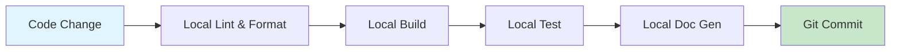
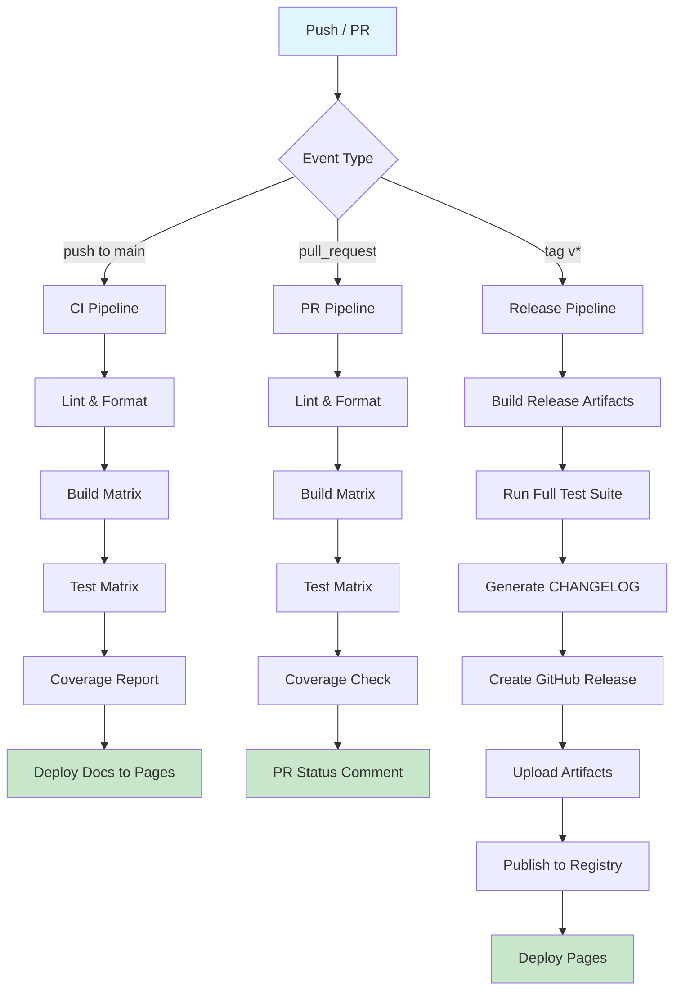
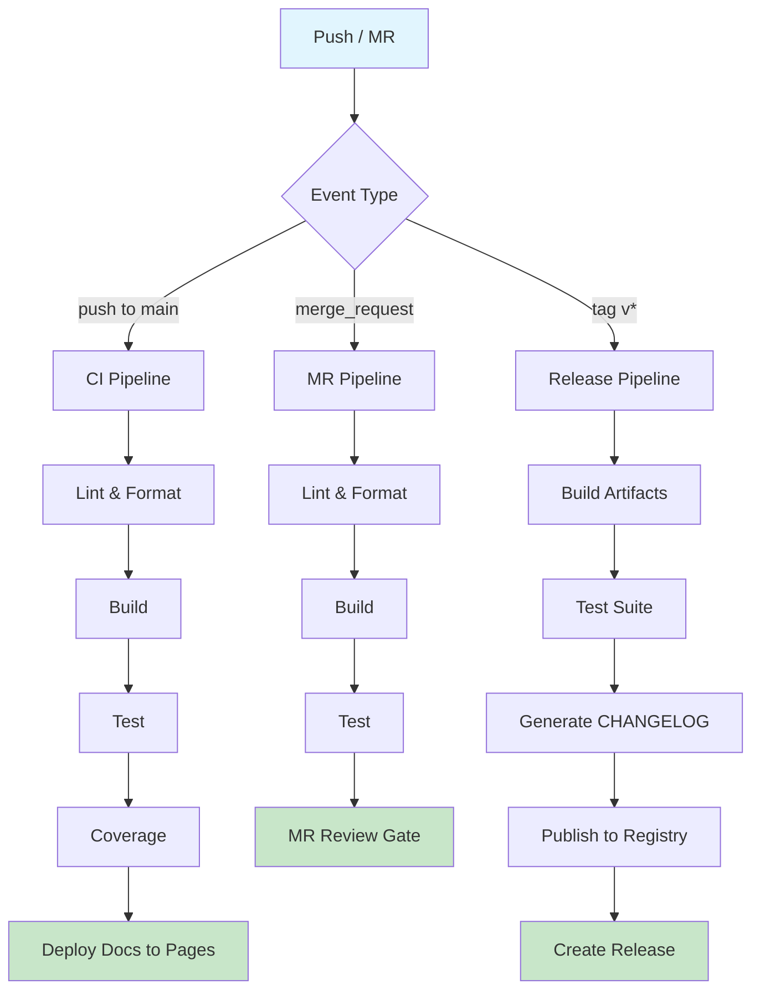

# Repository Mode System Design

> Defines three repository modes (Local, GitHub, Other-Git), their feature sets, a mode × feature toggle matrix, auto-detection logic, and deployment pipeline templates.

---

## 1. Mode Definitions

### 1.1 Local Mode

**When to use:** Personal projects, experiments, offline development, private prototypes, learning exercises.

Local mode operates without any remote repository. All build verification, documentation generation, and quality gates run on the developer's machine. No CI/CD pipelines, no release workflows, no remote publishing.

| Aspect | Behavior |
|---|---|
| Remote origin | None |
| Build verification | Local-only (`cargo build`, `npm run build`, etc.) |
| Test execution | Local-only (`cargo test`, `pytest`, etc.) |
| Documentation | Generated locally, not published |
| Code review | Self-review via local diff tooling |
| Release workflow | None — no tags, no artifacts, no publishing |
| CI/CD | None |
| Hosting / Pages | None |
| CHANGELOG | Optional manual maintenance |

**Capabilities provided:**

- Local build verification (compile, lint, format check)
- Local test execution with coverage reporting
- Local documentation generation (rustdoc, typedoc, sphinx, etc.)
- Gate quality checks (build + lint + test + fmt) run locally
- Git commit history management (conventional commits encouraged)
- Dependency audit (local `cargo audit`, `npm audit`)

**Capabilities excluded:**

- Remote publishing of any kind
- CI/CD pipeline execution
- Cross-platform build matrix
- Automated README/UserGuide generation for distribution
- Release artifact creation
- Online demo or Pages deployment
- PR/MR-based code review flow

---

### 1.2 GitHub Mode

**When to use:** Open-source projects, team projects hosted on GitHub, libraries intended for public or organizational distribution, projects requiring cross-platform support and automated release workflows.

GitHub mode unlocks the full feature set of GitHub's platform: Actions for CI/CD, Pages for documentation hosting, Releases for artifact distribution, and Issues/PRs for collaboration.

| Aspect | Behavior |
|---|---|
| Remote origin | `github.com` |
| Build verification | GitHub Actions CI matrix |
| Test execution | GitHub Actions across platforms |
| Documentation | Auto-generated README.md + UserGuide, GitHub Pages |
| Code review | PR-based flow with required reviews |
| Release workflow | Tag → Build → Test → Publish (GitHub Releases) |
| CI/CD | GitHub Actions (`.github/workflows/`) |
| Hosting / Pages | GitHub Pages, optional online demo |
| CHANGELOG | Auto-generated from conventional commits |

**Capabilities provided:**

- GitHub Actions CI/CD pipelines (push, PR, release triggers)
- Cross-platform build matrix (Linux x86_64/aarch64, macOS x86_64/aarch64, Windows x86_64)
- Automated README.md generation (badges, install instructions, usage examples)
- UserGuide generation (mdBook / docusaurus / custom, deployed to Pages)
- GitHub Pages deployment for documentation and project site
- Online demo hosting (WASM playground, interactive examples on Pages)
- Release workflow: semver tag → multi-platform build → artifact upload → GitHub Release creation
- CHANGELOG auto-generation (`git-cliff`, `conventional-changelog`, or custom)
- PR-based code review flow with branch protection rules
- GitHub Issues integration (issue templates, auto-labeling, project boards)
- Dependency update automation (Dependabot / Renovate)
- Security scanning (CodeQL, `cargo audit` in CI, npm audit)
- Badge generation (build status, coverage, version, license)

---

### 1.3 Other-Git Mode

**When to use:** Projects hosted on GitLab (cloud or self-hosted), Gitea, Bitbucket, or other Git platforms. Corporate environments with self-hosted Git infrastructure.

Other-Git mode adapts the workflow to the specific platform's CI/CD system, merge request flow, and registry capabilities. It uses a variant sub-system to handle platform-specific differences.

| Aspect | Behavior |
|---|---|
| Remote origin | `gitlab.com`, self-hosted GitLab, Gitea, Bitbucket, etc. |
| Build verification | Platform-native CI (GitLab CI, Gitea Actions, etc.) |
| Test execution | Platform-native CI |
| Documentation | Platform Pages or self-hosted deployment |
| Code review | MR (GitLab) or PR (Gitea/Bitbucket) flow |
| Release workflow | Tag → Pipeline → Registry publish |
| CI/CD | Platform-native (`.gitlab-ci.yml`, Gitea Actions, etc.) |
| Hosting / Pages | GitLab Pages / self-hosted |
| CHANGELOG | Auto-generated, same tooling as GitHub mode |

**Supported Variants:**

| Variant | Platform | CI Config | Review Flow | Registry |
|---|---|---|---|---|
| `gitlab` | GitLab (cloud/self-hosted) | `.gitlab-ci.yml` | Merge Request | GitLab Package Registry, Container Registry |
| `gitea` | Gitea / Forgejo | `.gitea/workflows/` | Pull Request | Gitea Packages |
| `bitbucket` | Bitbucket | `bitbucket-pipelines.yml` | Pull Request | Bitbucket Downloads |
| `generic` | Any other Git host | Manual / Makefile | Email patches / Web UI | Manual upload |

**Capabilities provided:**

- MR/PR flow adaptation per platform variant
- CI integration with platform-native config format generation
- Registry publishing (language-specific: crates.io, npm, PyPI, or platform registry)
- Self-hosted deployment (Docker, systemd, bare-metal scripts)
- Cross-platform build (where platform CI supports matrix builds)
- Documentation deployment to platform Pages or self-hosted target
- CHANGELOG generation (same tooling, platform-agnostic)

---

## 2. Feature Matrix

Each cell indicates the feature toggle state for the given mode.

| # | Feature | Local | GitHub | Other-Git | Notes |
|---|---|---|---|---|---|
| 1 | **CI/CD Pipeline** | disabled | enabled | enabled | Platform-native CI config generated per variant |
| 2 | **Cross-Platform Build Matrix** | disabled | enabled | optional | Depends on platform CI capabilities (GitLab: yes, Gitea: limited) |
| 3 | **README Generation** | optional | enabled | optional | Local: basic template only. GitHub: full with badges/install/usage |
| 4 | **UserGuide Generation** | optional | enabled | optional | GitHub: auto-deployed to Pages. Others: generated but deployment manual |
| 5 | **Pages / Documentation Hosting** | disabled | enabled | optional | GitLab Pages supported; Gitea: manual deployment |
| 6 | **Online Demo Hosting** | disabled | enabled | disabled | WASM playground / interactive demo on GitHub Pages |
| 7 | **Release Workflow** | disabled | enabled | enabled | Tag → Build → Publish. Artifact target varies by platform |
| 8 | **CHANGELOG Auto-Generation** | disabled | enabled | enabled | `git-cliff` / `conventional-changelog` from commit history |
| 9 | **Code Review Flow (PR/MR)** | disabled | enabled | enabled | GitHub PR / GitLab MR / Gitea PR / Bitbucket PR |
| 10 | **Registry Publish** | disabled | optional | optional | crates.io, npm, PyPI. Requires auth tokens as secrets |
| 11 | **Issue Tracking Integration** | disabled | enabled | optional | GitHub Issues templates. GitLab Issues. Gitea Issues |
| 12 | **Dependency Update Automation** | disabled | enabled | optional | Dependabot (GitHub), Renovate (GitLab/Gitea) |
| 13 | **Security Scanning** | optional | enabled | optional | CodeQL (GitHub), SAST (GitLab), local-only audit otherwise |
| 14 | **Badge Generation** | disabled | enabled | optional | Build status, coverage, version badges |
| 15 | **Local Build Verification** | enabled | enabled | enabled | Always available regardless of mode |
| 16 | **Local Test Execution** | enabled | enabled | enabled | Always available regardless of mode |
| 17 | **Local Documentation Gen** | enabled | enabled | enabled | Always available regardless of mode |
| 18 | **Conventional Commits Enforcement** | optional | enabled | enabled | Commit-msg hook or CI check |
| 19 | **Branch Protection Rules** | N/A | enabled | optional | Require reviews, status checks before merge |
| 20 | **Container Image Build** | disabled | optional | optional | GHCR (GitHub), GitLab Container Registry, Gitea Packages |

**Legend:**
- **enabled** — feature is active by default, pipeline templates and configs are generated
- **disabled** — feature is not available in this mode
- **optional** — feature can be activated via user configuration; not generated by default
- **N/A** — feature concept does not apply to this mode

---

## 3. Mode Detection Logic

### 3.1 Detection Algorithm

The mode is determined by inspecting the Git repository's remote configuration. The system reads `.git/config` (or runs `git remote -v`) and matches the remote URL against known patterns.

**Pseudocode:**

```
function detect_repo_mode(repo_path: Path) -> RepoMode:
    git_config = read_file(repo_path / ".git" / "config")

    if not exists(repo_path / ".git"):
        return RepoMode::Local  // not a git repo at all

    remotes = parse_git_remotes(git_config)

    if remotes is empty:
        return RepoMode::Local  // git repo with no remotes

    origin_url = remotes.get("origin")
        ?? remotes.values().first()  // fallback to any remote

    variant = match_platform(origin_url)

    match variant:
        PlatformVariant::GitHub    -> return RepoMode::GitHub
        PlatformVariant::GitLab    -> return RepoMode::OtherGit(variant: "gitlab")
        PlatformVariant::Gitea     -> return RepoMode::OtherGit(variant: "gitea")
        PlatformVariant::Bitbucket -> return RepoMode::OtherGit(variant: "bitbucket")
        PlatformVariant::Unknown   -> return RepoMode::OtherGit(variant: "generic")
```

### 3.2 Platform Matching Patterns

```
function match_platform(url: String) -> PlatformVariant:
    // Normalize: handle both SSH and HTTPS formats
    normalized = normalize_git_url(url)

    // GitHub: github.com (cloud only)
    if regex_match(normalized, r"github\.com[:/]"):
        return PlatformVariant::GitHub

    // GitLab: gitlab.com (cloud) or self-hosted instances
    if regex_match(normalized, r"gitlab\.com[:/]"):
        return PlatformVariant::GitLab
    if regex_match(normalized, r"gitlab\.[a-z]+\.[a-z]+[:/]"):
        return PlatformVariant::GitLab  // gitlab.company.com pattern

    // Gitea / Forgejo: common self-hosted patterns
    if regex_match(normalized, r"gitea\.|forgejo\."):
        return PlatformVariant::Gitea
    if regex_match(normalized, r"codeberg\.org[:/]"):
        return PlatformVariant::Gitea  // Codeberg runs Forgejo

    // Bitbucket
    if regex_match(normalized, r"bitbucket\.org[:/]"):
        return PlatformVariant::Bitbucket

    // Heuristic: check for known CI config files in repo root
    return detect_by_ci_config_files()


function normalize_git_url(url: String) -> String:
    // SSH format: git@host:owner/repo.git -> host:/owner/repo
    // HTTPS format: https://host/owner/repo.git -> host:/owner/repo
    url = url.strip()
    url = url.trim_suffix(".git")

    if url.starts_with("git@"):
        // git@github.com:owner/repo -> github.com:/owner/repo
        url = url.strip_prefix("git@")
    elif url.starts_with("https://") or url.starts_with("http://"):
        url = url.strip_prefix("https://").strip_prefix("http://")
    elif url.starts_with("ssh://"):
        url = url.strip_prefix("ssh://")
        // ssh://git@host/owner/repo -> remove user@ prefix
        if "@" in url:
            url = url.split("@", limit=2)[1]

    return url.to_lowercase()


function detect_by_ci_config_files() -> PlatformVariant:
    // Fallback: inspect repository root for CI config files
    if exists(".gitlab-ci.yml"):
        return PlatformVariant::GitLab
    if exists(".gitea/workflows/") or exists(".forgejo/workflows/"):
        return PlatformVariant::Gitea
    if exists("bitbucket-pipelines.yml"):
        return PlatformVariant::Bitbucket
    if exists(".github/workflows/"):
        return PlatformVariant::GitHub  // GitHub Actions in non-github remote
    return PlatformVariant::Unknown
```

### 3.3 Regex Pattern Reference

| Platform | HTTPS Pattern | SSH Pattern | Regex |
|---|---|---|---|
| GitHub | `https://github.com/owner/repo` | `git@github.com:owner/repo` | `github\.com[:/]` |
| GitLab (cloud) | `https://gitlab.com/owner/repo` | `git@gitlab.com:owner/repo` | `gitlab\.com[:/]` |
| GitLab (self-hosted) | `https://gitlab.corp.io/owner/repo` | `git@gitlab.corp.io:owner/repo` | `gitlab\.[a-z]+\.[a-z]+[:/]` |
| Gitea | `https://gitea.example.com/owner/repo` | `git@gitea.example.com:owner/repo` | `gitea\.\|forgejo\.` |
| Codeberg | `https://codeberg.org/owner/repo` | `git@codeberg.org:owner/repo` | `codeberg\.org[:/]` |
| Bitbucket | `https://bitbucket.org/owner/repo` | `git@bitbucket.org:owner/repo` | `bitbucket\.org[:/]` |

### 3.4 Self-Hosted GitLab Detection Enhancement

Self-hosted GitLab instances don't always contain "gitlab" in their hostname. For better detection, the system can probe the Git server's API:

```
function probe_gitlab_api(host: String) -> bool:
    // GitLab exposes /api/v4/version without auth
    response = http_get(f"https://{host}/api/v4/version", timeout=3s)
    if response.status == 200:
        body = parse_json(response.body)
        return body.has_key("version") and body.has_key("revision")
    return false
```

When the URL doesn't match any known pattern and `detect_by_ci_config_files()` returns `Unknown`, the system can optionally run `probe_gitlab_api()` on the remote host as a last resort. This probe is gated behind a user opt-in flag to avoid unexpected network requests.

### 3.5 User Override

Automatic detection can be overridden via a configuration file in the repository root:

```yaml
# .workflow/config.yaml
repo_mode: github          # local | github | other-git
platform_variant: null     # gitlab | gitea | bitbucket | generic (only for other-git)
features:
  cross_platform_build: true
  pages_deployment: true
  online_demo: false
  registry_publish: true
  changelog_generation: true
```

Override priority: **explicit config > auto-detection > default (local)**

---

## 4. Deployment Pipeline Templates

### 4.1 Local Mode Pipeline

No CI/CD — all stages run on the developer's machine via a task runner (Makefile, Justfile, or npm scripts).



**Stage details:**

| Stage | Command Example | Gate Criteria |
|---|---|---|
| Lint & Format | `cargo fmt --check && cargo clippy` | Zero warnings, format clean |
| Build | `cargo build --release` | Exit code 0 |
| Test | `cargo test` | All tests pass |
| Doc Gen | `cargo doc --no-deps` | Builds without errors |
| Commit | `git commit` (conventional format) | Commit-msg hook passes |

**Makefile template:**

```makefile
.PHONY: check build test doc all

check:
	cargo fmt --check
	cargo clippy -- -D warnings

build:
	cargo build --release

test:
	cargo test --release

doc:
	cargo doc --no-deps --release

all: check build test doc
```

---

### 4.2 GitHub Mode Pipeline

Full CI/CD via GitHub Actions with cross-platform matrix, release automation, and Pages deployment.



**GitHub Actions CI workflow (`.github/workflows/ci.yml`):**

```yaml
name: CI

on:
  push:
    branches: [main]
  pull_request:
    branches: [main]

env:
  CARGO_TERM_COLOR: always

jobs:
  check:
    runs-on: ubuntu-latest
    steps:
      - uses: actions/checkout@v4
      - uses: dtolnay/rust-toolchain@stable
        with:
          components: rustfmt, clippy
      - run: cargo fmt --check
      - run: cargo clippy -- -D warnings

  build-and-test:
    needs: check
    strategy:
      fail-fast: false
      matrix:
        include:
          - os: ubuntu-latest
            target: x86_64-unknown-linux-gnu
          - os: ubuntu-latest
            target: aarch64-unknown-linux-gnu
          - os: macos-latest
            target: x86_64-apple-darwin
          - os: macos-latest
            target: aarch64-apple-darwin
          - os: windows-latest
            target: x86_64-pc-windows-msvc
    runs-on: ${{ matrix.os }}
    steps:
      - uses: actions/checkout@v4
      - uses: dtolnay/rust-toolchain@stable
        with:
          targets: ${{ matrix.target }}
      - run: cargo build --release --target ${{ matrix.target }}
      - run: cargo test --release --target ${{ matrix.target }}
        if: ${{ !contains(matrix.target, 'aarch64') || matrix.os == 'macos-latest' }}

  coverage:
    needs: check
    runs-on: ubuntu-latest
    steps:
      - uses: actions/checkout@v4
      - uses: dtolnay/rust-toolchain@stable
      - uses: taiki-e/install-action@cargo-llvm-cov
      - run: cargo llvm-cov --lcov --output-path lcov.info
      - uses: codecov/codecov-action@v4
        with:
          files: lcov.info
```

**GitHub Actions Release workflow (`.github/workflows/release.yml`):**

```yaml
name: Release

on:
  push:
    tags: ["v*"]

permissions:
  contents: write

jobs:
  build-artifacts:
    strategy:
      matrix:
        include:
          - os: ubuntu-latest
            target: x86_64-unknown-linux-gnu
            artifact: my-app-linux-x86_64
          - os: macos-latest
            target: x86_64-apple-darwin
            artifact: my-app-macos-x86_64
          - os: macos-latest
            target: aarch64-apple-darwin
            artifact: my-app-macos-aarch64
          - os: windows-latest
            target: x86_64-pc-windows-msvc
            artifact: my-app-windows-x86_64.exe
    runs-on: ${{ matrix.os }}
    steps:
      - uses: actions/checkout@v4
      - uses: dtolnay/rust-toolchain@stable
        with:
          targets: ${{ matrix.target }}
      - run: cargo build --release --target ${{ matrix.target }}
      - uses: actions/upload-artifact@v4
        with:
          name: ${{ matrix.artifact }}
          path: target/${{ matrix.target }}/release/my-app*

  create-release:
    needs: build-artifacts
    runs-on: ubuntu-latest
    steps:
      - uses: actions/checkout@v4
        with:
          fetch-depth: 0
      - uses: actions/download-artifact@v4
        with:
          path: artifacts/
      - name: Generate CHANGELOG
        run: |
          cargo install git-cliff
          git-cliff --latest --strip header -o RELEASE_NOTES.md
      - uses: softprops/action-gh-release@v2
        with:
          body_path: RELEASE_NOTES.md
          files: artifacts/**/*
          generate_release_notes: false

  publish-registry:
    needs: create-release
    runs-on: ubuntu-latest
    steps:
      - uses: actions/checkout@v4
      - uses: dtolnay/rust-toolchain@stable
      - run: cargo publish
        env:
          CARGO_REGISTRY_TOKEN: ${{ secrets.CARGO_REGISTRY_TOKEN }}

  deploy-pages:
    needs: create-release
    runs-on: ubuntu-latest
    permissions:
      pages: write
      id-token: write
    environment:
      name: github-pages
    steps:
      - uses: actions/checkout@v4
      - uses: dtolnay/rust-toolchain@stable
      - run: cargo doc --no-deps --release
      - run: echo '<meta http-equiv="refresh" content="0;url=my_app/index.html">' > target/doc/index.html
      - uses: actions/upload-pages-artifact@v3
        with:
          path: target/doc
      - uses: actions/deploy-pages@v4
```

---

### 4.3 Other-Git Mode Pipeline

#### 4.3.1 GitLab Variant



**GitLab CI config (`.gitlab-ci.yml`):**

```yaml
stages:
  - check
  - build
  - test
  - deploy
  - release

variables:
  CARGO_HOME: ${CI_PROJECT_DIR}/.cargo

cache:
  key: ${CI_COMMIT_REF_SLUG}
  paths:
    - .cargo/
    - target/

lint:
  stage: check
  image: rust:latest
  script:
    - rustup component add rustfmt clippy
    - cargo fmt --check
    - cargo clippy -- -D warnings

build:
  stage: build
  image: rust:latest
  script:
    - cargo build --release
  artifacts:
    paths:
      - target/release/my-app

test:
  stage: test
  image: rust:latest
  script:
    - cargo test --release
  coverage: '/^\d+.\d+% coverage/'

pages:
  stage: deploy
  image: rust:latest
  script:
    - cargo doc --no-deps --release
    - mv target/doc public
    - echo '<meta http-equiv="refresh" content="0;url=my_app/index.html">' > public/index.html
  artifacts:
    paths:
      - public
  only:
    - main

release:
  stage: release
  image: rust:latest
  script:
    - cargo install git-cliff
    - git-cliff --latest --strip header -o RELEASE_NOTES.md
    - cargo build --release
  artifacts:
    paths:
      - target/release/my-app
      - RELEASE_NOTES.md
  only:
    - tags
```

#### 4.3.2 Gitea Variant

**Gitea Actions config (`.gitea/workflows/ci.yml`):**

```yaml
name: CI

on:
  push:
    branches: [main]
  pull_request:
    branches: [main]

jobs:
  check-build-test:
    runs-on: ubuntu-latest
    container:
      image: rust:latest
    steps:
      - uses: actions/checkout@v4
      - run: rustup component add rustfmt clippy
      - run: cargo fmt --check
      - run: cargo clippy -- -D warnings
      - run: cargo build --release
      - run: cargo test --release

  release:
    if: startsWith(github.ref, 'refs/tags/v')
    runs-on: ubuntu-latest
    container:
      image: rust:latest
    steps:
      - uses: actions/checkout@v4
        with:
          fetch-depth: 0
      - run: cargo build --release
      - run: cargo install git-cliff && git-cliff --latest -o RELEASE_NOTES.md
```

---

## 5. Mode Lifecycle

### 5.1 Mode Transition

Modes can transition as a project evolves. The system detects mode changes when remotes are added or changed.

```mermaid
statechart-v2
    [*] --> Local: git init (no remote)
    Local --> GitHub: git remote add origin github.com/...
    Local --> OtherGit: git remote add origin gitlab.com/...
    GitHub --> OtherGit: change remote to non-GitHub
    OtherGit --> GitHub: change remote to GitHub
    GitHub --> Local: remove all remotes
    OtherGit --> Local: remove all remotes
```

### 5.2 Mode Initialization Actions

When a mode is first detected or changes, the workflow system generates the appropriate scaffolding:

| Transition | Actions |
|---|---|
| → Local | Generate Makefile/Justfile, local gate script |
| → GitHub | Generate `.github/workflows/ci.yml`, `.github/workflows/release.yml`, PR template, issue templates, `.github/CODEOWNERS` |
| → Other-Git (GitLab) | Generate `.gitlab-ci.yml`, MR template, `.gitlab/issue_templates/` |
| → Other-Git (Gitea) | Generate `.gitea/workflows/ci.yml`, PR template |
| → Other-Git (Bitbucket) | Generate `bitbucket-pipelines.yml` |

### 5.3 Feature Activation Protocol

For features marked **optional** in the matrix, activation follows this protocol:

```
function activate_feature(mode: RepoMode, feature: Feature) -> Result:
    if feature_matrix[mode][feature] == "disabled":
        return Error("Feature not available in this mode")

    if feature_matrix[mode][feature] == "enabled":
        return Ok("Already active")

    // Feature is "optional" — activate it
    match feature:
        Feature::CrossPlatformBuild:
            add_build_matrix_to_ci_config(mode)
        Feature::RegistryPublish:
            prompt_user_for_registry_token()
            add_publish_step_to_release_pipeline(mode)
        Feature::PagesDeployment:
            add_pages_job_to_ci_config(mode)
        Feature::OnlineDemo:
            scaffold_wasm_demo_directory()
            add_demo_build_to_ci(mode)
        // ...

    update_workflow_config(feature, enabled=true)
    return Ok("Feature activated")
```

---

## 6. Integration with Workflow System

### 6.1 Mode in Pre-Decision Phase

During the Pre-Decision Phase, the workflow system:

1. **Auto-detects** the repository mode from `.git/config`
2. **Presents** the detected mode and enabled features to the user
3. **Asks** for confirmation or override
4. **Collects** mode-specific configuration (e.g., registry tokens, Pages custom domain)

### 6.2 Mode-Aware Stage Behavior

Different workflow stages adapt their behavior based on the active mode:

| Stage | Local Mode | GitHub Mode | Other-Git Mode |
|---|---|---|---|
| **Implement** | Local build/test gate | Local + CI trigger | Local + CI trigger |
| **Review** | Self-review checklist | PR creation + reviewer assignment | MR/PR creation |
| **Test** | Local test suite | CI matrix test + coverage upload | CI test + coverage |
| **Gate** | Local gate script | CI status checks | CI pipeline status |
| **Release** | Skip (no release) | Tag → Actions → Release | Tag → CI → Registry |
| **Deploy** | Skip (no deploy) | Pages deployment | Pages / self-hosted |

### 6.3 Configuration Schema

The complete mode configuration is stored as part of the workflow metadata:

```yaml
# .workflow/repo-mode.yaml
mode: github                     # auto-detected or user-override
variant: null                    # for other-git: gitlab | gitea | bitbucket | generic
detected_from: origin            # which remote was used for detection
detection_method: url_pattern    # url_pattern | ci_config_file | api_probe | user_override

features:
  ci_cd: true
  cross_platform_build: true
  readme_generation: true
  userguide_generation: true
  pages_deployment: true
  online_demo: false
  release_workflow: true
  changelog_generation: true
  code_review_flow: true
  registry_publish: false
  issue_tracking: true
  dependency_updates: true
  security_scanning: true
  badge_generation: true
  container_build: false

platform_config:
  # GitHub-specific
  default_branch: main
  branch_protection: true
  required_reviewers: 1
  codeowners_path: .github/CODEOWNERS

  # Release-specific
  release_tag_pattern: "v*"
  changelog_tool: git-cliff
  artifact_targets:
    - x86_64-unknown-linux-gnu
    - aarch64-apple-darwin
    - x86_64-pc-windows-msvc
```

---

## 7. Summary

The three-mode system provides a progressive capability ladder:

| | Local | GitHub | Other-Git |
|---|---|---|---|
| **Complexity** | Minimal | Full-featured | Adaptive |
| **Network dependency** | None | GitHub.com | Varies |
| **CI/CD** | None | GitHub Actions | Platform-native |
| **Review flow** | None | PR-based | MR/PR-based |
| **Release** | None | Automated | Automated |
| **Best for** | Prototyping, learning | Open-source, team projects | Corporate, self-hosted |

The mode detection is automatic but overridable, the feature matrix is transparent and configurable, and each mode generates the appropriate CI/CD pipeline scaffolding for its platform. The system integrates into the broader workflow via the Pre-Decision Phase (mode confirmation) and mode-aware Stage behaviors (review, gate, release, deploy).
