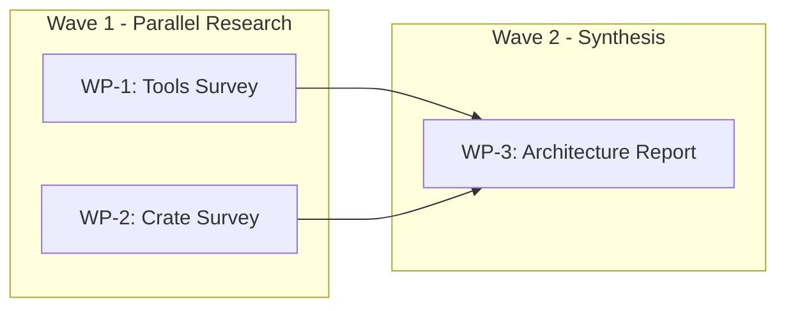

# WP-2: Local Pattern Extraction — Pattern Catalog

> Extracted from EchoAccess workflow records and 13 recent Cursor plan files (2026-03-31 to 2026-04-04).

---

## Executive Summary

Analysis of the local EchoAccess implementation workflow and 93 Cursor plan files reveals a mature, converging plan authoring system. A consistent structural grammar has emerged organically across diverse project types (research, architecture design, full implementation, migration, release). The core recurring unit is the **Work Package (WP)** — a self-contained, dependency-aware task with explicit sizing, subagent delegation, and done-when criteria, organized into parallel **Waves** for execution.

Key findings:

- **13 structural patterns** are used consistently across plans, with high reuse potential
- The **YAML frontmatter + Scout + WP + Wave + Risk** skeleton appears in every plan, forming a de facto standard
- EchoAccess introduced **3 advanced patterns** (convergence loop, gate mechanism, multi-tier agent hierarchy) not yet generalized across other plans
- **5 anti-patterns** are identifiable — primarily around scope inflation, stale references, and context budget overflow
- The strongest pattern for workflow automation is the **dispatcher-not-implementer** principle, which cleanly separates orchestration from execution

---

## Part I: EchoAccess Pattern Analysis

### Source Files

The EchoAccess `.local/` directory was gitignored and not directly accessible during this extraction. Patterns were extracted from the two Cursor plan files that drove EchoAccess implementation:

- `implementation_plan_design_41c799c1.plan.md` (44,596 bytes, 658 lines) — the plan that designed the 17-Stage implementation plan
- `echoaccess_full_implementation_f5d99cf2.plan.md` (8,508 bytes, 142 lines) — the plan that executed all 17 Stages

### 1.1 Stage/Wave Tracking Format

The EchoAccess implementation used a **4-Tier, 7-Wave, 17-Stage** decomposition with a hierarchical tracking table:

```markdown
| Wave | Stages | Max Parallelism | Notes |
|------|--------|-----------------|-------|
| Wave 1 | S1 | 1 | Scaffold — quick |
| Wave 2 | S2 | 1 | Core abstractions — all depend on this |
| Wave 3 | S3, S4, S5, S7, S15 | **5 parallel** | Independent |
| Wave 4 | S6, S10, S13, S14, S16 | **5 parallel** | S6 critical path |
| Wave 5 | S8 | 1 | CLI wires Waves 1-4 |
| Wave 6 | S9, S11, S12 | **3 parallel** | Feature UIs |
| Wave 7 | S17 | 1 | Final polish |
```

**Key characteristics:**
- Each Stage owns 2-12 source files (avg 4.5), enforcing narrow context
- Tiers group Stages by architectural layer (Foundation → Core Logic → Features → Release)
- Waves encode execution ordering with explicit parallelism counts
- Context purity metrics tracked (max files, max concurrent Stages, sub-agents per Stage)

### 1.2 Gate Mechanism and Quality Scoring

The convergence loop is the most sophisticated pattern, running **8 phases per round** with a minimum of 3 rounds per Stage:

```
Round N:
  Phase 1 - CODE REVIEW     (Code Review Sub-agent)
  Phase 2 - FIX (review)    (Coding Sub-agent)
  Phase 3 - TEST            (TDD Sub-agent)
  Phase 4 - FIX (test)      (Coding Sub-agent)
  Phase 5 - BENCHMARK       (automated)
  Phase 6 - FIX (benchmark) (Coding Sub-agent)
  Phase 7 - FINAL REVIEW    (SOLID + Code Review)
  Phase 8 - FIX (final)     (Coding Sub-agent)
```

**Gate decision formula:**
```
composite = tdd_quality_score * 0.3
          + code_review_quality_score * 0.3
          + solid_quality_score * 0.2
          + benchmark_pass_score * 0.2

PASS requires: round >= 3
           AND composite >= 85
           AND zero blocker findings
           AND zero MUST-priority violations
           AND coverage >= threshold
```

**Quality score** uses the code-rules severity system:
```
quality_score = max(0, 100 - Σ(severity_weight × finding_count))
  blocker=25, critical=15, major=5, minor=1, info=0
```

### 1.3 Agent Hierarchy and Dispatcher Pattern

EchoAccess established a 3-level agent hierarchy with strict delegation boundaries:

```
Project-Main-Agent (DISPATCHER ONLY)
  ├── Stage-Main-Agent × 17 (owns 2-6 files each)
  │     ├── Coding Sub-agent (implements)
  │     ├── TDD Sub-agent (tests)
  │     ├── SOLID Review Sub-agent (architecture review)
  │     └── Code Review Sub-agent (quality review)
  └── overview.md dashboard (tracks all 17 Stages)
```

**Hard constraints on Project-Main:**
1. NEVER implement code — dispatch to Stage-Main-Agents
2. NEVER run tests — Stage-Main delegates to TDD Sub-agent
3. NEVER review code — Stage-Main delegates to Quality Sub-agents
4. NEVER skip a Stage or wave
5. NEVER pause between waves — dispatch next immediately

### 1.4 Record-Keeping System

```
.local/stages/
├── overview.md                    # Project-Main dashboard
├── S01_scaffold/
│   ├── README.md                  # Stage scope, owned files
│   ├── context.md                 # Predecessor artifacts snapshot
│   ├── rounds/
│   │   ├── round-1/
│   │   │   ├── code_review.md
│   │   │   ├── solid_review.md
│   │   │   ├── test_report.md
│   │   │   ├── benchmark_report.md
│   │   │   └── round_summary.md
│   │   ├── round-2/
│   │   └── round-3/
│   ├── dev_log.md
│   ├── decisions.md
│   ├── gate_report.md
│   ├── convergence_chart.md
│   └── artifacts.md
├── S02_core_abstractions/
└── ...
```

### 1.5 Dependency Matrix Format

The dependency matrix was expressed as a Stage-to-Stage DAG using Mermaid, with these relationship types:
- **Hard dependency**: Stage B cannot start until Stage A gates PASS
- **Artifact contract**: what must exist before a downstream Stage starts (e.g., "UIAdapter trait signature frozen after S2")
- **Shared type ownership**: shared modules (config/, error.rs) have a designated owner per Stage to prevent conflicts

---

## Part II: Cursor Plans Pattern Analysis

### Sources Analyzed

13 plan files sampled across 4 project types:

| Type | Plans | Examples |
|------|-------|---------|
| Research | 4 | config_sync_research, tui_framework_research, macos_proxy_research, workflow_system_design |
| Architecture Design | 3 | rust_tui_architecture_design, echoaccess_architecture_update, implementation_plan_design |
| Full Implementation | 3 | echoaccess_full_implementation, scriptguard_build_plan, nier_automata_design_overhaul |
| Migration/Adoption | 3 | enva_全量收口计划, enva_重实现计划, revi_base_adoption |

### 2.1 Common Plan Structure

Every plan follows a consistent 6-section skeleton:

```markdown
---
name: <Plan Title>
overview: "<One-paragraph scope, scout scores, key stats>"
todos:
  - id: wp-N
    content: "WP-N: <Title> (<complexity>, <subagent>) [Wave N]"
    status: pending|in_progress|completed
isProject: false
---

# <Plan Title>

## Scout Findings
### Verified
### Discovered
### Gaps

## Work Packages
### WP-N: <Title> (complexity: L|M|H, subagent: <type>)
- Depends on: <WP list or none>
- Parallel with: <WP list> (optional)
- Actions:
  1. ...
- Done when: <testable criteria>

## Execution Waves
<mermaid diagram>
- Wave 1: ...
- Wave 2: ...

## Output Files (optional)
## Risks
## Quality Self-Check (optional)
```

### 2.2 YAML Frontmatter Pattern

The frontmatter serves dual purposes: plan metadata for the IDE and a machine-parseable todo list.

**Observed fields:**
- `name`: Short plan title (always present)
- `overview`: 1-3 sentence scope summary, often includes scout quality scores (always present)
- `todos`: Array of `{id, content, status}` objects mirroring WPs (always present)
- `isProject`: Always `false` in observed plans

**Content encoding in todo items:**
```yaml
- id: wp-3
  content: "WP-3: Wave 3 — S3,S4,S5,S7,S15 in parallel (5 Stages), validate cross-Stage, merge all"
  status: completed
```

The content string consistently packs: WP number, descriptive title, and key execution detail (parallelism, stage count).

### 2.3 Scout Findings Pattern

Every plan begins with a **Scout** reconnaissance section using a 3-part structure:

| Section | Purpose | Typical Content |
|---------|---------|-----------------|
| **Verified** | Confirmed pre-existing resources | File paths with line counts, confirmed tool versions, existing infrastructure |
| **Discovered** | New information found during scouting | Additional files not in task spec, undocumented constraints, related resources |
| **Gaps** | Missing prerequisites | Files that don't exist yet, uninstalled tools, missing configurations |

Scout sections often include inline file links with metadata:
```markdown
- `implementation_plan.md` (1,071 lines, 14 chapters) — execution manual
- `Architecture.md` (813 lines) — M0-M10 milestones, module design
```

Some plans include a **quality self-check** scoring the Scout:
```
D1 Scout (30%): Score 5 — All paths verified; 14+ frameworks discovered
D2 Decomposition (40%): Score 5 — 7 WPs; 4 waves maximize parallelism
D3 Executability (30%): Score 4 — Actions concrete; some subjectivity
Weighted total: 5×0.30 + 5×0.40 + 4×0.30 = 4.7 — Rating: Excellent
```

### 2.4 Work Package Structure

WPs are the atomic unit of all plans. Common fields:

| Field | Format | Required | Example |
|-------|--------|----------|---------|
| Title | `WP-N: <Name>` | Yes | `WP-3: Sync Strategies and Cloud Storage Research` |
| Complexity | `L\|M\|H` | Yes | `complexity: H` |
| Subagent | `explore\|generalPurpose\|direct\|shell` | Yes | `subagent: generalPurpose` |
| Depends on | WP list or `none` | Yes | `Depends on: WP-1, WP-2` |
| Parallel with | WP list | No | `Parallel with: WP-3, WP-4` |
| Actions | Numbered list | Yes | 3-6 concrete steps |
| Done when | Testable criteria | Yes | `cargo test passes, 30+ tests total` |

**Complexity ratings observed:**
- **L (Low)**: 1-3 actions, straightforward data collection or simple edits, 15-30 min
- **M (Medium)**: 3-5 actions, requires synthesis or moderate implementation, 30-60 min
- **H (High)**: 4-6+ actions, complex design/implementation, multiple sub-tasks, 45-90 min

**Subagent type selection observed:**
- `explore`: file/codebase scanning, web search, data collection
- `generalPurpose`: research, design, synthesis, analysis
- `direct`: final assembly, document writing, code implementation by the plan owner
- `shell`: git operations, builds, deployments

### 2.5 Wave Organization Patterns

Waves are the execution scheduling unit. Common patterns observed:

**Pattern A — Research Fan-out/Fan-in** (4 plans):
```
Wave 1: N parallel independent research WPs → Wave 2: consolidation WP → Wave 3: synthesis WP
```

**Pattern B — Sequential Pipeline** (3 plans):
```
Wave 1: scaffold → Wave 2: parallel modules → Wave 3: integration → Wave 4: tests → Wave 5: release
```

**Pattern C — Staged Dependencies** (3 plans):
```
Wave 1: WP-1 (baseline) → Wave 2: WP-2,WP-3 (parallel) → Wave 3: WP-4,WP-5 (parallel) → Wave 4: WP-6 (synthesis)
```

**Pattern D — Two-Stage with Subagent Handoff** (macos_proxy):
```
Stage 1: Waves 1-4 (research path design) → Stage 2: Waves 5-6 (parallel subagent deep-dives + synthesis)
```

Mermaid flowcharts consistently use `graph LR` or `flowchart TD/LR` with subgraph grouping per wave.

### 2.6 Dependency Expression

Dependencies are expressed at three levels:

1. **WP-level**: `Depends on: WP-1, WP-2` (most common)
2. **Wave-level**: `Wave 2 (depends on Wave 1)` (in execution waves section)
3. **DAG-level**: Mermaid arrows (`WP1 --> WP4`, `WP2 --> WP4`)

The macos_proxy plan added a **subagent execution contract** defining handoff format between stages — the most structured inter-WP dependency mechanism observed.

### 2.7 Risk Matrix Pattern

Every plan includes risks, with varying formality:

**Minimal (most common):**
```markdown
- **Risk name** (Severity: High/Medium/Low): Description. Mitigation: ...
```

**Tabular (EchoAccess, ScriptGuard):**
```markdown
| Risk | Severity | Mitigation |
|------|----------|------------|
| Pre-1.0 crates may break | Low | Pin versions; cargo audit |
```

**Categorized (implementation_plan_design):**
```markdown
| **Decomposition** | | |
| 17 Stages overhead | Medium | Automated dashboard |
| **Convergence Loop** | | |
| Loop never converges | High | Monotonic requirement |
```

### 2.8 Naming Patterns

Plan file naming follows: `<descriptive_slug>_<8char_hex>.plan.md`

WP naming conventions:
- Simple sequential: `WP-1`, `WP-2`, ... `WP-N`
- Hierarchical: `WP-1A`, `WP-1B`, `WP-2A`, `WP-2B` (implementation_plan_design)
- Phase-prefixed: `WP-0: Project Setup`, then `WP-1: Wave 1 — S1 Scaffold`

Todo IDs mirror WP naming: `wp-1`, `wp-2`, `wp-1a`, `wp-1b`, or descriptive slugs like `freeze-common-oracles`.

---

## Part III: Pattern Catalog

### Pattern 1: YAML Frontmatter Contract

**Source:** All 13 plans analyzed
**Description:** Every plan begins with a YAML frontmatter block containing `name`, `overview`, `todos[]`, and `isProject`. The todos array provides machine-parseable task tracking that the IDE can render as a checklist.
**When to use:** Every plan, without exception. This is the entry point for both human reading and IDE integration.
**When to avoid:** Never — this is mandatory infrastructure.
**Example:**
```yaml
---
name: Config Sync Research Plan
overview: "6 WPs across 3 waves. Scout: D1=5 D2=5 D3=5."
todos:
  - id: wp-1
    content: "WP-1: Tools Survey (M, explore)"
    status: completed
isProject: false
---
```

### Pattern 2: Scout Reconnaissance (Verified/Discovered/Gaps)

**Source:** All 13 plans; most mature in `tui_framework_research`, `workflow_system_design`
**Description:** Before any planning, a Scout phase inventories the workspace: verifying that referenced files/tools exist, discovering additional resources not mentioned in the task, and cataloging gaps that must be filled. The three categories (Verified/Discovered/Gaps) create a clear picture of starting conditions.
**When to use:** Every plan. Especially critical when the plan references external files, repos, or tools.
**When to avoid:** Skip only for trivially scoped single-file changes.
**Example:**
```markdown
## Scout Findings
### Verified
- Architecture.md (813 lines): complete v2 with M0-M10 milestones
- `cargo` 1.80+ available, all cross-compile targets installed
### Discovered
- Plans directory is at `/root/.cursor/plans/` (not under project root)
- 14+ additional frameworks not in original task scope
### Gaps
- `implementation_plan.md` does not exist yet — this is the target output
- No CI configuration present
```

### Pattern 3: Work Package as Atomic Unit

**Source:** All 13 plans (total 98 WPs analyzed)
**Description:** The WP is the fundamental planning atom: a bounded piece of work with explicit complexity (L/M/H), subagent type, dependency list, numbered actions (3-6), and testable done-when criteria. WPs are sized to complete within a single agent session (15-90 min).
**When to use:** Every decomposition. Even simple plans benefit from this structure for trackability.
**When to avoid:** Tasks with fewer than 3 distinct steps don't need WP formalism.
**Example:**
```markdown
### WP-4: Encryption Schemes Research (complexity: M, subagent: generalPurpose)
- Depends on: none
- Parallel with: WP-3
- Actions:
  1. Compare 3+ encryption schemes on cross-platform support, key management, Rust availability
  2. Inspect local sops/ and age/ repos for architecture patterns
  3. Research cross-platform file permission preservation approaches
  4. Output encryption comparison matrix
- Done when: encryption matrix + permission preservation notes written
```

### Pattern 4: Wave-Based Parallel Execution

**Source:** All 13 plans
**Description:** WPs are grouped into Waves for execution scheduling. Within a wave, WPs with no inter-dependencies run in parallel. Wave N+1 starts only after all Wave N WPs complete. Mermaid diagrams visualize the DAG. Plans consistently maximize parallelism in early waves (research fan-out) and serialize in later waves (synthesis/assembly).
**When to use:** Any plan with 4+ WPs where some WPs are independent.
**When to avoid:** Purely sequential workflows where every WP depends on the prior one (though even then, wave notation clarifies the pipeline).
**Example:**
```markdown
## Execution Waves
- **Wave 1** (parallel): WP-1 (tools survey), WP-2 (crate survey), WP-3 (sync strategies), WP-4 (encryption)
- **Wave 2** (depends on WP-1): WP-5 (clone + analyze reference repo)
- **Wave 3** (depends on all): WP-6 (architecture sketch + final report)
```

### Pattern 5: Dispatcher-Not-Implementer Principle

**Source:** `echoaccess_full_implementation`, `implementation_plan_design`
**Description:** The orchestrating agent (Project-Main) NEVER performs implementation work directly. It dispatches to sub-agents, monitors their outputs, validates cross-boundary contracts, and advances the pipeline. This creates clean separation between coordination logic and execution logic, preventing context pollution.
**When to use:** Any multi-stage implementation with 5+ stages. The dispatcher pattern prevents the orchestrator's context from filling with implementation details.
**When to avoid:** Small plans (3-4 WPs) where the overhead of strict delegation exceeds the benefit.
**Example:**
```markdown
### Hard Constraints
1. NEVER implement code — dispatch to Stage-Main-Agents
2. NEVER run tests — Stage-Main delegates to TDD Sub-agent
3. NEVER review code — Quality Sub-agents handle all reviews
4. NEVER pause between waves — dispatch next immediately
```

### Pattern 6: Convergence Loop with Quality Gate

**Source:** `implementation_plan_design` (EchoAccess-specific, generalizable)
**Description:** Each implementation stage runs a multi-round convergence loop: review → fix → test → fix → benchmark → fix → final review → fix. A gate decision uses a composite quality score formula. PASS requires meeting score thresholds, zero blocker findings, and minimum round count. FAIL triggers another round; exceeding max rounds triggers escalation.
**When to use:** Implementation stages where code quality must be verified before proceeding. Especially valuable for security-critical or API-defining stages.
**When to avoid:** Research-only or design-only workflows where there's no code to converge on.
**Example:**
```
Gate composite = tdd*0.3 + code_review*0.3 + solid*0.2 + benchmark*0.2
PASS: round >= 3 AND composite >= 85 AND zero blockers
FAIL: next round (max 6, then escalate)
```

### Pattern 7: Done-When Criteria as Acceptance Tests

**Source:** All 13 plans
**Description:** Every WP includes a `Done when:` clause with testable, observable criteria. The best done-when criteria are binary (pass/fail) and reference concrete artifacts (files exist, commands succeed, counts met). Weak done-when criteria use subjective language ("comprehensive", "good quality").
**When to use:** Every WP. Non-negotiable.
**When to avoid:** Never.
**Example (strong):**
```markdown
- Done when: `cargo test` passes, minimum 30 tests total across all modules
- Done when: pattern catalog document with 10+ extracted patterns
- Done when: all 5 Stages gate PASS, all merged, overview.md updated
```
**Example (weak — avoid):**
```markdown
- Done when: comprehensive research completed (too vague)
- Done when: architecture is well-designed (subjective)
```

### Pattern 8: Risk Register with Severity and Mitigation

**Source:** All 13 plans
**Description:** Every plan catalogs risks with severity rating and mitigation strategy. The most mature plans categorize risks (technical, process, quality) and reference specific WPs or actions as mitigations. Risks are not just listed — they influence WP ordering (front-loading high-risk items).
**When to use:** Every plan with 3+ WPs. Even research plans have risks (data availability, tool access).
**When to avoid:** Trivially scoped changes.
**Example:**
```markdown
| Risk | Severity | Mitigation |
|------|----------|------------|
| Apple entitlements may rule out per-app interception | High | Front-load Apple validation in WP-2 |
| Pre-1.0 crates may have breaking changes | Low | Pin versions; cargo audit in CI |
| Loop never converges (findings oscillate) | High | Monotonic non-increase requirement after round 2 |
```

### Pattern 9: Mermaid DAG for Dependency Visualization

**Source:** All 13 plans
**Description:** Every plan includes at least one Mermaid diagram showing the WP dependency graph. Diagrams use `subgraph` to group WPs by wave/phase. Arrow direction shows data/dependency flow. The diagram serves as both documentation and a visual sanity check for wave assignments.
**When to use:** Any plan with 4+ WPs. The visual representation catches dependency errors that text descriptions miss.
**When to avoid:** Plans with 2-3 WPs in a linear chain (textual description suffices).
**Example:**


### Pattern 10: Output File Registry

**Source:** 8 of 13 plans (strongest in `workflow_system_design`, `tui_framework_research`)
**Description:** Plans explicitly list all output files with their WP provenance and target directory. This creates a clear contract for what the plan produces and where to find results.
**When to use:** Any plan that produces 3+ output files, especially research/design plans.
**When to avoid:** Implementation plans where the output is code changes tracked by git.
**Example:**
```markdown
## Output Files
All artifacts go into `/home/agent/research/tui_best_practice_solution/`:
- `research_rust_tui.md` — WP-1 output
- `framework_landscape.md` — WP-3 unified comparison
- `recommendation_report.md` — WP-7 final report (bilingual)
```

### Pattern 11: Quality Self-Check Scoring (D1/D2/D3)

**Source:** `tui_framework_research`, `macos_proxy_research`, `enva_全量收口计划`
**Description:** Plans include a self-assessment scoring three dimensions: D1 Scout quality (30%), D2 Decomposition quality (40%), D3 Executability (30%). Each dimension gets a 1-5 score with justification, producing a weighted total. This creates accountability for plan quality.
**When to use:** Complex plans (6+ WPs). Helps catch under-scouted or under-decomposed plans before execution.
**When to avoid:** Simple plans where the overhead of self-scoring exceeds the benefit.
**Example:**
```markdown
## Quality Self-Check
- D1 Scout (30%): Score 5 — All paths verified; 14+ new items discovered
- D2 Decomposition (40%): Score 5 — 7 WPs; 4 waves maximize parallelism
- D3 Executability (30%): Score 4 — Actions concrete; some subjectivity
Weighted total: 4.7 — Rating: Excellent
```

### Pattern 12: Subagent Execution Contract

**Source:** `macos_proxy_research` (most explicit), `implementation_plan_design`
**Description:** When plans use a two-stage structure (design → execute), a formal contract defines what each subagent receives (input packet) and must return (output format). This prevents subagent drift and ensures consistent evidence quality.
**When to use:** Plans with Stage 1/Stage 2 separation, or any plan dispatching 3+ parallel subagents that must produce comparable outputs.
**When to avoid:** Plans where the main agent executes all WPs directly.
**Example:**
```markdown
## Subagent Execution Contract
- Every subagent receives: route summary, prior findings, must-answer questions, evidence format
- Every subagent must return: conclusion, evidence, blockers, next-step recommendations
- Route-invalidating blocker → compare against backup routes, don't stop at negative verdict
- WP-11 treats contradictions as first-class inputs
```

### Pattern 13: Termination Condition Definition

**Source:** `enva_全量收口计划` (most explicit), `echoaccess_full_implementation`
**Description:** The plan defines not just what to do, but what "done" means for the entire plan — distinguishing blockers from non-blockers, immediate fixes from long-term roadmap, and mandatory gates from advisory checks.
**When to use:** Migration plans, adoption plans, or any plan that could drift into "never done" territory.
**When to avoid:** Self-evident completion (e.g., "research report written" is its own termination).
**Example:**
```markdown
### Termination Conditions
- `must_now`: Oracle portability fix, CI gate parity, adoption checklist
- `should_now`: Handoff document refresh, verify command unification
- `later`: In-process self-update, signing/provenance, native builds
```

---

## Part IV: Anti-Patterns

### Anti-Pattern 1: Context Budget Overflow

**Source:** `implementation_plan_design_41c799c1.plan.md` (44,596 bytes)
**Description:** Plans that grow beyond ~15,000 bytes risk exceeding agent context windows when loaded alongside code. The implementation_plan_design plan at 44K bytes is the largest observed; it works because it's a design-only document, but an executing agent loading this plus source code would face context pressure.
**Mitigation:** Cap plan files at ~500 lines. For complex projects, split into a master plan (overview + wave schedule) and per-wave detail files.

### Anti-Pattern 2: Stale Path References

**Source:** Task specification referenced `.local/stages/overview.md`, `gate_report.md`, `wp1a_dependency_matrix.md` — none accessible during extraction
**Description:** Plans and tasks reference file paths that existed at authoring time but become inaccessible later (gitignored directories, branch-specific files, session-local artifacts). Subsequent agents waste time trying to read non-existent files.
**Mitigation:** Scout Findings should flag paths with access risks. Critical reference content should be quoted inline or committed to a tracked location. The Scout "Gaps" section should explicitly note inaccessible paths.

### Anti-Pattern 3: Immediate/Roadmap Mixing

**Source:** `enva_全量收口计划` (explicitly identified this problem), earlier enva plans
**Description:** Plans mix tasks that must be done now with aspirational roadmap items (e.g., "in-process self-update", "signing/provenance", "native builds"). This dilutes execution focus and makes completion criteria ambiguous.
**Mitigation:** Enforce a `must_now` / `should_now` / `later` classification. Roadmap items get a separate "Deferred Scope" or "Next Stage" section, not WPs in the current plan.

### Anti-Pattern 4: Vague Done-When Criteria

**Source:** Observed in weaker WPs across several plans
**Description:** Done-when criteria like "comprehensive analysis completed" or "architecture well-designed" are untestable. They lead to scope creep and unclear completion.
**Mitigation:** Every done-when must reference: (a) a file that exists, (b) a command that passes, (c) a count that is met, or (d) a table/matrix that contains N entries. Binary pass/fail only.

### Anti-Pattern 5: Missing Deferred Scope Section

**Source:** 6 of 13 plans lack explicit deferred scope; `macos_proxy_research` handles it well
**Description:** Plans that don't explicitly park out-of-scope items risk scope creep during execution. When an agent encounters a related-but-out-of-scope concern, it has no guidance on whether to pursue it or defer.
**Mitigation:** Include a "Deferred Scope" section listing items explicitly excluded from this plan, with a pointer to where they should be tracked (next-stage memo, backlog issue, etc.).

---

## Appendix: Cross-Plan Statistics

| Metric | Value |
|--------|-------|
| Plans analyzed | 13 |
| Total WPs across all plans | 98 |
| Average WPs per plan | 7.5 |
| Max WPs (scriptguard_build) | 21 |
| Min WPs (nier_automata_design) | 8 (task-based, not WP-numbered) |
| Average waves per plan | 4.2 |
| Max parallelism observed | 5 WPs in one wave |
| Plans with D1/D2/D3 scoring | 3 of 13 |
| Plans with bilingual output | 4 of 13 |
| Plans with Mermaid diagrams | 13 of 13 (100%) |
| Plans with risk section | 13 of 13 (100%) |
| Plans with output file registry | 8 of 13 (62%) |
| Plans with subagent contract | 2 of 13 (15%) |
| Plans with termination conditions | 2 of 13 (15%) |

---

*Generated: 2026-04-04 | Source: WP-2 of Workflow System Design Plan*
