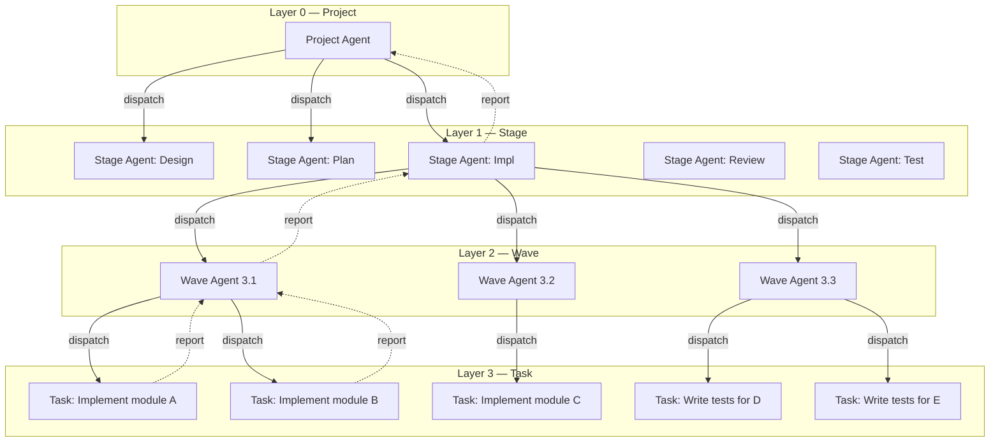
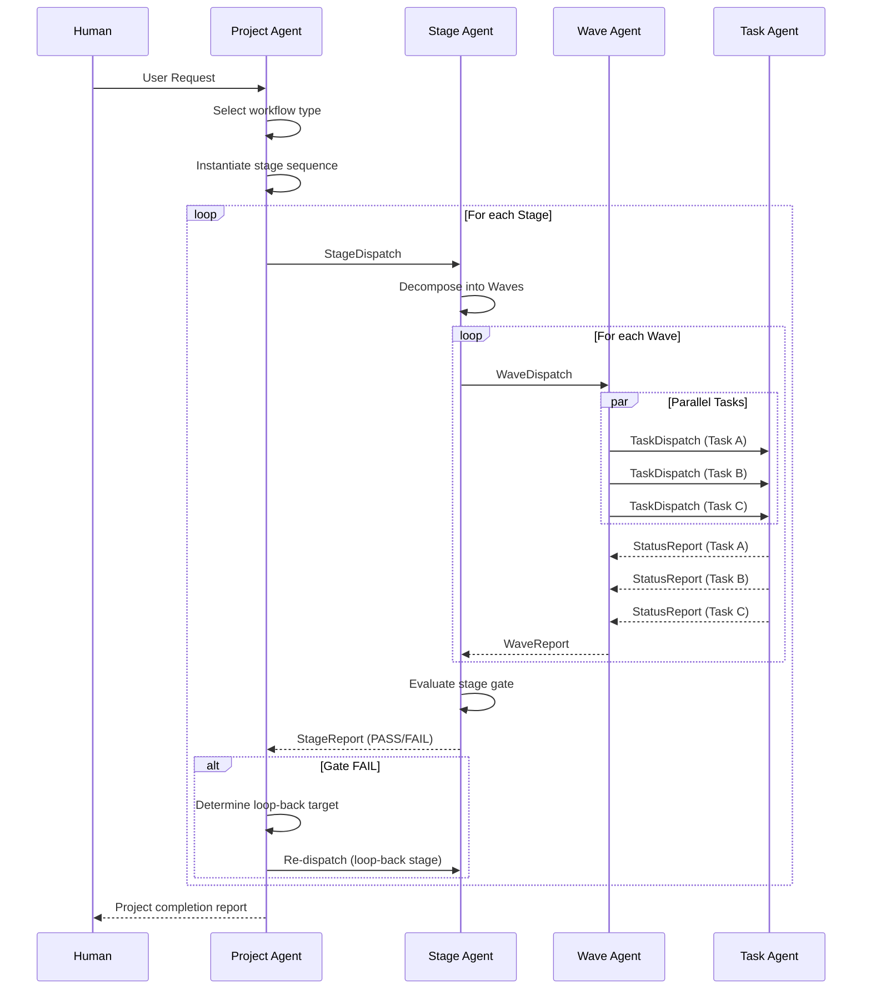
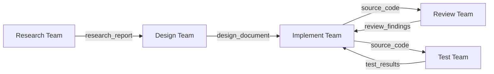
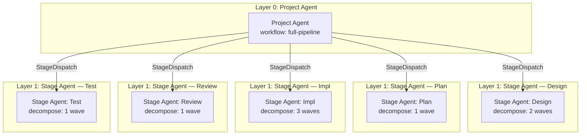

# Agent Hierarchy & Team Architecture Design

> [!WARNING]
> **Historical design — superseded before v16.** This document preserves
> rationale and evolution evidence; it is not a runtime instruction. For the
> current three-layer Project → Wave → Task and checklist-round contracts, see
> [SKILL](../../workflow-system/agent/SKILL.md), [agent hierarchy](../../workflow-system/agent/references/agent-hierarchy.md),
> [execution protocol](../../workflow-system/agent/references/execution-protocol.md), [meta-framework](../../workflow-system/agent/references/meta-framework.md),
> [schemas](../../schemas/), and [runtime implementation](../../src/devolaflow/).

> **Version**: 1.0.0  
> **Date**: 2026-04-04  
> **Status**: Design  
> **Scope**: 4-layer agent delegation hierarchy, 5 AgentTeam specifications, communication protocols, context isolation strategy, and delegation chain examples.  
> **Inputs**: wp1 (framework research), wp2 (EchoAccess patterns), wp3 (workflow types), code-rules agent guide

---

## Table of Contents

1. [Design Principles](#1-design-principles)
2. [4-Layer Agent Hierarchy](#2-4-layer-agent-hierarchy)
3. [Inter-Layer Communication Protocol](#3-inter-layer-communication-protocol)
4. [5 AgentTeam Role Specifications](#4-5-agentteam-role-specifications)
5. [Team Handoff Protocol](#5-team-handoff-protocol)
6. [Context Isolation Strategy](#6-context-isolation-strategy)
7. [Delegation Chain Examples](#7-delegation-chain-examples)

---

## 1. Design Principles

These principles govern every design decision in this document. They are derived from the converging patterns observed across 8 agent frameworks, 13 local plan files, and industry best practices from Anthropic, OpenAI, and Google.

### P1 — Dispatcher-Not-Implementer (Hard Constraint)

> **The main agent at every layer MUST NOT perform actual work. It dispatches, monitors, and reports — nothing else.**

This is the single most important architectural invariant. Violation breaks context isolation, produces context pollution, and degrades quality through scope mixing. The EchoAccess implementation validated this pattern across 17 stages with zero dispatcher-level failures.

Concrete prohibitions per layer:

| Layer | MUST NOT | MUST |
|-------|----------|------|
| Project Agent | Write code, run tests, read source files, author designs | Dispatch Stages, track status, enforce gate decisions |
| Stage Agent | Write code, run tests, author research reports | Dispatch Waves, aggregate wave results, run gate evaluations |
| Wave Agent | Write code, run tests, author any artifact | Dispatch Tasks in parallel, collect results, report to Stage |
| Task Agent | Dispatch sub-tasks, create new agents | Execute the assigned work directly using tools |

### P2 — Minimal Context at Every Layer

Inspired by the code-rules loading protocol (Minimal/Standard/Full strategies), each agent layer receives only the context it needs. A Project Agent never sees source code. A Task Agent never sees the full project plan. Context budgets:

| Layer | Max Context Injection | Rationale |
|-------|----------------------|-----------|
| Project | ~3K tokens | Workflow template + project metadata only |
| Stage | ~5K tokens | Stage definition + predecessor artifacts summary |
| Wave | ~4K tokens | Wave task list + dependency map + relevant artifacts |
| Task | ~8K tokens | Task spec + targeted file contents + relevant rules |

### P3 — Structured Message Passing (No Free-Form Chat)

All inter-layer communication uses typed message schemas. Free-form conversation between layers is prohibited. This prevents context pollution (MetaGPT pub-sub lesson) and enables deterministic replay (OpenHands event-sourced lesson).

### P4 — Fail-Forward with Bounded Retry

Every loop has a max iteration count. Every failure triggers a classified response (retry / escalate / abort). No infinite loops. No silent failures. Escalation always moves upward — a Task escalates to Wave, Wave to Stage, Stage to Project, Project to Human.

### P5 — Artifacts as Contracts

Layers communicate through artifacts, not through shared memory or conversation history. Each artifact has a defined schema. The producing layer writes; the consuming layer reads. No bidirectional shared state.

---

## 2. 4-Layer Agent Hierarchy

### 2.1 Architecture Overview



### 2.2 Layer 0 — Project Agent

**Role**: Top-level orchestrator for the entire project lifecycle. Owns the workflow type selection, stage sequencing, and overall completion.

**Analogy**: The program manager who tracks milestones, makes go/no-go decisions at gates, and escalates to the human stakeholder — but never opens the codebase.

| Aspect | Specification |
|--------|---------------|
| **Receives** | User request (natural language), workflow type (auto-detected or specified), project configuration (repo mode, release target, quality thresholds) |
| **Produces** | Final project report: completion status, artifact registry, quality metrics, timeline, deferred scope list |
| **Reports upward to** | Human user — via completion summary, blocker notifications, decision requests |
| **Delegates downward** | `StageDispatch` messages to Stage Agents — one per stage in the selected workflow |
| **State owned** | `project_status.yaml` — the master dashboard tracking all stages, their status, and gate results |
| **Tools used** | TodoWrite (task tracking), file read/write (dashboard), no code tools, no shell, no browser |

**Behavioral contract**:

1. On receiving a user request, determine the workflow type (using the heuristics from wp3 §6.5).
2. Instantiate the workflow template — resolve the ordered stage list, gate conditions, and loop-back rules.
3. Dispatch stages sequentially (respecting the workflow's stage ordering) or in parallel (where the workflow template allows).
4. After each stage completes, evaluate the gate condition. On PASS, advance. On FAIL, trigger the loop-back specified by the workflow template.
5. On project completion, produce the final report and present to the user.
6. On unrecoverable failure (max escalations exceeded), halt and produce a divergence report for the human.

**HARD CONSTRAINTS**:
- NEVER read source code files
- NEVER run shell commands (builds, tests, git)
- NEVER author design documents, research reports, or code
- NEVER skip a gate evaluation
- NEVER reorder stages unless the workflow template explicitly permits it

### 2.3 Layer 1 — Stage Agent

**Role**: Owns a single stage within the workflow. Decomposes the stage into waves (parallel groups of tasks), sequences wave execution, runs the stage's convergence loop (if applicable), and evaluates the stage gate.

**Analogy**: The team lead who breaks a sprint into parallelizable work streams, tracks progress across streams, and signs off when the sprint goal is met.

| Aspect | Specification |
|--------|---------------|
| **Receives** | `StageDispatch` message from Project Agent — stage type, scope, predecessor artifacts, acceptance criteria, quality thresholds |
| **Produces** | `StageReport` — completion status, produced artifacts, quality scores, gate decision (PASS/FAIL/ESCALATE) |
| **Reports upward to** | Project Agent — via `StageReport` message |
| **Delegates downward** | `WaveDispatch` messages to Wave Agents — one per wave, sequenced by dependency |
| **State owned** | `stage_{id}/README.md` — stage scope, wave plan, progress tracking |
| **Tools used** | TodoWrite, file read/write (stage tracking), no code tools, no shell |

**Behavioral contract**:

1. On receiving `StageDispatch`, analyze the stage scope and decompose into waves.
2. For each wave, determine which tasks can run in parallel (based on file ownership boundaries and dependency constraints).
3. Dispatch waves sequentially — Wave N+1 starts only after all Wave N tasks complete.
4. After all waves complete, aggregate results and evaluate the stage gate.
5. If the stage has a convergence loop (implementation stages), run the review→fix→test→fix cycle, dispatching each phase as a wave.
6. Report `StageReport` upward.

**Wave decomposition rules**:
- Tasks within a wave MUST be independent (no shared file ownership, no data dependency).
- Maximum 5 tasks per wave (prevents context overload on the Wave Agent).
- Each task MUST own a disjoint set of files (prevents merge conflicts).

**HARD CONSTRAINTS**:
- NEVER implement code
- NEVER run tests directly
- NEVER perform code review directly
- NEVER author research or design content
- NEVER dispatch more than 5 parallel tasks in a single wave

### 2.4 Layer 2 — Wave Agent

**Role**: Coordinates parallel execution of tasks within a single wave. Dispatches all tasks, waits for completion, collects results, checks for cross-task conflicts, and reports the aggregated wave result.

**Analogy**: The scrum master for a specific sprint day — ensures all team members have their assignments, removes blockers in real-time, and reports end-of-day status.

| Aspect | Specification |
|--------|---------------|
| **Receives** | `WaveDispatch` message from Stage Agent — wave ID, task list (each with spec), shared context, cross-task constraints |
| **Produces** | `WaveReport` — per-task results, aggregated status, conflict report, blocker list |
| **Reports upward to** | Stage Agent — via `WaveReport` message |
| **Delegates downward** | `TaskDispatch` messages to Task Agents — one per task, dispatched in parallel |
| **State owned** | In-memory only (wave is short-lived) — no persistent state file |
| **Tools used** | TodoWrite (tracking), Task tool (subagent spawning) |

**Behavioral contract**:

1. On receiving `WaveDispatch`, validate all task specifications (each must have a task_id, description, owned files, acceptance criteria).
2. Dispatch all tasks in parallel using the Task tool.
3. Monitor task completion. For each completed task, record status and artifacts.
4. If a task fails with a recoverable error, retry once. If it fails again, mark as failed and continue (do not block other tasks).
5. After all tasks complete (or fail), aggregate results and check for cross-task conflicts (overlapping file modifications, inconsistent interface changes).
6. Report `WaveReport` upward.

**HARD CONSTRAINTS**:
- NEVER perform any task's work directly
- NEVER modify task outputs
- NEVER retry a task more than once (escalate on second failure)
- NEVER wait indefinitely — enforce task timeout from the `TaskDispatch` spec

### 2.5 Layer 3 — Task Agent (Leaf Worker)

**Role**: The ONLY layer that performs actual work. A Task Agent is a subagent spawned to execute a single, narrowly scoped piece of work — writing code, running tests, authoring a design section, performing research, or conducting a code review.

**Analogy**: The individual contributor who receives a well-defined ticket, does the work, and submits the deliverable.

| Aspect | Specification |
|--------|---------------|
| **Receives** | `TaskDispatch` message from Wave Agent — task_id, type, description, owned files, context payload, acceptance criteria, timeout, applicable rules |
| **Produces** | `TaskReport` — completion status, artifacts (files created/modified), metrics, warnings |
| **Reports upward to** | Wave Agent — via return value (subagent completion message) |
| **Delegates downward** | Nothing — leaf node, no further delegation |
| **State owned** | Task-scoped file modifications only (within the owned file set) |
| **Tools used** | ALL available tools: Read, Write, StrReplace, Shell, Grep, Glob, SemanticSearch, WebSearch, WebFetch, browser tools — scoped to the task's domain |

**Task Agent type specializations** (determined by task type in `TaskDispatch`):

| Task Type | Specialization | Primary Tools | Typical Output |
|-----------|---------------|---------------|----------------|
| `code` | Implementation | Read, Write, StrReplace, Shell (build), Grep | Modified source files, new files |
| `test` | Test execution | Shell (test runner), Read, Write | Test results, coverage report |
| `review` | Code/design review | Read, Grep, SemanticSearch | Review findings (severity-classified) |
| `research` | Information gathering | WebSearch, WebFetch, Read, Glob | Research notes, comparison matrix |
| `design` | Design authoring | Read, Write, SemanticSearch | Design document section, diagrams |
| `benchmark` | Performance measurement | Shell (profiler/benchmark), Read | Benchmark results, baseline comparison |

**HARD CONSTRAINTS**:
- NEVER spawn sub-agents or delegate work
- NEVER modify files outside the owned file set (specified in `TaskDispatch`)
- NEVER exceed the specified timeout
- MUST produce a `TaskReport` even on failure (with error details)
- MUST follow applicable code-rules loaded per the context injection template

### 2.6 Layer Comparison Summary

```
┌──────────────────────────────────────────────────────────────────────────┐
│                        DELEGATION DIRECTION (↓)                        │
│                        REPORTING DIRECTION (↑)                         │
├──────────┬────────────┬──────────────┬──────────────┬─────────────────┤
│  Layer   │   Count    │   Lifespan   │  Does Work?  │  Context Size   │
├──────────┼────────────┼──────────────┼──────────────┼─────────────────┤
│ Project  │     1      │ Entire run   │     NO       │   ~3K tokens    │
│ Stage    │   3–8      │ Per stage    │     NO       │   ~5K tokens    │
│ Wave     │   1–7/stage│ Per wave     │     NO       │   ~4K tokens    │
│ Task     │  1–5/wave  │ Per task     │    YES       │   ~8K tokens    │
└──────────┴────────────┴──────────────┴──────────────┴─────────────────┘
```

---

## 3. Inter-Layer Communication Protocol

All messages are structured YAML (or JSON-serializable). No free-form natural language between layers. Messages are written to the project's tracking directory and read by the receiving agent.

### 3.1 Task Dispatch Message (Parent → Child)

Used at every layer boundary: Project→Stage, Stage→Wave, Wave→Task. The schema is identical; the `payload` field varies by layer.

```yaml
# TaskDispatch schema
task_dispatch:
  header:
    dispatch_id: "string (UUID)"        # unique identifier for this dispatch
    parent_id: "string (UUID)"          # dispatch_id of the parent that created this
    layer: "project | stage | wave"     # which layer is dispatching
    timestamp: "ISO8601"
    timeout_seconds: "integer"          # hard timeout; child must complete or fail by this

  task:
    task_id: "string"                   # human-readable ID (e.g., S03, W02, T04)
    type: "string"                      # stage | wave | code | test | review | research | design | benchmark
    title: "string"                     # short descriptive title
    description: "string"              # detailed specification (what to do, not how)

  context:
    predecessor_artifacts:              # list of artifacts from prior stages/waves
      - artifact_id: "string"
        path: "string"                  # file path to the artifact
        summary: "string"              # 1-2 sentence summary (NOT the full content)
    owned_files:                        # files this child is authorized to read/modify
      - "string (file path)"
    applicable_rules:                   # code-rules to load (per guide.md protocol)
      loading_strategy: "minimal | standard | full"
      language: "string | null"
      task_type: "string | null"
      quality_focus: ["string"]
    shared_context: "string | null"    # any project-wide context (max 500 tokens)

  acceptance:
    criteria:                           # list of testable done-when conditions
      - "string"
    quality_thresholds:                 # optional numeric thresholds
      coverage_pct: "number | null"
      quality_score: "number | null"
      max_blocker_findings: "integer"   # typically 0
    max_retry_rounds: "integer"         # how many times this task can be retried on failure
```

**Example — Project Agent dispatching the Impl stage**:

```yaml
task_dispatch:
  header:
    dispatch_id: "d-20260404-001"
    parent_id: "project-root"
    layer: "project"
    timestamp: "2026-04-04T10:30:00Z"
    timeout_seconds: 7200

  task:
    task_id: "S03-impl"
    type: "stage"
    title: "Implementation Stage"
    description: >
      Implement the designed architecture per the approved plan.
      Plan contains 3 waves with 11 total tasks.
      Each wave must complete before the next begins.
      Run convergence loop after each wave.

  context:
    predecessor_artifacts:
      - artifact_id: "design-doc-v2"
        path: ".local/stages/S01_design/design_document.md"
        summary: "Approved architecture with 5 modules, 3 external interfaces"
      - artifact_id: "impl-plan-v1"
        path: ".local/stages/S02_plan/implementation_plan.md"
        summary: "3-wave plan: W1=scaffold, W2=core modules (parallel), W3=integration"
    owned_files: []
    applicable_rules:
      loading_strategy: "full"
      language: "rust"
      task_type: "new_feature"
      quality_focus: ["security", "maintainability"]
    shared_context: "Target: Rust 1.80+, no unsafe, min coverage 80%"

  acceptance:
    criteria:
      - "All 11 tasks completed with PASS status"
      - "cargo build succeeds with zero warnings"
      - "cargo test passes with >= 80% coverage"
      - "Zero blocker findings in final review"
    quality_thresholds:
      coverage_pct: 80
      quality_score: 85
      max_blocker_findings: 0
    max_retry_rounds: 2
```

### 3.2 Status Report (Child → Parent)

Sent by children at completion (or on significant status change for long-running stages).

```yaml
# StatusReport schema
status_report:
  header:
    report_id: "string (UUID)"
    dispatch_id: "string"              # references the original dispatch
    task_id: "string"
    layer: "stage | wave | task"
    timestamp: "ISO8601"

  status:
    state: "pending | in_progress | completed | failed | escalated"
    progress_pct: "integer (0-100)"
    started_at: "ISO8601"
    completed_at: "ISO8601 | null"
    elapsed_seconds: "integer"

  result:
    artifacts:                          # files produced by this work
      - artifact_id: "string"
        path: "string"
        type: "source | test | document | report | config"
        summary: "string"
    metrics:                            # quantitative results
      tests_passed: "integer | null"
      tests_failed: "integer | null"
      coverage_pct: "number | null"
      quality_score: "number | null"
      findings_by_severity:
        blocker: "integer"
        critical: "integer"
        major: "integer"
        minor: "integer"
        info: "integer"

  issues:
    blockers: ["string"]               # items that prevented completion
    warnings: ["string"]               # non-blocking concerns
    deferred: ["string"]               # items explicitly pushed to later stages

  gate_decision:                        # only for Stage-level reports
    verdict: "PASS | FAIL | ESCALATE | null"
    rationale: "string"
    loop_back_target: "string | null"  # which stage/wave to return to on FAIL
```

### 3.3 Exception Escalation (Child → Parent)

Sent immediately when a child encounters a problem it cannot resolve within its authority.

```yaml
# ExceptionEscalation schema
exception_escalation:
  header:
    escalation_id: "string (UUID)"
    dispatch_id: "string"
    task_id: "string"
    layer: "stage | wave | task"
    timestamp: "ISO8601"

  error:
    error_type: "recoverable | blocking | fatal"
    category: "tool_failure | context_overflow | ambiguous_spec | dependency_missing | quality_threshold | timeout | conflict"
    description: "string"             # human-readable description of the problem
    evidence: "string | null"         # relevant output/log snippet (max 500 tokens)

  impact:
    affected_tasks: ["string"]        # task_ids affected by this error
    blocking_downstream: "boolean"    # does this block subsequent work?
    data_loss_risk: "boolean"         # could retrying cause data corruption?

  suggested_action:
    action: "retry | skip | abort | reassign | request_human_input | modify_spec"
    details: "string"                 # specific recommendation
    estimated_resolution: "string"    # time estimate if known
```

**Error type classification**:

| Error Type | Definition | Parent Response |
|-----------|------------|-----------------|
| `recoverable` | Transient failure (network, rate limit, tool timeout). Retrying with identical inputs is expected to succeed. | Auto-retry (up to max_retry_rounds). If exhausted, promote to `blocking`. |
| `blocking` | The task cannot proceed without intervention, but the broader project is not at risk. Examples: ambiguous spec, missing dependency, conflicting requirements. | Parent evaluates: modify spec and re-dispatch, reassign to a different agent type, or escalate further. |
| `fatal` | Unrecoverable failure that threatens project integrity. Examples: corrupted state, impossible requirement, persistent tool failure across all retries. | Halt the affected stage. Project Agent produces a divergence report for the human. |

### 3.4 Message Flow Diagram



---

## 4. 5 AgentTeam Role Specifications

AgentTeams are not a hierarchy layer — they are **role classifications** that determine which Task Agents are spawned at Layer 3. When a Wave Agent dispatches a task, the task's `type` field determines which AgentTeam role template is used to configure the Task Agent.

### 4.0 Team Relationship to Layers

```
Layer 0 (Project)  ── workflow-type-agnostic orchestrator
Layer 1 (Stage)    ── stage-type-agnostic orchestrator
Layer 2 (Wave)     ── parallel-dispatch coordinator
Layer 3 (Task)     ── AgentTeam member (one of 5 roles)
                       ├── Research Agent
                       ├── Design Agent
                       ├── Implement Agent
                       ├── Test Agent
                       └── Review Agent
```

### 4.1 Research Team

**Role**: Gather, analyze, and synthesize information. The Research Team operates in the early stages of most workflows, establishing the knowledge foundation that downstream teams build upon.

**Responsibilities**:
- Survey prior art, documentation, and existing code
- Benchmark and compare alternatives
- Identify constraints, risks, and knowledge gaps
- Produce structured research reports with evidence

**Standard Workflow** (ordered steps within a Research task):

```
1. SCOPE     — Parse the research question; identify evaluation criteria
2. GATHER    — Search web, read docs, scan codebases, fetch references
3. ANALYZE   — Compare findings against criteria; build comparison matrices
4. SYNTHESIZE — Produce a structured report with recommendations and confidence levels
5. SELF-CHECK — Verify all evaluation criteria are addressed; flag gaps
```

**Input Contract**:

```yaml
research_task_input:
  research_question: "string"           # the specific question to answer
  scope_boundaries:                     # what is in/out of scope
    include: ["string"]
    exclude: ["string"]
  evaluation_criteria: ["string"]       # what dimensions to compare on
  prior_findings: "string | null"       # any existing research to build on
  output_format: "report | matrix | brief"  # expected output structure
  max_sources: "integer"               # cap on number of sources to survey
```

**Output Contract**:

```yaml
research_task_output:
  report_path: "string"                # path to the written report
  summary: "string"                    # 3-5 sentence executive summary
  findings_count: "integer"            # number of distinct findings
  sources_consulted: "integer"         # number of sources surveyed
  confidence: "high | medium | low"    # self-assessed confidence
  gaps_identified: ["string"]          # known gaps in the research
  recommendation: "string | null"      # if the question asks for a choice
```

**Quality Criteria**:
- All evaluation criteria addressed (100% coverage)
- At least 3 distinct sources consulted per major finding
- Comparison matrix included when comparing 2+ alternatives
- Confidence level self-assessed and justified
- Gaps explicitly identified (no pretending completeness when uncertain)

**Tools/Skills**:
- `WebSearch`, `WebFetch` — external information gathering
- `Read`, `Glob`, `Grep`, `SemanticSearch` — codebase exploration
- `Write` — report authoring
- explore subagent type — for codebase scanning tasks

---

### 4.2 Design Team

**Role**: Synthesize requirements and research into concrete design artifacts — architectures, API specifications, data models, interface contracts, and decision records.

**Responsibilities**:
- Translate requirements into technical specifications
- Create architecture diagrams and interface definitions
- Document trade-off analyses and design decisions (ADRs)
- Define contracts between system components
- Produce schemas, type definitions, and structural blueprints

**Standard Workflow**:

```
1. REQUIREMENTS — Extract and formalize requirements from predecessor artifacts
2. CONSTRAINTS  — Identify technical constraints (language, platform, dependencies, performance)
3. STRUCTURE    — Design the high-level architecture (modules, layers, interfaces)
4. DETAIL       — Specify component interfaces, data models, error handling strategy
5. DOCUMENT     — Write the design document with diagrams, schemas, and decision records
6. SELF-CHECK   — Verify requirements traceability, internal consistency, completeness
```

**Input Contract**:

```yaml
design_task_input:
  requirements: "string"               # what the design must satisfy
  constraints:                          # non-negotiable technical boundaries
    language: "string | null"
    platform: "string | null"
    dependencies: ["string"]
    performance_targets: "string | null"
  research_findings: "string | null"    # summarized research output
  existing_architecture: "string | null"  # if extending an existing system
  design_scope: "full | incremental"    # new design vs. modification
```

**Output Contract**:

```yaml
design_task_output:
  document_path: "string"              # path to the design document
  summary: "string"                    # 3-5 sentence design overview
  components_defined: "integer"        # number of components/modules specified
  interfaces_defined: "integer"        # number of interface contracts
  diagrams_included: "integer"         # number of Mermaid/visual diagrams
  decisions_recorded: "integer"        # number of ADRs
  requirements_coverage_pct: "number"  # % of requirements addressed
  open_questions: ["string"]           # unresolved design questions
```

**Quality Criteria**:
- 100% requirement traceability (every requirement maps to a design element)
- All component interfaces specified with types, error cases, and constraints
- At least 1 architecture diagram (Mermaid)
- Design decisions documented with rationale and alternatives considered
- No circular dependencies between components
- Internal consistency (no contradictory specifications)

**Tools/Skills**:
- `Read`, `SemanticSearch` — understanding existing codebase/architecture
- `Write` — design document authoring
- `WebSearch` — reference design patterns and best practices

---

### 4.3 Implement Team

**Role**: Write production-quality code, create configurations, and build infrastructure as specified by the design. The Implement Team is the only team that modifies source code in the project.

**Responsibilities**:
- Implement features, modules, and components per the design specification
- Write unit tests alongside implementation (test-first when applicable)
- Follow code-rules (loaded per the context injection template)
- Produce build-ready code with no lint errors
- Fix issues identified by Review and Test teams during refinement loops

**Standard Workflow**:

```
1. ORIENT      — Read the task spec, design reference, and owned file list
2. LOAD_RULES  — Load applicable code-rules (core + language + task + quality)
3. SCAFFOLD    — Create file structure, module boilerplate, type definitions
4. IMPLEMENT   — Write the implementation code, following loaded rules
5. UNIT_TEST   — Write unit tests for the implemented code
6. VERIFY      — Run build (cargo build / npm run build / etc.) and lint check
7. SELF-CHECK  — Review own code against MUST rules; fix violations
```

**Input Contract**:

```yaml
implement_task_input:
  specification: "string"              # what to implement (from design doc)
  owned_files:                         # files this agent is authorized to modify
    create: ["string"]                 # new files to create
    modify: ["string"]                 # existing files to change
    read_only: ["string"]             # files to reference but not modify
  design_reference: "string"           # path to relevant design section
  interface_contracts:                 # interfaces this code must satisfy
    - name: "string"
      signature: "string"
      constraints: "string"
  code_rules:
    loading_strategy: "minimal | standard | full"
    language: "string"
    task_type: "new_feature | bug_fix | refactoring"
    quality_focus: ["string"]
  predecessor_code: "string | null"    # summary of code from prior waves this depends on
```

**Output Contract**:

```yaml
implement_task_output:
  files_created: ["string"]
  files_modified: ["string"]
  lines_added: "integer"
  lines_removed: "integer"
  tests_written: "integer"
  build_status: "pass | fail"
  lint_status: "clean | warnings | errors"
  lint_warnings: "integer"
  self_review_findings:
    must_violations: "integer"         # should be 0
    should_deviations: "integer"
    deviation_justifications: ["string"]
```

**Quality Criteria**:
- Zero MUST-rule violations (per code-rules)
- Build passes with zero errors (warnings acceptable if justified)
- Lint clean (zero errors; warnings documented if intentional)
- Unit tests written for all public interfaces
- All interface contracts satisfied (signature match, constraint compliance)
- SHOULD-rule deviations justified in code comments

**Tools/Skills**:
- `Read`, `Write`, `StrReplace` — code editing
- `Shell` — build, lint, format, run tests
- `Grep`, `Glob`, `SemanticSearch` — codebase navigation
- `ReadLints` — check for introduced lint errors
- code-rules loading protocol (guide.md)

---

### 4.4 Test Team

**Role**: Execute test suites, measure quality metrics, validate correctness and performance. The Test Team verifies that the implementation meets specifications without modifying the implementation itself (except test code).

**Responsibilities**:
- Run existing test suites (unit, integration, E2E)
- Write additional tests to cover gaps identified in design/review
- Measure code coverage and performance benchmarks
- Produce test reports with pass/fail, coverage, and regression analysis
- Validate acceptance criteria from the original task spec

**Standard Workflow**:

```
1. ORIENT        — Read the task spec, identify test scope, review acceptance criteria
2. SETUP         — Verify test infrastructure, install dependencies, prepare test data
3. EXECUTE       — Run test suites: unit → integration → E2E (order of increasing scope)
4. MEASURE       — Collect metrics: coverage, performance, resource usage
5. GAP_ANALYSIS  — Identify uncovered code paths, missing edge cases, untested error paths
6. WRITE_TESTS   — Write additional tests to close coverage gaps (if part of the task)
7. REPORT        — Produce structured test report
```

**Input Contract**:

```yaml
test_task_input:
  test_scope: "unit | integration | e2e | full | benchmark | security"
  target_files: ["string"]             # source files to test
  test_files: ["string"]               # existing test files to run
  acceptance_criteria: ["string"]      # from the original task spec
  coverage_threshold: "number"         # minimum required coverage %
  performance_baselines:               # optional performance targets
    - metric: "string"
      threshold: "string"
  write_new_tests: "boolean"           # should the Test Agent write additional tests?
  regression_baseline: "string | null" # path to prior test results for comparison
```

**Output Contract**:

```yaml
test_task_output:
  report_path: "string"
  summary: "string"                    # 2-3 sentence test summary
  suites_run: "integer"
  tests_total: "integer"
  tests_passed: "integer"
  tests_failed: "integer"
  tests_skipped: "integer"
  coverage_pct: "number"
  coverage_delta: "number | null"      # change from baseline
  new_tests_written: "integer"
  performance_results:
    - metric: "string"
      value: "string"
      meets_threshold: "boolean"
  regressions_detected: ["string"]     # tests that passed before but fail now
  uncovered_paths: ["string"]          # identified but untested code paths
  acceptance_criteria_met:
    - criterion: "string"
      met: "boolean"
      evidence: "string"
```

**Quality Criteria**:
- All existing tests pass (zero regressions)
- Coverage meets or exceeds the specified threshold
- All acceptance criteria evaluated with evidence
- Performance benchmarks within specified thresholds (if applicable)
- Test report includes actionable gap analysis (not just pass/fail)
- New tests (if written) follow the project's test conventions

**Tools/Skills**:
- `Shell` — run test commands, coverage tools, benchmarks
- `Read`, `Grep` — analyze source code for test gap analysis
- `Write` — write new tests, produce reports
- `ReadLints` — verify test code quality

---

### 4.5 Review Team

**Role**: Evaluate artifacts (code, designs, documents) against quality standards, design compliance, security requirements, and coding conventions. The Review Team never modifies artifacts — it produces findings that other teams act on.

**Responsibilities**:
- Code review: style, correctness, security, performance, maintainability
- Design review: completeness, consistency, feasibility, requirements traceability
- Convention compliance: code-rules adherence, naming, error handling patterns
- Produce severity-classified findings (blocker/critical/major/minor/info)
- Calculate quality scores using the gate formula

**Standard Workflow**:

```
1. ORIENT       — Read the task spec, identify review scope, load review checklist
2. LOAD_RULES   — Load applicable code-rules for the target language and quality dimensions
3. STRUCTURAL   — Review architecture: module boundaries, dependency direction, interface design
4. BEHAVIORAL   — Review logic: correctness, error handling, edge cases, security
5. STYLISTIC    — Review conventions: naming, formatting, documentation, idioms
6. SCORE        — Calculate quality score using severity-weighted formula
7. REPORT       — Produce structured review report with classified findings
```

**Input Contract**:

```yaml
review_task_input:
  review_type: "code | design | security | architecture | documentation"
  target_files: ["string"]             # files/artifacts to review
  design_reference: "string | null"    # design doc for compliance checking
  code_rules:
    loading_strategy: "standard | full"
    language: "string"
    quality_focus: ["string"]
  review_checklist: ["string"]         # specific items to check
  prior_review: "string | null"        # path to prior review (for re-review after fix)
  severity_weights:                    # quality score formula weights
    blocker: 25
    critical: 15
    major: 5
    minor: 1
    info: 0
```

**Output Contract**:

```yaml
review_task_output:
  report_path: "string"
  summary: "string"                    # 2-3 sentence review summary
  findings:
    - finding_id: "string"             # e.g., "F001"
      severity: "blocker | critical | major | minor | info"
      category: "correctness | security | performance | style | design_compliance | maintainability"
      location: "string"              # file:line or artifact section
      description: "string"           # what the issue is
      suggestion: "string | null"     # how to fix (optional)
      rule_id: "string | null"        # related code-rule ID if applicable
  quality_score: "number (0-100)"     # calculated using severity_weights
  findings_by_severity:
    blocker: "integer"
    critical: "integer"
    major: "integer"
    minor: "integer"
    info: "integer"
  verdict: "PASS | REVISE | REJECT"
  verdict_rationale: "string"
  checklist_coverage:
    items_checked: "integer"
    items_total: "integer"
```

**Quality Criteria**:
- All review checklist items evaluated (100% checklist coverage)
- Findings correctly severity-classified (no inflation or deflation)
- Quality score calculated using the agreed formula
- Each finding includes a specific location and actionable description
- Verdict is consistent with the quality score and threshold
- Suggestions provided for critical and blocker findings

**Tools/Skills**:
- `Read`, `Grep`, `SemanticSearch` — code/artifact analysis
- `ReadLints` — automated lint findings
- `Write` — review report authoring
- code-rules loading protocol (guide.md) — rule-based review

---

### 4.6 AgentTeam Participation by Workflow Type

This matrix shows which team is **Primary** (drives the stage), **Active** (participates), or uninvolved for each of the 10 workflow types identified in wp3.

| Workflow Type | Research | Design | Implement | Test | Review |
|--------------|----------|--------|-----------|------|--------|
| Research-Only | **Primary** | — | — | — | — |
| Design-Only | — | **Primary** | — | — | Active |
| Hotfix | — | — | **Primary** | Active | Minimal |
| Refactoring | — | — | **Primary** | **Primary** | Optional |
| Migration | Active | — | **Primary** | Active | Optional |
| Spike/PoC | Active | — | Active | — | — |
| Documentation | Active | — | — | — | Active |
| Security Audit | Active | — | Active | Active | Active |
| RDRR | **Primary** | **Primary** | — | — | **Primary** |
| Full Pipeline | Active | **Primary** | **Primary** | **Primary** | **Primary** |

---

## 5. Team Handoff Protocol

### 5.1 Handoff Deliverable Format

When one AgentTeam's output becomes another team's input, the handoff uses a standardized deliverable envelope:

```yaml
# Handoff Deliverable schema
handoff_deliverable:
  metadata:
    deliverable_id: "string (UUID)"
    source_team: "research | design | implement | test | review"
    target_team: "research | design | implement | test | review"
    stage_id: "string"                 # which stage produced this
    timestamp: "ISO8601"
    version: "integer"                 # increments on each revision

  content:
    artifact_paths: ["string"]         # paths to the delivered files
    summary: "string"                  # 3-5 sentence summary of the deliverable
    key_decisions: ["string"]          # decisions made that affect downstream work
    constraints_imposed: ["string"]    # new constraints the receiving team must honor
    open_items: ["string"]             # unresolved items requiring attention

  quality:
    self_assessed_score: "number"      # source team's own quality assessment
    review_verdict: "PASS | REVISE | null"  # if review was done
    known_limitations: ["string"]      # acknowledged weaknesses
```

### 5.2 Standard Handoff Chains



**Handoff contracts by team pair**:

| Source → Target | Deliverable | Required Sections | Acceptance Criteria |
|----------------|------------|-------------------|---------------------|
| Research → Design | Research report | findings, comparison matrix, recommendation, gaps | All evaluation criteria addressed, confidence level ≥ medium |
| Design → Implement | Design document | architecture, interfaces, data models, constraints, ADRs | 100% requirements coverage, zero open blocking questions |
| Implement → Review | Source code + test code | all files in the change set | Build passes, lint clean, self-review MUST violations = 0 |
| Implement → Test | Source code + test code | all files + acceptance criteria | Build passes, minimum test scaffolding present |
| Review → Implement | Review findings | severity-classified findings, quality score, verdict | All findings have severity, location, and description |
| Test → Implement | Test results | pass/fail, coverage, gap analysis, regressions | All suites executed, coverage measured, gaps identified |
| Design → Review | Design document | architecture, interfaces, decision records | Document complete, diagrams rendered, no TBD sections |
| Research → Review | Research report | findings, methodology, sources | Sources cited, methodology described |

### 5.3 Acceptance Criteria at Handoff Points

The receiving team runs a **handoff acceptance check** before beginning work. This is a lightweight validation, not a full review:

```yaml
handoff_acceptance:
  checks:
    - name: "completeness"
      description: "All required sections present in the deliverable"
      pass_condition: "No section marked TBD or TODO"

    - name: "parsability"
      description: "Deliverable is well-formed and readable"
      pass_condition: "Markdown/YAML renders correctly, no broken references"

    - name: "scope_alignment"
      description: "Deliverable covers the expected scope"
      pass_condition: "Summary matches the receiving team's task description"

    - name: "blocker_free"
      description: "No unresolved blocking issues"
      pass_condition: "open_items contains no items tagged as blocking"

  on_pass: "Begin work using the deliverable as input"
  on_fail:
    action: "reject_with_feedback"
    feedback_format:
      rejection_reasons: ["string"]    # specific issues found
      missing_sections: ["string"]     # what is missing
      blocking_items: ["string"]       # what blocks the receiving team
    routing: "Return to source team's Stage Agent for remediation"
```

### 5.4 Rollback Mechanism

When a receiving team rejects a handoff:

```
1. Receiving team's Wave Agent sends ExceptionEscalation (error_type: blocking,
   category: quality_threshold) to its Stage Agent.

2. Stage Agent packages the rejection as a HandoffRejection:
   - rejection_reasons from the acceptance check
   - suggested_fixes from the receiving team
   - original deliverable_id for traceability

3. Stage Agent reports FAIL to Project Agent with loop_back_target
   pointing to the source stage.

4. Project Agent re-dispatches the source stage with:
   - The original StageDispatch (unchanged scope)
   - The HandoffRejection as additional context
   - Instruction: "Address rejection reasons and re-deliver"

5. Source Stage Agent runs a targeted remediation wave
   (not a full re-execution) addressing only the rejection reasons.

6. Remediated deliverable is re-submitted with version incremented.

7. Maximum 2 rejection-remediation cycles before escalation to human.
```

---

## 6. Context Isolation Strategy

### 6.1 Isolation Principles

Context isolation prevents three failure modes:
1. **Context pollution**: A Task Agent's working memory fills with irrelevant information from other tasks, degrading its output quality.
2. **Cross-task interference**: Parallel tasks inadvertently share or conflict on information, producing inconsistent results.
3. **Budget exhaustion**: Accumulated context from multiple phases exceeds the model's effective context window, causing degraded reasoning.

### 6.2 How SubAgents Get Isolated Context Windows

Each Task Agent (Layer 3) is spawned as an independent subagent with its own context window. Isolation is enforced through three mechanisms:

**Mechanism 1 — Fresh context per spawn**: Every Task Agent starts with an empty context window. It receives only the `TaskDispatch` message and the files listed in `owned_files`. No conversation history from prior tasks leaks in.

**Mechanism 2 — File ownership boundaries**: Each Task Agent is authorized to read/modify only the files listed in its `TaskDispatch.context.owned_files`. File ownership is partitioned at the Wave level — no two tasks in the same wave share a writable file.

**Mechanism 3 — Artifact-mediated communication**: Tasks never directly communicate. When Task B depends on Task A's output, the dependency is expressed through artifacts: Task A writes to a file, the Wave Agent collects the result, and Task B receives a summary reference in its context injection — not the full content.

### 6.3 Context Injection Template

Every Task Agent receives this structured context injection at spawn time. This is the ONLY information the Task Agent has access to (beyond its own tool outputs):

```yaml
# Context Injection Template — provided to every Task Agent at spawn
context_injection:
  # Section 1: Identity and role (100 tokens)
  identity:
    role: "string"                     # research | design | implement | test | review
    task_id: "string"
    team: "string"                     # which AgentTeam role template to follow

  # Section 2: Task specification (500-1500 tokens)
  task:
    title: "string"
    description: "string"             # detailed what-to-do
    acceptance_criteria: ["string"]    # testable done-when conditions
    constraints: ["string"]           # non-negotiable boundaries

  # Section 3: Scoped context (1000-3000 tokens)
  context:
    predecessor_summary: "string"      # 3-5 sentence summary of prior work (NOT full artifacts)
    design_reference_excerpt: "string | null"  # relevant design section only (NOT full doc)
    relevant_interfaces: ["string"]    # interface signatures this task must respect

  # Section 4: File scope (200-500 tokens)
  files:
    owned:                             # files this agent can create/modify
      - path: "string"
        purpose: "string"             # why this file is relevant
    read_only:                         # files this agent can read but not modify
      - path: "string"
        purpose: "string"

  # Section 5: Rules (loaded per guide.md protocol) (2000-5000 tokens)
  rules:
    loading_strategy: "minimal | standard | full"
    language: "string | null"
    task_type: "string | null"
    quality_focus: ["string"]

  # Section 6: Behavioral constraints (200 tokens)
  behavioral:
    timeout_seconds: "integer"
    max_files_to_read: "integer"       # prevent context blow-up from excessive file reading
    output_format: "string"            # expected output structure
    escalation_contact: "wave_agent"   # who to escalate to
```

**Total budget**: ~3,800–10,300 tokens for context injection, leaving 150K–490K tokens for the agent's own reasoning and tool usage (assuming a 500K context window).

### 6.4 What MUST NOT Leak Between SubAgents

| Category | What Must Not Leak | Why |
|----------|-------------------|-----|
| **Conversation history** | Prior task's internal reasoning, tool calls, intermediate outputs | Pollutes the new task's reasoning with irrelevant context |
| **File contents from other tasks** | Source code files owned by other parallel tasks | Prevents false dependencies and conflicting assumptions |
| **Full predecessor artifacts** | Complete research reports, design documents, review reports | Context budget exhaustion; summaries are sufficient |
| **Error details from other tasks** | Stack traces, failure logs from sibling tasks | Irrelevant to the current task; may confuse the agent |
| **Quality scores from other tasks** | Review scores, coverage metrics from unrelated modules | Could create false pressure to match or exceed |
| **Deferred items from other stages** | Items explicitly pushed to later stages | Not actionable for the current task |

**What IS shared (via artifact summaries)**:
- Interface contracts (function signatures, type definitions) from predecessor stages
- Design decisions (ADRs) that constrain the current task
- Naming conventions and project-wide patterns
- Quality thresholds and acceptance criteria from the project configuration

### 6.5 Context Budget Management by Layer

Drawing from the code-rules guide.md loading strategies, each layer uses a different context budget strategy:

| Layer | Strategy | Context Budget | What's Loaded |
|-------|----------|---------------|---------------|
| Project Agent | Minimal | ~3K tokens | Workflow template, project config, stage status dashboard |
| Stage Agent | Standard | ~5K tokens | Stage definition, predecessor artifact summaries, wave plan |
| Wave Agent | Minimal | ~4K tokens | Wave task list, task status tracking |
| Task Agent | Standard–Full | ~8K tokens | Task spec, owned files, code-rules, design excerpt |

---

## 7. Delegation Chain Examples

### 7.1 Example A: Full Pipeline — New Feature Implementation

**Scenario**: User requests implementation of a new CLI tool for file synchronization. The workflow type is `full-pipeline` (design → plan → impl → review → test → refine → testgate → release).



**Full delegation trace**:

```
TIME  LAYER    AGENT              ACTION                        MESSAGE TYPE
─────────────────────────────────────────────────────────────────────────────
T+0   L0  Project Agent       Receive user request             ─
T+1   L0  Project Agent       Select workflow: full-pipeline   ─
T+2   L0  Project Agent       Dispatch Stage: Design           StageDispatch

      L1  Stage:Design        Receive StageDispatch            ─
      L1  Stage:Design        Decompose → 2 waves              ─
      L1  Stage:Design        Dispatch Wave 1                  WaveDispatch
      L2  Wave:D-W1           Dispatch Task: Research APIs     TaskDispatch
      L3  Task:Research       [WORK] Survey sync protocols     ─
      L3  Task:Research       Return research report           StatusReport
      L2  Wave:D-W1           Collect results                  WaveReport
      L1  Stage:Design        Dispatch Wave 2                  WaveDispatch
      L2  Wave:D-W2           Dispatch Task: Write design doc  TaskDispatch
      L3  Task:Design         [WORK] Author architecture       ─
      L3  Task:Design         Return design document           StatusReport
      L2  Wave:D-W2           Collect results                  WaveReport
      L1  Stage:Design        Gate evaluation: PASS            ─
      L1  Stage:Design        Report to Project                StageReport(PASS)

T+10  L0  Project Agent       Receive StageReport(PASS)        ─
T+11  L0  Project Agent       Dispatch Stage: Plan             StageDispatch

      L1  Stage:Plan          Receive StageDispatch            ─
      L1  Stage:Plan          Decompose → 1 wave               ─
      L1  Stage:Plan          Dispatch Wave 1                  WaveDispatch
      L2  Wave:P-W1           Dispatch Task: Create plan       TaskDispatch
      L3  Task:Design         [WORK] Decompose into WPs+Waves  ─
      L3  Task:Design         Return implementation plan       StatusReport
      L2  Wave:P-W1           Collect results                  WaveReport
      L1  Stage:Plan          Gate evaluation: PASS            ─
      L1  Stage:Plan          Report to Project                StageReport(PASS)

T+20  L0  Project Agent       Receive StageReport(PASS)        ─
T+21  L0  Project Agent       Dispatch Stage: Impl             StageDispatch

      L1  Stage:Impl          Receive StageDispatch            ─
      L1  Stage:Impl          Read plan: 3 waves, 9 tasks      ─
      L1  Stage:Impl          Dispatch Wave 1 (scaffold)       WaveDispatch

      L2  Wave:I-W1           Dispatch Task: Scaffold project  TaskDispatch
      L3  Task:Implement      [WORK] Create Cargo.toml, main   ─
      L3  Task:Implement      Return scaffold                  StatusReport
      L2  Wave:I-W1           Collect results                  WaveReport
      L1  Stage:Impl          Dispatch Wave 2 (parallel core)  WaveDispatch

      L2  Wave:I-W2           Dispatch 4 parallel tasks        TaskDispatch ×4
      L3  Task:Impl-A         [WORK] Implement config module   ─  ┐
      L3  Task:Impl-B         [WORK] Implement sync engine     ─  │ PARALLEL
      L3  Task:Impl-C         [WORK] Implement storage layer   ─  │
      L3  Task:Impl-D         [WORK] Implement error types     ─  ┘
      L3  Task:Impl-A         Return code + tests              StatusReport
      L3  Task:Impl-B         Return code + tests              StatusReport
      L3  Task:Impl-C         Return code + tests              StatusReport
      L3  Task:Impl-D         Return code + tests              StatusReport
      L2  Wave:I-W2           Conflict check: OK               ─
      L2  Wave:I-W2           Collect results                  WaveReport
      L1  Stage:Impl          Dispatch Wave 3 (integration)    WaveDispatch

      L2  Wave:I-W3           Dispatch 2 tasks                 TaskDispatch ×2
      L3  Task:Impl-E         [WORK] Wire CLI interface        ─  ┐ PARALLEL
      L3  Task:Impl-F         [WORK] Integration tests         ─  ┘
      L3  Task:Impl-E         Return code                      StatusReport
      L3  Task:Impl-F         Return tests                     StatusReport
      L2  Wave:I-W3           Collect results                  WaveReport
      L1  Stage:Impl          Gate evaluation: PASS            ─
      L1  Stage:Impl          Report to Project                StageReport(PASS)

T+40  L0  Project Agent       Receive StageReport(PASS)        ─
T+41  L0  Project Agent       Dispatch Stage: Review           StageDispatch

      L1  Stage:Review        Receive StageDispatch            ─
      L1  Stage:Review        Dispatch Wave 1                  WaveDispatch
      L2  Wave:R-W1           Dispatch 3 parallel reviews      TaskDispatch ×3
      L3  Task:Review-Code    [WORK] Code quality review       ─  ┐
      L3  Task:Review-Sec     [WORK] Security review           ─  │ PARALLEL
      L3  Task:Review-SOLID   [WORK] Architecture review       ─  ┘
      L3  Task:Review-Code    Return findings (score: 88)      StatusReport
      L3  Task:Review-Sec     Return findings (score: 92)      StatusReport
      L3  Task:Review-SOLID   Return findings (score: 85)      StatusReport
      L2  Wave:R-W1           Aggregate scores                 WaveReport
      L1  Stage:Review        Composite: 88×0.3+92×0.3+85×0.4 = 88.0  ─
      L1  Stage:Review        Gate: PASS (≥ 85, 0 blockers)    ─
      L1  Stage:Review        Report to Project                StageReport(PASS)

T+50  L0  Project Agent       Dispatch Stage: Test             StageDispatch
      ...                     (similar pattern)
      L1  Stage:Test          Report to Project                StageReport(PASS)

T+60  L0  Project Agent       Dispatch Stage: TestGate         StageDispatch
      ...                     (automated metrics check)
      L1  Stage:TestGate      Report to Project                StageReport(PASS)

T+65  L0  Project Agent       Dispatch Stage: Release          StageDispatch
      ...                     (tag, changelog, deploy)
      L1  Stage:Release       Report to Project                StageReport(PASS)

T+70  L0  Project Agent       All stages PASS                  ─
      L0  Project Agent       Produce final project report     ─
      L0  Project Agent       Present to user                  ─
```

**Key observations**:
- Total Task Agents spawned: ~18 (across all stages)
- Maximum parallel tasks: 4 (Wave I-W2)
- Each Task Agent had isolated context (~8K tokens injected)
- No source code ever reached the Project Agent
- Project Agent made 6 dispatch decisions and 6 gate evaluations

---

### 7.2 Example B: Hotfix — Production Bug Fix

**Scenario**: User reports a critical bug — the sync engine corrupts files when the target directory has unicode characters in its path. The workflow type is `hotfix` (bug-triage → fix → test → release).

```
TIME  LAYER    AGENT              ACTION                        MESSAGE TYPE
─────────────────────────────────────────────────────────────────────────────
T+0   L0  Project Agent       Receive bug report               ─
T+1   L0  Project Agent       Select workflow: hotfix           ─
T+2   L0  Project Agent       Dispatch Stage: Bug-Triage        StageDispatch

      L1  Stage:BugTriage     Decompose → 1 wave, 1 task       ─
      L1  Stage:BugTriage     Dispatch Wave 1                   WaveDispatch
      L2  Wave:BT-W1          Dispatch Task: Triage             TaskDispatch
      L3  Task:Research       [WORK] Analyze error logs         ─
                              Identify root cause: Path::new()
                              doesn't handle non-UTF8 on Windows
                              Severity: SEV2
                              Scope: sync_engine/path.rs L42-58
      L3  Task:Research       Return triage report              StatusReport
      L2  Wave:BT-W1          Collect results                   WaveReport
      L1  Stage:BugTriage     Gate: PASS (root cause identified)─
      L1  Stage:BugTriage     Report to Project                 StageReport(PASS)

T+5   L0  Project Agent       Dispatch Stage: Fix               StageDispatch
                              (includes triage report as predecessor artifact)

      L1  Stage:Fix           Decompose → 1 wave, 2 tasks      ─
      L1  Stage:Fix           Dispatch Wave 1                   WaveDispatch
      L2  Wave:F-W1           Dispatch 2 parallel tasks         TaskDispatch ×2
      L3  Task:Implement      [WORK] Fix path handling          ─  ┐
                              Modify: sync_engine/path.rs       │ PARALLEL
      L3  Task:Implement      [WORK] Write regression test      ─  ┘
                              Create: tests/regression/
                                      unicode_path_test.rs
      L3  Task:Implement      Return patched code               StatusReport
      L3  Task:Implement      Return regression test            StatusReport
      L2  Wave:F-W1           Conflict check: OK                WaveReport
      L1  Stage:Fix           Gate: PASS (build passes)         ─
      L1  Stage:Fix           Report to Project                 StageReport(PASS)

T+10  L0  Project Agent       Dispatch Stage: Test              StageDispatch

      L1  Stage:Test          Decompose → 1 wave, 1 task       ─
      L1  Stage:Test          Dispatch Wave 1                   WaveDispatch
      L2  Wave:T-W1           Dispatch Task: Run tests          TaskDispatch
      L3  Task:Test           [WORK] Run:                       ─
                              - cargo test (all pass)
                              - regression test (PASS)
                              - smoke test (PASS)
      L3  Task:Test           Return test results               StatusReport
      L2  Wave:T-W1           Collect results                   WaveReport
      L1  Stage:Test          Gate: PASS (zero failures)        ─
      L1  Stage:Test          Report to Project                 StageReport(PASS)

T+12  L0  Project Agent       Dispatch Stage: Release           StageDispatch

      L1  Stage:Release       Decompose → 1 wave, 1 task       ─
      L1  Stage:Release       Dispatch Wave 1                   WaveDispatch
      L2  Wave:R-W1           Dispatch Task: Release            TaskDispatch
      L3  Task:Implement      [WORK] git tag v1.2.1             ─
                              Update CHANGELOG.md
                              Create release commit
      L3  Task:Implement      Return release artifacts          StatusReport
      L2  Wave:R-W1           Collect results                   WaveReport
      L1  Stage:Release       Gate: PASS                        ─
      L1  Stage:Release       Report to Project                 StageReport(PASS)

T+14  L0  Project Agent       All stages PASS                   ─
      L0  Project Agent       Produce hotfix report             ─
      L0  Project Agent       Present to user                   ─
```

**Key observations**:
- Total Task Agents spawned: 5 (vs. ~18 for full pipeline)
- Total elapsed: ~14 units (vs. ~70 for full pipeline)
- No Design or Plan stages — hotfix skips directly to triage
- Single reviewer replaced the full review stage (review is implicit in the Test stage)
- The hotfix workflow is the same 4-layer hierarchy with the same message schemas — just fewer stages

### 7.3 Comparison

| Dimension | Full Pipeline (Example A) | Hotfix (Example B) |
|-----------|--------------------------|-------------------|
| Stages | 7 (Design, Plan, Impl, Review, Test, TestGate, Release) | 4 (Bug-Triage, Fix, Test, Release) |
| Total Task Agents | ~18 | 5 |
| Max parallelism | 4 tasks | 2 tasks |
| Convergence loops | Yes (review-fix, test-fix) | No (single pass) |
| Design phase | Full architecture + ADRs | None |
| Review depth | 3 parallel reviewers | Implicit in test |
| Gate evaluations | 7 gates | 4 gates |
| Context per task | ~8K tokens (full rules) | ~5K tokens (minimal rules) |
| Typical duration | Hours to days | 30 min to 2 hours |

Both examples use identical message schemas, identical layer boundaries, and identical delegation patterns. The difference is entirely in the workflow template — which stages are included and how many waves each stage contains.

---

## Appendix A: Gate Decision Formula

Used by Stage Agents at Layer 1 to evaluate stage completion:

```yaml
gate_formula:
  composite_score:
    formula: "Σ(dimension_score × dimension_weight)"
    dimensions:
      - name: "test_quality"
        weight: 0.30
        source: "Test Team output — tests_passed / tests_total × 100"
      - name: "code_review"
        weight: 0.30
        source: "Review Team output — quality_score"
      - name: "architecture_compliance"
        weight: 0.20
        source: "Review Team output — SOLID/architecture review score"
      - name: "benchmark"
        weight: 0.20
        source: "Test Team output — benchmark pass/fail"

  pass_conditions:
    all_required:
      - "composite_score >= 85"
      - "zero blocker findings"
      - "zero MUST-priority violations"
      - "coverage >= coverage_threshold"
    optional:
      - "round >= minimum_rounds (default 1, configurable)"

  fail_actions:
    - condition: "round < max_rounds"
      action: "Run another convergence round (dispatch refine wave)"
    - condition: "round >= max_rounds"
      action: "Escalate to Project Agent with divergence report"

  quality_score_formula:
    description: "Individual dimension score calculation"
    formula: "max(0, 100 - Σ(severity_weight × finding_count))"
    severity_weights:
      blocker: 25
      critical: 15
      major: 5
      minor: 1
      info: 0
```

## Appendix B: File System Layout

The project tracking directory follows this structure. All inter-layer communication is mediated through these files.

```
.local/
├── project_status.yaml                # Layer 0: Project Agent dashboard
├── workflow_config.yaml               # Workflow template + project configuration
├── stages/
│   ├── overview.md                    # Stage tracking summary
│   ├── S01_design/
│   │   ├── README.md                  # Stage scope, wave plan
│   │   ├── dispatch.yaml              # StageDispatch received by this Stage Agent
│   │   ├── report.yaml                # StageReport produced by this Stage Agent
│   │   ├── waves/
│   │   │   ├── W01/
│   │   │   │   ├── dispatch.yaml      # WaveDispatch for Wave 1
│   │   │   │   ├── report.yaml        # WaveReport from Wave 1
│   │   │   │   ├── tasks/
│   │   │   │   │   ├── T01_dispatch.yaml
│   │   │   │   │   ├── T01_report.yaml
│   │   │   │   │   ├── T02_dispatch.yaml
│   │   │   │   │   └── T02_report.yaml
│   │   │   └── W02/
│   │   │       └── ...
│   │   ├── gate_report.yaml           # Gate decision record
│   │   └── artifacts/                 # Deliverables produced by this stage
│   │       ├── design_document.md
│   │       └── architecture_diagrams.md
│   ├── S02_plan/
│   │   └── ...
│   └── S03_impl/
│       └── ...
├── handoffs/
│   ├── research_to_design.yaml        # Handoff deliverable envelope
│   ├── design_to_implement.yaml
│   └── ...
└── escalations/
    └── ESC_001.yaml                   # Exception escalation records
```

## Appendix C: Convergence Loop Detail

For implementation stages that use the convergence loop (inherited from EchoAccess pattern, generalized):

```
┌─────────────────────────────────────────────────────────────────┐
│                    CONVERGENCE LOOP (per Stage)                 │
│                                                                 │
│  Round N:                                                       │
│  ┌──────────────┐                                               │
│  │ Phase 1: CODE REVIEW (Review Agent)                          │
│  │ Phase 2: FIX review findings (Implement Agent)               │
│  │ Phase 3: TEST (Test Agent)                                   │
│  │ Phase 4: FIX test failures (Implement Agent)                 │
│  │ Phase 5: BENCHMARK (Test Agent)                              │
│  │ Phase 6: FIX benchmark issues (Implement Agent)              │
│  │ Phase 7: FINAL REVIEW — SOLID + Code (Review Agent)          │
│  │ Phase 8: FIX final findings (Implement Agent)                │
│  └──────────────┘                                               │
│                                                                 │
│  Gate Decision:                                                 │
│  composite ≥ 85 AND round ≥ min AND 0 blockers → PASS          │
│  composite < 85 AND round < max → NEXT ROUND                   │
│  round ≥ max → ESCALATE                                        │
│                                                                 │
│  Each phase is dispatched as a Wave with 1 Task.                │
│  The Stage Agent orchestrates the loop, never executes phases.  │
└─────────────────────────────────────────────────────────────────┘
```

Each phase in the convergence loop maps to the 4-layer hierarchy:
- Stage Agent (L1) owns the loop counter and gate evaluation
- Each phase is dispatched as a Wave (L2) containing a single Task (L3)
- The Task Agent (L3) is the appropriate AgentTeam member (Review, Implement, or Test)

---

*Design document generated: 2026-04-04 | Status: Architecture Design Complete*
*Inputs: wp1_frameworks_research.md, wp2_local_patterns.md, wp3_workflow_types.md, code-rules agent guide.md*
*Next: Implementation plan for building the workflow engine*
