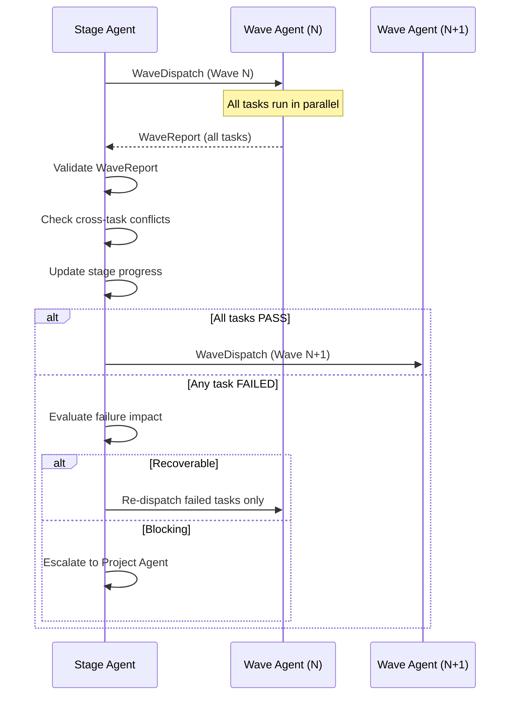
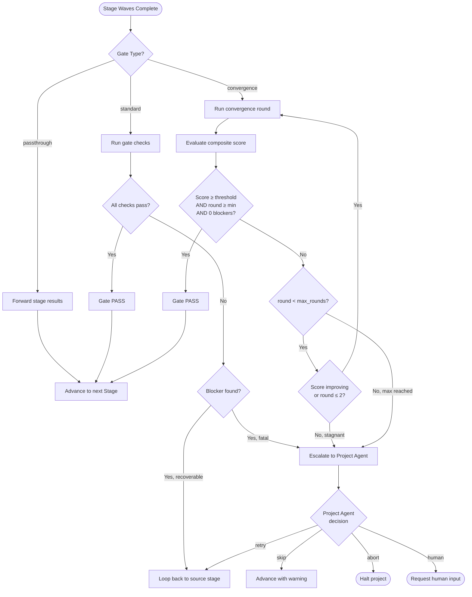
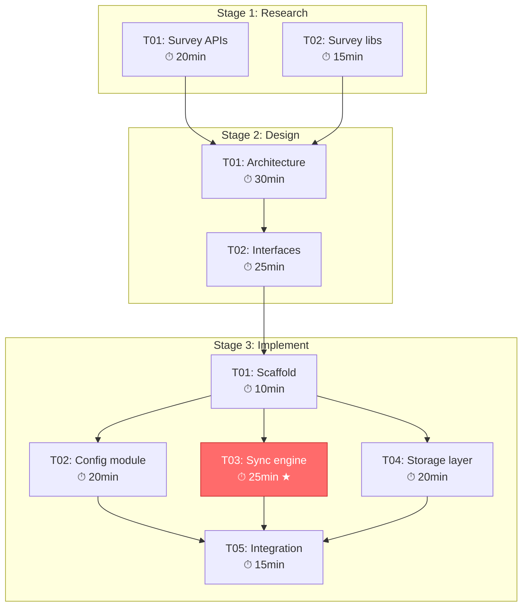
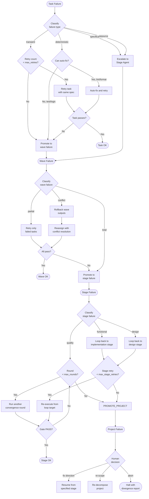

# Task Decomposition Framework & Gate Mechanism Design

> [!WARNING]
> **Historical design — superseded before v16.** This document preserves
> rationale and evolution evidence; it is not a runtime instruction. For the
> current three-layer Project → Wave → Task and checklist-round contracts, see
> [SKILL](../../workflow-system/agent/SKILL.md), [agent hierarchy](../../workflow-system/agent/references/agent-hierarchy.md),
> [execution protocol](../../workflow-system/agent/references/execution-protocol.md), [meta-framework](../../workflow-system/agent/references/meta-framework.md),
> [schemas](../../schemas/), and [runtime implementation](../../src/devolaflow/).

> **Version**: 1.0.0  
> **Date**: 2026-04-04  
> **Status**: Design  
> **Scope**: Stage/Wave/Task decomposition rules, gate quality mechanism, dependency matrix auto-generation, failure handling chain  
> **Inputs**: design_agent_hierarchy.md (4-layer hierarchy), wp2_local_patterns.md (EchoAccess patterns, 13-plan analysis)

---

## Table of Contents

1. [Design Principles](#1-design-principles)
2. [Stage Decomposition Rules](#2-stage-decomposition-rules)
3. [Wave Decomposition Rules](#3-wave-decomposition-rules)
4. [Task Decomposition Rules](#4-task-decomposition-rules)
5. [Gate Quality Mechanism](#5-gate-quality-mechanism)
6. [Dependency Matrix Auto-Generation](#6-dependency-matrix-auto-generation)
7. [Failure Handling Chain](#7-failure-handling-chain)

---

## 1. Design Principles

These principles are inherited from the 4-layer hierarchy design and extended for decomposition-specific concerns.

### D1 — Monotonic Granularity Refinement

Each decomposition level strictly increases granularity: Project → Stage (coarse functional boundary) → Wave (parallelism group) → Task (atomic work unit). No level may re-aggregate or blur the boundaries of a higher level. A Task never spans two Stages. A Wave never spans two Stages.

### D2 — Dependency Completeness

Every dependency between decomposition units must be explicitly declared. Implicit dependencies (assumed ordering, assumed artifact availability) are a defect class. The dependency graph must be a DAG — cycles are prohibited and detected algorithmically.

### D3 — Bounded Atomicity

Tasks are the atomic unit. Every Task must be completable by a single agent in a single session (< 30 min wall-clock for implementation, < 45 min for research/design). If a unit of work exceeds this bound, it must be decomposed further.

### D4 — Gate-Before-Advance

No downstream Stage may begin until the upstream Stage's gate evaluates to PASS. Gates are the only mechanism for state transitions between Stages. Skipping a gate requires explicit Project Agent override with human authorization.

### D5 — Deterministic Decomposition

Given the same project specification and workflow type, the decomposition rules should produce the same Stage/Wave/Task structure. This enables reproducibility, testing of the decomposition engine, and predictable resource estimation.

---

## 2. Stage Decomposition Rules

### 2.1 What Is a Stage

A Stage is the coarsest unit of decomposition below the Project level. It represents a distinct **functional phase** in the workflow — a bounded period where a specific type of work dominates (research, design, implementation, review, testing, release).

Stages map 1:1 to the workflow type's phase sequence. The workflow template (selected by the Project Agent at initialization) defines which Stages exist and their ordering.

### 2.2 Stage Boundary Criteria

A Stage boundary exists wherever any of these conditions hold:

| Criterion | Description | Example |
|-----------|-------------|---------|
| **Team Transition** | The primary AgentTeam role changes | Design → Implement (Design Team yields to Implement Team) |
| **Artifact Gate** | A significant artifact must be validated before downstream work begins | Design document must pass review before implementation starts |
| **Quality Checkpoint** | A formal quality evaluation is required | Code must pass test/review gate before release |
| **Risk Isolation** | A failure in this phase should not corrupt prior phase results | Test failures should not modify already-reviewed code |
| **Context Reset** | The working context shifts enough that a fresh agent context is beneficial | Moving from research mode to code-writing mode |

A Stage boundary does NOT exist for:
- Arbitrary time boundaries ("do this first half today")
- Parallelism grouping (that's Wave-level)
- Individual file ownership (that's Task-level)

### 2.3 Stage Definition Schema

```yaml
stage_definition:
  stage_id: "string"                    # S01, S02, ... S{nn}
  name: "string"                        # Human-readable name
  type: "research | design | plan | implement | review | test | benchmark | release | triage | fix"
  description: "string"                 # 2-3 sentence scope description

  position:
    workflow_type: "string"             # Which workflow template this belongs to
    sequence_index: "integer"           # Position in the workflow sequence (1-based)
    is_loopback_target: "boolean"       # Can this stage be re-entered on downstream failure?
    loop_back_from: ["string"]          # Which stages can loop back to this one

  scope:
    primary_team: "research | design | implement | test | review"
    secondary_teams: ["string"]         # Other teams that participate
    estimated_waves: "integer"          # Expected number of waves (1-7)
    estimated_tasks: "integer"          # Expected total tasks across all waves

  inputs:
    required_predecessor_stages: ["string"]  # Stage IDs that must PASS before this starts
    required_artifacts:                      # Artifacts this stage needs from predecessors
      - artifact_type: "string"             # research_report | design_doc | impl_plan | source_code | test_results | review_findings
        source_stage: "string"              # Which stage produces this
        required: "boolean"                 # Hard requirement vs optional input
    project_config_keys: ["string"]         # Keys from project config needed (e.g., "language", "coverage_threshold")

  outputs:
    produced_artifacts:
      - artifact_type: "string"
        description: "string"
    gate_type: "standard | convergence | passthrough"  # Which gate profile to use

  acceptance:
    criteria: ["string"]                # Testable done-when conditions
    quality_thresholds:
      composite_score_min: "number | null"
      coverage_pct_min: "number | null"
      max_blocker_findings: "integer"
      max_critical_findings: "integer | null"
    max_convergence_rounds: "integer"   # Max rounds for convergence gate (default 3)
```

### 2.4 Stage Naming Conventions

```
Format:  S{nn}_{snake_case_name}

Examples:
  S01_research
  S02_design
  S03_plan
  S04_implement
  S05_review
  S06_test
  S07_testgate
  S08_release

For workflow-specific stages:
  S01_bug_triage       (hotfix workflow)
  S02_fix              (hotfix workflow)
  S01_scope_analysis   (refactoring workflow)
```

Rules:
- Sequence numbers are always two digits, zero-padded
- Names use `snake_case`, max 20 characters
- The name reflects the stage's **purpose**, not its implementation
- Names are unique within a workflow instance

### 2.5 Stage Decomposition from Workflow Templates

The Project Agent selects a workflow type, which provides a stage template. The decomposition follows this algorithm:

```
ALGORITHM: StageDecomposition(workflow_type, project_spec)

1. LOAD workflow template for workflow_type
   → Yields ordered list of stage_types with gate_types

2. FOR each stage_type in template:
   a. INSTANTIATE stage_definition from template defaults
   b. RESOLVE inputs:
      - Map required_predecessor_stages to instantiated stage_ids
      - Map required_artifacts to predecessor output artifacts
   c. ESTIMATE scope:
      - Use project_spec size heuristics to estimate wave/task counts
      - Apply complexity multipliers from project_spec
   d. CONFIGURE gate:
      - Set quality_thresholds from project_spec or template defaults
      - Set max_convergence_rounds from template defaults (3 for impl, 1 for research)
   e. EMIT stage_definition

3. VALIDATE DAG:
   - Verify no cycles in required_predecessor_stages
   - Verify all referenced artifacts have a producing stage
   - Verify gate_types are compatible with stage_types

4. RETURN ordered list of stage_definitions
```

### 2.6 Predefined Stage Templates by Workflow Type

```yaml
workflow_stage_templates:
  full_pipeline:
    stages: [research, design, plan, implement, review, test, testgate, release]
    gates:  [standard, standard, standard, convergence, standard, standard, passthrough, standard]

  hotfix:
    stages: [triage, fix, test, release]
    gates:  [standard, standard, standard, standard]

  refactoring:
    stages: [scope_analysis, plan, implement, test, review]
    gates:  [standard, standard, convergence, standard, standard]

  research_only:
    stages: [research]
    gates:  [standard]

  design_only:
    stages: [research, design, review]
    gates:  [standard, standard, standard]

  migration:
    stages: [assessment, plan, implement, validate, cutover]
    gates:  [standard, standard, convergence, standard, standard]

  spike:
    stages: [research, prototype, evaluate]
    gates:  [standard, standard, standard]

  security_audit:
    stages: [threat_model, scan, analyze, remediate, verify]
    gates:  [standard, standard, standard, convergence, standard]

  documentation:
    stages: [survey, author, review]
    gates:  [standard, standard, standard]

  rdrr:
    stages: [research, design, review, refine]
    gates:  [standard, standard, standard, convergence]
```

---

## 3. Wave Decomposition Rules

### 3.1 What Is a Wave

A Wave is a group of Tasks within a Stage that can execute in parallel. Waves are the primary mechanism for exploiting parallelism. Within a Wave, all Tasks are independent — no shared writable files, no data dependencies, no ordering requirements. Waves within a Stage execute sequentially: Wave N+1 starts only after all Wave N Tasks complete.

### 3.2 Wave Formation Algorithm

```
ALGORITHM: WaveDecomposition(stage_definition, task_list)

INPUT:
  - stage_definition: the stage being decomposed
  - task_list: all tasks identified for this stage (unordered)

OUTPUT:
  - ordered list of waves, each containing a set of parallel tasks

1. BUILD dependency graph G from task_list
   - Nodes: tasks
   - Edges: depends_on relationships + file ownership conflicts

2. DETECT cycles in G
   IF cycles found → ERROR: "Circular dependency in stage {stage_id}"

3. COMPUTE topological layers (Kahn's algorithm):
   layer[0] = all tasks with in-degree 0 (no dependencies)
   WHILE unassigned tasks remain:
     layer[n+1] = tasks whose dependencies are ALL in layers 0..n

4. PARTITION each layer into waves respecting constraints:
   FOR each topological layer:
     WHILE layer has unassigned tasks:
       wave = new Wave()
       FOR each unassigned task in layer:
         IF wave.task_count < MAX_TASKS_PER_WAVE (5)
         AND task.owned_files ∩ wave.all_owned_files == ∅
         AND task has no file read-conflict with wave tasks:
           wave.add(task)
       EMIT wave

5. NUMBER waves sequentially: W01, W02, ..., W{nn}

6. RETURN ordered wave list
```

### 3.3 Wave Constraints

| Constraint | Value | Rationale |
|-----------|-------|-----------|
| Max tasks per wave | 5 | Prevents Wave Agent context overload; matches observed EchoAccess max |
| Min tasks per wave | 1 | Single-task waves are valid (scaffold, integration) |
| Max waves per stage | 7 | Observed ceiling across 13 plans; beyond this, the Stage is too large |
| File ownership disjointness | Strict | No two tasks in a wave may write to the same file |
| Read-only sharing | Allowed | Multiple tasks may read the same file within a wave |

### 3.4 Wave Synchronization Points

A synchronization point occurs at every Wave boundary. At synchronization:



At each synchronization point, the Stage Agent:
1. Collects all WaveReports from completed tasks
2. Validates cross-task consistency (no conflicting file modifications)
3. Updates the stage progress tracker
4. Decides whether to advance, retry failed tasks, or escalate

### 3.5 Wave Definition Schema

```yaml
wave_definition:
  wave_id: "string"                     # W01, W02, ..., W{nn}
  stage_id: "string"                    # Parent stage
  sequence_index: "integer"             # Position within the stage (1-based)

  tasks: ["string"]                     # List of task_ids in this wave
  max_parallelism: "integer"            # Number of tasks that run simultaneously

  dependencies:
    requires_waves: ["string"]          # Wave IDs that must complete before this wave starts
    required_artifacts:                 # Artifacts from prior waves needed by tasks in this wave
      - artifact_id: "string"
        source_wave: "string"
        source_task: "string"

  synchronization:
    on_all_pass: "advance"              # Proceed to next wave
    on_partial_fail: "retry_failed | advance_with_warnings | escalate"
    on_all_fail: "escalate"
    max_retry_per_task: 1               # Wave-level retry limit (separate from gate rounds)

  metadata:
    estimated_duration_seconds: "integer"
    description: "string"              # Brief description of what this wave accomplishes
```

### 3.6 Wave Numbering Convention

```
Format:  W{nn}

Within a stage:  W01, W02, W03, ...
Global unique:   S03_W02  (Stage 3, Wave 2)

For convergence loop waves (special):
  S04_W01_R1  (Stage 4, Wave 1, Round 1 — code review phase)
  S04_W02_R1  (Stage 4, Wave 2, Round 1 — fix phase)
  ...
  S04_W01_R2  (Stage 4, Wave 1, Round 2 — code review phase, second round)
```

### 3.7 Wave Pattern Library

Common wave patterns derived from the 13-plan analysis (wp2 §2.5):

```yaml
wave_patterns:
  scaffold_then_parallel:
    description: "Single scaffold task, then N parallel implementation tasks"
    structure:
      - W01: [scaffold_task]
      - W02: [impl_a, impl_b, impl_c, impl_d]  # parallel
      - W03: [integration_task]
    use_when: "Implementation stage with independent modules sharing a common scaffold"

  research_fanout:
    description: "N parallel research tasks, then synthesis"
    structure:
      - W01: [research_a, research_b, research_c]  # parallel
      - W02: [synthesis_task]
    use_when: "Research stage surveying independent topics"

  sequential_pipeline:
    description: "Each wave depends on the prior; no parallelism"
    structure:
      - W01: [task_a]
      - W02: [task_b]
      - W03: [task_c]
    use_when: "Strongly ordered work where each step modifies the same files"

  convergence_round:
    description: "Single round of the convergence loop (review→fix→test→fix)"
    structure:
      - W01: [code_review]
      - W02: [fix_review_findings]
      - W03: [test_execution]
      - W04: [fix_test_failures]
    use_when: "Inside convergence loop stages"

  parallel_review:
    description: "Multiple independent reviewers, then aggregation"
    structure:
      - W01: [review_code, review_security, review_architecture]  # parallel
      - W02: [aggregate_findings]
    use_when: "Review stage with multiple review dimensions"
```

---

## 4. Task Decomposition Rules

### 4.1 What Is a Task

A Task is the smallest unit of work in the decomposition hierarchy. It is **atomic** — it either completes successfully or fails entirely. A Task is assigned to exactly one Task Agent (Layer 3), which is the only layer that performs actual work. Tasks are the leaves of the decomposition tree.

### 4.2 Task Sizing Guidelines

```
┌─────────────────────────────────────────────────────────────────────────┐
│                         TASK SIZING RULES                              │
│                                                                        │
│  Hard Limits:                                                          │
│    Max wall-clock time:  30 min (implementation)                       │
│                          45 min (research/design)                      │
│    Max files owned:      6 writable files                              │
│    Max lines changed:    ~300 lines net (create+modify combined)       │
│    Max files read:       15 files                                      │
│                                                                        │
│  Soft Targets:                                                         │
│    Ideal wall-clock:     10-20 min                                     │
│    Ideal files owned:    2-4 writable files                            │
│    Ideal lines changed:  50-150 lines net                              │
│    Ideal complexity:     Single concern, single module                 │
│                                                                        │
│  Decompose Further When:                                               │
│    - Task requires understanding > 2 distinct subsystems               │
│    - Task has internal sequential dependencies                         │
│    - Task produces > 2 distinct artifact types                         │
│    - Estimated time > 30 min                                           │
│    - Task description exceeds 200 words                                │
│                                                                        │
│  Do NOT Decompose When:                                                │
│    - Task is a single function/method implementation                   │
│    - Task is a single test file                                        │
│    - Task is a single config file change                               │
│    - Task modifies < 50 lines across ≤ 2 files                        │
│    - Splitting would create artificial file-ownership boundaries       │
└─────────────────────────────────────────────────────────────────────────┘
```

### 4.3 Task Definition Schema

```yaml
task_definition:
  task_id: "string"                     # T{nn} within a wave, globally: S{nn}_W{nn}_T{nn}
  wave_id: "string"                     # Parent wave
  stage_id: "string"                    # Grandparent stage
  type: "code | test | review | research | design | benchmark | config | release"

  specification:
    title: "string"                     # Short title (< 80 chars)
    description: "string"              # Detailed specification (100-300 words)
    acceptance_criteria:                # Testable conditions
      - criterion: "string"            # What must be true
        verification: "string"         # How to verify (command, file check, etc.)
    constraints: ["string"]            # Non-negotiable boundaries

  scope:
    owned_files:
      create: ["string"]               # Files this task will create
      modify: ["string"]               # Files this task will modify
      read_only: ["string"]            # Files this task may read (not modify)
    owned_modules: ["string"]           # Logical modules this task owns (for dependency tracking)

  dependencies:
    depends_on_tasks: ["string"]        # Task IDs that must complete first (typically from prior waves)
    depends_on_artifacts:               # Specific artifacts needed
      - artifact_id: "string"
        source_task: "string"
        usage: "string"                 # How this task uses the artifact
    interface_contracts:                # Interfaces this task must satisfy or consume
      - name: "string"
        direction: "produces | consumes"
        signature: "string"

  estimation:
    complexity: "L | M | H"            # Low / Medium / High
    estimated_minutes: "integer"        # Expected duration (5-45)
    agent_type: "research | design | implement | test | review"
    model_preference: "fast | default"  # fast for trivial tasks, default for complex

  timeout_seconds: "integer"            # Hard timeout (default: estimated_minutes × 120)
  max_retries: "integer"                # Task-level retry limit (default: 1)
```

### 4.4 Task Description Template

Every task description follows this structure to ensure the Task Agent has sufficient context without ambiguity:

```
TASK DESCRIPTION TEMPLATE
─────────────────────────
WHAT: [1-2 sentences: what to produce/accomplish]

WHY: [1 sentence: why this task exists in the context of the stage]

INPUTS:
  - [artifact or file] from [source]: [brief description]
  - ...

OUTPUTS:
  - [file path]: [what it contains]
  - ...

CONSTRAINTS:
  - [constraint 1]
  - [constraint 2]

DONE WHEN:
  - [binary testable criterion 1]
  - [binary testable criterion 2]
```

**Example task description**:

```
WHAT: Implement the ConfigManager module that reads, validates, and
merges configuration from TOML files, environment variables, and CLI
arguments, following the design in design_document.md §3.2.

WHY: ConfigManager is the foundation dependency for all other modules
in this stage; it must be available before Wave 2 tasks begin.

INPUTS:
  - design_document.md §3.2 (read-only): ConfigManager interface spec
  - config_types.rs (read-only): Shared type definitions from S03_W01

OUTPUTS:
  - src/config/manager.rs: ConfigManager implementation
  - src/config/mod.rs: Module declaration
  - tests/config/manager_test.rs: Unit tests (≥ 80% coverage)

CONSTRAINTS:
  - Must use the ConfigSource trait from config_types.rs
  - No unwrap() calls; all errors must use the project error type
  - Environment variables take precedence over TOML values

DONE WHEN:
  - cargo build succeeds with zero warnings
  - cargo test config:: passes with ≥ 80% line coverage
  - ConfigManager satisfies all 4 interface methods from design §3.2
```

### 4.5 Inter-Task Dependency Syntax

Dependencies between tasks are expressed using a compact DAG notation that the dependency matrix generator can parse.

```yaml
dependency_notation:
  formats:
    direct: "T03 -> T07"                          # T07 depends on T03
    multi_source: "[T03, T04] -> T07"             # T07 depends on both T03 and T04
    artifact: "T03 --(config_types.rs)--> T07"    # T07 depends on T03's config_types.rs artifact
    cross_wave: "S02_W01_T01 -> S02_W02_T03"      # Cross-wave dependency (explicit)
    cross_stage: "S01::design_doc -> S03_W01_T01"  # Cross-stage dependency (stage artifact)

  rules:
    - Dependencies within a wave are PROHIBITED (tasks in same wave are independent)
    - Cross-wave dependencies within a stage are the primary mechanism
    - Cross-stage dependencies are expressed as artifact dependencies, not task dependencies
    - Circular dependencies are prohibited and detected by the DAG validator
```

### 4.6 Task ID Conventions

```
Local (within a wave):     T{nn}
                           T01, T02, ..., T05

Wave-scoped:               W{nn}_T{nn}
                           W02_T03

Stage-scoped:              S{nn}_W{nn}_T{nn}
                           S04_W02_T03

Global (project-unique):   {workflow}_{stage}_{wave}_{task}
                           full_S04_W02_T03
```

The shortest unambiguous form is used in context. Within a WaveDispatch, tasks are referenced as `T01`..`T05`. Within a StageReport, they are `W01_T01`. In the project-level dependency matrix, the stage-scoped form is used.

---

## 5. Gate Quality Mechanism

### 5.1 What Is a Gate

A Gate is a quality checkpoint that evaluates whether a Stage has met its acceptance criteria. Every Stage has exactly one Gate. The Gate evaluation is performed by the Stage Agent (Layer 1) after all Waves complete (or after a convergence round completes). The Gate produces a verdict: **PASS**, **FAIL**, or **ESCALATE**.

### 5.2 Gate Types

```yaml
gate_types:
  standard:
    description: "Single-evaluation gate. Runs once after all waves complete."
    rounds: 1
    checks: [build, test, lint, acceptance_criteria]
    use_when: "Research, design, plan, release, and simple test stages"

  convergence:
    description: "Multi-round gate with review→fix→test→fix loop."
    min_rounds: 1
    max_rounds: 6
    default_max_rounds: 3
    checks: [code_review, test, benchmark, solid_review, acceptance_criteria]
    convergence_phases: [review, fix, test, fix, benchmark, fix, final_review, fix]
    use_when: "Implementation stages requiring iterative quality improvement"

  passthrough:
    description: "No quality checks. Stage result passes through directly."
    rounds: 0
    checks: []
    use_when: "Intermediate aggregation stages where upstream gates are sufficient"
```

### 5.3 Gate Check Configuration Schema

```yaml
gate_check_config:
  gate_id: "string"                     # G_{stage_id}
  stage_id: "string"                    # Which stage this gate evaluates
  gate_type: "standard | convergence | passthrough"

  checks:
    build:
      enabled: "boolean"               # Default: true for code stages
      command: "string"                 # e.g., "cargo build --release"
      pass_condition: "exit_code == 0"
      fail_severity: "blocker"          # Build failure is always a blocker
      timeout_seconds: 300

    test:
      enabled: "boolean"
      command: "string"                 # e.g., "cargo test"
      pass_condition: "exit_code == 0 AND coverage >= coverage_threshold"
      coverage_threshold: "number"      # From project config (default 80)
      fail_severity: "blocker"
      timeout_seconds: 600

    lint:
      enabled: "boolean"
      command: "string"                 # e.g., "cargo clippy -- -D warnings"
      pass_condition: "exit_code == 0"
      fail_severity: "critical"         # Lint failure is critical, not blocker
      timeout_seconds: 120

    format:
      enabled: "boolean"
      command: "string"                 # e.g., "cargo fmt --check"
      pass_condition: "exit_code == 0"
      fail_severity: "major"
      timeout_seconds: 60

    code_review:
      enabled: "boolean"
      agent_type: "review"
      review_dimensions: ["correctness", "security", "performance", "style", "maintainability"]
      severity_weights:
        blocker: 25
        critical: 15
        major: 5
        minor: 1
        info: 0
      quality_score_formula: "max(0, 100 - Σ(weight × count))"
      pass_threshold: 85
      fail_severity: "varies"           # Based on individual findings

    solid_review:
      enabled: "boolean"
      agent_type: "review"
      review_dimensions: ["single_responsibility", "open_closed", "liskov", "interface_segregation", "dependency_inversion"]
      pass_threshold: 85

    benchmark:
      enabled: "boolean"
      command: "string | null"          # e.g., "cargo bench"
      baselines:                        # Optional performance baselines
        - metric: "string"
          threshold: "string"
          comparison: "lt | lte | gt | gte | eq"
      pass_condition: "all baselines met"
      fail_severity: "major"

    acceptance_criteria:
      enabled: true                     # Always enabled
      criteria: ["string"]             # From stage_definition.acceptance.criteria
      pass_condition: "all criteria met"
      fail_severity: "blocker"

  composite_score:
    enabled: "boolean"                  # True for convergence gates
    formula: "weighted_sum"
    dimensions:
      - name: "test_quality"
        weight: 0.30
        source: "test.coverage_pct OR (tests_passed / tests_total × 100)"
      - name: "code_review"
        weight: 0.30
        source: "code_review.quality_score"
      - name: "architecture"
        weight: 0.20
        source: "solid_review.quality_score"
      - name: "benchmark"
        weight: 0.20
        source: "benchmark.pass_rate OR 100 if no benchmarks"
    pass_threshold: 85
```

### 5.4 Gate Profiles

Configurable profiles control gate strictness. The project configuration selects a profile; individual stages can override.

```yaml
gate_profiles:
  strict:
    description: "Production-grade quality. All checks enabled, high thresholds."
    composite_score_threshold: 90
    coverage_threshold: 85
    max_blocker_findings: 0
    max_critical_findings: 0
    max_convergence_rounds: 4
    min_convergence_rounds: 2
    lint_policy: "zero_warnings"
    format_policy: "enforced"
    benchmark_policy: "required"
    use_when: "Production releases, security-critical code, public APIs"

  standard:
    description: "Balanced quality. Most checks enabled, reasonable thresholds."
    composite_score_threshold: 85
    coverage_threshold: 80
    max_blocker_findings: 0
    max_critical_findings: 2
    max_convergence_rounds: 3
    min_convergence_rounds: 1
    lint_policy: "zero_errors"
    format_policy: "enforced"
    benchmark_policy: "optional"
    use_when: "Default for most projects. Internal tools, feature branches."

  relaxed:
    description: "MVP/spike quality. Minimal checks, low thresholds."
    composite_score_threshold: 70
    coverage_threshold: 60
    max_blocker_findings: 0
    max_critical_findings: 5
    max_convergence_rounds: 2
    min_convergence_rounds: 1
    lint_policy: "zero_errors"
    format_policy: "advisory"
    benchmark_policy: "disabled"
    use_when: "Prototypes, spikes, PoCs, time-constrained hotfixes."

  audit:
    description: "Maximum scrutiny. Every check at highest sensitivity."
    composite_score_threshold: 95
    coverage_threshold: 90
    max_blocker_findings: 0
    max_critical_findings: 0
    max_convergence_rounds: 6
    min_convergence_rounds: 3
    lint_policy: "zero_warnings"
    format_policy: "enforced"
    benchmark_policy: "required_with_regression_check"
    use_when: "Security audits, compliance reviews, critical infrastructure."
```

### 5.5 Gate Report Format

Reference: EchoAccess `gate_report.md` pattern from wp2 §1.4

```yaml
gate_report:
  header:
    gate_id: "string"                   # G_S04
    stage_id: "string"
    stage_name: "string"
    gate_type: "standard | convergence | passthrough"
    gate_profile: "strict | standard | relaxed | audit"
    timestamp: "ISO8601"
    round: "integer"                    # Current round number (1 for standard gates)
    max_rounds: "integer"

  verdict:
    decision: "PASS | FAIL | ESCALATE"
    rationale: "string"                 # Human-readable explanation
    composite_score: "number | null"    # Overall weighted score (convergence gates)
    meets_threshold: "boolean"

  check_results:
    build:
      status: "pass | fail | skip"
      command: "string"
      exit_code: "integer"
      output_summary: "string"         # First 500 chars of output on failure
      duration_seconds: "number"

    test:
      status: "pass | fail | skip"
      tests_total: "integer"
      tests_passed: "integer"
      tests_failed: "integer"
      tests_skipped: "integer"
      coverage_pct: "number"
      coverage_threshold: "number"
      coverage_met: "boolean"
      failed_tests: ["string"]          # Names of failing tests (max 20)

    lint:
      status: "pass | fail | skip"
      errors: "integer"
      warnings: "integer"
      policy: "string"
      policy_met: "boolean"

    format:
      status: "pass | fail | skip"
      files_needing_format: "integer"

    code_review:
      status: "pass | fail | skip"
      quality_score: "number"
      pass_threshold: "number"
      findings_summary:
        blocker: "integer"
        critical: "integer"
        major: "integer"
        minor: "integer"
        info: "integer"
      top_findings:                     # Most severe findings (max 5)
        - severity: "string"
          location: "string"
          description: "string"

    solid_review:
      status: "pass | fail | skip"
      quality_score: "number"
      pass_threshold: "number"
      principle_scores:
        single_responsibility: "number"
        open_closed: "number"
        liskov: "number"
        interface_segregation: "number"
        dependency_inversion: "number"

    benchmark:
      status: "pass | fail | skip"
      results:
        - metric: "string"
          value: "string"
          threshold: "string"
          meets_threshold: "boolean"

    acceptance_criteria:
      status: "pass | fail"
      results:
        - criterion: "string"
          met: "boolean"
          evidence: "string"

  convergence_history:                  # Only for convergence gates, tracks improvement
    rounds:
      - round: "integer"
        composite_score: "number"
        blocker_count: "integer"
        critical_count: "integer"
        timestamp: "ISO8601"
    trend: "improving | stagnant | degrading"
    monotonic_after_round_2: "boolean"  # Must be true for PASS

  next_action:
    action: "advance | retry | escalate | loop_back"
    target: "string | null"             # Next stage (advance) or loop-back stage
    details: "string"                   # Specific instructions
```

### 5.6 Gate Insertion Rules

Gates are inserted automatically based on the workflow template. The following rules determine gate behavior:

```
GATE INSERTION RULES
─────────────────────
AUTOMATIC GATES (no user configuration needed):
  1. Every Stage in the workflow template gets a gate.
  2. Gate type is determined by the template (§2.6 predefined templates).
  3. Gate profile defaults to the project-level setting.

GATE TYPE SELECTION:
  IF stage.type IN [implement, fix, remediate, refactor]:
    gate_type = convergence
  ELIF stage.type IN [testgate]:
    gate_type = passthrough (upstream gates already validated)
  ELSE:
    gate_type = standard

CONVERGENCE GATE INSERTION (within implementation stages):
  The convergence loop inserts sub-waves automatically:
  FOR round IN 1..max_rounds:
    INSERT Wave: code_review (Review Agent)
    INSERT Wave: fix_review  (Implement Agent)
    INSERT Wave: test        (Test Agent)
    INSERT Wave: fix_test    (Implement Agent)
    IF benchmark.enabled:
      INSERT Wave: benchmark   (Test Agent)
      INSERT Wave: fix_bench   (Implement Agent)
    INSERT Wave: final_review  (Review Agent)
    INSERT Wave: fix_final     (Implement Agent)
    EVALUATE gate
    IF PASS: break
    IF round == max_rounds: ESCALATE

MANUAL GATE OVERRIDE:
  The Project Agent may insert additional gates between stages
  when the human requests a checkpoint (e.g., "pause after design
  for my review"). Manual gates always have gate_type = standard
  and require human PASS/FAIL input.
```

### 5.7 Gate Evaluation Flowchart



---

## 6. Dependency Matrix Auto-Generation

### 6.1 Purpose

The dependency matrix is a complete representation of all dependencies across Stages, Waves, and Tasks. It is auto-generated from the decomposition definitions and serves three purposes:
1. **Validation**: Detect cycles, missing dependencies, and unreachable tasks
2. **Scheduling**: Determine the critical path and optimal parallelism
3. **Impact Analysis**: When a task fails, identify all downstream tasks affected

### 6.2 Dependency Matrix Format

Reference: EchoAccess `wp1a_dependency_matrix.md` pattern from wp2 §1.5

```yaml
dependency_matrix:
  metadata:
    project_id: "string"
    workflow_type: "string"
    generated_at: "ISO8601"
    total_stages: "integer"
    total_waves: "integer"
    total_tasks: "integer"
    total_edges: "integer"
    critical_path_length: "integer"     # Number of nodes on critical path

  stages:
    - stage_id: "S01"
      name: "research"
      depends_on_stages: []
      produces_artifacts: ["research_report"]
    - stage_id: "S02"
      name: "design"
      depends_on_stages: ["S01"]
      consumes_artifacts: ["research_report"]
      produces_artifacts: ["design_doc"]
    # ...

  stage_adjacency:                      # Stage-level DAG as adjacency list
    S01: [S02]
    S02: [S03]
    S03: [S04, S05]
    S04: [S06]
    S05: [S06]
    S06: [S07]
    S07: [S08]

  task_dependencies:                    # Full task-level dependency edges
    - from: "S03_W01_T01"
      to: "S03_W02_T01"
      type: "data"                      # data | artifact | file | interface
      artifact: "scaffold files"
    - from: "S03_W01_T01"
      to: "S03_W02_T02"
      type: "file"
      artifact: "Cargo.toml"
    # ...

  file_ownership:                       # Which task owns which files (for conflict detection)
    "src/config/manager.rs":
      owner: "S03_W02_T01"
      mode: "create"
    "src/config/mod.rs":
      owner: "S03_W02_T01"
      mode: "modify"
    "src/sync/engine.rs":
      owner: "S03_W02_T02"
      mode: "create"
    # ...

  interface_contracts:                  # Cross-task interface dependencies
    - interface: "ConfigSource trait"
      producer: "S03_W01_T01"
      consumers: ["S03_W02_T01", "S03_W02_T03"]
      frozen_after: "S03_W01"           # Interface must not change after this wave
    # ...

  critical_path:                        # Longest dependency chain
    path: ["S01_W01_T01", "S02_W01_T01", "S02_W02_T01", "S03_W01_T01", "S03_W02_T02", "S03_W03_T01", "S04_W01_T01", "S05_W01_T01"]
    estimated_duration_minutes: 240
    bottleneck: "S03_W02_T02"           # Task with longest duration on critical path
```

### 6.3 Auto-Generation Algorithm

```
ALGORITHM: GenerateDependencyMatrix(stages[], waves[], tasks[])

INPUT:
  - stages[]: All stage definitions
  - waves[]: All wave definitions
  - tasks[]: All task definitions

OUTPUT:
  - dependency_matrix: Complete matrix with adjacency, ownership, critical path

STEPS:

1. BUILD stage-level adjacency graph:
   FOR each stage S:
     FOR each required_predecessor P in S.inputs.required_predecessor_stages:
       ADD edge P → S to stage_adjacency

2. BUILD task-level dependency graph:
   FOR each task T:
     // Explicit task dependencies
     FOR each dep in T.dependencies.depends_on_tasks:
       ADD edge dep → T to task_graph

     // Implicit wave-ordering dependencies
     IF T.wave_id has a predecessor wave PW in the same stage:
       FOR each task PT in PW:
         IF T.dependencies.depends_on_artifacts references PT's output:
           ADD edge PT → T to task_graph (type: artifact)

     // Cross-stage artifact dependencies
     FOR each artifact_dep in T.dependencies.depends_on_artifacts:
       IF artifact_dep.source_task is in a different stage:
         ADD edge artifact_dep.source_task → T to task_graph (type: cross_stage)

3. BUILD file ownership map:
   ownership = {}
   FOR each task T:
     FOR each file F in T.scope.owned_files.create + T.scope.owned_files.modify:
       IF F in ownership:
         CONFLICT: file F owned by both ownership[F] and T
         → Raise error unless tasks are in different waves with explicit ordering
       ownership[F] = {task: T.task_id, mode: create|modify}

4. BUILD interface contract map:
   FOR each task T:
     FOR each contract C in T.dependencies.interface_contracts:
       IF C.direction == "produces":
         REGISTER T as producer of C.name
       IF C.direction == "consumes":
         REGISTER T as consumer of C.name
   VALIDATE: every consumed interface has exactly one producer
   VALIDATE: producer executes before all consumers (topological order)

5. DETECT CYCLES (see §6.4)

6. COMPUTE CRITICAL PATH (see §6.5)

7. EMIT dependency_matrix
```

### 6.4 Cycle Detection Algorithm

The system uses a depth-first search with coloring to detect cycles in the dependency graph. This runs at three levels: stage, wave, and task.

```
ALGORITHM: DetectCycles(graph)

Uses three-color DFS:
  WHITE = unvisited
  GRAY  = in current DFS path (visiting descendants)
  BLACK = fully processed (all descendants visited)

FOR each node N in graph:
  IF color[N] == WHITE:
    IF DFS_Visit(N) finds cycle:
      RETURN CycleError with the cycle path

FUNCTION DFS_Visit(node):
  color[node] = GRAY
  FOR each neighbor in graph.adjacent(node):
    IF color[neighbor] == GRAY:
      → CYCLE DETECTED: reconstruct path from neighbor to node
      RETURN cycle_path
    IF color[neighbor] == WHITE:
      result = DFS_Visit(neighbor)
      IF result is cycle:
        RETURN result
  color[node] = BLACK
  RETURN no_cycle

CYCLE RESOLUTION:
  When a cycle is detected, the system reports:
  1. The exact cycle path (e.g., "T01 → T03 → T05 → T01")
  2. The dependency types on each edge
  3. Suggested resolution:
     - If file dependency: restructure file ownership
     - If interface dependency: extract shared interface to a prior wave
     - If artifact dependency: reorder waves
```

### 6.5 Critical Path Identification

The critical path is the longest dependency chain through the task graph. It determines the minimum possible project duration even with unlimited parallelism.

```
ALGORITHM: CriticalPath(task_graph, durations)

1. COMPUTE topological order of task_graph

2. FOR each task T in topological order:
   earliest_start[T] = max(earliest_finish[dep] for dep in T.predecessors)
                        OR 0 if T has no predecessors
   earliest_finish[T] = earliest_start[T] + duration[T]

3. project_duration = max(earliest_finish[T] for all T)

4. FOR each task T in REVERSE topological order:
   latest_finish[T] = min(latest_start[succ] for succ in T.successors)
                       OR project_duration if T has no successors
   latest_start[T] = latest_finish[T] - duration[T]

5. FOR each task T:
   slack[T] = latest_start[T] - earliest_start[T]
   IF slack[T] == 0:
     T is on the critical path

6. EXTRACT critical_path = all tasks with slack == 0, in topological order

7. IDENTIFY bottleneck = task on critical path with max duration

8. RETURN {critical_path, project_duration, bottleneck, slack_per_task}
```

### 6.6 Dependency Matrix Visualization (Mermaid Template)



Legend: `★` = critical path bottleneck, red = critical path node

### 6.7 Example Dependency Matrix (Tabular View)

For quick human review, the matrix can be rendered as a table:

```
DEPENDENCY MATRIX — Example Full Pipeline Project
═══════════════════════════════════════════════════════════════════

  TASK ID          │ DEPENDS ON              │ FILES OWNED              │ EST.  │ SLACK │ CP?
  ─────────────────┼─────────────────────────┼──────────────────────────┼───────┼───────┼────
  S01_W01_T01      │ —                       │ research_report.md       │ 20min │ 0     │ ★
  S01_W01_T02      │ —                       │ lib_survey.md            │ 15min │ 5     │
  S02_W01_T01      │ S01_W01_T01,T02         │ design_doc.md            │ 30min │ 0     │ ★
  S02_W02_T01      │ S02_W01_T01             │ interfaces.md            │ 25min │ 0     │ ★
  S03_W01_T01      │ S02_W02_T01             │ Cargo.toml, src/main.rs  │ 10min │ 0     │ ★
  S03_W02_T01      │ S03_W01_T01             │ src/config/*             │ 20min │ 5     │
  S03_W02_T02      │ S03_W01_T01             │ src/sync/*               │ 25min │ 0     │ ★
  S03_W02_T03      │ S03_W01_T01             │ src/storage/*            │ 20min │ 5     │
  S03_W03_T01      │ S03_W02_T01,T02,T03     │ src/lib.rs, tests/int/*  │ 15min │ 0     │ ★
  ─────────────────┴─────────────────────────┴──────────────────────────┴───────┴───────┴────
  Critical path: T01 → T01 → T01 → T01 → T02 → T01    Total: 125 min
  Parallelism savings: 40 min (3 tasks run in parallel in S03_W02)
```

---

## 7. Failure Handling Chain

### 7.1 Failure Classification

Every failure in the system is classified at the point of occurrence, determining the handling strategy:

```yaml
failure_classification:
  levels:
    task_failure:
      scope: "Single task within a wave"
      classifier: "Wave Agent"
      categories:
        - name: "transient"
          description: "Network timeout, rate limit, tool crash — likely to succeed on retry"
          examples: ["API rate limit", "git lock contention", "build server timeout"]
          default_action: "retry"

        - name: "deterministic"
          description: "The task spec is executable but produces wrong results"
          examples: ["test failure", "lint error", "type mismatch", "missing import"]
          default_action: "fix_and_retry"

        - name: "specification"
          description: "The task spec is ambiguous, contradictory, or impossible"
          examples: ["conflicting interface requirements", "missing design reference", "impossible constraint"]
          default_action: "escalate"

        - name: "resource"
          description: "Required resource is unavailable"
          examples: ["file not found", "dependency not installable", "permission denied"]
          default_action: "escalate"

    wave_failure:
      scope: "One or more tasks in a wave failed"
      classifier: "Stage Agent"
      categories:
        - name: "partial"
          description: "Some tasks passed, some failed; failures don't block passing tasks' outputs"
          default_action: "retry_failed_tasks"

        - name: "conflict"
          description: "Multiple tasks produced conflicting outputs (overlapping file edits, inconsistent interfaces)"
          default_action: "rollback_and_reassign"

        - name: "total"
          description: "All tasks in the wave failed"
          default_action: "escalate_to_project"

    stage_failure:
      scope: "Stage gate evaluated to FAIL after max rounds"
      classifier: "Project Agent"
      categories:
        - name: "quality"
          description: "Gate composite score too low, but code is functional"
          default_action: "add_convergence_round_or_escalate"

        - name: "functional"
          description: "Core functionality is broken (build fails, critical tests fail)"
          default_action: "loop_back_to_implementation"

        - name: "design"
          description: "Implementation reveals a design flaw"
          default_action: "loop_back_to_design"

    project_failure:
      scope: "Multiple stages failed or human escalation required"
      classifier: "Human"
      categories:
        - name: "recoverable"
          description: "Project can resume from a specific stage after human intervention"
          default_action: "human_provides_fix_direction"

        - name: "scope_change"
          description: "Requirements changed; existing decomposition is invalid"
          default_action: "re_decompose_from_changed_stage"

        - name: "terminal"
          description: "Project cannot be completed as specified"
          default_action: "produce_divergence_report"
```

### 7.2 Failure Handling Flowchart



### 7.3 Retry Limits and Escalation Thresholds

```yaml
retry_limits:
  task_level:
    max_retries: 1                      # Wave Agent retries a task at most once
    retry_delay_seconds: 0              # No delay (fresh agent spawn)
    retry_context: "same spec + error details from prior attempt"
    on_exhaustion: "promote to wave failure"

  wave_level:
    max_wave_retries: 1                 # Stage Agent retries a wave at most once
    partial_retry: true                 # Only re-run failed tasks, not the whole wave
    conflict_resolution: "rollback all wave outputs, re-dispatch with explicit conflict avoidance instructions"
    on_exhaustion: "promote to stage failure"

  convergence_round_level:
    min_rounds: 1                       # Minimum rounds before PASS is possible
    max_rounds: 3                       # Default; overridable by gate profile (1-6)
    stagnation_detection: true          # If score doesn't improve for 2 consecutive rounds, escalate
    on_exhaustion: "promote to project failure"

  stage_level:
    max_stage_retries: 2                # Project Agent can retry a stage at most twice
    loop_back_budget: 3                 # Total loop-backs across all stages in a project
    on_exhaustion: "escalate to human"

  project_level:
    max_human_escalations: 3            # After 3 human escalations, suggest project re-scoping
    divergence_report_required: true    # Always produce a report on terminal failure
```

### 7.4 Escalation Message Schema

When a failure is promoted to the next level, the escalation message carries all diagnostic context:

```yaml
escalation_message:
  header:
    escalation_id: "string"
    source_layer: "task | wave | stage"
    source_id: "string"                 # ID of the failing unit
    target_layer: "wave | stage | project | human"
    timestamp: "ISO8601"
    urgency: "immediate | next_cycle | advisory"

  failure:
    classification: "string"            # From §7.1 categories
    description: "string"              # Human-readable failure description
    root_cause: "string | null"        # Best-effort root cause analysis
    evidence:                           # Diagnostic evidence (max 1000 tokens)
      error_output: "string | null"     # Command output / error message
      failing_check: "string | null"    # Which gate check failed
      affected_files: ["string"]        # Files involved in the failure

  retry_history:
    attempts: "integer"                 # How many times this was retried
    outcomes:                           # Result of each retry attempt
      - attempt: "integer"
        result: "pass | fail"
        error_summary: "string"
        timestamp: "ISO8601"

  impact:
    blocked_tasks: ["string"]           # Downstream tasks that cannot proceed
    blocked_stages: ["string"]          # Downstream stages that cannot proceed
    critical_path_impact: "boolean"     # Is this failure on the critical path?
    estimated_delay_minutes: "integer"  # How much delay this failure causes

  recommendation:
    action: "retry | fix_spec | loop_back | abort | request_human"
    details: "string"                   # Specific actionable recommendation
    alternative_actions: ["string"]     # Other options if primary recommendation fails
```

### 7.5 Human Escalation Triggers

The system escalates to a human when any of these conditions are met:

```
HUMAN ESCALATION TRIGGERS
──────────────────────────
ALWAYS ESCALATE:
  1. Stage retry budget exhausted (max_stage_retries reached for any stage)
  2. Convergence loop stagnation (score not improving for 2+ rounds at max_rounds)
  3. Project loop-back budget exhausted (3+ total loop-backs across all stages)
  4. Specification error (task spec is contradictory or impossible)
  5. Security concern (potential vulnerability discovered during review)
  6. Scope change needed (implementation reveals requirements gap)

NEVER AUTO-ESCALATE (retry first):
  1. Transient failures (network, rate limit, timeout)
  2. Lint/format errors (auto-fixable)
  3. Single test failure with clear error message
  4. Build error from missing import or typo

HUMAN ESCALATION MESSAGE FORMAT:
  ┌─────────────────────────────────────────────────────────┐
  │  ⚠ HUMAN DECISION REQUIRED                             │
  │                                                         │
  │  Stage: S04_implement (Round 3 of 3)                    │
  │  Issue: Convergence loop stagnant — composite score     │
  │         stuck at 78 (threshold: 85)                     │
  │                                                         │
  │  Root Cause: 2 critical findings in error handling      │
  │  that require architectural decision:                   │
  │    F003: Error recovery strategy undefined for          │
  │          partial network failures                       │
  │    F007: Retry semantics conflict between config        │
  │          module and sync engine                         │
  │                                                         │
  │  Options:                                               │
  │    [A] Provide error recovery strategy → retry stage    │
  │    [B] Lower quality threshold to 75 → accept as-is    │
  │    [C] Loop back to design stage → redesign error       │
  │        handling                                         │
  │    [D] Abort project                                    │
  │                                                         │
  │  Impact: 2 downstream stages blocked (review, test)     │
  │  Critical path delay: ~45 min per additional round      │
  └─────────────────────────────────────────────────────────┘
```

### 7.6 Rollback Strategy

When a failure requires rolling back completed work:

```yaml
rollback_strategy:
  task_rollback:
    scope: "Undo a single task's file modifications"
    mechanism: "git checkout -- {owned_files}"
    preserves: "All other tasks' modifications in the same wave"
    when: "Task failure with file corruption or wrong-direction implementation"

  wave_rollback:
    scope: "Undo all tasks in a wave"
    mechanism: "git stash or git checkout to pre-wave state"
    preserves: "All prior waves' completed work"
    when: "Wave conflict (multiple tasks produced inconsistent outputs)"

  stage_rollback:
    scope: "Undo all waves in a stage"
    mechanism: "git reset to pre-stage commit (soft reset, no data loss)"
    preserves: "All prior stages' completed work"
    when: "Stage gate FAIL with functional failure — need fresh implementation attempt"

  project_rollback:
    scope: "N/A — projects don't roll back; they re-scope or abort"
    mechanism: "Human decision"
    when: "Terminal project failure"

  rollback_safety:
    - "NEVER force-push or hard-reset without human authorization"
    - "ALWAYS create a backup branch before rollback: backup/{stage_id}_{timestamp}"
    - "Rollback only affects uncommitted or stage-committed changes; pushed code is never auto-rolled-back"
    - "Task Agents have no rollback authority; only Stage and Project Agents can initiate rollback"
```

### 7.7 End-to-End Failure Scenario

Example: A test failure in Wave 2 of the Implementation stage, propagating through the failure chain.

```
TIME  EVENT                                           ACTION
────────────────────────────────────────────────────────────────────────
T+0   Task S03_W02_T02 (sync engine) fails:           cargo test fails
      - 3 tests fail with "connection refused"         Classification: transient

T+1   Wave Agent retries T02 (attempt 2/2):            Retry with same spec
      - Same 3 tests fail again                        Classification: deterministic
      - Error: mock server not initialized

T+2   Wave Agent promotes to wave failure:             WaveReport(partial_fail)
      - T01 PASS, T02 FAIL, T03 PASS
      - Wave Agent reports to Stage Agent

T+3   Stage Agent evaluates wave failure:              Classification: partial
      - Only T02 failed; T01 and T03 outputs valid
      - No file conflicts detected

T+4   Stage Agent retries Wave 2 with T02 only:        Partial wave retry
      - T02 re-dispatched with error context
      - Error context: "mock server init required in test setup"

T+5   Retried T02 succeeds:                           Task PASS
      - Agent adds mock server setup to test fixture
      - All 3 previously-failing tests now pass

T+6   Stage Agent advances to Wave 3:                 Normal flow resumes
      - Total delay: ~10 min (1 task retry + 1 wave retry)
      - No escalation to Project Agent

────────────────────────────────────────────────────────────────────────
ALTERNATE TIMELINE (if retry also fails):

T+5'  Retried T02 fails again:                        Different error
      - "ConfigManager trait not found" — wrong interface

T+6'  Stage Agent promotes to stage failure:           Classification: specification
      - Interface mismatch between T01 and T02
      - Root cause: design doc §3.2 inconsistent with §4.1

T+7'  Project Agent evaluates:                        loop_back_to_design
      - Stage retry budget: 0/2 used
      - Loop back to S02_design with feedback:
        "§3.2 ConfigSource and §4.1 SyncAdapter have incompatible
         error types; reconcile before re-implementation"

T+8'  Design stage re-executes targeted fix:           Remediation wave
      - Single task: reconcile error types in design doc
      - Gate PASS

T+9'  Implementation stage re-executes:                Full re-run from W01
      - Uses updated design doc
      - All waves pass

T+10' Stage gate evaluates: PASS                       Project advances
      - Total delay: ~60 min
      - 1 stage retry, 1 loop-back used
```

---

## Appendix A: Complete Decomposition Example

A full decomposition for a medium-complexity project (CLI file sync tool), showing all three levels.

```yaml
decomposition_example:
  project:
    name: "File Sync CLI Tool"
    workflow_type: "full_pipeline"
    gate_profile: "standard"

  stages:
    - stage_id: S01_research
      type: research
      waves: 1
      tasks: 2
      gate: standard

    - stage_id: S02_design
      type: design
      waves: 2
      tasks: 3
      gate: standard

    - stage_id: S03_plan
      type: plan
      waves: 1
      tasks: 1
      gate: standard

    - stage_id: S04_implement
      type: implement
      waves: 3  # plus convergence loop waves
      tasks: 9
      gate: convergence (max_rounds: 3)

    - stage_id: S05_review
      type: review
      waves: 1
      tasks: 3
      gate: standard

    - stage_id: S06_test
      type: test
      waves: 1
      tasks: 2
      gate: standard

    - stage_id: S07_testgate
      type: test
      waves: 0
      tasks: 0
      gate: passthrough

    - stage_id: S08_release
      type: release
      waves: 1
      tasks: 1
      gate: standard

  detailed_implementation_stage:
    stage_id: S04_implement
    waves:
      - wave_id: S04_W01
        description: "Project scaffold and shared types"
        tasks:
          - task_id: S04_W01_T01
            title: "Create project scaffold"
            type: code
            complexity: L
            est_minutes: 10
            owned_files_create: [Cargo.toml, src/main.rs, src/lib.rs, src/error.rs]
            depends_on: []

      - wave_id: S04_W02
        description: "Core modules (parallel)"
        tasks:
          - task_id: S04_W02_T01
            title: "Implement ConfigManager"
            type: code
            complexity: M
            est_minutes: 20
            owned_files_create: [src/config/manager.rs, src/config/mod.rs]
            depends_on: [S04_W01_T01]

          - task_id: S04_W02_T02
            title: "Implement SyncEngine"
            type: code
            complexity: H
            est_minutes: 25
            owned_files_create: [src/sync/engine.rs, src/sync/mod.rs, src/sync/diff.rs]
            depends_on: [S04_W01_T01]

          - task_id: S04_W02_T03
            title: "Implement StorageBackend"
            type: code
            complexity: M
            est_minutes: 20
            owned_files_create: [src/storage/backend.rs, src/storage/mod.rs]
            depends_on: [S04_W01_T01]

          - task_id: S04_W02_T04
            title: "Implement ErrorTypes"
            type: code
            complexity: L
            est_minutes: 10
            owned_files_modify: [src/error.rs]
            depends_on: [S04_W01_T01]

      - wave_id: S04_W03
        description: "Integration and CLI wiring"
        tasks:
          - task_id: S04_W03_T01
            title: "Wire CLI interface"
            type: code
            complexity: M
            est_minutes: 20
            owned_files_modify: [src/main.rs, src/lib.rs]
            depends_on: [S04_W02_T01, S04_W02_T02, S04_W02_T03, S04_W02_T04]

          - task_id: S04_W03_T02
            title: "Write integration tests"
            type: test
            complexity: M
            est_minutes: 20
            owned_files_create: [tests/integration/sync_test.rs, tests/integration/config_test.rs]
            depends_on: [S04_W02_T01, S04_W02_T02, S04_W02_T03]
```

## Appendix B: Gate Report Template (Markdown)

For human-readable gate reports written to disk:

```markdown
# Gate Report: {stage_name}

## Summary
| Field | Value |
|-------|-------|
| Stage | {stage_id}: {stage_name} |
| Gate Type | {standard/convergence/passthrough} |
| Profile | {strict/standard/relaxed/audit} |
| Round | {current}/{max} |
| Verdict | **{PASS/FAIL/ESCALATE}** |
| Composite Score | {score}/{threshold} |
| Timestamp | {ISO8601} |

## Check Results

### Build
- Status: {PASS/FAIL}
- Command: `{build_command}`
- Duration: {N}s

### Tests
- Status: {PASS/FAIL}
- Passed: {N}/{total} | Failed: {N} | Skipped: {N}
- Coverage: {N}% (threshold: {N}%)

### Lint
- Status: {PASS/FAIL}
- Errors: {N} | Warnings: {N}

### Code Review
- Quality Score: {N}/100
- Findings: {blocker}B / {critical}C / {major}M / {minor}m / {info}i

### Architecture Review
- Quality Score: {N}/100
- SRP: {N} | OCP: {N} | LSP: {N} | ISP: {N} | DIP: {N}

### Acceptance Criteria
| Criterion | Met? | Evidence |
|-----------|------|----------|
| {criterion_1} | {Yes/No} | {evidence} |
| {criterion_2} | {Yes/No} | {evidence} |

## Convergence History
| Round | Composite | Blockers | Criticals | Trend |
|-------|-----------|----------|-----------|-------|
| 1     | {score}   | {N}      | {N}       | —     |
| 2     | {score}   | {N}      | {N}       | {↑/↓/→} |
| 3     | {score}   | {N}      | {N}       | {↑/↓/→} |

## Decision
**Verdict**: {PASS/FAIL/ESCALATE}
**Rationale**: {explanation}
**Next Action**: {advance to S{nn} / run round {N+1} / escalate to Project Agent}
```

## Appendix C: Decomposition Validation Checklist

Before executing a decomposition, validate against this checklist:

```
DECOMPOSITION VALIDATION CHECKLIST
═══════════════════════════════════

STAGE LEVEL:
  □ All stages from workflow template are present
  □ Stage ordering matches template (no reordering without override)
  □ Every stage has a gate configured
  □ No stage depends on itself
  □ All cross-stage artifact dependencies have producers

WAVE LEVEL:
  □ No wave has > 5 tasks
  □ No stage has > 7 waves (excluding convergence sub-waves)
  □ Tasks within a wave have no file ownership overlaps
  □ Tasks within a wave have no data dependencies on each other
  □ Wave ordering is topologically correct

TASK LEVEL:
  □ Every task has a type, title, description, acceptance criteria
  □ Every task owns ≤ 6 writable files
  □ Every task has estimated duration ≤ 30 min (impl) or ≤ 45 min (research)
  □ Every task description follows the template (WHAT/WHY/INPUTS/OUTPUTS/CONSTRAINTS/DONE WHEN)
  □ No file is owned by two tasks in the same wave
  □ All interface contracts have a producer and at least one consumer

DEPENDENCY GRAPH:
  □ No cycles detected (cycle detection algorithm ran clean)
  □ Critical path identified and documented
  □ All tasks are reachable from at least one root node
  □ No orphan tasks (tasks with no predecessors AND no successors, unless they are root/leaf nodes)

GATE CONFIGURATION:
  □ Gate profile matches project requirements
  □ Convergence stages have min_rounds ≥ 1 and max_rounds ≤ 6
  □ Quality thresholds are set (not left at 0 or null)
  □ Acceptance criteria are binary/testable (no subjective language)
```

---

*Design document generated: 2026-04-04 | Status: Architecture Design Complete*  
*Inputs: design_agent_hierarchy.md, wp2_local_patterns.md*  
*Cross-references: Gate formula from hierarchy design Appendix A, convergence loop from Appendix C*  
*Next: Integration with workflow type engine and implementation planning*
