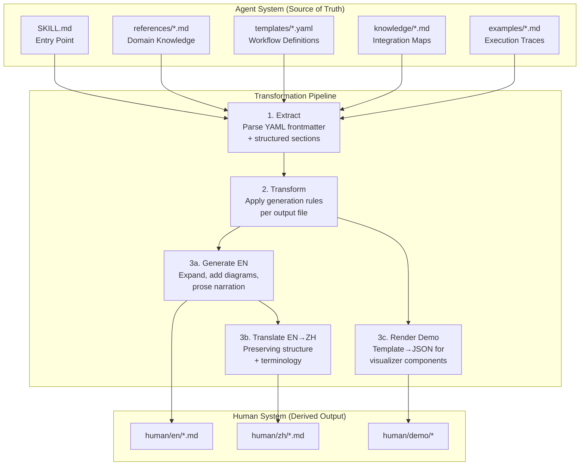
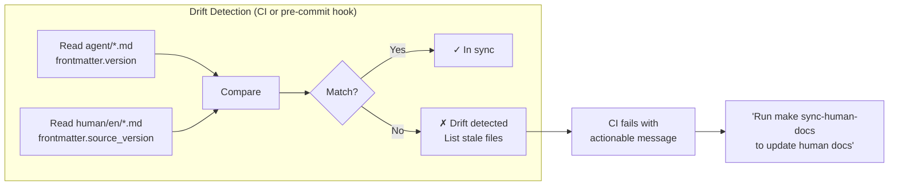
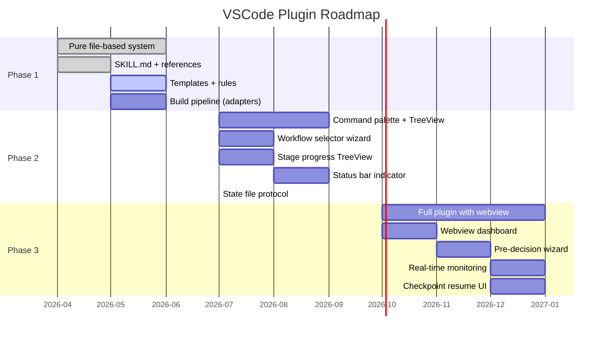

# Dual-System Output Architecture & VSCode Plugin Roadmap

> [!WARNING]
> **Historical design — superseded before v16.** This document preserves
> rationale and evolution evidence; it is not a runtime instruction. For the
> current three-layer Project → Wave → Task and checklist-round contracts, see
> [SKILL](../../workflow-system/agent/SKILL.md), [agent hierarchy](../../workflow-system/agent/references/agent-hierarchy.md),
> [execution protocol](../../workflow-system/agent/references/execution-protocol.md), [meta-framework](../../workflow-system/agent/references/meta-framework.md),
> [schemas](../../schemas/), and [runtime implementation](../../src/devolaflow/).

> **Version**: 1.0.0
> **Date**: 2026-04-04
> **Status**: Design
> **Scope**: Agent system directory design, human system directory design, sync pipeline, VSCode plugin boundary analysis, 3-phase plugin roadmap, versioning strategy.
> **Inputs**: Delivery Architecture (design_delivery_architecture.md), Code-Rules agent guide (agent/en/guide.md), Code-Rules architecture (design/en/architecture.md), desires.md

---

## Table of Contents

1. [Design Principles](#1-design-principles)
2. [Agent System — Directory Structure](#2-agent-system--directory-structure)
3. [Human System — Directory Structure](#3-human-system--directory-structure)
4. [Mapping & Sync Mechanism](#4-mapping--sync-mechanism)
5. [VSCode Plugin Boundary Analysis](#5-vscode-plugin-boundary-analysis)
6. [VSCode Plugin 3-Phase Roadmap](#6-vscode-plugin-3-phase-roadmap)
7. [Deliverable Versioning Strategy](#7-deliverable-versioning-strategy)

---

## 1. Design Principles

The dual-system architecture separates concerns between two audiences that consume the same underlying knowledge in fundamentally different ways:

| Concern | Agent System | Human System |
|---------|-------------|--------------|
| **Audience** | AI agents (Cursor, Codex, Claude Code, Copilot) | Human developers, team leads, evaluators |
| **Language** | English only (machine-parseable) | Bilingual (English + Chinese) |
| **Format** | YAML frontmatter + structured Markdown | Prose Markdown + diagrams + interactive demos |
| **Optimization** | Token budget, progressive disclosure, conditional loading | Readability, navigation, visual comprehension |
| **Source of truth** | YES — canonical | NO — generated/derived |

**Core invariant**: The Agent system is the single source of truth. The Human system is a derivative projection. No knowledge originates in the Human system; all knowledge flows from Agent → Human via transformation rules.

This mirrors the Code-Rules architecture where `agent/en/` is the canonical rule source and the evaluation system consumes its structured metadata. The workflow system extends this pattern to a full dual-output model.

---

## 2. Agent System — Directory Structure

### 2.1 Complete File Tree

```
workflow-system/
  agent/
    SKILL.md                              # Entry point (<500 lines, Tier 1)
    │
    references/                           # Domain references (Tier 2, 200-500 lines each)
    │   ├── agent-hierarchy.md            # 4-layer hierarchy, delegation rules
    │   ├── meta-framework.md             # Stage primitives, composability model
    │   ├── decomposition-gate.md         # Task decomposition + gate formulas
    │   ├── repo-modes.md                 # Repository mode detection + config
    │   ├── execution-protocol.md         # Checkpoint, resume, exception handling
    │   ├── message-schemas.md            # Dispatch/Report/Escalation YAML schemas
    │   ├── team-roles.md                 # 5 AgentTeam role specifications
    │   └── context-isolation.md          # Context injection, budget rules
    │
    templates/                            # Workflow templates (Tier 3, on-demand)
    │   ├── research-only.yaml            # Research-only workflow definition
    │   ├── design-review.yaml            # Design → Review → Refine loop
    │   ├── full-pipeline.yaml            # Design → Plan → Impl → Review → Test → Release
    │   ├── hotfix.yaml                   # Minimal 4-stage hotfix
    │   ├── refactoring.yaml              # Refactoring with regression testing
    │   ├── test-augmentation.yaml        # Test coverage improvement
    │   ├── migration.yaml                # Technology migration workflow
    │   ├── documentation.yaml            # Documentation-focused workflow
    │   ├── security-audit.yaml           # Security review workflow
    │   └── release-prep.yaml             # Release preparation workflow
    │
    rules/                                # Cursor rules for workflow enforcement
    │   └── workflow-rules.mdc            # Always-on hard constraints (alwaysApply)
    │
    knowledge/                            # Integration knowledge (Tier 3, on-demand)
    │   ├── code-rules-mapping.md         # How workflow integrates with Code-Rules system
    │   └── principle-mapping.md          # SOLID/TDD/DDD/Clean Architecture mapping
    │
    examples/                             # Execution trace examples (Tier 3)
    │   ├── full-pipeline-trace.md        # Complete delegation chain walkthrough
    │   ├── hotfix-trace.md               # Minimal workflow trace
    │   └── convergence-loop-trace.md     # Review-fix-test cycle example
    │
    schemas/                              # YAML schema definitions (Tier 3)
    │   ├── task-dispatch.yaml            # Full dispatch schema with field docs
    │   ├── status-report.yaml            # Status report schema
    │   └── handoff-deliverable.yaml      # Handoff/deliverable schema
    │
    scripts/                              # Executable utilities (Tier 3)
    │   ├── detect-repo-mode.sh           # Auto-detect repo structure
    │   └── validate-gate.py              # Gate composite score calculator
    │
    adapters/                             # Per-tool output adapters
    │   ├── cursor.yaml                   # Cursor-specific transform config
    │   ├── codex.yaml                    # Codex-specific transform config
    │   ├── claude.yaml                   # Claude Code-specific transform config
    │   └── copilot.yaml                  # Copilot-specific transform config
    │
    workflow-skill.yaml                   # Canonical source schema (single source of truth)
    build-skill.py                        # Adapter engine (generates per-tool outputs)
    CHANGELOG.md                          # Version history
```

### 2.2 Metadata Format Specification

Every agent system file uses YAML frontmatter with a standardized schema. This ensures machine-parseability, version tracking, and selective loading.

#### File-Level Frontmatter Schema

```yaml
---
id: "agent/references/agent-hierarchy"       # Globally unique file identifier
version: "1.0.0"                              # Semver for this file
purpose: >                                    # One-paragraph description
  Define the 4-layer agent hierarchy with delegation rules,
  context budgets, and per-layer hard constraints.
triggers:                                     # When an agent should load this file
  - "setting up agent hierarchy"
  - "debugging delegation"
  - "understanding layer roles"
tier: 2                                       # Loading tier (1=always, 2=per-stage, 3=on-demand)
token_estimate: 3200                          # Approximate token count
dependencies:                                 # Other files this references
  - "agent/SKILL.md"
  - "agent/references/context-isolation.md"
last_updated: "2026-04-04"
---
```

#### Metadata Field Registry

| Field | Type | Required | Description |
|-------|------|----------|-------------|
| `id` | string | YES | Unique identifier matching the file path (without extension) |
| `version` | semver | YES | Independent version per file, bumped on every content change |
| `purpose` | string | YES | What this file covers and why it exists (1-3 sentences) |
| `triggers` | list[string] | YES (Tier 2-3) | Conditions under which an agent should load this file |
| `tier` | enum(1,2,3) | YES | Loading tier: 1=entry point, 2=domain reference, 3=on-demand |
| `token_estimate` | integer | YES | Approximate token count for context budget planning |
| `dependencies` | list[string] | NO | Other agent files this file references or requires |
| `last_updated` | date | YES | ISO 8601 date of last modification |
| `content_hash` | string | NO | SHA-256 of content body (used for drift detection) |

#### Template File Frontmatter (YAML workflow definitions)

```yaml
---
id: "agent/templates/full-pipeline"
version: "1.0.0"
purpose: "Full software development lifecycle workflow template"
workflow_type: "full-pipeline"
stages: 10
estimated_duration: "4-8 hours"
repo_modes: ["github", "gitlab", "local"]
tier: 3
token_estimate: 800
last_updated: "2026-04-04"
---
```

#### Rules File Frontmatter (.mdc format)

```yaml
---
description: >
  Hard constraints for workflow orchestration. These rules are always active
  and enforce dispatcher-not-implementer, structured messages, bounded retry,
  artifacts-as-contracts, and file ownership invariants.
alwaysApply: true
version: "1.0.0"
rule_count: 5
---
```

### 2.3 Content Standards per File Type

| File Type | Max Lines | Structure Requirements | Quality Bar |
|-----------|-----------|----------------------|-------------|
| `SKILL.md` | <500 | YAML frontmatter + numbered sections + reference index | Every section has a clear purpose; no orphan references |
| `references/*.md` | 200-500 | YAML frontmatter + structured markdown + tables/diagrams | Self-contained per topic; cross-refs via file IDs |
| `templates/*.yaml` | <200 | Full YAML with inline comments; stage definitions | Validates against template JSON schema |
| `rules/*.mdc` | <100 | Cursor .mdc format with glob patterns | Each rule has severity, id, and rationale |
| `knowledge/*.md` | <300 | YAML frontmatter + mapping tables + integration instructions | Bidirectional references to source systems |
| `examples/*.md` | <400 | YAML frontmatter + step-by-step trace with YAML message blocks | Complete trace from dispatch to completion |
| `schemas/*.yaml` | <150 | JSON Schema in YAML syntax with field documentation | Validates with standard JSON Schema tooling |
| `scripts/*` | <200 | Shebang + usage comment + implementation | Executable, tested, idempotent |

---

## 3. Human System — Directory Structure

### 3.1 Complete File Tree

```
workflow-system/
  human/
    en/                                     # English documentation
    │   ├── quickstart.md                   # Getting started in <10 minutes
    │   ├── architecture-overview.md        # System architecture with Mermaid diagrams
    │   ├── workflow-types.md               # Workflow catalog with selection guide
    │   ├── agent-hierarchy-guide.md        # Human-readable hierarchy explanation
    │   ├── customization-guide.md          # How to customize workflows
    │   ├── integration-guide.md            # Integrating with existing tools
    │   ├── troubleshooting.md              # Common issues and solutions
    │   └── faq.md                          # Frequently asked questions
    │
    zh/                                     # Chinese documentation (镜像结构)
    │   ├── quickstart.md                   # 快速入门
    │   ├── architecture-overview.md        # 系统架构概述
    │   ├── workflow-types.md               # 工作流类型目录
    │   ├── agent-hierarchy-guide.md        # Agent 层级指南
    │   ├── customization-guide.md          # 自定义工作流指南
    │   ├── integration-guide.md            # 工具集成指南
    │   ├── troubleshooting.md              # 常见问题排查
    │   └── faq.md                          # 常见问题解答
    │
    demo/                                   # Interactive demonstrations
    │   ├── index.html                      # Demo landing page
    │   ├── workflow-visualizer/            # Interactive workflow diagram component
    │   │   ├── index.html                  # Standalone visualizer page
    │   │   ├── visualizer.js               # D3.js/Mermaid-based renderer
    │   │   └── styles.css                  # Visualization styles
    │   ├── stage-explorer/                 # Stage detail drill-down component
    │   │   ├── index.html
    │   │   ├── explorer.js
    │   │   └── styles.css
    │   └── assets/
    │       ├── diagrams/                   # Pre-rendered architecture diagrams (SVG)
    │       └── screenshots/                # Tool-specific UI screenshots
    │
    shared/                                 # Language-neutral assets
        ├── images/                         # Architecture diagrams, flowcharts
        │   ├── 4-layer-hierarchy.svg       # Agent hierarchy diagram
        │   ├── workflow-selection.svg       # Workflow type decision tree
        │   ├── gate-mechanism.svg           # Gate evaluation flow
        │   └── sync-pipeline.svg            # Agent→Human sync pipeline
        └── schema/
            └── human-doc-metadata.yaml     # Schema for human doc frontmatter
```

### 3.2 Content Standards per File

#### Quickstart (`quickstart.md`)

```yaml
---
source_files:                                # Agent files this derives from
  - "agent/SKILL.md#purpose"
  - "agent/SKILL.md#workflow-type-selection"
  - "agent/references/repo-modes.md"
auto_generated: true                         # Flag: do not hand-edit
last_synced: "2026-04-04T00:00:00Z"
source_version: "1.0.0"
---
```

| Section | Content Source | Generation Rule |
|---------|--------------|-----------------|
| What is Workflow Orchestrator? | `SKILL.md#purpose` | Expand to 3-4 paragraphs, add analogies |
| Prerequisites | `repo-modes.md` | List required tool versions |
| Your First Workflow | `SKILL.md#workflow-type-selection` | Convert decision tree to step-by-step tutorial |
| Next Steps | `SKILL.md#reference-nav` | Convert file index to navigation links |

#### Architecture Overview (`architecture-overview.md`)

| Section | Content Source | Generation Rule |
|---------|--------------|-----------------|
| System Overview | `SKILL.md#purpose` + `agent-hierarchy.md` | High-level narrative with Mermaid diagram |
| The 4-Layer Hierarchy | `agent-hierarchy.md` | Convert tables to visual diagrams + prose explanation |
| Stage Primitives | `meta-framework.md` | Convert stage index to annotated catalog |
| Gate Mechanism | `decomposition-gate.md` | Simplify formula to conceptual explanation + visual |
| Context Isolation | `context-isolation.md` | Explain as "why agents don't share everything" |
| Message Protocol | `message-schemas.md` | 1-2 example messages with annotations |

#### Workflow Types (`workflow-types.md`)

| Section | Content Source | Generation Rule |
|---------|--------------|-----------------|
| Workflow Catalog | `SKILL.md#workflow-type-selection` + all `templates/*.yaml` | Card layout: icon + name + description + when-to-use |
| Selection Guide | `SKILL.md#workflow-type-selection` decision tree | Interactive flowchart (links to demo/workflow-visualizer) |
| Workflow Comparison | All `templates/*.yaml` | Comparison table: stages × teams × duration × repo modes |
| Customization | `templates/*.yaml` structure | How to create custom workflow definitions |

#### Demo Pages

**`demo/index.html` specification**:
- Single-page application shell with navigation
- Loads workflow-visualizer and stage-explorer as embedded components
- No build step required (vanilla JS + CSS, optionally Mermaid CDN)
- Responsive layout, dark/light mode toggle

**`demo/workflow-visualizer/` specification**:
- Reads `templates/*.yaml` files (or their JSON export) to render workflow diagrams
- Shows stage progression as a horizontal pipeline with gates between stages
- Clicking a stage shows teams involved, gate criteria, expected artifacts
- Supports all 10 workflow types via dropdown selector

**`demo/stage-explorer/` specification**:
- Deep-dive into a single stage: teams, tasks, gates, artifacts
- Shows delegation chain: Stage Agent → Wave Agent → Task Agents
- Visualizes context budget allocation per layer
- Shows example dispatch/report YAML messages

### 3.3 Bilingual Content Parity

| Constraint | Implementation |
|-----------|---------------|
| Structural parity | `en/` and `zh/` contain identical file sets with identical heading structure |
| Metadata parity | Frontmatter fields are identical; only prose content differs |
| Diagram parity | Mermaid diagrams use language-neutral labels; legends are localized |
| Link parity | Cross-references use relative paths; both directories use the same link patterns |
| Sync detection | `source_version` field in frontmatter must match across `en/` and `zh/` variants |

---

## 4. Mapping & Sync Mechanism

### 4.1 Architecture: Agent as Single Source of Truth



### 4.2 Transformation Pipeline Detail

#### Stage 1: Extract

The extraction stage parses all agent system files into a normalized intermediate representation (IR).

```yaml
# Intermediate Representation (IR) — per source file
source_file: "agent/references/agent-hierarchy.md"
frontmatter:
  id: "agent/references/agent-hierarchy"
  version: "1.0.0"
  purpose: "Define the 4-layer agent hierarchy..."
  tier: 2
sections:
  - heading: "Layer Specifications"
    level: 2
    content_type: "table"
    rows: [...]
  - heading: "Delegation Rules"
    level: 2
    content_type: "list"
    items: [...]
  - heading: "Context Budgets"
    level: 2
    content_type: "table"
    rows: [...]
cross_references:
  - target: "agent/references/context-isolation.md"
    context: "budget allocation details"
content_hash: "sha256:abc123..."
```

#### Stage 2: Transform

Each human output file has a **generation manifest** — a declarative mapping from agent IR sections to human output sections.

```yaml
# Generation manifest: human/en/architecture-overview.md
output: "human/en/architecture-overview.md"
sources:
  - file: "agent/SKILL.md"
    sections: ["purpose"]
    transform: "expand_prose"       # Expand terse agent text to readable narrative
    target_section: "System Overview"

  - file: "agent/references/agent-hierarchy.md"
    sections: ["layer-specifications", "delegation-rules"]
    transform: "table_to_diagram"   # Convert table rows to Mermaid diagram
    target_section: "The 4-Layer Hierarchy"

  - file: "agent/references/meta-framework.md"
    sections: ["stage-index"]
    transform: "index_to_catalog"   # Convert compact index to annotated catalog cards
    target_section: "Stage Primitives"

  - file: "agent/references/decomposition-gate.md"
    sections: ["composite-score", "pass-conditions"]
    transform: "simplify_formula"   # Replace math with conceptual explanation + visual
    target_section: "Gate Mechanism"

post_processing:
  - inject_mermaid_diagrams: true
  - add_navigation_links: true
  - validate_internal_links: true
```

#### Stage 3a: Generate EN

Transform functions available to generation manifests:

| Transform | Input | Output | Use Case |
|-----------|-------|--------|----------|
| `expand_prose` | Terse agent instruction | 3-4 paragraph narrative | Purpose, overview sections |
| `table_to_diagram` | Markdown table | Mermaid diagram + legend | Hierarchy, flow visualizations |
| `index_to_catalog` | Compact index (name + 1-liner) | Card layout with description + when-to-use | Stage, workflow type catalogs |
| `simplify_formula` | Mathematical formula + thresholds | Conceptual explanation + visual | Gate mechanism, scoring |
| `schema_to_example` | YAML schema definition | Annotated example instance | Message protocol docs |
| `trace_to_tutorial` | Execution trace | Step-by-step tutorial | Quickstart, how-to guides |
| `passthrough` | Any markdown | Same markdown (minimal formatting) | When agent content is already human-readable |

#### Stage 3b: Translate EN → ZH

Translation preserves:
- All frontmatter fields (unchanged, including `source_version`)
- Heading structure (same level, same count)
- Mermaid diagram structure (translated labels only)
- Code blocks (unchanged)
- Cross-reference link targets (unchanged)
- Terminology consistency via a controlled vocabulary glossary:

```yaml
# Controlled vocabulary (subset)
terms:
  - en: "Stage Agent"
    zh: "阶段代理"
  - en: "Wave Agent"
    zh: "批次代理"
  - en: "Task Agent"
    zh: "任务代理"
  - en: "Gate"
    zh: "质量门"
  - en: "Convergence Loop"
    zh: "收敛循环"
  - en: "Dispatch"
    zh: "分派"
  - en: "Progressive Disclosure"
    zh: "渐进加载"
  - en: "Context Budget"
    zh: "上下文预算"
  - en: "Single Source of Truth"
    zh: "唯一真实来源"
```

#### Stage 3c: Render Demo

Template YAML → JSON export for the workflow-visualizer:

```yaml
# Export format for demo consumption
workflow_type: "full-pipeline"
display_name: "Full Development Pipeline"
stages:
  - name: "Pre-Decision"
    teams: ["ProjectAgent"]
    gate: null
    position: 0
  - name: "Requirements"
    teams: ["ResearchTeam", "DesignTeam"]
    gate: { type: "composite", threshold: 0.7 }
    position: 1
  # ... remaining stages
connections:
  - from: 0
    to: 1
    label: "user confirmed"
  - from: 1
    to: 2
    label: "gate passed"
```

### 4.3 Sync Triggers

| Trigger | Mechanism | Scope |
|---------|-----------|-------|
| **CI Pipeline** | Git push to `agent/` directory → CI job runs `make sync-human-docs` | Full rebuild of all human outputs |
| **Manual Sync** | Developer runs `make sync-human-docs` locally | Full rebuild |
| **Selective Sync** | `make sync-human-docs FILE=agent/references/agent-hierarchy.md` | Rebuild only outputs that depend on the changed file |
| **Watch Mode** | `make watch-sync` (development only) | Incremental rebuild on file save |

### 4.4 Drift Detection

Automated drift detection ensures human docs never become stale relative to the agent system.



**Implementation: `scripts/check-drift.py`**

```
For each human doc in human/en/*.md and human/zh/*.md:
  1. Read frontmatter.source_files[] list
  2. For each source file:
     a. Read agent source frontmatter.version
     b. Read human doc frontmatter.source_version
     c. If agent.version > human.source_version → DRIFT
  3. Report: { file, source, expected_version, actual_version }
  4. Exit 1 if any drift found
```

### 4.5 Makefile Targets

```makefile
# Sync pipeline targets
sync-human-docs:        ## Regenerate all human docs from agent system
    python3 scripts/generate-human-docs.py --all

sync-human-docs-en:     ## Regenerate English docs only
    python3 scripts/generate-human-docs.py --lang en

sync-human-docs-zh:     ## Regenerate Chinese docs only (requires EN to exist)
    python3 scripts/generate-human-docs.py --lang zh

sync-demo:              ## Regenerate demo data from templates
    python3 scripts/generate-demo-data.py

check-drift:            ## Verify human docs are in sync with agent system
    python3 scripts/check-drift.py

watch-sync:             ## Watch agent/ for changes and auto-sync (dev only)
    fswatch -r agent/ | xargs -I{} make sync-human-docs FILE={}
```

---

## 5. VSCode Plugin Boundary Analysis

### 5.1 Decision Framework

The boundary between "file-based" and "plugin-based" features is determined by two questions:

1. **Who is the primary consumer?** Agent (machine) → file. Human (visual) → plugin.
2. **Does the feature require UI that files cannot provide?** Yes → plugin. No → file.

```
                          Consumer
                    Agent           Human
              ┌──────────────┬──────────────┐
  UI needed?  │              │              │
    No        │  FILE-BASED  │  FILE-BASED  │
              │  (skills,    │  (human docs,│
              │   rules,     │   README)    │
              │   templates) │              │
              ├──────────────┼──────────────┤
    Yes       │  FILE-BASED  │  PLUGIN      │
              │  (agent      │  (TreeView,  │
              │   doesn't    │   dashboard, │
              │   need UI)   │   wizards)   │
              └──────────────┴──────────────┘
```

### 5.2 Feature Classification

#### File-Based Features (Agent-Consumed)

These remain as files because AI tools consume files natively and more reliably than plugin APIs.

| Feature | File Type | Rationale |
|---------|-----------|-----------|
| Workflow skill instructions | `SKILL.md` + `references/*.md` | Agent progressive disclosure model; tools read files directly |
| Always-on rules | `.mdc` rules | Cursor rules system is file-based by design |
| Workflow templates | `.yaml` templates | Structured data; agent parses YAML natively |
| Knowledge bases | `.md` knowledge files | Rich text with structured sections; agent reads on demand |
| Execution trace examples | `.md` examples | Context for agent learning; loaded when relevant |
| YAML schemas | `.yaml` schemas | Machine-parseable by definition |
| Executable scripts | `.sh`, `.py` scripts | Agent executes via shell; no UI needed |
| Cross-tool adapter configs | `.yaml` adapters | Build pipeline input; no runtime UI |

#### Plugin-Based Features (Human-Consumed UI)

These benefit from native VSCode UI primitives that files cannot replicate.

| Feature | VSCode API | Why Plugin Beats File |
|---------|-----------|---------------------|
| **Workflow stage progress** | TreeView API | Real-time tree with expand/collapse, icons, progress indicators; a markdown file cannot update in real-time or show interactive state |
| **Workflow type selection wizard** | QuickPick / Multi-step input | Guided decision tree with branching questions; far superior to reading a markdown decision tree |
| **Current stage indicator** | StatusBar API | Persistent visible indicator in the bottom bar; no file equivalent |
| **Gate status display** | StatusBar API + TreeView | Color-coded pass/fail/pending with click-to-detail; a file would require manual refresh |
| **Workflow visualization dashboard** | Webview API | Interactive Mermaid/D3 diagram with clickable nodes, zoom, filter; HTML-in-editor |
| **Progress timeline** | Webview API | Gantt-like view of stage progression over time |
| **Checkpoint resume picker** | QuickPick API | List available checkpoints with metadata; select to resume |
| **Pre-decision wizard** | Multi-step QuickPick | Structured Q&A flow to gather user decisions before workflow starts |

### 5.3 Boundary Contract

The plugin and file systems interact through a well-defined contract:

```
┌─────────────────────────────────────────────────────────────────┐
│                     BOUNDARY CONTRACT                            │
│                                                                  │
│  Plugin READS:                                                   │
│    - workflow-system/agent/templates/*.yaml  (workflow defs)     │
│    - .workflow-state/current-state.yaml      (runtime state)     │
│    - .workflow-state/checkpoints/*.yaml      (checkpoint data)   │
│                                                                  │
│  Plugin WRITES:                                                  │
│    - .workflow-state/current-state.yaml      (status updates)    │
│    - .workflow-state/user-decisions.yaml     (wizard outputs)    │
│                                                                  │
│  Agent READS:                                                    │
│    - .workflow-state/user-decisions.yaml     (pre-decision input)│
│    - .workflow-state/current-state.yaml      (resume context)    │
│                                                                  │
│  Agent WRITES:                                                   │
│    - .workflow-state/current-state.yaml      (progress updates)  │
│    - .workflow-state/checkpoints/*.yaml      (checkpoint saves)  │
│    - .workflow-state/stage-outputs/*.md      (stage artifacts)   │
│                                                                  │
│  SHARED STATE FILE:                                              │
│    .workflow-state/current-state.yaml                            │
│    - Both plugin and agent read/write                            │
│    - File-level locking via .lock file                           │
│    - Schema versioned (state-schema-v1.yaml)                     │
└─────────────────────────────────────────────────────────────────┘
```

### 5.4 Why This Boundary

| Principle | Explanation |
|-----------|-------------|
| **Agent tools consume files more reliably than plugin APIs** | Cursor, Codex, Claude Code, and Copilot all read files natively. None of them can call VSCode extension APIs. Putting workflow knowledge in a plugin would make it invisible to agents. |
| **Plugins provide UI that files cannot** | A TreeView with real-time progress updates, a status bar indicator, and a webview dashboard are impossible to replicate with markdown files. These are the features worth pluginizing. |
| **File-based state enables tool independence** | By using `.workflow-state/*.yaml` as the shared state layer, the plugin and agent communicate through files. This means the workflow system works even without the plugin (agents read/write files directly), and the plugin is purely additive UI. |
| **Graceful degradation** | Without the plugin installed, the system is fully functional (file-based). With the plugin, the experience is enhanced with visual feedback. |

---

## 6. VSCode Plugin 3-Phase Roadmap

### 6.1 Phase Overview



### 6.2 Phase 1: Pure File-Based System (Current)

**Goal**: Deliver the complete workflow orchestration capability using only files — no plugin required.

| Feature | Deliverable | Status |
|---------|------------|--------|
| Workflow skill entry point | `agent/SKILL.md` (<500 lines) | In progress |
| Domain references | `agent/references/*.md` (7 files) | In progress |
| Workflow templates | `agent/templates/*.yaml` (10 files) | Design |
| Always-on rules | `agent/rules/workflow-rules.mdc` | Design |
| Knowledge integration | `agent/knowledge/*.md` (2 files) | Design |
| Cross-tool adapters | `build-skill.py` + `adapters/*.yaml` | Design |
| Human docs (EN) | `human/en/*.md` (8 files) | Design |
| Human docs (ZH) | `human/zh/*.md` (8 files) | Design |
| Interactive demo | `human/demo/` (2 components) | Design |
| Sync pipeline | `scripts/generate-human-docs.py` + `check-drift.py` | Design |

**Prerequisites**: None (greenfield).

**Estimated Effort**: 3-4 weeks (2 engineers).

**Migration Path**: N/A (initial delivery).

**Exit Criteria**:
- MVP SKILL.md validates against all criteria from delivery architecture design §5.5
- All 10 workflow templates parse correctly
- `build-skill.py` generates valid output for all 4 tool targets
- Human docs sync pipeline runs end-to-end
- Drift detection catches intentional desync

### 6.3 Phase 2: Command Palette + TreeView + Status Bar

**Goal**: Add lightweight VSCode UI for workflow selection, progress tracking, and status display.

| Feature | VSCode API | Description |
|---------|-----------|-------------|
| **Workflow Selector** | `vscode.window.showQuickPick` (multi-step) | 3-step wizard: (1) select workflow type, (2) confirm repo mode, (3) review configuration. Writes output to `.workflow-state/user-decisions.yaml` |
| **Stage Progress TreeView** | `vscode.TreeDataProvider` | Tree with workflow name as root, stages as children, tasks as leaves. Icons: ⏳ pending, 🔄 active, ✅ passed, ❌ failed. Auto-refreshes by watching `.workflow-state/current-state.yaml` |
| **Status Bar Indicator** | `vscode.StatusBarItem` | Shows `$(rocket) Stage: Implementation [3/8]` in status bar. Click opens TreeView. Color: green (on track), yellow (gate retry), red (blocked) |
| **Gate Status** | TreeView child items | Under each stage node: gate criteria with pass/fail status. Tooltip shows composite score |

**Prerequisites**:
- Phase 1 complete (file system is operational)
- `.workflow-state/current-state.yaml` schema defined and documented
- Agent writes state file during workflow execution (requires SKILL.md to include state-write instructions)

**Estimated Effort**: 4-5 weeks (1 extension developer + 1 workflow developer).

**Architecture**:

```
┌─────────────────────────────────────────────────────┐
│                VSCode Extension (Phase 2)            │
│                                                      │
│  ┌──────────────┐  ┌──────────────┐  ┌────────────┐ │
│  │ WorkflowPick │  │ StageTree    │  │ StatusBar  │ │
│  │ Command      │  │ DataProvider │  │ Item       │ │
│  └──────┬───────┘  └──────┬───────┘  └──────┬─────┘ │
│         │                 │                 │        │
│         │    ┌────────────┴────────────┐    │        │
│         └───►│   StateFileWatcher      │◄───┘        │
│              │   (fs.watch on          │             │
│              │    .workflow-state/)     │             │
│              └────────────┬────────────┘             │
│                           │                          │
└───────────────────────────┼──────────────────────────┘
                            │ reads/writes
                            ▼
            .workflow-state/
              ├── current-state.yaml
              ├── user-decisions.yaml
              └── checkpoints/
```

**Migration Path from Phase 1**:
- No breaking changes to file system
- Extension is purely additive (installs alongside existing files)
- State file protocol is new (Phase 1 agents don't write state files; Phase 2 SKILL.md update adds state-write instructions)
- Backward compatible: without extension, agents still work via files

**Exit Criteria**:
- Workflow selector wizard correctly writes `user-decisions.yaml`
- TreeView auto-refreshes within 2 seconds of state file change
- Status bar shows correct stage/total count
- Extension degrades gracefully if state file is missing or malformed

### 6.4 Phase 3: Full Plugin with Webview Dashboard

**Goal**: Rich interactive UI with workflow visualization, pre-decision wizard, real-time monitoring, and checkpoint management.

| Feature | VSCode API | Description |
|---------|-----------|-------------|
| **Workflow Dashboard** | `vscode.WebviewPanel` | Full-page webview with: (1) pipeline diagram (Mermaid/D3), (2) stage detail panels, (3) team activity feed, (4) gate score charts. Auto-updates via state file polling |
| **Pre-Decision Wizard** | `vscode.WebviewPanel` (multi-page form) | Rich form UI for gathering all user decisions before workflow starts: repo mode, deployment targets, quality gates, team preferences, excluded stages. Replaces multi-step QuickPick from Phase 2 |
| **Real-Time Monitoring** | `vscode.WebviewPanel` + `OutputChannel` | Live feed of agent dispatch/report messages. Filterable by layer, team, severity. Clickable links to stage artifacts |
| **Checkpoint Resume UI** | `vscode.QuickPick` + `WebviewPanel` | List available checkpoints with metadata (stage, timestamp, reason). Preview checkpoint state before resuming. Diff view between current and checkpoint state |
| **Workflow Template Editor** | `vscode.WebviewPanel` | Visual editor for workflow templates: drag-drop stages, configure gates, set team assignments. Generates valid `templates/*.yaml` |

**Prerequisites**:
- Phase 2 complete and stable
- State file protocol proven in production use
- Agent reliably writes dispatch/report messages to state file
- Template YAML schema finalized

**Estimated Effort**: 8-10 weeks (2 extension developers + 1 designer + 1 workflow developer).

**Architecture**:

```
┌──────────────────────────────────────────────────────────────────┐
│                    VSCode Extension (Phase 3)                     │
│                                                                   │
│  ┌────────────────┐  ┌─────────────────┐  ┌───────────────────┐  │
│  │ Phase 2 UI     │  │ WebviewManager  │  │ TemplateEditor    │  │
│  │ (TreeView,     │  │ (Dashboard,     │  │ (drag-drop stage  │  │
│  │  StatusBar,    │  │  Wizard,        │  │  editor, writes   │  │
│  │  QuickPick)    │  │  Monitor)       │  │  templates/*.yaml)│  │
│  └───────┬────────┘  └────────┬────────┘  └────────┬──────────┘  │
│          │                    │                     │             │
│          │    ┌───────────────┴──────────────┐      │             │
│          └───►│      StateManager            │◄─────┘             │
│               │  - FileWatcher               │                    │
│               │  - StateValidator             │                    │
│               │  - MessageBus (internal)      │                    │
│               └───────────────┬──────────────┘                    │
│                               │                                   │
└───────────────────────────────┼───────────────────────────────────┘
                                │ reads/writes
                                ▼
                .workflow-state/
                  ├── current-state.yaml        (enhanced schema v2)
                  ├── user-decisions.yaml
                  ├── message-log.jsonl          (new: agent message stream)
                  ├── checkpoints/
                  │     ├── cp-001-requirements.yaml
                  │     └── cp-002-design.yaml
                  └── stage-outputs/
                        ├── requirements.md
                        └── design.md
```

**Migration Path from Phase 2**:
- Phase 2 UI components continue to work (TreeView, StatusBar)
- Dashboard webview is new panel (does not replace TreeView; supplements it)
- State file schema evolves from v1 → v2 (backward-compatible: new fields are optional)
- `message-log.jsonl` is new file; Phase 2 agents are updated to write it via SKILL.md update
- Phase 2 QuickPick wizard remains as fallback; webview wizard is the primary path

**Exit Criteria**:
- Dashboard renders all 10 workflow types correctly
- Pre-decision wizard captures all required decisions without agent intervention
- Real-time monitor shows <1 second latency for new messages
- Checkpoint resume correctly restores agent state
- Template editor generates valid YAML that passes schema validation
- Extension package size < 5MB
- Extension activates in < 500ms

### 6.5 Phase Comparison Summary

| Dimension | Phase 1 | Phase 2 | Phase 3 |
|-----------|---------|---------|---------|
| **Delivery** | Files only | Files + lightweight UI | Files + rich UI |
| **User interaction** | Read docs, configure YAML | QuickPick wizards, TreeView | Webview dashboard, visual editor |
| **Agent interaction** | Read files | Read files + write state | Read files + write state + message stream |
| **Installation** | Copy files | Install extension (marketplace) | Install extension (marketplace) |
| **Tool compatibility** | All 4 tools | Cursor-primary (others still file-based) | Cursor-primary (others still file-based) |
| **Effort** | 3-4 weeks | 4-5 weeks | 8-10 weeks |
| **Risk** | Low (proven file patterns) | Medium (state file coordination) | High (webview complexity, real-time sync) |

---

## 7. Deliverable Versioning Strategy

### 7.1 Version Number Scheme

All deliverables use **Semantic Versioning 2.0.0** (semver):

```
MAJOR.MINOR.PATCH

MAJOR: Breaking changes (incompatible skill structure, removed stages, schema breaks)
MINOR: Backward-compatible additions (new workflow types, new reference files, new features)
PATCH: Bug fixes, typo corrections, clarifications (no behavioral change)
```

### 7.2 Version Scope

| Deliverable | Version Track | Example | Scope of Version |
|-------------|--------------|---------|-----------------|
| **Skill system (overall)** | `workflow-system` | `1.2.0` | The entire `workflow-system/agent/` tree |
| **Individual files** | Per-file `version` field | `1.0.3` | Single file within the agent system |
| **VSCode extension** | Extension `version` in `package.json` | `0.2.1` | Plugin package (Phase 2/3) |
| **Human docs** | Inherits from agent source | `1.2.0` | Derived; always matches source version |
| **Cross-tool adapter outputs** | Inherits from system version | `1.2.0` | Generated; version stamped in output header |

### 7.3 Compatibility Matrix

The compatibility matrix tracks which tool versions work with which skill system versions.

| Skill System Version | Cursor | Codex (CLI) | Claude Code | GitHub Copilot | VSCode Extension |
|----------------------|--------|-------------|-------------|----------------|-----------------|
| **1.0.x** (MVP) | ≥0.48 | ≥0.1 | ≥1.0 | ≥1.0 | N/A (Phase 1) |
| **1.1.x** (templates) | ≥0.48 | ≥0.1 | ≥1.0 | ≥1.0 | N/A |
| **2.0.x** (state protocol) | ≥0.50 | ≥0.2 | ≥1.1 | ≥1.1 | ≥0.1.0 (Phase 2) |
| **2.1.x** (message stream) | ≥0.50 | ≥0.2 | ≥1.1 | ≥1.1 | ≥0.2.0 (Phase 3) |
| **3.0.x** (future) | TBD | TBD | TBD | TBD | ≥1.0.0 |

**Version detection**: Each generated output includes a version header comment:

```markdown
<!-- workflow-system v1.2.0 | generated 2026-04-04 | adapter: cursor -->
```

For YAML outputs:

```yaml
# workflow-system v1.2.0 | generated 2026-04-04 | adapter: codex
```

### 7.4 Upgrade Path

#### File System Upgrades (Phase 1)

```
UPGRADE PROCEDURE (file-based):

1. Pull new version of workflow-system/ into project
2. Run `make build-skill` to regenerate tool-specific outputs
3. Run `make sync-human-docs` to update human documentation
4. Verify: `make check-drift` passes
5. Commit updated outputs

ROLLBACK: git checkout previous version of workflow-system/
```

#### Extension Upgrades (Phase 2/3)

```
UPGRADE PROCEDURE (extension):

1. VSCode auto-updates extension from marketplace
2. Extension checks .workflow-state/schema-version
3. If schema-version < required:
   a. Show notification: "Workflow state needs migration"
   b. Run automatic migration (schema v1 → v2)
   c. Backup old state to .workflow-state/backup/
4. Extension activates with new features

ROLLBACK:
1. Install previous extension version from VSIX
2. Restore .workflow-state/backup/ if needed
```

#### Cross-Version File Compatibility

| Scenario | Behavior |
|----------|----------|
| New SKILL.md + old agent | Agent reads new sections it understands; ignores unknown sections (forward-compatible) |
| Old SKILL.md + new agent | Agent works with available content; missing sections trigger fallback behavior |
| New state schema + old extension | Extension ignores unknown fields; uses known fields (forward-compatible) |
| Old state schema + new extension | Extension runs schema migration on first read |

### 7.5 Deprecation Policy

```
DEPRECATION LIFECYCLE:

Version N:     Feature/format introduced, fully supported
Version N+1:   Deprecation notice added (warning in build output)
                Old format still works, new format available
Version N+2:   Old format produces errors in build
                Migration script provided
Version N+3:   Old format support removed entirely

TIMELINE:
  - Minor versions: ~4 weeks apart
  - Major versions: ~3 months apart
  - Deprecation window: 2 minor versions or 1 major version (whichever is longer)
```

**Deprecation notice format** (in skill file frontmatter):

```yaml
---
deprecated:
  since: "1.2.0"
  removal: "2.0.0"
  migration: "scripts/migrate-v1-to-v2.py"
  reason: "Stage template format changed from flat list to nested YAML"
  replacement: "agent/templates/*.yaml (new format)"
---
```

**Deprecation notice format** (in build output):

```
⚠ DEPRECATION: agent/templates/full-pipeline.yaml uses v1 template format
  Deprecated in: 1.2.0
  Will be removed in: 2.0.0
  Run: python3 scripts/migrate-v1-to-v2.py agent/templates/full-pipeline.yaml
```

### 7.6 Release Checklist

Before releasing a new version of the skill system:

- [ ] All agent files have updated `version` in frontmatter
- [ ] `CHANGELOG.md` updated with changes, migrations, deprecations
- [ ] `workflow-skill.yaml` version bumped
- [ ] `build-skill.py` generates valid output for all 4 targets
- [ ] All adapter outputs pass validation (line budgets, schema compliance)
- [ ] Human docs regenerated (`make sync-human-docs`)
- [ ] Drift detection passes (`make check-drift`)
- [ ] Compatibility matrix updated in this document
- [ ] Breaking changes documented with migration scripts
- [ ] Extension `package.json` version bumped (if Phase 2/3 changes)
- [ ] Extension tested on minimum supported VSCode version

---

## Appendix A: State File Schema (Phase 2/3 Shared Contract)

```yaml
# .workflow-state/current-state.yaml — Schema v1
schema_version: 1
workflow:
  type: "full-pipeline"
  skill_version: "1.2.0"
  started_at: "2026-04-04T10:00:00Z"
  repo_mode: "github"

current_stage:
  index: 3
  name: "Implementation"
  status: "active"                          # pending | active | gate_check | passed | failed
  started_at: "2026-04-04T12:00:00Z"

stages:
  - name: "Pre-Decision"
    status: "passed"
    gate_score: null
  - name: "Requirements"
    status: "passed"
    gate_score: 0.85
  - name: "Design"
    status: "passed"
    gate_score: 0.78
  - name: "Implementation"
    status: "active"
    gate_score: null
    active_wave: 2
    total_waves: 4
    tasks_completed: 7
    tasks_total: 15

last_checkpoint:
  id: "cp-003"
  stage: "Implementation"
  wave: 2
  timestamp: "2026-04-04T14:30:00Z"

errors: []
```

## Appendix B: Generation Manifest Registry

Complete list of agent → human file mappings:

| Human Output | Primary Agent Sources | Transform Functions |
|-------------|----------------------|-------------------|
| `en/quickstart.md` | `SKILL.md`, `repo-modes.md` | `expand_prose`, `trace_to_tutorial` |
| `en/architecture-overview.md` | `SKILL.md`, `agent-hierarchy.md`, `meta-framework.md`, `decomposition-gate.md`, `context-isolation.md`, `message-schemas.md` | `expand_prose`, `table_to_diagram`, `simplify_formula` |
| `en/workflow-types.md` | `SKILL.md`, all `templates/*.yaml` | `index_to_catalog`, `schema_to_example` |
| `en/agent-hierarchy-guide.md` | `agent-hierarchy.md`, `team-roles.md`, `context-isolation.md` | `expand_prose`, `table_to_diagram` |
| `en/customization-guide.md` | `templates/*.yaml` schema, `repo-modes.md` | `schema_to_example`, `expand_prose` |
| `en/integration-guide.md` | `knowledge/*.md`, `adapters/*.yaml` | `expand_prose`, `passthrough` |
| `en/troubleshooting.md` | `execution-protocol.md`, `decomposition-gate.md` | `expand_prose` |
| `en/faq.md` | All agent sources | `expand_prose` |
| `demo/` data | All `templates/*.yaml` | Template YAML → JSON export |

## Appendix C: Glossary

| Term | Definition | First Used |
|------|-----------|-----------|
| **Agent System** | The machine-parseable file tree consumed by AI coding tools | §1 |
| **Human System** | The bilingual documentation and demo pages for human developers | §1 |
| **Drift** | When human docs become stale relative to their agent source files | §4.4 |
| **Generation Manifest** | Declarative mapping from agent IR sections to human output sections | §4.2 |
| **IR (Intermediate Representation)** | Normalized data structure parsed from agent files during sync | §4.2 |
| **State File** | `.workflow-state/current-state.yaml` — shared contract between plugin and agent | §5.3 |
| **Transform Function** | Named function that converts agent content to human-readable format | §4.2 |
| **Boundary Contract** | The file-based interface between VSCode plugin and agent system | §5.3 |
| **Skill System Version** | The overall semver version of the `workflow-system/agent/` tree | §7.2 |

---

*Design document generated: 2026-04-04 | Status: Dual-System Architecture Design Complete*
*Inputs: Delivery Architecture, Code-Rules agent guide, Code-Rules architecture, desires.md*
*Next: Implement sync pipeline scripts, author agent reference files, build Phase 1 deliverables*
