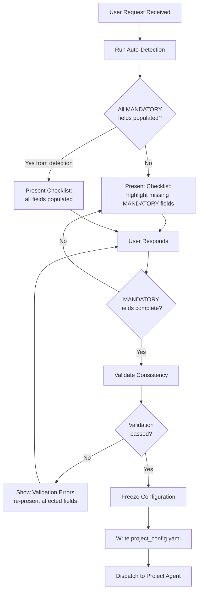
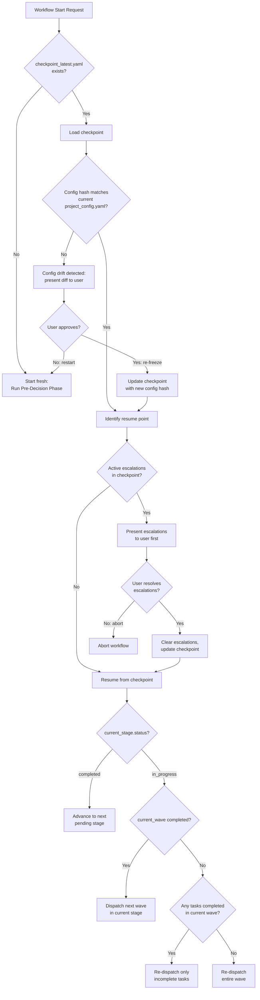

# Execution Protocol — Pre-Decision Phase & Continuous Execution

> [!WARNING]
> **Historical design — superseded before v16.** This document preserves
> rationale and evolution evidence; it is not a runtime instruction. For the
> current three-layer Project → Wave → Task and checklist-round contracts, see
> [SKILL](../../workflow-system/agent/SKILL.md), [agent hierarchy](../../workflow-system/agent/references/agent-hierarchy.md),
> [execution protocol](../../workflow-system/agent/references/execution-protocol.md), [meta-framework](../../workflow-system/agent/references/meta-framework.md),
> [schemas](../../schemas/), and [runtime implementation](../../src/devolaflow/).

> **Version**: 1.0.0  
> **Date**: 2026-04-04  
> **Status**: Design  
> **Scope**: Pre-decision checklist, information collection protocol, checkpoint/resume mechanism, exception severity classification, human intervention breakpoints, execution logging and progress reporting.  
> **Inputs**: design_agent_hierarchy.md (hierarchy + communication), wp2_local_patterns.md (EchoAccess patterns), wp3_workflow_types.md (workflow catalog), desires.md (requirements)

---

## Table of Contents

1. [Design Rationale](#1-design-rationale)
2. [Pre-Decision Phase Checklist](#2-pre-decision-phase-checklist)
3. [Information Collection Protocol](#3-information-collection-protocol)
4. [Checkpoint/Resume Mechanism](#4-checkpointresume-mechanism)
5. [Exception Severity Classification](#5-exception-severity-classification)
6. [Human Intervention Breakpoints](#6-human-intervention-breakpoints)
7. [Execution Log & Progress Report Format](#7-execution-log--progress-report-format)
8. [Integration with Agent Hierarchy](#8-integration-with-agent-hierarchy)

---

## 1. Design Rationale

The execution protocol addresses requirement 8 from the project goals: *"Have a pre-decision phase to surface all information the user must provide before actual development begins"* and requirement 9: *"Once confirmed, the workflow should run continuously to completion, avoiding interruptions."*

These two goals are in tension — maximizing upfront information collection conflicts with getting started quickly. The resolution is a **tiered collection model**: collect only MANDATORY information before starting, use sensible DEFAULTED values for everything else, and CONFIRM auto-detected values asynchronously when possible.

**Governing principles:**

- **P1 — Front-load decisions, not execution**: Every decision that could block execution mid-workflow must be resolved before the first Stage dispatches.
- **P2 — Minimize human round-trips**: Batch questions into a single pre-decision prompt. Never ask one question at a time.
- **P3 — Fail-safe defaults**: Every non-critical decision has a default. The system can start with defaults and let the user override later (before the relevant stage begins).
- **P4 — Checkpoint everything**: The system can be killed at any point and resume from the last consistent state without data loss or repeated work.
- **P5 — Classify before escalating**: Every exception is classified by severity before human involvement is considered. Most exceptions are auto-recoverable.

---

## 2. Pre-Decision Phase Checklist

### 2.1 Purpose

The Pre-Decision Phase runs **before** the Project Agent dispatches any Stage. Its purpose is to collect, validate, and freeze all configuration that the workflow depends on. After this phase completes, the workflow should be able to run to completion without blocking on missing information.

### 2.2 Phase Sequence

```
┌───────────────────────────────────────────────────────────────────────┐
│                     PRE-DECISION PHASE                                │
│                                                                       │
│  Step 1: DETECT     — Auto-detect repo mode, language, platform       │
│  Step 2: COLLECT    — Present checklist to user with detected values  │
│  Step 3: VALIDATE   — Check consistency (e.g., Rust + npm = error)    │
│  Step 4: FREEZE     — Write project_config.yaml, lock decisions       │
│  Step 5: RECOMMEND  — Auto-recommend workflow type, present for       │
│                       confirmation                                    │
│  Step 6: DISPATCH   — Hand off frozen config to Project Agent         │
│                                                                       │
└───────────────────────────────────────────────────────────────────────┘
```

### 2.3 Checklist Template (YAML)

```yaml
pre_decision_checklist:
  version: "1.0"
  created_at: "ISO8601"
  status: "draft | collecting | validated | frozen"

  # ── Section 1: Project Identity ──────────────────────────────────
  project:
    name: ""                           # MANDATORY — no default
    purpose: ""                        # MANDATORY — 1-3 sentence description
    scope_keywords: []                 # DEFAULTED — auto-extracted from purpose
    existing_codebase: false           # CONFIRM — detected from workspace scan

  # ── Section 2: Tech Stack ────────────────────────────────────────
  tech_stack:
    primary_language: ""               # MANDATORY — rust | python | typescript | go | java | other
    secondary_languages: []            # DEFAULTED — [] (none)
    framework: ""                      # DEFAULTED — auto-detected or "none"
    build_system: ""                   # CONFIRM — auto-detected (cargo | npm | pip | make | gradle)
    dependency_manifest: ""            # CONFIRM — auto-detected (Cargo.toml | package.json | etc.)
    runtime_version: ""                # DEFAULTED — "latest stable"
    dependencies:
      pinned: []                       # DEFAULTED — [] (none pre-pinned)
      banned: []                       # DEFAULTED — [] (none banned)

  # ── Section 3: Repository Mode ───────────────────────────────────
  repository:
    mode: "local | github | gitlab | other_git"   # CONFIRM — auto-detected from git remote
    remote_url: ""                     # CONFIRM — auto-detected from git remote -v
    default_branch: "main"             # CONFIRM — auto-detected
    branching_strategy: "feature"      # DEFAULTED — feature branches (matches Protected Branch rule)
    features:                          # mode-dependent feature flags
      ci_cd: false                     # DEFAULTED — false for local, true for github
      cross_platform_builds: false     # DEFAULTED — false
      github_actions: false            # DEFAULTED — true if mode=github
      github_pages: false              # DEFAULTED — false
      online_demo: false               # DEFAULTED — false
      release_publishing: false        # DEFAULTED — false for local, true for github
      merge_requests: false            # DEFAULTED — true if mode=gitlab/other_git
      readme: true                     # DEFAULTED — true
      user_guide: false                # DEFAULTED — false
      changelog: true                  # DEFAULTED — true

  # ── Section 4: Language & Localization ───────────────────────────
  localization:
    primary_language: "en"             # DEFAULTED — English
    secondary_language: ""             # DEFAULTED — none
    bilingual_output: false            # DEFAULTED — false
    doc_language: "en"                 # DEFAULTED — matches primary_language
    code_comments_language: "en"       # DEFAULTED — always English

  # ── Section 5: Target Platforms ──────────────────────────────────
  platforms:
    os:
      - "linux"                        # DEFAULTED — [linux] (current OS)
    architectures:
      - "x86_64"                       # DEFAULTED — [x86_64] (current arch)
    additional_targets: []             # DEFAULTED — [] (e.g., aarch64-apple-darwin)
    min_os_versions: {}                # DEFAULTED — {} (no minimum specified)

  # ── Section 6: Quality Standards ─────────────────────────────────
  quality:
    coverage_target_pct: 80            # DEFAULTED — 80%
    quality_score_threshold: 85        # DEFAULTED — 85 (gate composite minimum)
    lint_strictness: "strict"          # DEFAULTED — strict (zero warnings)
    gate_profile: "standard"           # DEFAULTED — standard
    # Gate profiles:
    #   minimal  — composite >= 70, coverage >= 60%, max 2 blocker findings
    #   standard — composite >= 85, coverage >= 80%, zero blockers
    #   strict   — composite >= 90, coverage >= 90%, zero blockers, zero criticals
    max_convergence_rounds: 3          # DEFAULTED — 3 (per stage)
    min_convergence_rounds: 1          # DEFAULTED — 1 (at least 1 review cycle)
    security_review_required: false    # DEFAULTED — false (true for security_audit workflow)
    benchmark_required: false          # DEFAULTED — false (true for perf-critical projects)

  # ── Section 7: Release Strategy ──────────────────────────────────
  release:
    versioning: "semver"               # DEFAULTED — semver
    initial_version: "0.1.0"           # DEFAULTED — 0.1.0
    channels: ["release"]              # DEFAULTED — [release] (options: dev, beta, release)
    publishing_targets: []             # DEFAULTED — [] (e.g., crates.io, npm, pypi, github-releases)
    signing: false                     # DEFAULTED — false
    changelog_format: "keepachangelog" # DEFAULTED — keepachangelog

  # ── Section 8: Workflow Selection ────────────────────────────────
  workflow:
    type: ""                           # CONFIRM — auto-recommended based on purpose + context
    # Supported types: research_only, design_only, hotfix, refactoring,
    #   migration, spike, documentation, security_audit, rdrr, full_pipeline
    custom_stages: []                  # DEFAULTED — [] (use standard stage set for the type)
    skip_stages: []                    # DEFAULTED — [] (no stages skipped)
    stage_overrides: {}                # DEFAULTED — {} (no per-stage config changes)
```

### 2.4 Auto-Detection Rules

The system attempts to detect values before presenting the checklist. Each detection populates a CONFIRM-category field.

```yaml
auto_detection_rules:
  repository_mode:
    method: "git remote -v"
    rules:
      - pattern: "github.com"
        result: { mode: "github", ci_cd: true, github_actions: true, release_publishing: true }
      - pattern: "gitlab"
        result: { mode: "gitlab", merge_requests: true }
      - pattern: "no remote"
        result: { mode: "local", ci_cd: false, release_publishing: false }
      - pattern: "not a git repo"
        result: { mode: "local", ci_cd: false }

  primary_language:
    method: "file extension frequency analysis"
    rules:
      - condition: "*.rs count > 50% of source files"
        result: "rust"
      - condition: "*.ts or *.tsx count > 50%"
        result: "typescript"
      - condition: "*.py count > 50%"
        result: "python"
      - condition: "*.go count > 50%"
        result: "go"
      - fallback: "ask user (MANDATORY)"

  build_system:
    method: "manifest file detection"
    rules:
      - file: "Cargo.toml"
        result: { build_system: "cargo", dependency_manifest: "Cargo.toml" }
      - file: "package.json"
        result: { build_system: "npm", dependency_manifest: "package.json" }
      - file: "pyproject.toml"
        result: { build_system: "pip", dependency_manifest: "pyproject.toml" }
      - file: "go.mod"
        result: { build_system: "go", dependency_manifest: "go.mod" }
      - file: "Makefile"
        result: { build_system: "make", dependency_manifest: "Makefile" }

  framework:
    method: "dependency analysis of manifest file"
    examples:
      - dependency: "actix-web"
        result: "actix"
      - dependency: "react"
        result: "react"
      - dependency: "django"
        result: "django"

  workflow_type:
    method: "heuristic matching on purpose + context"
    rules:
      - signals: ["bug", "fix", "hotfix", "patch", "urgent"]
        result: "hotfix"
      - signals: ["research", "survey", "investigate", "explore", "compare"]
        result: "research_only"
      - signals: ["refactor", "restructure", "reorganize", "clean up"]
        result: "refactoring"
      - signals: ["migrate", "port", "convert", "upgrade"]
        result: "migration"
      - signals: ["prototype", "spike", "PoC", "experiment"]
        result: "spike"
      - signals: ["document", "readme", "guide", "docs"]
        result: "documentation"
      - signals: ["audit", "security", "vulnerability", "CVE"]
        result: "security_audit"
      - signals: ["design", "architecture", "API spec"]
        combined_with_no: ["implement", "build", "code"]
        result: "rdrr"
      - signals: ["implement", "build", "create", "develop", "feature"]
        result: "full_pipeline"
      - fallback: "full_pipeline"
```

### 2.5 Checklist Presentation Format

When presented to the user, the checklist is rendered as a concise confirmation prompt. Auto-detected values are shown with their source, MANDATORY gaps are highlighted, and DEFAULTED values are shown but marked as overridable.

```
╔══════════════════════════════════════════════════════════════════════╗
║                    PROJECT PRE-DECISION CHECKLIST                   ║
╠══════════════════════════════════════════════════════════════════════╣
║                                                                      ║
║  Project: <name>                                                     ║
║  Purpose: <purpose>                                                  ║
║                                                                      ║
║  ── NEEDS YOUR INPUT ──────────────────────────────────────────────  ║
║  ⬚ Project name: ___________                                        ║
║  ⬚ Primary purpose: ___________                                     ║
║                                                                      ║
║  ── AUTO-DETECTED (confirm or override) ──────────────────────────  ║
║  ☑ Repo mode: github (detected from git@github.com:user/repo.git)   ║
║  ☑ Language: rust (87% .rs files)                                    ║
║  ☑ Build: cargo (Cargo.toml found)                                   ║
║  ☑ Workflow: full_pipeline (signals: "implement", "feature")         ║
║                                                                      ║
║  ── DEFAULTS (override if needed) ────────────────────────────────  ║
║  ○ Coverage target: 80%                                              ║
║  ○ Gate profile: standard (composite ≥ 85)                           ║
║  ○ Lint: strict (zero warnings)                                      ║
║  ○ Platforms: linux/x86_64                                           ║
║  ○ Version: 0.1.0 (semver)                                          ║
║  ○ Docs language: en                                                 ║
║                                                                      ║
║  ── REPO-MODE FEATURES (github detected) ─────────────────────────  ║
║  ○ GitHub Actions CI: yes                                            ║
║  ○ Cross-platform builds: no                                         ║
║  ○ GitHub Pages: no                                                  ║
║  ○ Online demo: no                                                   ║
║  ○ Release to crates.io: no                                          ║
║                                                                      ║
║  Reply with changes or "confirm" to start.                           ║
╚══════════════════════════════════════════════════════════════════════╝
```

---

## 3. Information Collection Protocol

### 3.1 Decision Point Categories

Every field in the pre-decision checklist is classified into one of three categories. The category determines when and how the value is collected.

| Category | Symbol | Collection Rule | User Action | Blocking? |
|----------|--------|----------------|-------------|-----------|
| **MANDATORY** | `⬚` | No default exists. User MUST provide a value. | Must type a value | YES — workflow cannot start without all MANDATORY values |
| **DEFAULTED** | `○` | Has a sensible default derived from best practices. User CAN override. | Review and optionally change | NO — workflow uses default if user does not respond |
| **CONFIRM** | `☑` | Auto-detected from workspace analysis. User should verify. | Confirm or correct | SOFT — workflow proceeds with detected value after 1 prompt; if user overrides, re-validate |

### 3.2 Complete Decision Point Classification

```yaml
decision_classification:

  # ── MANDATORY (must be provided, no default) ─────────────────────
  mandatory:
    - field: "project.name"
      reason: "Used in file paths, artifact naming, release tags"
      validation: "non-empty string, valid as directory name, max 64 chars"

    - field: "project.purpose"
      reason: "Drives workflow type auto-recommendation and scope definition"
      validation: "non-empty string, min 10 chars, max 500 chars"

    - field: "tech_stack.primary_language"
      reason: "Determines code-rules loading, build commands, test framework"
      validation: "one of: rust, python, typescript, go, java, c, cpp, other"
      fallback: "If auto-detection succeeds, promote to CONFIRM"

  # ── DEFAULTED (has sensible default, user can override) ──────────
  defaulted:
    - field: "tech_stack.secondary_languages"
      default: "[]"
      reason: "Most projects are single-language"

    - field: "tech_stack.runtime_version"
      default: "latest stable"
      reason: "Stable is safe; user overrides for specific version needs"

    - field: "tech_stack.dependencies.pinned"
      default: "[]"
      reason: "Dependencies resolved during implementation, not pre-decision"

    - field: "tech_stack.dependencies.banned"
      default: "[]"
      reason: "No banned deps unless user has constraints"

    - field: "repository.branching_strategy"
      default: "feature"
      reason: "Feature branches align with Protected Branch workspace rule"

    - field: "repository.features.readme"
      default: "true"
      reason: "Every project benefits from a README"

    - field: "repository.features.changelog"
      default: "true"
      reason: "Changelog is standard practice"

    - field: "localization.primary_language"
      default: "en"
      reason: "English is the international default for code and docs"

    - field: "localization.code_comments_language"
      default: "en"
      reason: "Code comments universally in English"

    - field: "platforms.os"
      default: "[linux]"
      reason: "Current OS as default target"

    - field: "platforms.architectures"
      default: "[x86_64]"
      reason: "Current architecture as default target"

    - field: "quality.coverage_target_pct"
      default: 80
      reason: "Industry standard for meaningful coverage without diminishing returns"

    - field: "quality.quality_score_threshold"
      default: 85
      reason: "Proven in EchoAccess convergence loops"

    - field: "quality.lint_strictness"
      default: "strict"
      reason: "Zero-warning policy prevents technical debt accumulation"

    - field: "quality.gate_profile"
      default: "standard"
      reason: "Balanced between thoroughness and velocity"

    - field: "quality.max_convergence_rounds"
      default: 3
      reason: "EchoAccess data shows most stages converge within 3 rounds"

    - field: "quality.min_convergence_rounds"
      default: 1
      reason: "At least one review cycle catches first-pass oversights"

    - field: "release.versioning"
      default: "semver"
      reason: "Universal standard"

    - field: "release.initial_version"
      default: "0.1.0"
      reason: "Pre-1.0 for new projects; signals API instability appropriately"

    - field: "release.channels"
      default: "[release]"
      reason: "Single channel is simplest; user adds beta/dev as needed"

    - field: "release.changelog_format"
      default: "keepachangelog"
      reason: "Widely adopted, well-structured"

    - field: "workflow.custom_stages"
      default: "[]"
      reason: "Standard stage set for the workflow type"

    - field: "workflow.skip_stages"
      default: "[]"
      reason: "No stages skipped by default"

  # ── CONFIRM (auto-detected, needs user confirmation) ─────────────
  confirm:
    - field: "repository.mode"
      detection: "git remote -v analysis"
      confidence: "high if remote URL found, low if no .git"
      user_prompt: "Detected repo mode: {value} (from {evidence}). Correct?"

    - field: "repository.remote_url"
      detection: "git remote get-url origin"
      confidence: "high"
      user_prompt: "Remote: {value}. Correct?"

    - field: "repository.default_branch"
      detection: "git symbolic-ref refs/remotes/origin/HEAD"
      confidence: "high"
      user_prompt: "Default branch: {value}. Correct?"

    - field: "tech_stack.build_system"
      detection: "manifest file presence"
      confidence: "high if exactly one manifest found"
      user_prompt: "Build system: {value} (found {manifest}). Correct?"

    - field: "tech_stack.framework"
      detection: "dependency analysis in manifest"
      confidence: "medium — multiple frameworks possible"
      user_prompt: "Framework: {value} (detected from deps). Correct?"

    - field: "project.existing_codebase"
      detection: "source file count > 0"
      confidence: "high"
      user_prompt: "Existing codebase detected ({N} source files). Extending?"

    - field: "workflow.type"
      detection: "heuristic matching on project.purpose keywords"
      confidence: "medium — purpose text may be ambiguous"
      user_prompt: "Recommended workflow: {value} (based on: {signals}). Correct?"

    - field: "repository.features.*"
      detection: "conditional on repository.mode"
      confidence: "high for mode-implied features"
      user_prompt: "Repo features for {mode}: {feature_list}. Any changes?"
```

### 3.3 Collection Flow



### 3.4 Consistency Validation Rules

After collection, the system validates that all decisions are internally consistent.

```yaml
consistency_rules:
  - rule: "language_build_match"
    condition: "primary_language == 'rust' AND build_system != 'cargo'"
    severity: "error"
    message: "Rust projects must use cargo as build system"

  - rule: "language_build_match_ts"
    condition: "primary_language == 'typescript' AND build_system not in ['npm', 'yarn', 'pnpm', 'bun']"
    severity: "error"
    message: "TypeScript projects must use a JS package manager"

  - rule: "github_features_require_github_mode"
    condition: "repository.features.github_actions == true AND repository.mode != 'github'"
    severity: "error"
    message: "GitHub Actions requires repository mode 'github'"

  - rule: "cross_platform_needs_targets"
    condition: "repository.features.cross_platform_builds == true AND len(platforms.os) < 2"
    severity: "warning"
    message: "Cross-platform builds enabled but only one OS target specified"

  - rule: "security_review_with_audit"
    condition: "workflow.type == 'security_audit' AND quality.security_review_required == false"
    severity: "auto_fix"
    action: "Set quality.security_review_required = true"

  - rule: "coverage_within_range"
    condition: "quality.coverage_target_pct < 0 OR quality.coverage_target_pct > 100"
    severity: "error"
    message: "Coverage target must be between 0 and 100"

  - rule: "gate_profile_consistency"
    condition: "quality.gate_profile == 'strict' AND quality.coverage_target_pct < 90"
    severity: "warning"
    message: "Strict gate profile typically uses >= 90% coverage. Current: {value}%"

  - rule: "local_mode_no_publish"
    condition: "repository.mode == 'local' AND len(release.publishing_targets) > 0"
    severity: "warning"
    message: "Publishing targets set but repo mode is local. Publishing requires a remote."

  - rule: "version_semver_format"
    condition: "release.versioning == 'semver' AND release.initial_version does not match semver regex"
    severity: "error"
    message: "Initial version must be valid semver (e.g., 0.1.0)"
```

---

## 4. Checkpoint/Resume Mechanism

### 4.1 Purpose

The checkpoint system provides crash-recovery and session-resumability. The workflow can be interrupted at any point (agent timeout, user closes IDE, machine reboot) and resume from the last consistent state. No work is lost. No stage is re-executed unnecessarily.

### 4.2 Checkpoint Storage

```
.local/
├── checkpoints/
│   ├── checkpoint_latest.yaml          # symlink → most recent checkpoint
│   ├── cp_20260404T103000Z_S01_gate.yaml
│   ├── cp_20260404T110000Z_S02_gate.yaml
│   ├── cp_20260404T113000Z_S03_W02_complete.yaml
│   ├── cp_20260404T120000Z_S03_gate.yaml
│   └── ...
├── project_config.yaml                 # frozen pre-decision config
├── project_status.yaml                 # live dashboard (Layer 0)
└── stages/
    └── ...                             # per-stage artifacts
```

### 4.3 Checkpoint Schema

```yaml
checkpoint:
  metadata:
    checkpoint_id: "cp_20260404T103000Z_S01_gate"
    timestamp: "2026-04-04T10:30:00Z"
    trigger: "stage_gate_pass | wave_complete | manual | error_recovery"
    workflow_run_id: "run-20260404-001"
    schema_version: "1.0"

  project_state:
    workflow_type: "full_pipeline"
    project_name: "echo-sync"
    config_hash: "sha256:abc123..."      # hash of project_config.yaml for drift detection

  stage_progress:
    completed_stages:
      - stage_id: "S01-design"
        gate_verdict: "PASS"
        completed_at: "2026-04-04T10:30:00Z"
        gate_report_path: ".local/stages/S01_design/gate_report.yaml"
        artifacts:
          - path: ".local/stages/S01_design/artifacts/design_document.md"
            hash: "sha256:def456..."
    current_stage:
      stage_id: "S02-plan"
      status: "in_progress"
      started_at: "2026-04-04T10:31:00Z"
      current_wave: "W01"
      waves_completed: []
      waves_remaining: ["W01"]
    pending_stages:
      - "S03-impl"
      - "S04-review"
      - "S05-test"
      - "S06-testgate"
      - "S07-release"

  wave_state:
    current_wave_id: "W01"
    tasks:
      - task_id: "T01-create-plan"
        status: "in_progress"
        assigned_agent_type: "design"
        started_at: "2026-04-04T10:31:15Z"
      - task_id: "T02-risk-analysis"
        status: "pending"

  convergence_state:                     # only present for stages with convergence loops
    current_round: 0
    max_rounds: 3
    round_history: []

  quality_snapshot:
    last_composite_score: null
    last_coverage_pct: null
    total_findings:
      blocker: 0
      critical: 0
      major: 0
      minor: 0
      info: 0

  deferred_items: []                     # items explicitly pushed to later stages
  active_escalations: []                 # unresolved escalations
```

### 4.4 Checkpoint Trigger Rules

Checkpoints are created automatically at specific execution boundaries. They are never created mid-task (a task is the atomic unit of work — it either completes or fails, never checkpoints internally).

```yaml
checkpoint_triggers:
  - trigger: "stage_gate_pass"
    description: "After a stage's gate evaluates PASS"
    data_captured: "full project state including completed stage artifacts"
    retention: "permanent (until project completes)"

  - trigger: "stage_gate_fail"
    description: "After a stage's gate evaluates FAIL (before loop-back)"
    data_captured: "full project state + gate failure details"
    retention: "permanent"

  - trigger: "wave_complete"
    description: "After all tasks in a wave complete (success or failure)"
    data_captured: "current stage + wave state + task results"
    retention: "until next wave completes (rolling)"

  - trigger: "convergence_round_complete"
    description: "After all 8 phases of a convergence round finish"
    data_captured: "round scores, findings, convergence trajectory"
    retention: "until stage gates PASS"

  - trigger: "error_recovery"
    description: "After an AUTO_RECOVER retry succeeds"
    data_captured: "recovery context + what was retried"
    retention: "until wave completes"

  - trigger: "human_intervene_pause"
    description: "When workflow pauses for human decision"
    data_captured: "full project state + intervention request details"
    retention: "permanent"

  - trigger: "manual"
    description: "User explicitly requests a checkpoint"
    data_captured: "full project state"
    retention: "permanent"
```

### 4.5 Resume Logic



**Resume rules — critical invariants:**

1. **Never re-execute a completed stage.** If a stage's gate has PASS verdict in the checkpoint, it is skipped on resume. Its artifacts are still available for downstream stages.

2. **Never re-execute completed tasks in a wave.** If Wave W has 5 tasks and 3 completed before interruption, only the 2 remaining tasks are dispatched on resume.

3. **Artifact integrity check on resume.** Before resuming, verify that all artifact files referenced in the checkpoint still exist and match their recorded hashes. If an artifact is missing or corrupted, mark the producing stage as requiring re-execution.

4. **Convergence round state preserved.** If a stage was in the middle of round 2 of its convergence loop, resume starts from the phase within round 2 that was interrupted (not from round 1).

5. **Config drift requires user approval.** If `project_config.yaml` changed since the checkpoint was created (different hash), the user must review the diff and approve. Changed config may invalidate completed stages.

### 4.6 Checkpoint Expiry & Cleanup

```yaml
checkpoint_lifecycle:
  retention_policy:
    stage_gate_checkpoints: "kept until project completes"
    wave_checkpoints: "replaced by next wave's checkpoint (rolling)"
    error_recovery_checkpoints: "replaced by next wave checkpoint"
    manual_checkpoints: "kept until project completes"
    human_intervene_checkpoints: "kept until project completes"

  cleanup_triggers:
    - event: "project_completion"
      action: "Archive all checkpoints to .local/checkpoints/archive/"
      retention: "7 days, then delete"

    - event: "project_abort"
      action: "Keep all checkpoints for forensic analysis"
      retention: "30 days, then delete"

    - event: "disk_pressure"
      action: "Delete wave-level checkpoints older than latest stage gate checkpoint"
      threshold: "available disk < 500MB"

  max_checkpoints: 50
  max_checkpoint_age_days: 30
  cleanup_command: "workflow checkpoint cleanup --older-than 30d"
```

---

## 5. Exception Severity Classification

### 5.1 Severity Levels

Every exception encountered during workflow execution is classified into one of four severity levels. The classification determines the automatic response before any human involvement is considered.

| Level | Symbol | Description | Auto-Action | Human Involved? |
|-------|--------|-------------|-------------|-----------------|
| **AUTO_RECOVER** | `🔄` | Transient errors that are expected to self-resolve on retry. Network timeouts, rate limits, temporary tool failures, flaky test results. | Retry up to 3 times with exponential backoff (2s, 4s, 8s). Log each attempt. | NO — unless all retries exhausted, then promote to PAUSE |
| **PAUSE** | `⏸` | Non-urgent information gaps that block one task but not the entire workflow. Ambiguous spec detail, missing optional dependency, non-critical tool unavailable. | Pause the affected task. Queue a question for batch presentation. Continue all parallel and independent work. | BATCHED — questions collected and presented together at next natural pause point |
| **HUMAN_INTERVENE** | `🛑` | Decisions requiring human judgment. Architecture trade-offs, security-sensitive changes, external service credentials, irreversible operations, license compliance. | Stop the affected stage. Present options with analysis. Wait for user response. Other independent stages may continue. | YES — immediately, with structured options |
| **FULL_ROLLBACK** | `⏮` | Fundamental errors that compromise project integrity. Corrupted state, impossible requirements discovered mid-execution, persistent tool failures across all retries, data loss detected. | Rollback to last checkpoint. Produce a detailed failure report. Halt all execution. | YES — with failure report and recommended next steps |

### 5.2 Classification Rules

```yaml
exception_classification:

  auto_recover:
    triggers:
      - error_type: "network_timeout"
        conditions: ["retry_count < 3"]
      - error_type: "rate_limit"
        conditions: ["retry_count < 3"]
      - error_type: "tool_timeout"
        conditions: ["retry_count < 3", "elapsed < timeout_seconds"]
      - error_type: "flaky_test"
        conditions: ["test was passing before", "retry_count < 2"]
      - error_type: "build_cache_stale"
        conditions: ["clean build not yet attempted"]
      - error_type: "git_lock"
        conditions: ["lock file age < 60s"]
    retry_strategy:
      max_retries: 3
      backoff: "exponential"
      base_delay_ms: 2000
      max_delay_ms: 30000
      jitter: true
    on_exhausted: "promote to PAUSE"

  pause:
    triggers:
      - error_type: "ambiguous_specification"
        description: "Task spec has multiple valid interpretations"
        question_format: "Ambiguity in {task_id}: {description}. Options: {A | B | C}"
      - error_type: "optional_dependency_missing"
        description: "An optional feature requires an uninstalled dependency"
        question_format: "Optional dep {name} not found. Skip feature {X} or install?"
      - error_type: "style_decision"
        description: "Multiple valid approaches exist, no clear winner"
        question_format: "{task_id} has {N} valid approaches: {list}. Preference?"
      - error_type: "non_critical_test_failure"
        description: "Tests fail but coverage and quality are above minimum thresholds"
        question_format: "{N} non-critical tests failing. Continue or fix first?"
      - error_type: "auto_recover_exhausted"
        description: "AUTO_RECOVER retries exceeded"
    behavior:
      pause_scope: "affected_task_only"
      continue_parallel: true
      batch_questions: true
      batch_presentation_trigger: "wave_boundary | 5_minutes_accumulated | 3_questions_queued"

  human_intervene:
    triggers:
      - error_type: "architecture_decision"
        description: "Structural choice with long-term consequences"
        examples: ["database selection", "API paradigm (REST vs gRPC)", "auth strategy"]
      - error_type: "security_sensitive"
        description: "Changes that affect security posture"
        examples: ["adding crypto dependency", "modifying auth flow", "changing permissions"]
      - error_type: "external_service_config"
        description: "Requires credentials or external account setup"
        examples: ["API keys", "service accounts", "DNS configuration"]
      - error_type: "irreversible_operation"
        description: "Cannot be undone without significant effort"
        examples: ["database migration in production", "public API publication", "domain registration"]
      - error_type: "license_compliance"
        description: "Dependency license may conflict with project license"
        examples: ["GPL dependency in MIT project", "proprietary dependency"]
      - error_type: "cost_implication"
        description: "Decision has financial impact"
        examples: ["paid API selection", "cloud resource provisioning"]
      - error_type: "scope_expansion"
        description: "Discovered requirement significantly expands scope beyond original purpose"
    behavior:
      pause_scope: "affected_stage"
      continue_independent_stages: true
      presentation_format:
        summary: "1-2 sentence description of the decision needed"
        options: "2-4 options with trade-off analysis"
        recommendation: "Agent's recommended option with rationale"
        impact: "What happens if each option is chosen"
        urgency: "How long other work can continue without this decision"

  full_rollback:
    triggers:
      - error_type: "state_corruption"
        description: "Checkpoint data inconsistent with file system state"
        detection: "artifact hash mismatch, missing files referenced in checkpoint"
      - error_type: "impossible_requirement"
        description: "Discovered mid-execution that a core requirement cannot be met"
        examples: ["target platform doesn't support required feature", "mutually exclusive requirements"]
      - error_type: "persistent_tool_failure"
        description: "Critical tool (build, test runner) fails consistently after all retries"
        conditions: ["auto_recover exhausted", "pause resolution attempted", "still failing"]
      - error_type: "data_loss_detected"
        description: "Source files or artifacts deleted or corrupted outside of agent control"
      - error_type: "dependency_incompatibility"
        description: "Core dependencies have irreconcilable version conflicts"
    behavior:
      immediate_actions:
        - "Halt all running tasks and waves"
        - "Collect all task outputs so far (even partial)"
        - "Identify the last valid checkpoint"
        - "Produce a failure report"
      rollback_target: "last checkpoint with stage_gate_pass trigger"
      report_format:
        what_happened: "Description of the failure"
        when: "Timestamp and execution context"
        what_was_lost: "Work completed since last valid checkpoint"
        root_cause: "Best assessment of why this happened"
        recommended_action: "What the user should do next"
        can_retry: "Whether re-running from the checkpoint is likely to succeed"
```

### 5.3 Escalation Flow

```
Task Agent encounters error
  │
  ├─ Is it in auto_recover triggers?
  │   ├─ YES → Retry (up to 3)
  │   │         ├─ Retry succeeds → Continue, log recovery
  │   │         └─ Retries exhausted → Promote to PAUSE
  │   └─ NO ↓
  │
  ├─ Is it in pause triggers?
  │   ├─ YES → Pause task, queue question
  │   │         Report to Wave Agent: status=paused
  │   │         Wave Agent continues other tasks
  │   │         At batch trigger: present questions to user
  │   │         User responds → Resume task
  │   └─ NO ↓
  │
  ├─ Is it in human_intervene triggers?
  │   ├─ YES → Report ExceptionEscalation upward
  │   │         Wave → Stage → Project → User
  │   │         Present structured decision request
  │   │         Wait for user response
  │   │         Resume with user's decision
  │   └─ NO ↓
  │
  ├─ Is it in full_rollback triggers?
  │   ├─ YES → Halt immediately
  │   │         Rollback to last valid checkpoint
  │   │         Present failure report to user
  │   └─ NO ↓
  │
  └─ Unknown error type
      → Classify as PAUSE (conservative default)
      → Log full error context for post-mortem
```

### 5.4 Exception-to-Hierarchy Mapping

This table shows which agent layer handles each severity level. The principle is: handle at the lowest layer possible, escalate only when necessary.

| Severity | Task Agent (L3) | Wave Agent (L2) | Stage Agent (L1) | Project Agent (L0) | Human |
|----------|-----------------|-----------------|-------------------|---------------------|-------|
| AUTO_RECOVER | **Handles** (retries internally) | Notified (via StatusReport warning) | — | — | — |
| PAUSE | **Detects**, reports upward | Continues other tasks, batches questions | Aggregates paused tasks | Presents batched questions at natural break | Answers batched questions |
| HUMAN_INTERVENE | **Detects**, reports upward | Passes through | Passes through | **Presents** structured decision request | **Decides** |
| FULL_ROLLBACK | **Detects**, reports upward | Halts remaining tasks | **Executes** rollback | **Reports** to human | Reviews failure report |

---

## 6. Human Intervention Breakpoints

### 6.1 Breakpoint Categories

Breakpoints are pre-defined points in the workflow where human involvement may be required. They are classified into two categories based on whether they block execution.

#### HARD Breakpoints — Workflow MUST Stop

These are non-negotiable. The system halts and waits for human input.

```yaml
hard_breakpoints:
  - id: "HBP-01"
    name: "Pre-Decision Confirmation"
    when: "Before first stage dispatches"
    trigger: "Always — end of Pre-Decision Phase"
    what_user_decides: "Confirm or modify all pre-decision checklist values"
    timeout: "none — waits indefinitely"
    skip_condition: "never"

  - id: "HBP-02"
    name: "Architecture Design Approval"
    when: "After Design stage gates PASS"
    trigger: "Workflow types: full_pipeline, rdrr"
    what_user_decides: "Approve the architecture design before implementation begins"
    timeout: "none — waits indefinitely"
    skip_condition: "workflow.type in [hotfix, refactoring, documentation]"
    rationale: >
      Architecture decisions are irreversible in practice. Implementation built
      on a rejected architecture is wasted work. This is the highest-leverage
      review point in the entire workflow.

  - id: "HBP-03"
    name: "Security-Sensitive Change Approval"
    when: "When any task modifies auth, crypto, permissions, or secrets"
    trigger: "Task Agent detects security-sensitive file modification"
    what_user_decides: "Approve the specific security-related change"
    timeout: "none — waits indefinitely"
    skip_condition: "quality.security_review_required == false AND change is in test files only"
    detection_patterns:
      - file_patterns: ["**/auth/**", "**/crypto/**", "**/secrets/**", "**/permissions/**"]
      - content_patterns: ["password", "secret", "private_key", "token", "credential"]
      - dependency_patterns: ["openssl", "ring", "bcrypt", "jsonwebtoken"]

  - id: "HBP-04"
    name: "External Service Configuration"
    when: "When workflow requires external service credentials or setup"
    trigger: "Task Agent needs API key, service account, or external resource"
    what_user_decides: "Provide credentials or configure external service"
    timeout: "none — waits indefinitely"
    skip_condition: "never when credentials are needed"

  - id: "HBP-05"
    name: "Release Publication Approval"
    when: "Before publishing to external registries (crates.io, npm, pypi)"
    trigger: "Release stage, publishing_targets is non-empty"
    what_user_decides: "Approve the release version, changelog, and publication target"
    timeout: "none — waits indefinitely"
    skip_condition: "repository.mode == 'local' OR release.publishing_targets is empty"

  - id: "HBP-06"
    name: "Divergence Report Review"
    when: "When max convergence rounds reached without passing gate"
    trigger: "Stage gate FAIL after max_convergence_rounds"
    what_user_decides: "Lower quality threshold, add more rounds, or abort stage"
    timeout: "none — waits indefinitely"
    skip_condition: "never"

  - id: "HBP-07"
    name: "Full Rollback Acknowledgment"
    when: "After a FULL_ROLLBACK exception"
    trigger: "FULL_ROLLBACK severity event"
    what_user_decides: "Resume from checkpoint, restart, or abort"
    timeout: "none — waits indefinitely"
    skip_condition: "never"
```

#### SOFT Breakpoints — Workflow CAN Continue

These are advisory. The system continues with defaults or queues questions for batch presentation.

```yaml
soft_breakpoints:
  - id: "SBP-01"
    name: "Style/Naming Preference"
    when: "During implementation when multiple valid naming conventions exist"
    trigger: "No project-wide convention detected, multiple options valid"
    default_behavior: "Use language-idiomatic naming (snake_case for Rust, camelCase for TS)"
    user_can_override: true
    batched: true

  - id: "SBP-02"
    name: "Tool Selection Within Constraints"
    when: "Multiple equivalent tools available for a task"
    trigger: "e.g., test framework choice when none specified"
    default_behavior: "Use language default (cargo test for Rust, jest for TS, pytest for Python)"
    user_can_override: true
    batched: true

  - id: "SBP-03"
    name: "Optional Feature Inclusion"
    when: "Optional features available but not in original spec"
    trigger: "Agent discovers useful feature during implementation"
    default_behavior: "Skip optional features; log as deferred scope"
    user_can_override: true
    batched: true

  - id: "SBP-04"
    name: "Documentation Detail Level"
    when: "During documentation generation"
    trigger: "Multiple detail levels possible (API-only vs. tutorial vs. comprehensive)"
    default_behavior: "API documentation + README"
    user_can_override: true
    batched: true

  - id: "SBP-05"
    name: "Test Strategy for Edge Cases"
    when: "During test writing when edge case coverage exceeds coverage target"
    trigger: "Coverage target met; additional edge cases identified"
    default_behavior: "Write tests for identified edge cases up to 90% coverage"
    user_can_override: true
    batched: true

  - id: "SBP-06"
    name: "Dependency Version Selection"
    when: "Multiple compatible versions available for a dependency"
    trigger: "No pinned version specified in pre-decision config"
    default_behavior: "Use latest stable compatible version"
    user_can_override: true
    batched: true
```

### 6.2 Breakpoint Definition Schema

```yaml
breakpoint_definition:
  id: "string (HBP-NN or SBP-NN)"
  name: "string"
  category: "hard | soft"

  timing:
    when: "string — human description of when this triggers"
    stage_scope: "string | null — which stage(s) this applies to"
    workflow_scope: ["string"] # which workflow types this applies to, or ["all"]

  trigger:
    condition: "string — boolean expression or detection rule"
    detection_method: "always | file_pattern | content_pattern | dependency_analysis | gate_result"

  presentation:
    summary: "string — 1-2 sentence description of what's needed"
    options: ["string"] # if applicable
    recommendation: "string | null"
    context_provided: ["string"] # what supporting info is shown

  behavior:
    blocks_execution: true | false
    scope_of_block: "task | wave | stage | project"
    continue_independent: true | false
    timeout_seconds: "integer | null" # null = indefinite
    default_if_timeout: "string | null" # action taken if timeout expires

  skip_conditions:
    - "string — condition under which this breakpoint is skipped"
```

---

## 7. Execution Log & Progress Report Format

### 7.1 Progress Dashboard (overview.md Format)

The progress dashboard is maintained by the Project Agent (Layer 0) in `.local/stages/overview.md`. It follows the EchoAccess progress table format, extended with additional columns for the full workflow context.

```markdown
# Project: {project_name} — Execution Dashboard

> **Workflow**: {workflow_type} | **Started**: {start_time} | **Run ID**: {run_id}
> **Config**: {gate_profile} profile | Coverage ≥ {coverage_target}% | Composite ≥ {quality_threshold}
> **Status**: {overall_status} | **Progress**: {total_progress_pct}%

## Stage Progress

| # | Stage | Wave | Status | Round | Score | Coverage | Blockers | Updated |
|---|-------|------|--------|-------|-------|----------|----------|---------|
| 1 | Design | W2/W2 | ✅ PASS | — | 92 | — | 0 | 10:30 |
| 2 | Plan | W1/W1 | ✅ PASS | — | — | — | 0 | 10:45 |
| 3 | Impl | W2/W3 | 🔄 ACTIVE | R2 | 78→83 | 74% | 2 | 11:30 |
| 4 | Review | — | ⏳ PENDING | — | — | — | — | — |
| 5 | Test | — | ⏳ PENDING | — | — | — | — | — |
| 6 | TestGate | — | ⏳ PENDING | — | — | — | — | — |
| 7 | Release | — | ⏳ PENDING | — | — | — | — | — |

## Summary Metrics

| Metric | Value |
|--------|-------|
| Total progress | 38% |
| Stages completed | 2/7 |
| Current stage | S03-Impl (Wave 2 of 3, Round 2) |
| Estimated remaining | ~45 min |
| Active blockers | 2 (both in S03-Impl) |
| Deferred items | 3 |
| Checkpoints created | 4 |
| Exceptions handled | 1 AUTO_RECOVER, 0 PAUSE, 0 HUMAN |

## Active Blockers

| ID | Stage | Severity | Description | Since |
|----|-------|----------|-------------|-------|
| BLK-01 | S03 | critical | Unicode path handling missing for Windows target | 11:15 |
| BLK-02 | S03 | major | Integration test for module B times out | 11:25 |

## Deferred Scope

| Item | Reason | Target |
|------|--------|--------|
| GUI frontend | Out of scope for CLI-first MVP | Future milestone |
| Windows ARM support | No CI runner available | Post-release |
| Plugin system | Architecture supports it, not in spec | v0.2.0 |
```

### 7.2 Status Icons

```yaml
status_icons:
  completed_pass: "✅ PASS"
  completed_fail: "❌ FAIL"
  active: "🔄 ACTIVE"
  pending: "⏳ PENDING"
  paused: "⏸ PAUSED"
  blocked: "🚫 BLOCKED"
  skipped: "⏭ SKIPPED"
  rollback: "⏮ ROLLBACK"
```

### 7.3 Detailed Execution Log Format

The execution log records every significant event in the workflow. It is append-only and serves as the audit trail for debugging and post-mortem analysis.

**Storage**: `.local/execution_log.jsonl` (JSON Lines format — one JSON object per line for efficient append and streaming).

```yaml
execution_log_entry:
  timestamp: "ISO8601"
  run_id: "string"
  event_type: "string"
  layer: "project | stage | wave | task"
  agent_id: "string"               # which agent produced this event
  stage_id: "string | null"
  wave_id: "string | null"
  task_id: "string | null"

  event_types:
    # ── Lifecycle events ──
    - type: "workflow_start"
      data: { workflow_type, project_name, config_hash }

    - type: "stage_dispatch"
      data: { stage_id, stage_type, predecessor_artifacts }

    - type: "stage_complete"
      data: { stage_id, gate_verdict, composite_score, elapsed_seconds }

    - type: "wave_dispatch"
      data: { wave_id, task_count, parallel_count }

    - type: "wave_complete"
      data: { wave_id, tasks_passed, tasks_failed, elapsed_seconds }

    - type: "task_dispatch"
      data: { task_id, task_type, agent_team, owned_files }

    - type: "task_complete"
      data: { task_id, status, artifacts, metrics }

    # ── Quality events ──
    - type: "gate_evaluation"
      data: { stage_id, round, composite_score, verdict, findings_summary }

    - type: "convergence_round"
      data: { stage_id, round_number, phase_results, score_delta }

    - type: "quality_score_change"
      data: { stage_id, previous_score, new_score, dimension_breakdown }

    # ── Exception events ──
    - type: "exception_raised"
      data: { severity, error_type, description, affected_tasks }

    - type: "auto_recover_attempt"
      data: { attempt_number, max_attempts, error_type, outcome }

    - type: "pause_queued"
      data: { question, affected_task, can_continue_parallel }

    - type: "human_intervene_requested"
      data: { decision_type, options, recommendation }

    - type: "human_intervene_resolved"
      data: { decision, response_time_seconds }

    - type: "rollback_initiated"
      data: { trigger, target_checkpoint, work_lost_summary }

    # ── Checkpoint events ──
    - type: "checkpoint_created"
      data: { checkpoint_id, trigger, stage_progress_summary }

    - type: "checkpoint_resumed"
      data: { checkpoint_id, resume_point, skipped_stages }

    # ── Handoff events ──
    - type: "handoff_delivered"
      data: { source_team, target_team, deliverable_id, acceptance_status }

    - type: "handoff_rejected"
      data: { deliverable_id, rejection_reasons, remediation_required }
```

**Example log entries:**

```jsonl
{"timestamp":"2026-04-04T10:00:00Z","run_id":"run-001","event_type":"workflow_start","layer":"project","agent_id":"PA-001","data":{"workflow_type":"full_pipeline","project_name":"echo-sync","config_hash":"sha256:abc123"}}
{"timestamp":"2026-04-04T10:00:05Z","run_id":"run-001","event_type":"stage_dispatch","layer":"project","agent_id":"PA-001","stage_id":"S01-design","data":{"stage_type":"design","predecessor_artifacts":[]}}
{"timestamp":"2026-04-04T10:30:00Z","run_id":"run-001","event_type":"gate_evaluation","layer":"stage","agent_id":"SA-001","stage_id":"S01-design","data":{"round":1,"composite_score":92,"verdict":"PASS","findings_summary":{"blocker":0,"critical":0,"major":1,"minor":3}}}
{"timestamp":"2026-04-04T10:30:01Z","run_id":"run-001","event_type":"checkpoint_created","layer":"project","agent_id":"PA-001","data":{"checkpoint_id":"cp_20260404T103000Z_S01_gate","trigger":"stage_gate_pass","stage_progress_summary":"1/7 stages complete"}}
{"timestamp":"2026-04-04T11:15:00Z","run_id":"run-001","event_type":"exception_raised","layer":"task","agent_id":"TA-007","stage_id":"S03-impl","wave_id":"W02","task_id":"T04","data":{"severity":"AUTO_RECOVER","error_type":"tool_timeout","description":"cargo build timed out after 120s","affected_tasks":["T04"]}}
{"timestamp":"2026-04-04T11:15:03Z","run_id":"run-001","event_type":"auto_recover_attempt","layer":"task","agent_id":"TA-007","task_id":"T04","data":{"attempt_number":1,"max_attempts":3,"error_type":"tool_timeout","outcome":"success"}}
```

### 7.4 Progress Calculation

```yaml
progress_calculation:
  total_progress_pct:
    formula: "weighted sum of stage progress values"
    weights:
      design: 0.10
      plan: 0.05
      impl: 0.40
      review: 0.15
      test: 0.15
      testgate: 0.05
      release: 0.10

    stage_progress:
      pending: 0
      active:
        formula: "(completed_waves / total_waves) × 100"
        with_convergence: "((completed_waves / total_waves) × 0.6) + ((completed_rounds / max_rounds) × 0.4)"
      completed: 100
      skipped: 100   # skipped stages count as complete

  estimated_remaining_time:
    method: "linear extrapolation from completed stages"
    formula: >
      elapsed_time × (remaining_weight / completed_weight)
    adjustments:
      - "If current stage is in convergence loop, add +50% buffer"
      - "If blockers exist, add +30% per blocker"
      - "If this is first run (no historical data), add +25% uncertainty buffer"
    display: "~{minutes} min" or "~{hours}h {minutes}m"
```

### 7.5 Periodic Progress Report

At natural pause points (wave boundaries, gate evaluations), the Project Agent produces a concise progress report for the user. This is distinct from the full dashboard — it's a one-time summary of recent progress.

```yaml
periodic_progress_report:
  trigger: "wave_complete | stage_gate | human_intervene"
  format: |
    ── Progress Update ({timestamp}) ─────────────────────────
    Stage: {current_stage} ({stage_status})
    Progress: {total_pct}% complete ({stages_done}/{stages_total} stages)
    Last completed: {last_event_description}
    Next: {next_action}
    {blocker_summary if any}
    {question_batch if any queued PAUSE questions}
    ──────────────────────────────────────────────────────────
```

---

## 8. Integration with Agent Hierarchy

### 8.1 Pre-Decision Phase Ownership

The Pre-Decision Phase is **not owned by the Project Agent**. It runs at Layer -1 — the user-facing shell that initializes the workflow. The Project Agent receives the frozen `project_config.yaml` as its input and never modifies it.

```
User Request
    │
    ▼
┌────────────────────────┐
│  Pre-Decision Engine   │  ← Layer -1 (user-facing)
│  (this document §2-3)  │
│                        │
│  1. Auto-detect        │
│  2. Present checklist  │
│  3. Validate           │
│  4. Freeze config      │
└────────┬───────────────┘
         │ project_config.yaml (frozen)
         ▼
┌────────────────────────┐
│  Project Agent (L0)    │  ← Receives frozen config
│                        │
│  1. Load config        │
│  2. Select workflow    │
│  3. Init checkpoints   │
│  4. Dispatch stages    │
└────────────────────────┘
```

### 8.2 Checkpoint Ownership by Layer

| Checkpoint Type | Created By | Stored By | Consumed By |
|----------------|-----------|-----------|-------------|
| Stage gate checkpoint | Stage Agent (L1) triggers, Project Agent (L0) writes | `.local/checkpoints/` | Project Agent on resume |
| Wave checkpoint | Wave Agent (L2) triggers, Stage Agent (L1) writes | `.local/checkpoints/` | Stage Agent on resume |
| Error recovery checkpoint | Task Agent (L3) triggers, Wave Agent (L2) writes | `.local/checkpoints/` | Wave Agent on resume |
| Human intervention checkpoint | Project Agent (L0) writes | `.local/checkpoints/` | Project Agent on resume |

### 8.3 Exception Handling by Layer

```
Task Agent (L3)
  │ Encounters error
  │
  ├─ AUTO_RECOVER → Handle internally (retry)
  │   └─ Exhausted → ExceptionEscalation to Wave Agent
  │
  └─ Other → ExceptionEscalation upward
         │
Wave Agent (L2)
  │ Receives escalation
  │
  ├─ PAUSE → Queue question, continue other tasks
  │   └─ At batch trigger → Bundle questions upward
  │
  └─ HUMAN_INTERVENE / FULL_ROLLBACK → Pass upward
         │
Stage Agent (L1)
  │ Receives escalation
  │
  ├─ PAUSE (batched) → Include in StageReport
  ├─ HUMAN_INTERVENE → Include in StageReport with options
  └─ FULL_ROLLBACK → Execute rollback, include in StageReport
         │
Project Agent (L0)
  │ Receives StageReport with escalations
  │
  ├─ PAUSE → Present batched questions to user
  ├─ HUMAN_INTERVENE → Present structured decision to user
  └─ FULL_ROLLBACK → Present failure report to user
         │
         ▼
      Human User
```

### 8.4 Breakpoint Integration with Stages

```yaml
breakpoint_stage_mapping:
  full_pipeline:
    - after: "pre_decision"
      breakpoint: "HBP-01 (Pre-Decision Confirmation)"
      mandatory: true

    - after: "S01-design"
      breakpoint: "HBP-02 (Architecture Design Approval)"
      mandatory: true

    - during: "S03-impl"
      breakpoint: "HBP-03 (Security-Sensitive Change Approval)"
      mandatory: "conditional — only if security-sensitive files modified"

    - during: "S03-impl"
      breakpoint: "HBP-04 (External Service Configuration)"
      mandatory: "conditional — only if external services needed"

    - after: "S06-testgate"
      breakpoint: "HBP-05 (Release Publication Approval)"
      mandatory: "conditional — only if publishing_targets non-empty"

    - after: "any stage gate FAIL at max_rounds"
      breakpoint: "HBP-06 (Divergence Report Review)"
      mandatory: true

  hotfix:
    - after: "pre_decision"
      breakpoint: "HBP-01"
      mandatory: true
    # No HBP-02 (no design stage)
    # HBP-03, HBP-04 conditional during fix stage
    - after: "test gate"
      breakpoint: "HBP-05"
      mandatory: "conditional"

  rdrr:
    - after: "pre_decision"
      breakpoint: "HBP-01"
      mandatory: true
    - after: "design (each review-refine iteration)"
      breakpoint: "HBP-02"
      mandatory: true
    # No HBP-03/04 (no implementation)
    # No HBP-05 (no release)

  research_only:
    - after: "pre_decision"
      breakpoint: "HBP-01"
      mandatory: true
    # No other hard breakpoints — research runs to completion
```

### 8.5 Execution Log Producers by Layer

| Layer | Log Events Produced | Volume |
|-------|-------------------|--------|
| Project Agent (L0) | `workflow_start`, `stage_dispatch`, `stage_complete`, `checkpoint_created`, `checkpoint_resumed`, `human_intervene_*` | Low (~20 events per run) |
| Stage Agent (L1) | `wave_dispatch`, `wave_complete`, `gate_evaluation`, `convergence_round`, `handoff_*`, `rollback_*` | Medium (~50 events per run) |
| Wave Agent (L2) | `task_dispatch`, `task_complete`, `exception_raised` (pass-through) | Medium (~60 events per run) |
| Task Agent (L3) | `exception_raised`, `auto_recover_attempt`, `quality_score_change` | High (~100+ events per run) |

**Total estimated log size**: ~250 events per full-pipeline run, ~50KB at ~200 bytes per entry.

---

## Appendix A: Full Pre-Decision → Execution Flow

```
USER REQUEST
     │
     ▼
╔═══════════════════════════════════════════╗
║         PRE-DECISION PHASE (§2-3)         ║
║                                           ║
║  1. Auto-detect (repo, lang, build)       ║
║  2. Present checklist (§2.5)              ║
║  3. Collect MANDATORY fields              ║
║  4. Validate consistency (§3.4)           ║
║  5. Freeze config → project_config.yaml   ║
║  6. Recommend workflow type               ║
║                                           ║
║  ★ HBP-01: User confirms checklist ★     ║
╚═══════════════════════╤═══════════════════╝
                        │
                        ▼
╔═══════════════════════════════════════════╗
║      PROJECT AGENT INITIALIZATION         ║
║                                           ║
║  1. Load frozen config                    ║
║  2. Instantiate workflow template         ║
║  3. Initialize checkpoint system          ║
║  4. Initialize execution log              ║
║  5. Create .local/ directory structure    ║
╚═══════════════════════╤═══════════════════╝
                        │
                        ▼
╔═══════════════════════════════════════════╗
║       CONTINUOUS EXECUTION LOOP           ║
║                                           ║
║  for each Stage in workflow:              ║
║    │                                      ║
║    ├─ Dispatch Stage (StageDispatch)      ║
║    │   │                                  ║
║    │   ├─ Decompose into Waves            ║
║    │   │   │                              ║
║    │   │   ├─ Dispatch Wave               ║
║    │   │   │   ├─ Tasks (parallel)        ║
║    │   │   │   │   ├─ Execute             ║
║    │   │   │   │   ├─ [Exception?] → §5   ║
║    │   │   │   │   └─ Report              ║
║    │   │   │   └─ WaveReport              ║
║    │   │   │   └─ ★ Wave Checkpoint ★     ║
║    │   │   │                              ║
║    │   │   └─ [More waves? → next wave]   ║
║    │   │                                  ║
║    │   ├─ [Convergence loop? → §App.C]    ║
║    │   │                                  ║
║    │   └─ Gate Evaluation                 ║
║    │       ├─ PASS → ★ Gate Checkpoint ★  ║
║    │       ├─ FAIL + rounds < max → loop  ║
║    │       └─ FAIL + rounds ≥ max         ║
║    │           → ★ HBP-06 Divergence ★   ║
║    │                                      ║
║    ├─ [Hard breakpoint? → §6, wait]       ║
║    │                                      ║
║    └─ Advance to next stage               ║
║                                           ║
║  All stages complete:                     ║
║    → Final project report                 ║
║    → Present to user                      ║
╚═══════════════════════════════════════════╝
```

## Appendix B: Gate Profile Comparison

```
┌──────────────────────────────────────────────────────────────────────┐
│                     GATE PROFILE COMPARISON                          │
├──────────────┬──────────────┬──────────────┬────────────────────────┤
│  Dimension   │   Minimal    │   Standard   │       Strict           │
├──────────────┼──────────────┼──────────────┼────────────────────────┤
│ Composite    │    ≥ 70      │    ≥ 85      │       ≥ 90             │
│ Coverage     │    ≥ 60%     │    ≥ 80%     │       ≥ 90%            │
│ Blockers     │    ≤ 2       │    0         │       0                │
│ Criticals    │    any       │    any       │       0                │
│ Min rounds   │    1         │    1         │       2                │
│ Max rounds   │    2         │    3         │       6                │
├──────────────┼──────────────┼──────────────┼────────────────────────┤
│ Use when     │ Spike, PoC,  │ Most         │ Security-critical,     │
│              │ prototype    │ projects     │ public API, production │
└──────────────┴──────────────┴──────────────┴────────────────────────┘
```

## Appendix C: Checkpoint File Example

```yaml
checkpoint:
  metadata:
    checkpoint_id: "cp_20260404T113000Z_S03_W02_complete"
    timestamp: "2026-04-04T11:30:00Z"
    trigger: "wave_complete"
    workflow_run_id: "run-20260404-001"
    schema_version: "1.0"

  project_state:
    workflow_type: "full_pipeline"
    project_name: "echo-sync"
    config_hash: "sha256:e3b0c44298fc1c149afbf4c8996fb92427ae41e4649b934ca495991b7852b855"

  stage_progress:
    completed_stages:
      - stage_id: "S01-design"
        gate_verdict: "PASS"
        completed_at: "2026-04-04T10:30:00Z"
        gate_report_path: ".local/stages/S01_design/gate_report.yaml"
        artifacts:
          - path: ".local/stages/S01_design/artifacts/design_document.md"
            hash: "sha256:def456..."
      - stage_id: "S02-plan"
        gate_verdict: "PASS"
        completed_at: "2026-04-04T10:45:00Z"
        gate_report_path: ".local/stages/S02_plan/gate_report.yaml"
        artifacts:
          - path: ".local/stages/S02_plan/artifacts/implementation_plan.md"
            hash: "sha256:789abc..."

    current_stage:
      stage_id: "S03-impl"
      status: "in_progress"
      started_at: "2026-04-04T10:46:00Z"
      current_wave: "W03"
      waves_completed: ["W01", "W02"]
      waves_remaining: ["W03"]

    pending_stages:
      - "S04-review"
      - "S05-test"
      - "S06-testgate"
      - "S07-release"

  wave_state:
    current_wave_id: "W03"
    tasks:
      - task_id: "T08-cli-wiring"
        status: "pending"
        assigned_agent_type: "implement"
      - task_id: "T09-integration-tests"
        status: "pending"
        assigned_agent_type: "test"

  convergence_state:
    current_round: 0
    max_rounds: 3
    round_history: []

  quality_snapshot:
    last_composite_score: null
    last_coverage_pct: 74.2
    total_findings:
      blocker: 0
      critical: 2
      major: 5
      minor: 12
      info: 8

  deferred_items:
    - "GUI frontend — out of scope for CLI-first MVP"
    - "Windows ARM support — no CI runner available"
    - "Plugin system — architecture supports it, not in spec"

  active_escalations: []
```

---

*Design document generated: 2026-04-04 | Status: Architecture Design Complete*
*Inputs: design_agent_hierarchy.md, wp2_local_patterns.md, wp3_workflow_types.md, desires.md*
*Next: Integration with meta-framework and implementation planning*
